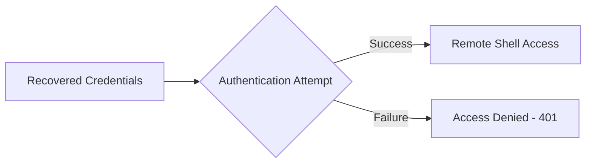

# Exercise 5.3: WinRM Manual Authentication

## Before You Begin

Exercise 5.2 revealed which authentication methods the WinRM service accepts. Now you will test whether a known set of credentials can grant access to the remote management service. Manual authentication testing is a critical skill because automated tools are not always available or appropriate.

## Scenario

During your FinanceCorp engagement, a colleague on the social engineering team recovered a potential username and password combination from a phishing exercise. The credentials are `admin:password`. Your job is to test whether these credentials grant access to the WinRM service on the target host.

## Your Objectives

- Understand WinRM authentication methods at a conceptual level
- Attempt manual credential testing against the target
- Use SSH as a practical authentication method in the lab environment
- Confirm or deny the validity of recovered credentials

---

## Background: WinRM Authentication Methods

WinRM supports several authentication mechanisms, each with different security properties. Understanding these methods helps you choose the right tool and approach for credential testing.

| Method | Description | Security Level |
|--------|-------------|----------------|
| Basic | Username and password sent in base64 encoding | Low; easily decoded |
| Negotiate | Automatically selects NTLM or Kerberos | Medium to High |
| Kerberos | Ticket-based authentication requiring a domain controller | High |
| Certificate | Client certificate presented for identity verification | High |
| CredSSP | Credential Security Support Provider; delegates credentials | Medium |

Basic authentication is the simplest to attack because the credentials are only base64-encoded, not encrypted. Negotiate is more common in enterprise environments and requires a multi-step handshake. In production penetration tests, tools like Evil-WinRM handle these protocols automatically.

In the OpenCyberRange lab environment, the WinRM simulator runs on a Linux container. While the WinRM ports respond with realistic headers, the practical way to test authentication and interact with the host is through SSH on port 22. The concepts remain the same; you are testing whether credentials grant remote management access.



---

## Tool Primer: Evil-WinRM (Conceptual)

Evil-WinRM is a purpose-built tool for interacting with WinRM services during penetration tests. While you will use SSH in this exercise, understanding Evil-WinRM syntax prepares you for real-world engagements.

| Flag | Purpose |
|------|---------|
| `-i` | Target IP address |
| `-u` | Username |
| `-p` | Password |
| `-P` | Port number (default 5985) |
| `-S` | Use SSL/HTTPS (port 5986) |

A typical Evil-WinRM command looks like the following.

```bash
evil-winrm -i <target_ip> -u admin -p password
```

A successful connection drops you into a PowerShell-like prompt on the remote host. A failed attempt returns an authentication error.

---

## Walkthrough

### Step 1: Attempt Authentication via curl

Before using SSH, try authenticating against the WinRM HTTP endpoint using curl with Basic authentication. Send a POST request with credentials embedded in the request.

!!! kali "Kali - Test WinRM Basic authentication with curl"
    ```bash
    curl -u admin:password http://<target_ip>:5985/wsman
    ```

The `-u` flag sends the username and password using HTTP Basic authentication. Examine the response code. A 401 means the credentials were rejected or the server does not accept Basic authentication. Any other response; particularly a 200 or a SOAP XML body; indicates successful authentication.

### Step 2: Test with the SSH Service

Since the lab environment provides SSH access for practical interaction, test the same credentials against the SSH service.

!!! kali "Kali - Connect to the target via SSH"
    ```bash
    ssh admin@<target_ip>
    ```

When prompted, enter the password `password`. Note that the password for this exercise is `password`, not `password123` from previous labs. If the credentials are valid, you will land in a shell session on the target.

### Step 3: Confirm Access and Gather Context

Once logged in, verify your identity and permissions. Run a few quick commands to confirm who you are and where you landed.

!!! target "Target - Verify identity and gather context"
    ```bash
    whoami
    id
    hostname
    pwd
    ```

The `whoami` command shows your current username. The `id` command reveals your user ID (UID) and group memberships. The `hostname` command confirms you are on the correct target. The `pwd` command (print working directory) shows your starting location in the filesystem.

### Step 4: Retrieve the Flag

Navigate to the flag location and read its contents.

!!! target "Target - Read the flag file"
    ```bash
    cat /home/admin/flag.txt
    ```

Record the flag value before ending your session.

### Step 5: Exit the Session

Cleanly disconnect from the target by typing the exit command.

!!! target "Target - Disconnect from the remote session"
    ```bash
    exit
    ```

Always close your sessions when you are done to avoid leaving open connections that could alert defenders.

---

### Record Your Findings

> Document the results of your authentication attempts in the table below.
>
> | Method | Credentials Used | Result (Success/Fail) |
> |--------|------------------|-----------------------|
> | curl Basic Auth | admin:password | |
> | SSH | admin:password | |
>
> ```
> whoami output:
> id output:
> hostname output:
> ```

---

### Step 6: Record the Flag

Write down the flag from `/home/admin/flag.txt` using the format `OCR{<flag_here>}`.

---

## Analysis Questions

1. Why might an organization disable Basic authentication on WinRM while leaving Negotiate enabled?

??? note "Reveal Answer"
    Basic authentication transmits credentials in base64, which offers no real protection. Negotiate uses NTLM or Kerberos, both of which include challenge-response mechanisms that never send the plaintext password over the network. Disabling Basic authentication reduces the risk of credential interception.

2. In a real engagement, why would you prefer Evil-WinRM over SSH for accessing a Windows target?

??? note "Reveal Answer"
    Evil-WinRM provides a PowerShell session that understands Windows commands, paths, and object models. SSH on Windows is less common and may have limited functionality. Evil-WinRM also supports file upload/download and in-memory PowerShell script execution, making it a more capable post-exploitation tool.

3. Why is it important to test credentials manually before running automated tools?

??? note "Reveal Answer"
    Manual testing confirms that the credentials work and that the service is reachable. Running an automated brute-force tool against a service that requires a different authentication protocol wastes time and generates unnecessary log entries. Manual verification also reduces the chance of triggering account lockout policies.

---

## Key Takeaways

- WinRM supports multiple authentication methods, each with different security trade-offs
- Basic authentication is the easiest to test but the least secure for the target organization
- Manual credential testing should always precede automated attacks
- Always record the exact credentials that grant access; password variations matter
- In Exercise 5.4, you will use automated tools to brute-force credentials when you do not have a known password
