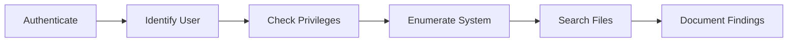

# Exercise 5.5: WinRM Command Execution

## Before You Begin

Exercises 5.1 through 5.4 covered the reconnaissance and access phases of the attack chain. You scanned for the service, enumerated its configuration, tested credentials, and brute-forced a password. Now you move into the post-exploitation phase, where authenticated access becomes a platform for deeper system enumeration.

## Scenario

Your FinanceCorp penetration test has reached a critical milestone. You have valid credentials for the target host's remote management service. The project lead wants you to demonstrate the impact of unauthorized remote access by enumerating the system; gathering information about users, permissions, network configuration, and installed software. The goal is to show FinanceCorp's leadership exactly what an attacker could learn from a single compromised account.

## Your Objectives

- Establish a remote session on the target using valid credentials
- Enumerate the current user's identity and privileges
- Gather system and network information from the target
- Search the filesystem for sensitive files
- Document the scope of information accessible through remote management

---

## Background: Post-Authentication Enumeration

Gaining access to a host is only the beginning of a penetration test. Once authenticated, an attacker needs to understand the environment before taking further action. Post-authentication enumeration answers critical questions: Who am I on this system? What privileges do I have? What else is on the network? Where is the sensitive data?

On a Linux host, a set of standard commands provides this information. The `whoami` command reveals the current username. The `id` command shows the numeric user ID and group memberships, which determine file access permissions. The `hostname` command identifies the machine, and `uname -a` provides kernel and operating system details.

On a Windows host accessed through WinRM or Evil-WinRM, equivalent commands include `whoami`, `systeminfo`, `ipconfig`, and `net user`. The lab environment simulates a Windows target on Linux, so you will use Linux enumeration commands while understanding that the same concepts apply to real Windows targets.



---

## Tool Primer: System Enumeration Commands

The table below lists the commands you will run on the target after authenticating. Each command reveals a different layer of information about the host.

| Command | Purpose |
|---------|---------|
| `whoami` | Display the current username |
| `id` | Show user ID, group ID, and group memberships |
| `hostname` | Print the system's hostname |
| `uname -a` | Display kernel version and system architecture |
| `ip addr` or `ifconfig` | Show network interface configuration |
| `ls -la /home/` | List user home directories with permissions |
| `find / -name "flag*" 2>/dev/null` | Search the entire filesystem for flag files |
| `cat /etc/passwd` | List all user accounts on the system |

The `2>/dev/null` suffix on the find command redirects error messages (like "Permission denied") to nowhere, keeping the output clean and readable.

---

## Walkthrough

### Step 1: Establish a Remote Session

Connect to the target host via SSH using the credentials from earlier labs.

!!! kali "Kali - Connect to the target via SSH"
    ```bash
    ssh admin@<target_ip>
    ```

Enter the password `password123` when prompted. You should land in the admin user's home directory.

### Step 2: Identify the Current User

Run the identity commands to confirm who you are and what groups you belong to.

!!! target "Target - Check current user and group memberships"
    ```bash
    whoami
    id
    ```

The `whoami` output should show `admin`. The `id` output displays your numeric user ID (UID), primary group ID (GID), and any additional group memberships. Group memberships are important because certain groups grant elevated privileges; for example, membership in the `sudo` or `wheel` group may allow privilege escalation.

### Step 3: Enumerate the System

Gather details about the host itself. Run the following commands one at a time and record each result.

!!! target "Target - Gather system details"
    ```bash
    hostname
    uname -a
    cat /etc/os-release
    ```

The `hostname` command confirms you are on the correct target. The `uname -a` output reveals the kernel version, architecture (e.g., x86_64), and build date. The `/etc/os-release` file identifies the specific Linux distribution and version.

### Step 4: Examine Network Configuration

Understanding the target's network position helps identify pivot opportunities; other hosts you might be able to reach from this machine.

!!! target "Target - Examine network interfaces and hosts file"
    ```bash
    ip addr
    cat /etc/hosts
    ```

The `ip addr` command lists all network interfaces along with their IP addresses and subnet masks. The `/etc/hosts` file may contain hardcoded hostnames that point to other internal systems.

### Step 5: List User Accounts

Enumerate the user accounts on the system to identify other potential targets.

!!! target "Target - List user accounts and home directories"
    ```bash
    cat /etc/passwd
    ls -la /home/
    ```

The `/etc/passwd` file lists every user account on the system. Each line contains the username, UID, GID, home directory, and default shell. The `ls -la /home/` command shows which users have home directories and what permissions are set on them.

### Step 6: Search for Sensitive Files

Use the `find` command to search for files that might contain valuable data.

!!! target "Target - Search for flag files, configs, and logs"
    ```bash
    find / -name "flag*" 2>/dev/null
    find / -name "*.conf" -readable 2>/dev/null | head -20
    find / -name "*.log" -readable 2>/dev/null | head -20
    ```

The first command searches for any files with names starting with "flag." The second and third commands look for configuration files and log files that your user can read. Configuration files may contain hardcoded credentials, and log files may reveal system activity.

### Step 7: Retrieve the Flag

Read the flag file from the expected location.

!!! target "Target - Read the flag file"
    ```bash
    cat /home/admin/flag.txt
    ```

Record the flag, then exit the session.

!!! target "Target - Disconnect from the remote session"
    ```bash
    exit
    ```

---

### Record Your Findings

> Fill in the system enumeration results below.
>
> ```
> Username:
> User ID (UID):
> Groups:
> Hostname:
> Kernel version:
> OS Distribution:
> IP Address(es):
> Number of user accounts:
> ```
>
> | File Search | Files Found |
> |-------------|-------------|
> | flag* | |
> | *.conf | |
> | *.log | |

---

### Step 8: Record the Flag

Write down the flag from `/home/admin/flag.txt` in the format `OCR{<flag_here>}`.

---

## Analysis Questions

1. Why is post-authentication enumeration important even when you already have a working shell?

??? note "Reveal Answer"
    A working shell is just the starting point. Enumeration reveals the full scope of what an attacker can access: other users, network connections, sensitive files, and potential privilege escalation paths. Without enumeration, you cannot accurately report the impact of the compromise to the client.

2. What could an attacker learn from the `/etc/passwd` file?

??? note "Reveal Answer"
    The `/etc/passwd` file reveals all usernames on the system, their home directories, and their default shells. An attacker can use this information to target other accounts for brute-force attacks, identify service accounts that may have weak passwords, and map the user landscape of the system.

3. How does group membership affect what an attacker can do on a compromised host?

??? note "Reveal Answer"
    Group memberships determine file and resource access. A user in the `sudo` group can execute commands as root. A user in the `docker` group can interact with Docker containers, which often leads to full root access. Checking group memberships is essential for identifying privilege escalation opportunities.

---

## Key Takeaways

- Post-authentication enumeration is a mandatory phase of every penetration test
- Identity commands (`whoami`, `id`) reveal privilege levels that determine your next steps
- Network configuration data can expose pivot opportunities to other internal hosts
- The `find` command is your primary tool for locating sensitive files across the filesystem
- In Exercise 5.6, you will focus on finding and retrieving a flag that is hidden outside the expected directory
