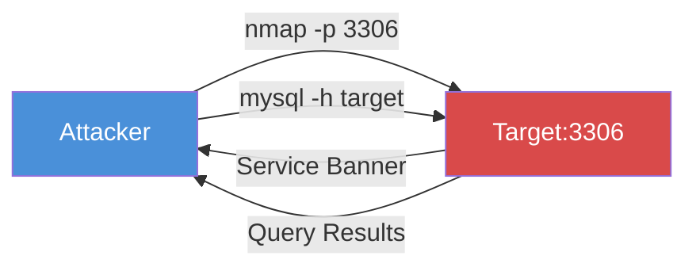

# Exercise 6.1: MS-SQL Service Detection

## Before You Begin

Before you can exploit a database, you need to find it. Most penetration tests begin with a broad port scan, but once you suspect a database server exists on the network, a targeted scan against the known database port is faster and more reliable. In this exercise, you will scan for a database service on the FinanceCorp target and confirm that the port is open and accepting connections.

## Scenario

FinanceCorp has engaged your team to assess the security of their internal infrastructure. James Mitchell, the CISO, has hinted that several internal applications rely on a centralized database server. Your first task is to determine whether a database service is exposed on the network. If it is, you need to document what port it runs on and what service banner it presents.

## Your Objectives

- Scan the target for database services on port 3306
- Identify the service name and version from the scan output
- Confirm the database is accepting connections
- Connect to the database and retrieve the flag
- Capture the flag

---

## Background: Database Port Scanning

Database servers listen on well-known ports that make them easy to detect with a port scanner. Microsoft SQL Server typically uses TCP port 1433, while MySQL uses TCP port 3306. PostgreSQL listens on 5432, and Oracle on 1521. A penetration tester who knows these defaults can quickly determine which database engines are present on a network by scanning just a handful of ports.

Port scanning for database services is different from scanning for web servers or file shares because database ports are often firewalled from external networks but left wide open on internal segments. Organizations assume that internal users need fast, unfiltered access to the database, so they rarely apply network-level access controls between application servers and database servers. When a penetration tester lands on the internal network, these database ports become prime targets.



**Lab environment note:** The lab target runs MySQL on port 3306. In a real MS-SQL environment, you would scan port 1433 instead. The scanning technique is identical; only the port number changes.

## Tool Primer: Nmap Service Detection

Nmap can do more than just check whether a port is open. The `-sV` flag activates service version detection, which sends probes to the open port and analyzes the response to identify the software and version running behind it.

The basic syntax for a targeted service version scan is shown below.

```bash
nmap -p <port> -sV <target_ip>
```

| Flag | Purpose |
|------|---------|
| `-p 3306` | Scan only port 3306 (MySQL default) |
| `-sV` | Probe open ports to determine service name and version |
| `-Pn` | Skip host discovery (assume the host is up) |
| `--open` | Show only open ports in the output |

Sample output from a successful service detection scan looks like the following.

```
PORT     STATE SERVICE VERSION
3306/tcp open  mysql   MySQL 5.7.42
```

The `SERVICE` column tells you what protocol Nmap detected, and the `VERSION` column shows the specific software and build number. Both pieces of information are valuable; the service type tells you which client tool to use, and the version may reveal known vulnerabilities.

---

## Walkthrough

### Step 1: Launch the Exercise

Open the OpenCyberRange platform in your browser and start the exercise environment.

- Navigate to **Exercises** and select **MS-SQL Exploitation** then **Level 1**
- Click **Launch** on "MS-SQL Service Detection"
- Wait for the status to change to **Running**
- Note the **target IP** displayed in the Active Lab View

### Step 2: Scan for the Database Service

Run a targeted Nmap scan against port 3306 with service version detection enabled.

!!! kali "Kali - Scan for MySQL service on port 3306"
    ```bash
    nmap -p 3306 -sV <target_ip>
    ```

You should see output similar to the following.

```
PORT     STATE SERVICE VERSION
3306/tcp open  mysql   MySQL 5.7.42
```

The port is open and Nmap has identified the service as MySQL. Record the version number; you will need it for your findings.

### Step 3: Verify Connectivity with the MySQL Client

A port scan confirms the service is listening, but you should also verify that you can establish a client connection. Attempt to connect with known credentials.

!!! kali "Kali - Verify connectivity with the MySQL client"
    ```bash
    mysql --ssl-verify-server-cert=0 -h <target_ip> -u sa -p'password' -e "SELECT 'Connection successful';"
    ```

If the connection succeeds, you will see a small result table with the text "Connection successful." If it fails, check that the lab environment is fully running and that you have the correct target IP.

### Step 4: Retrieve the Flag from the Database

Now that you have confirmed connectivity and valid credentials, query the database for the flag.

!!! kali "Kali - Query the secrets table for the flag"
    ```bash
    mysql --ssl-verify-server-cert=0 -h <target_ip> -u sa -p'password' -e "SELECT * FROM target_db.secrets;"
    ```

The query returns the contents of the `secrets` table in the `target_db` database. Record the flag value from the output.

### Step 5: Verify the Flag on the File System

The flag is also stored in a file on the target. Read it using the MySQL `LOAD_FILE()` function to confirm both sources match.

!!! kali "Kali - Read the flag from the file system via LOAD_FILE"
    ```bash
    mysql --ssl-verify-server-cert=0 -h <target_ip> -u sa -p'password' -e "SELECT LOAD_FILE('/tmp/flag.txt');"
    ```

Both the database query and the file read should return the same flag value. Record both results.

---

### Record Your Findings

> **Nmap scan output (port 3306):**
>
> ```
> (paste the full nmap output here)
> ```
>
> **MySQL version detected:**
>
> ```
> (paste the version string here)
> ```
>
> **Database flag (from target_db.secrets):**
>
> ```
> (paste the flag here)
> ```
>
> **File system flag (from /tmp/flag.txt):**
>
> ```
> (paste the flag here)
> ```

---

### Step 6: Record the Flag

The flag is in `OCR{<flag_here>}` format. Copy it and paste it into the **Submit Flag** form on the platform and click **Submit**.

---

## Analysis Questions

Take a moment to think through these questions before moving to the next exercise.

**1. Why is a targeted port scan (scanning one specific port) more useful than a full port scan when you already suspect a database service is present?**

??? note "Reveal Answer"

    A targeted scan is faster and generates less network noise. A full 65,535-port scan can take minutes or longer and may trigger intrusion detection systems (IDS). When you already know the default port for the service you are looking for, scanning that single port gives you an answer in seconds while remaining stealthy.

**2. The Nmap output showed the service as "mysql" and included a version number. How could an attacker use the version number?**

??? note "Reveal Answer"

    The version number allows an attacker to search for known vulnerabilities (CVEs) specific to that software release. For example, MySQL 5.7.42 may have different vulnerabilities than MySQL 8.0.33. Knowing the exact version narrows the search and helps the attacker select the right exploit or attack technique.

**3. In a real engagement, MS-SQL listens on port 1433 while MySQL listens on port 3306. Why should a penetration tester scan for both ports?**

??? note "Reveal Answer"

    Organizations sometimes run multiple database engines for different applications. A single server might host both MS-SQL for the primary business application and MySQL for a web application. Scanning only one port would miss the other service entirely. A thorough tester scans all common database ports (1433, 3306, 5432, 1521) to get a complete picture.

---

## Key Takeaways

- Database services listen on well-known ports: MS-SQL on 1433, MySQL on 3306, PostgreSQL on 5432, Oracle on 1521
- `nmap -p 3306 -sV` performs a targeted service version scan that identifies both the service type and the software version
- The service banner reveals the database engine and version, which can be used to search for known vulnerabilities
- Verifying connectivity with the database client confirms that the service is listening and accepting authenticated connections
- Always record the exact version string; it becomes part of your penetration test report and guides your next steps
