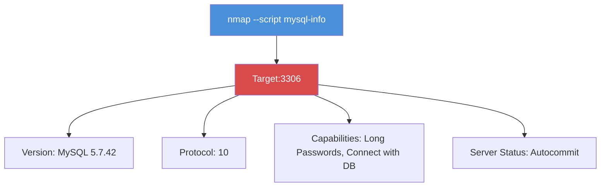

# Exercise 6.2: MS-SQL Version and Instance Enumeration

## Before You Begin

Exercise 6.1 confirmed that a database service is running on port 3306. A basic service scan gives you the version string, but Nmap's scripting engine can extract much more: authentication methods, supported capabilities, and configuration details that reveal how the database is set up. In this exercise, you will use NSE (Nmap Scripting Engine) scripts to perform deep enumeration of the database service.

## Scenario

FinanceCorp's database server has been identified on the network. James Mitchell wants a detailed profile of the database instance before your team attempts authentication. He needs to know the exact version, the authentication mechanisms in use, and whether any configuration weaknesses are visible from the network. Your task is to extract as much information as possible without logging in.

## Your Objectives

- Use NSE scripts to enumerate the database service in detail
- Identify the MySQL version, protocol, and capabilities
- Enumerate valid usernames using NSE enumeration scripts
- Document the information gathered for the engagement report
- Capture the flag

---

## Background: NSE Scripts for Database Enumeration

The Nmap Scripting Engine (NSE) extends Nmap beyond simple port scanning. NSE scripts are small programs written in Lua that automate specific tasks; from banner grabbing to vulnerability detection. Nmap ships with hundreds of scripts, organized by category. The `mysql-*` scripts target MySQL services specifically, while `ms-sql-*` scripts target Microsoft SQL Server.

When you run an NSE script against a database port, the script interacts with the service at the application layer. Instead of just reading the TCP banner, it speaks the database protocol; sending handshake packets, requesting version information, and probing for configuration details. The result is a much richer picture of the target than a simple `-sV` scan provides.

The key NSE scripts for MySQL enumeration are listed below.

| Script | What It Does |
|--------|-------------|
| `mysql-info` | Extracts version, protocol, thread ID, capabilities, and server status |
| `mysql-enum` | Attempts to enumerate valid MySQL usernames |
| `mysql-databases` | Lists databases (requires credentials) |
| `mysql-variables` | Dumps server variables (requires credentials) |
| `mysql-audit` | Checks for common security misconfigurations |

In a real MS-SQL engagement, you would use the `ms-sql-info`, `ms-sql-config`, and `ms-sql-ntlm-info` scripts instead. The approach is identical; only the script names and the protocol differ.



## Tool Primer: Nmap NSE Script Execution

Running NSE scripts requires the `--script` flag followed by one or more script names. Multiple scripts can be separated by commas.

The basic syntax for running NSE scripts against a specific port is shown below.

```bash
nmap -p <port> --script <script1>,<script2> <target_ip>
```

| Flag | Purpose |
|------|---------|
| `--script mysql-info` | Run the mysql-info script |
| `--script mysql-enum` | Enumerate MySQL usernames |
| `--script mysql-*` | Run all MySQL-related scripts |
| `--script-args` | Pass arguments to scripts (e.g., credentials) |
| `-sV` | Combine with service detection for best results |

Sample output from the `mysql-info` script looks like the following.

```
PORT     STATE SERVICE
3306/tcp open  mysql
| mysql-info:
|   Protocol: 10
|   Version: 5.7.42
|   Thread ID: 8
|   Capabilities flags: 65535
|   Some Coverage flags: 15
|   Status: Autocommit
|_  Salt: <random_bytes>
```

The Protocol field indicates the MySQL wire protocol version. The Capabilities flags reveal what features the server supports. The Salt value is used in the authentication handshake; it is a random nonce that prevents replay attacks.

---

## Walkthrough

### Step 1: Launch the Exercise

Open the OpenCyberRange platform in your browser and start the exercise environment.

- Navigate to **Exercises** and select **MS-SQL Exploitation** then **Level 2**
- Click **Launch** on "MS-SQL Version and Instance Enumeration"
- Wait for the status to change to **Running**
- Note the **target IP** displayed in the Active Lab View

### Step 2: Run the mysql-info Script

Start with the `mysql-info` script to extract detailed version and capability information from the database service.

!!! kali "Kali - Run the mysql-info NSE script"
    ```bash
    nmap -p 3306 --script mysql-info <target_ip>
    ```

The output will include the protocol version, MySQL version, thread ID, capability flags, and server status. Record all of these details; each one tells you something about the server's configuration.

### Step 3: Enumerate Usernames with mysql-enum

The `mysql-enum` script attempts to discover valid MySQL usernames by exploiting differences in server responses to valid and invalid usernames.

!!! kali "Kali - Enumerate valid MySQL usernames"
    ```bash
    nmap -p 3306 --script mysql-enum <target_ip>
    ```

If the script succeeds, it will list valid usernames. Look for the `sa` account; the system administrator account commonly found in MS-SQL environments. The presence of `sa` in a MySQL setup indicates that the database was configured to mimic MS-SQL conventions.

### Step 4: Run All MySQL NSE Scripts

For a thorough enumeration, run all MySQL-related scripts at once using a wildcard.

!!! kali "Kali - Run all MySQL NSE scripts at once"
    ```bash
    nmap -p 3306 -sV --script "mysql-*" <target_ip>
    ```

The wildcard `mysql-*` matches every NSE script whose name starts with "mysql." Some scripts may produce errors if they require credentials; that is expected. Focus on the scripts that return information without authentication.

### Step 5: Connect and Retrieve the Flag

Use the credentials discovered or confirmed through enumeration to connect and retrieve the flag.

!!! kali "Kali - Retrieve the flag via LOAD_FILE"
    ```bash
    mysql --ssl-verify-server-cert=0 -h <target_ip> -u sa -p'password' -e "SELECT LOAD_FILE('/tmp/flag.txt');"
    ```

The `LOAD_FILE()` function reads the contents of a file on the target server and returns it as a string. Record the flag value from the output.

---

### Record Your Findings

> **mysql-info script output:**
>
> ```
> (paste the full mysql-info output here)
> ```
>
> **MySQL version identified:**
>
> ```
> (paste the version string here)
> ```
>
> **mysql-enum results (valid usernames):**
>
> ```
> (paste any usernames discovered here)
> ```
>
> **Full script scan results:**
>
> ```
> (paste notable findings from the mysql-* scan here)
> ```
>
> **Flag:**
>
> ```
> (paste the flag here)
> ```

---

### Step 6: Record the Flag

The flag is in `OCR{<flag_here>}` format. Copy it and paste it into the **Submit Flag** form on the platform and click **Submit**.

---

## Analysis Questions

Take a moment to consider these questions before moving to the next exercise.

**1. The mysql-info script returned capability flags. Why are server capabilities useful to an attacker?**

??? note "Reveal Answer"

    Capability flags reveal what features the server supports; such as whether it accepts compressed connections, supports SSL, or allows multiple statements in a single query. An attacker can use these to determine the best attack approach. For example, if multiple statements are allowed, SQL injection becomes more dangerous because the attacker can chain commands.

**2. Why does the mysql-enum script sometimes fail to identify valid usernames?**

??? note "Reveal Answer"

    The mysql-enum script relies on timing differences or error message differences between valid and invalid usernames. If the server is configured to return identical responses regardless of whether the username exists, the technique fails. Modern MySQL configurations often prevent username enumeration by design.

**3. In a real MS-SQL engagement, which NSE script would you use instead of mysql-info, and what additional information might it provide?**

??? note "Reveal Answer"

    You would use `ms-sql-info`, which extracts MS-SQL-specific details like the instance name, whether named pipes are enabled, and the SQL Server edition (Express, Standard, Enterprise). MS-SQL also supports `ms-sql-ntlm-info`, which extracts the Windows domain name and computer name from the NTLM handshake; information that MySQL does not expose.

---

## Key Takeaways

- NSE scripts extract far more detail than a basic `-sV` service scan; including protocol version, capabilities, and server configuration
- The `mysql-info` script is the most reliable NSE script for MySQL enumeration because it requires no credentials
- Running `mysql-*` as a wildcard executes all MySQL-related scripts at once, which saves time during initial enumeration
- Username enumeration through NSE scripts is not always reliable; server configuration can prevent it
- In a real MS-SQL assessment, the `ms-sql-info` and `ms-sql-ntlm-info` scripts would replace the MySQL equivalents
- Always record the full script output; details like capability flags and protocol versions may become relevant later in the engagement
