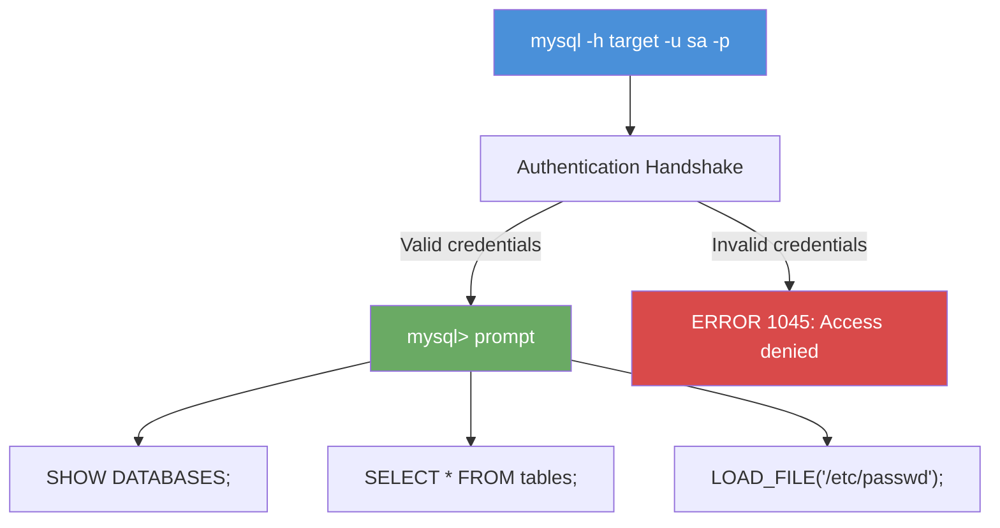

# Exercise 6.3: MS-SQL Manual Authentication

## Before You Begin

Exercises 6.1 and 6.2 confirmed the database service and extracted its version and capabilities. You know the service is MySQL, you know the version, and you may have identified valid usernames. The next logical step is to attempt authentication. In this exercise, you will connect to the database using the `mysql` command-line client with known credentials, verifying that you can establish an interactive session.

## Scenario

FinanceCorp's database server has been enumerated. During a review of the organization's internal documentation (obtained from an earlier phase of the assessment), your team discovered a set of credentials for the database: username `sa` with password `password`. James Mitchell wants you to confirm whether these credentials are valid and, if so, demonstrate what level of access they provide. The `sa` account in an MS-SQL environment is the system administrator; the highest-privilege database account.

## Your Objectives

- Connect to the database service using the `mysql` command-line client
- Authenticate with discovered credentials (sa:password)
- Verify the connection by running a basic query
- Explore what the authenticated session can see
- Capture the flag

---

## Background: Database Authentication

Database authentication works differently from file share or remote desktop authentication. When you connect to a database, you are not logging into an operating system session; you are opening a query interface. The database grants you access based on your account's privileges, which may range from read-only access to a single table all the way up to full administrative control over every database on the server.

In MS-SQL, the `sa` (system administrator) account has unrestricted access. It can create and drop databases, read and modify any table, execute stored procedures, and; most dangerously; run operating system commands through xp_cmdshell. If an attacker obtains the `sa` password, they effectively own the database server.

The MySQL equivalent of the `sa` account is `root`, but the lab environment uses `sa` to maintain the MS-SQL framing. The privilege level is the same; full administrative access.



## Tool Primer: The mysql Command-Line Client

The `mysql` client is the standard tool for connecting to MySQL databases from the command line. It supports both interactive sessions (where you type queries at a prompt) and non-interactive execution (where you pass a query with the `-e` flag).

The basic connection syntax is shown below.

```bash
mysql --ssl-verify-server-cert=0 -h <target_ip> -u <username> -p'<password>'
```

| Flag | Purpose |
|------|---------|
| `-h` | Hostname or IP address of the database server |
| `-u` | Username to authenticate with |
| `-p` | Password (no space between `-p` and the password) |
| `-e` | Execute a query and exit (non-interactive mode) |
| `-D` | Select a default database on connection |
| `--ssl-verify-server-cert=0` | Skip verification of the server TLS certificate |
| `--ssl-mode=DISABLED` | Disable SSL (useful when the server does not support it) |

!!! note "TLS certificate verification on Kali"
    The MariaDB `mysql` client shipped with Kali verifies the server TLS certificate by default. Against a lab database with a self-signed certificate, a plain `mysql -h ...` command fails before authentication with `ERROR 2026 (HY000): TLS/SSL error: Certificate verification failure`. Adding `--ssl-verify-server-cert=0` tells the client to connect over TLS without checking the certificate, which avoids the error. The `--skip-ssl` flag is an alternative that disables TLS entirely; either one lets the connection through.

**What success looks like:**

```
Welcome to the MySQL monitor.  Commands end with ; or \g.
Your MySQL connection id is 12
Server version: 5.7.42 MySQL Community Server (GPL)

mysql>
```

**What failure looks like:**

```
ERROR 1045 (28000): Access denied for user 'sa'@'172.17.0.1' (using password: YES)
```

The error code 1045 is MySQL's equivalent of MS-SQL's "Login failed for user" message. It means the username or password is incorrect, or the user does not have permission to connect from your IP address.

---

## Walkthrough

### Step 1: Launch the Exercise

Open the OpenCyberRange platform in your browser and start the exercise environment.

- Navigate to **Exercises** and select **MS-SQL Exploitation** then **Level 3**
- Click **Launch** on "MS-SQL Manual Authentication"
- Wait for the status to change to **Running**
- Note the **target IP** displayed in the Active Lab View

### Step 2: Attempt an Interactive Connection

Connect to the database using the `sa` credentials. Enter the following command, replacing `<target_ip>` with your lab's target IP.

!!! kali "Kali - Connect to the database with sa credentials"
    ```bash
    mysql --ssl-verify-server-cert=0 -h <target_ip> -u sa -p'password'
    ```

If the credentials are valid, you will see the MySQL welcome banner and the `mysql>` prompt. If you receive an "Access denied" error, double-check the username and password; the credentials for this exercise are `sa` with the password `password`.

### Step 3: Verify Your Identity

Once connected, confirm which user you are logged in as. Run the following query at the `mysql>` prompt.

!!! kali "Kali - Verify which user you are logged in as"
    ```sql
    SELECT CURRENT_USER();
    ```

The result should show `sa@%` or similar, confirming you are connected as the `sa` account. The `%` wildcard means the account can connect from any host.

### Step 4: Check Your Privileges

Determine what the `sa` account is allowed to do by checking the grant table.

!!! kali "Kali - Check account privileges"
    ```sql
    SHOW GRANTS FOR CURRENT_USER();
    ```

Look for `GRANT ALL PRIVILEGES` in the output. If present, the `sa` account has full administrative access to every database on the server; equivalent to the MS-SQL `sysadmin` role.

### Step 5: List Available Databases

See what databases exist on the server.

!!! kali "Kali - List all databases on the server"
    ```sql
    SHOW DATABASES;
    ```

Record every database name in the output. System databases like `information_schema`, `mysql`, and `performance_schema` are standard. Any additional databases (such as `target_db`) are custom and likely contain the data you are looking for.

### Step 6: Retrieve the Flag

The flag is stored in the file `/tmp/flag.txt` on the target server. Read it using the MySQL `LOAD_FILE()` function.

!!! kali "Kali - Read the flag via LOAD_FILE"
    ```sql
    SELECT LOAD_FILE('/tmp/flag.txt');
    ```

Record the flag value from the output. Then exit the interactive session.

!!! kali "Kali - Exit the MySQL session"
    ```sql
    EXIT;
    ```

---

### Record Your Findings

> **Connection result (success or error message):**
>
> ```
> (paste the connection banner or error here)
> ```
>
> **Current user:**
>
> ```
> (paste the CURRENT_USER() result here)
> ```
>
> **Account privileges:**
>
> ```
> (paste the SHOW GRANTS output here)
> ```
>
> **Available databases:**
>
> ```
> (paste the SHOW DATABASES output here)
> ```
>
> **Flag:**
>
> ```
> (paste the flag here)
> ```

---

### Step 7: Record the Flag

The flag is in `OCR{<flag_here>}` format. Copy it and paste it into the **Submit Flag** form on the platform and click **Submit**.

---

## Analysis Questions

Consider these questions to deepen your understanding of database authentication.

**1. The `sa` account has `GRANT ALL PRIVILEGES`. Why is it dangerous to expose the `sa` account with a weak password on a network-accessible database?**

??? note "Reveal Answer"

    The `sa` account has unrestricted access to the database server. An attacker who obtains the `sa` password can read every table in every database, modify or delete data, create new accounts, and; if file privileges are enabled; read and write files on the operating system. A weak password on the `sa` account turns a database server into an open door to the entire system.

**2. The CURRENT_USER() function showed `sa@%`. What does the `%` mean, and how could the administrator reduce the attack surface?**

??? note "Reveal Answer"

    The `%` is a wildcard that means the `sa` account can authenticate from any IP address. The administrator could reduce the attack surface by restricting the account to specific IP addresses (e.g., `sa@192.168.1.100`), limiting who can connect. Combining IP restrictions with a strong password and multi-factor authentication would make brute force attacks much harder.

**3. Why is it important to check SHOW GRANTS before attempting further exploitation?**

??? note "Reveal Answer"

    Understanding your privilege level determines what attacks are possible. If you have `FILE` privilege, you can read and write files on the server. If you have `SUPER` privilege, you can modify server configuration. If you have only `SELECT` on one database, your options are limited to data extraction. Checking grants first prevents wasted time on attacks that your account cannot execute.

---

## Key Takeaways

- The `mysql -h <target> -u <user> -p'<pass>'` command establishes an interactive database session
- Error code 1045 (Access denied) means invalid credentials or insufficient connection permissions
- `CURRENT_USER()` confirms your identity and `SHOW GRANTS` reveals your privilege level
- The `sa` account with `ALL PRIVILEGES` is the most dangerous finding in a database assessment; it grants complete control
- Always enumerate databases with `SHOW DATABASES` immediately after connecting to understand the scope of what you can access
- Checking privileges before attempting exploitation ensures you do not waste time on techniques your account cannot execute
