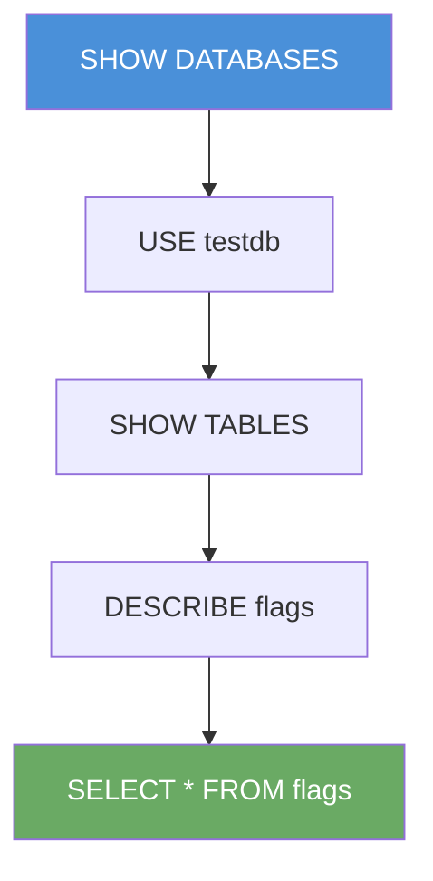

# Exercise 6.5: MS-SQL Basic Query Execution

## Before You Begin

You can connect to the database. You can authenticate. Now it is time to do something with that access. A database is only as dangerous as the queries you can run against it. In this exercise, you will learn the fundamental SQL commands for enumerating databases, listing tables, and extracting data. These skills form the core of post-authentication database exploitation; once you are in, these are the commands that let you find and steal the data.

## Scenario

FinanceCorp's database server has been accessed with the `sa` credentials. James Mitchell now wants proof of impact; he needs to see exactly what data an attacker could extract. Your task is to enumerate every database on the server, identify tables that contain sensitive information, and extract that data using SQL queries. The results will go directly into the penetration test report as evidence of the business impact of weak database credentials.

## Your Objectives

- Connect to the database and enumerate all available databases
- Identify and select a target database
- List all tables within the target database
- Extract data from tables containing sensitive information
- Capture the flag

---

## Background: SQL Query Fundamentals

Structured Query Language (SQL) is the standard language for interacting with relational databases. Every major database engine; MS-SQL, MySQL, PostgreSQL, Oracle; uses SQL with minor syntax variations. Once you learn the core commands, you can query any database.

For a penetration tester, the most important SQL commands fall into two categories: enumeration commands (discovering what exists) and extraction commands (reading the data). You do not need to be a database developer. You need to know enough SQL to map out the database structure and pull data from interesting tables.

The key commands for database enumeration and extraction are listed below.

| Command | Purpose |
|---------|---------|
| `SHOW DATABASES;` | List all databases on the server |
| `USE <database>;` | Switch to a specific database |
| `SHOW TABLES;` | List all tables in the current database |
| `DESCRIBE <table>;` | Show column names and data types for a table |
| `SELECT * FROM <table>;` | Read all rows from a table |
| `SELECT column FROM table WHERE condition;` | Read specific data matching a condition |

In MS-SQL, the syntax differs slightly. `SHOW DATABASES` becomes `SELECT name FROM sys.databases`, and `SHOW TABLES` becomes `SELECT name FROM sys.tables`. The MySQL syntax used in the lab is more concise, but the concept is identical: discover databases, pick one, list its tables, and read the data.



## Tool Primer: Interactive MySQL Queries

When connected to a MySQL session, every command must end with a semicolon (`;`). Forgetting the semicolon is the most common mistake; MySQL will wait on a new line for you to finish the statement, showing a `->` continuation prompt instead of executing the query.

If you see the continuation prompt unexpectedly, type a semicolon and press Enter to complete the statement.

```
mysql> SELECT * FROM flags
    -> ;
```

Queries are case-insensitive, so `SELECT`, `select`, and `Select` all work. SQL keywords are conventionally written in uppercase for readability, but the database does not require it.

---

## Walkthrough

### Step 1: Launch the Exercise

Open the OpenCyberRange platform in your browser and start the exercise environment.

- Navigate to **Exercises** and select **MS-SQL Exploitation** then **Level 5**
- Click **Launch** on "MS-SQL Basic Query Execution"
- Wait for the status to change to **Running**
- Note the **target IP** displayed in the Active Lab View

### Step 2: Connect to the Database

Establish an interactive session with the `sa` account.

!!! kali "Kali - Connect to the database"
    ```bash
    mysql --ssl-verify-server-cert=0 -h <target_ip> -u sa -p'password'
    ```

You should see the MySQL welcome banner and the `mysql>` prompt.

### Step 3: Enumerate All Databases

List every database on the server.

!!! kali "Kali - List all databases"
    ```sql
    SHOW DATABASES;
    ```

You will see a list that includes system databases and any custom databases. The output will look similar to the following.

```
+--------------------+
| Database           |
+--------------------+
| information_schema |
| mysql              |
| performance_schema |
| testdb             |
+--------------------+
```

The system databases (`information_schema`, `mysql`, `performance_schema`) are standard MySQL databases. The `testdb` database is a custom database; the likely target for your investigation.

### Step 4: Select the Target Database

Switch to the `testdb` database.

!!! kali "Kali - Switch to the target database"
    ```sql
    USE testdb;
    ```

The prompt will not change, but MySQL will confirm the database switch with the message "Database changed."

### Step 5: List All Tables

Discover what tables exist in the `testdb` database.

!!! kali "Kali - List all tables in the database"
    ```sql
    SHOW TABLES;
    ```

Look for tables with names that suggest sensitive content; words like "flags," "secrets," "credentials," "users," or "passwords" are strong indicators.

### Step 6: Examine the Table Structure

Before extracting data, look at the table structure to understand what columns exist.

!!! kali "Kali - Examine the flags table structure"
    ```sql
    DESCRIBE flags;
    ```

The `DESCRIBE` command shows each column's name, data type, whether it allows NULL values, and its key status. Understanding the structure helps you write targeted queries instead of blindly selecting everything.

### Step 7: Extract the Flag Data

Read all rows from the flags table.

!!! kali "Kali - Extract all data from the flags table"
    ```sql
    SELECT * FROM flags;
    ```

The output will contain the flag value. Record it carefully; it is in `OCR{<flag_here>}` format.

### Step 8: Explore with Targeted Queries

Practice writing more specific queries. Try selecting only the flag column.

!!! kali "Kali - Select a specific flag by ID"
    ```sql
    SELECT flag FROM flags WHERE id = 1;
    ```

Or count the number of entries in the table.

!!! kali "Kali - Count the rows in the flags table"
    ```sql
    SELECT COUNT(*) FROM flags;
    ```

These targeted queries demonstrate precision; in a real engagement, you would use WHERE clauses and JOINs to extract exactly the data you need from tables with millions of rows.

### Step 9: Exit the Session

Close the interactive session.

!!! kali "Kali - Exit the MySQL session"
    ```sql
    EXIT;
    ```

---

### Record Your Findings

> **Databases discovered:**
>
> ```
> (paste the SHOW DATABASES output here)
> ```
>
> **Tables in testdb:**
>
> ```
> (paste the SHOW TABLES output here)
> ```
>
> **Table structure (DESCRIBE output):**
>
> ```
> (paste the DESCRIBE flags output here)
> ```
>
> **Extracted data:**
>
> ```
> (paste the SELECT * FROM flags output here)
> ```
>
> **Flag:**
>
> ```
> (paste the flag here)
> ```

---

### Step 10: Record the Flag

The flag is in `OCR{<flag_here>}` format. Copy it and paste it into the **Submit Flag** form on the platform and click **Submit**.

---

## Analysis Questions

Test your understanding of SQL-based data extraction.

**1. You used SHOW DATABASES to find `testdb`. In a real environment with dozens of databases, how would you prioritize which databases to investigate first?**

??? note "Reveal Answer"

    Focus on databases with names that suggest business value; "production," "finance," "hr," "customers," "billing." Ignore system databases (information_schema, mysql, performance_schema) unless you are looking for credential hashes. Custom databases with application-specific names are almost always more interesting than generic ones.

**2. The DESCRIBE command showed column names and data types. Why is it useful to examine the table structure before running SELECT *?**

??? note "Reveal Answer"

    Large tables may contain millions of rows and dozens of columns. Running `SELECT *` on a huge table can flood your terminal, crash your client, or alert monitoring systems with an unusually large query. Examining the structure first lets you write targeted queries that retrieve only the columns you need, keeping the output manageable and the query fast.

**3. How would you enumerate databases in MS-SQL if SHOW DATABASES is not available?**

??? note "Reveal Answer"

    In MS-SQL, you would use `SELECT name FROM sys.databases;` to list all databases, `SELECT name FROM sys.tables;` to list tables in the current database, and `sp_columns <table_name>` to view column details. The information_schema views (`information_schema.tables`, `information_schema.columns`) also work in both MySQL and MS-SQL, making them a portable alternative.

---

## Key Takeaways

- `SHOW DATABASES`, `USE`, `SHOW TABLES`, `DESCRIBE`, and `SELECT` are the five essential commands for database enumeration and extraction
- Always enumerate the database structure (databases, tables, columns) before extracting data
- Custom databases (non-system databases) are the primary targets; they contain the organization's business data
- Every SQL statement must end with a semicolon, or the MySQL client will wait for more input
- Targeted queries with WHERE clauses are more practical than `SELECT *` on large production tables
- The same enumeration workflow applies to MS-SQL, PostgreSQL, and other database engines; only the syntax changes slightly
