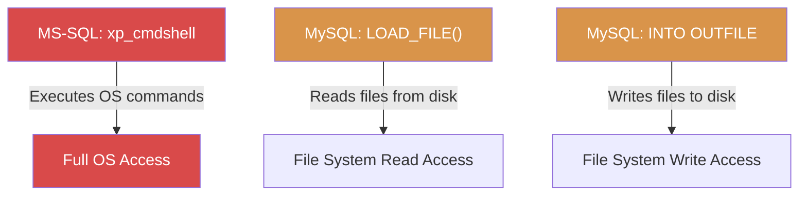

# Exercise 6.6: MS-SQL xp_cmdshell Activation (MySQL LOAD_FILE equivalent)

## Before You Begin

Up to now, your database access has been limited to querying tables; reading data that the database stores internally. In this exercise, you cross a critical boundary: reading files from the operating system through the database. In MS-SQL, the classic technique for this is `xp_cmdshell`, a stored procedure that executes operating system commands. The MySQL equivalent is the `LOAD_FILE()` function, which reads files from the server's disk and returns their contents as a query result.

## Scenario

FinanceCorp's database has been fully enumerated. James Mitchell is concerned that database access might extend beyond the data stored in tables. He wants you to determine whether an attacker with database credentials could read files from the underlying operating system. If so, the impact escalates from "data breach" to "full system compromise." Your task is to demonstrate file reading through the database connection and document the risk.

## Your Objectives

- Understand the relationship between xp_cmdshell (MS-SQL) and LOAD_FILE() (MySQL)
- Check whether the MySQL server is configured to allow file operations
- Use LOAD_FILE() to read a file from the target's file system
- Confirm the flag from both the database and the file system
- Capture the flag

---

## Background: From Database Access to Operating System Access

In Microsoft SQL Server, `xp_cmdshell` is an extended stored procedure that lets you run operating system commands directly from a SQL query. A query like `EXEC xp_cmdshell 'whoami'` would return the Windows username of the SQL Server service account. An attacker who can enable and execute xp_cmdshell can read files, list directories, create users, download malware, and establish reverse shells; all through the database connection.

By default, xp_cmdshell is disabled in modern MS-SQL installations. Enabling it requires `sysadmin` (sa) privileges and two configuration commands:

```sql
-- MS-SQL syntax (for reference only; not used in this exercise)
EXEC sp_configure 'show advanced options', 1;
RECONFIGURE;
EXEC sp_configure 'xp_cmdshell', 1;
RECONFIGURE;
```

The MySQL equivalent does not have a direct "command shell" feature, but the `LOAD_FILE()` function provides similar file-reading capability. When the MySQL server is configured with `secure_file_priv=""` (an empty string), the `LOAD_FILE()` function can read any file that the MySQL process has operating system permissions to access. The `SELECT ... INTO OUTFILE` command provides the write counterpart, allowing you to write query results to files on disk.



The `secure_file_priv` variable controls where MySQL can read and write files. When set to a directory path, file operations are restricted to that directory. When set to an empty string, there are no restrictions. When set to NULL, file operations are completely disabled.

| secure_file_priv Value | Effect |
|----------------------|--------|
| `""` (empty string) | No restrictions; LOAD_FILE can read any accessible file |
| `"/var/lib/mysql-files/"` | File operations restricted to the specified directory |
| `NULL` | File operations completely disabled |

## Tool Primer: LOAD_FILE() and INTO OUTFILE

The `LOAD_FILE()` function takes a file path as its argument and returns the file contents as a string. The file must be readable by the MySQL server process (typically running as the `mysql` user on Linux).

The syntax for reading a file is shown below.

```sql
SELECT LOAD_FILE('/path/to/file');
```

The syntax for writing data to a file uses `INTO OUTFILE`.

```sql
SELECT 'data to write' INTO OUTFILE '/path/to/output';
```

If `LOAD_FILE()` returns `NULL`, one of three things is wrong: the file does not exist, the MySQL process does not have read permissions, or `secure_file_priv` blocks the operation. A NULL result with no error message can be confusing; always check `secure_file_priv` first to rule out configuration restrictions.

---

## Walkthrough

### Step 1: Launch the Exercise

Open the OpenCyberRange platform in your browser and start the exercise environment.

- Navigate to **Exercises** and select **MS-SQL Exploitation** then **Level 6**
- Click **Launch** on "MS-SQL xp_cmdshell Activation"
- Wait for the status to change to **Running**
- Note the **target IP** displayed in the Active Lab View

### Step 2: Connect to the Database

Establish an interactive session with the `sa` credentials.

!!! kali "Kali - Connect to the database"
    ```bash
    mysql --ssl-verify-server-cert=0 -h <target_ip> -u sa -p'password'
    ```

### Step 3: Check the secure_file_priv Configuration

Before attempting to read files, verify that the server allows file operations.

!!! kali "Kali - Check whether file operations are restricted"
    ```sql
    SHOW VARIABLES LIKE 'secure_file_priv';
    ```

The result will show one of three values. An empty string (`""` or a blank Value field) means file operations are unrestricted. A directory path means operations are restricted to that directory. NULL means file operations are disabled entirely.

For this exercise, the value should be an empty string, confirming that `LOAD_FILE()` has no restrictions.

### Step 4: Read a Known System File

Start with a common system file to confirm that `LOAD_FILE()` works. Read the `/etc/hostname` file.

!!! kali "Kali - Read a known system file to test LOAD_FILE"
    ```sql
    SELECT LOAD_FILE('/etc/hostname');
    ```

If the function returns a hostname string, file reading is working. If it returns NULL, check the `secure_file_priv` setting and the file permissions.

### Step 5: Read the Flag File

Now read the flag from the target file system.

!!! kali "Kali - Read the flag from the file system"
    ```sql
    SELECT LOAD_FILE('/tmp/flag.txt');
    ```

The function returns the contents of `/tmp/flag.txt` as a string. Record the flag value.

### Step 6: Confirm the Flag from the Database

The flag is also stored in the `target_db.secrets` table. Query it to confirm both sources match.

!!! kali "Kali - Confirm the flag from the database"
    ```sql
    SELECT * FROM target_db.secrets;
    ```

Both the file system and database should contain the same flag. Having two confirmation sources strengthens your evidence.

---

### Record Your Findings

> **secure_file_priv value:**
>
> ```
> (paste the SHOW VARIABLES output here)
> ```
>
> **System file read test (/etc/hostname):**
>
> ```
> (paste the result here)
> ```
>
> **Flag from file system (LOAD_FILE):**
>
> ```
> (paste the flag here)
> ```
>
> **Flag from database (target_db.secrets):**
>
> ```
> (paste the flag here)
> ```

---

### Step 7: Record the Flag

The flag is in `OCR{<flag_here>}` format. Copy it and paste it into the **Submit Flag** form on the platform and click **Submit**.

---

## Analysis Questions

Consider the implications of file system access through a database connection.

**1. xp_cmdshell can execute any operating system command, while LOAD_FILE() can only read files. Why is xp_cmdshell considered significantly more dangerous?**

??? note "Reveal Answer"

    xp_cmdshell provides arbitrary command execution; the attacker can run `whoami`, `net user`, `powershell`, download tools, create accounts, and establish reverse shells. LOAD_FILE() is limited to reading files that the MySQL process can access. While file reading is dangerous (passwords, configuration files, source code), it does not provide the ability to execute commands, create processes, or modify the system. xp_cmdshell turns database access into full operating system control.

**2. The secure_file_priv variable was set to an empty string. What would a proper production configuration look like?**

??? note "Reveal Answer"

    A secure configuration would set `secure_file_priv` to NULL (disabling file operations entirely) or to a restricted directory like `/var/lib/mysql-files/` that contains no sensitive data. Most applications do not need LOAD_FILE() or INTO OUTFILE, so disabling these features removes the risk without affecting functionality. If file operations are genuinely needed, restricting them to a specific directory limits the damage an attacker can do.

**3. LOAD_FILE() returned NULL for a file that exists. What are the possible causes?**

??? note "Reveal Answer"

    Three causes can produce a NULL result: (1) the `secure_file_priv` variable restricts access to a different directory, (2) the MySQL process does not have operating system read permissions on the file, or (3) the file exceeds the `max_allowed_packet` size limit. A NULL return with no error message makes troubleshooting difficult; checking `secure_file_priv` first eliminates the most common cause.

---

## Key Takeaways

- In MS-SQL, `xp_cmdshell` provides operating system command execution through the database; the most dangerous database feature an attacker can access
- The MySQL equivalent, `LOAD_FILE()`, reads files from the target file system through a SQL query
- The `secure_file_priv` variable controls whether file operations are allowed, restricted to a directory, or completely disabled
- Always check `secure_file_priv` before attempting file operations; a NULL setting means LOAD_FILE() will silently return NULL for every file
- `SELECT ... INTO OUTFILE` provides the write counterpart, allowing data exfiltration to files on disk
- Reading `/etc/hostname` or another known file is a quick way to confirm that LOAD_FILE() is functioning before targeting sensitive files
