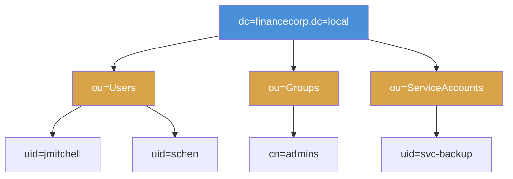

# Chapter 7: LDAP Enumeration

## Why LDAP Matters

Most corporate networks rely on a centralized directory to manage user accounts, group memberships, and access policies. In Windows environments, Active Directory is that directory, and it speaks LDAP. An attacker who can query the LDAP service can extract usernames, email addresses, group memberships, organizational structure, and sometimes even password-related attributes, all without needing any special exploits.

LDAP enumeration is one of the quietest and most productive reconnaissance techniques available. A single well-formed query can return every user account in the organization. When anonymous access is permitted, all of that information is available to anyone who can reach port 389.

## What Is LDAP?

LDAP stands for **Lightweight Directory Access Protocol**. It is a standard protocol for accessing and querying directory services over a network. A directory service works like a phone book for a network; it stores structured records about users, groups, computers, and other resources in a hierarchical tree.

LDAP typically runs on **port 389** (unencrypted) or **port 636** (LDAPS, encrypted with TLS). In Windows environments, every Active Directory Domain Controller runs an LDAP service. In Linux environments, **OpenLDAP** (the `slapd` daemon) provides the same functionality. The FinanceCorp lab target runs OpenLDAP configured to simulate an Active Directory environment.

Unlike SMB, which gives you access to shared files and printers, LDAP gives you access to **structured data about the organization itself**. User accounts, group memberships, organizational units, email addresses, and access policies are all stored as entries in the LDAP directory. Querying LDAP does not download files; it reads records from a database.

## How LDAP Relates to Active Directory

Active Directory (AD) is Microsoft's implementation of a directory service. LDAP is the protocol that clients use to talk to it. When a Windows workstation checks whether a user belongs to the "Domain Admins" group, it sends an LDAP query to a Domain Controller. When an email client looks up a colleague's address, that lookup goes through LDAP.

Attacking LDAP is, in many cases, the same as attacking Active Directory's data layer. The enumeration techniques you learn in this chapter apply directly to real AD environments; the only difference is that the FinanceCorp lab runs OpenLDAP instead of Microsoft's implementation.

## Distinguished Names (DNs)

Every object in an LDAP directory is identified by its **Distinguished Name (DN)**: a unique path that describes where the object sits in the directory tree. Understanding DN structure is essential for writing effective queries.

The components of a DN follow a consistent naming convention:

| Abbreviation | Meaning | Example |
|-------------|---------|---------|
| `dc` | Domain Component | `dc=financecorp,dc=local` |
| `ou` | Organizational Unit | `ou=Users,dc=financecorp,dc=local` |
| `cn` | Common Name | `uid=jmitchell,ou=Users,dc=financecorp,dc=local` |

A full DN reads from most specific (left) to most general (right). The entry `uid=jmitchell,ou=Users,dc=financecorp,dc=local` describes a user named "jmitchell" inside the "Users" organizational unit within the "financecorp.local" domain.

The directory tree below the **Base DN** (the domain root) is organized into containers called Organizational Units. The FinanceCorp directory places users under `ou=Users`, security groups under `ou=Groups`, and service accounts under `ou=ServiceAccounts`. Learning to navigate this tree structure is the core skill you will develop in this chapter.

---

## What Will You Learn?

By the end of this chapter, you will be able to:

- Detect LDAP services running on a target using Nmap
- Test whether a server permits anonymous (unauthenticated) LDAP queries
- Discover the Base DN that anchors the entire directory tree
- Extract user accounts and their attributes from the directory
- Enumerate security groups and group memberships
- Perform a thorough LDAP enumeration combining all techniques

## Lab Progression

Each lab builds on the previous one, following the same methodology a penetration tester would use against a real Active Directory environment:

| Exercise | Title | Primary Tool | What It Adds |
|-----|-------|-------------|-------------|
| 7.1 | LDAP Service Detection | `nmap` | Confirm LDAP is running and identify the service |
| 7.2 | Anonymous Bind Test | `ldapsearch` | Determine if queries work without credentials |
| 7.3 | Base DN Enumeration | `ldapsearch` | Discover the root of the directory tree |
| 7.4 | User Enumeration | `ldapsearch` | Extract user accounts and attributes |
| 7.5 | Group Enumeration | `ldapsearch` | Map security groups and memberships |
| 7.6 | Comprehensive Enumeration | `ldapsearch` + `nmap` | Full directory extraction in one pass |

## Before You Start

Make sure the following are in place before beginning Exercise 7.1:

- [ ] You have completed Chapters 1 through 6 and are comfortable running Nmap scans and working from the command line
- [ ] Your VPN is connected and working
- [ ] You have a terminal open on your Kali Linux VM
- [ ] You have verified connectivity to the lab network
- [ ] You understand that LDAP is a directory query protocol, not a file-sharing protocol; you are reading a database, not browsing folders
