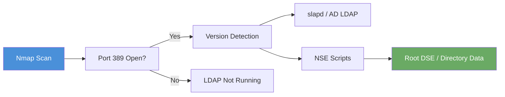

# Exercise 7.1: LDAP Service Detection

## Before You Begin

Before you can query a directory, you need to confirm that LDAP is actually running on the target. Nmap can detect the LDAP service on port 389 and identify the specific software behind it. In the FinanceCorp lab, the target runs OpenLDAP's `slapd` daemon, which simulates the directory service you would find on a Windows Domain Controller.

## Scenario

You are conducting a penetration test for FinanceCorp. During your scoping call, the client mentioned that their environment uses centralized directory services for authentication and access control. Your first task is to confirm that LDAP is running on the target server and identify the software version. The engagement lead, James Mitchell, wants you to document every exposed service before attempting any queries.

## Your Objectives

- Scan port 389 on the target to confirm LDAP is listening
- Use Nmap service version detection to identify the LDAP implementation
- Run Nmap LDAP scripts to extract additional information from the service
- Capture the flag embedded in the directory data

---

## Background: LDAP Service Fingerprinting

Detecting LDAP follows the same pattern you used in earlier chapters for other services. Port 389 is the well-known port for unencrypted LDAP, and port 636 is reserved for LDAPS (LDAP over TLS). In most internal penetration tests, you will encounter LDAP on port 389 because many organizations do not enforce encrypted LDAP within their internal network.

When Nmap performs version detection against port 389, it sends protocol-specific probes and reads the server's response. For OpenLDAP, the service banner typically identifies the daemon as `slapd`: the Stand-alone LDAP Daemon. On a real Windows Domain Controller, you would see Microsoft's LDAP implementation instead.

Nmap also includes a collection of LDAP-specific NSE (Nmap Scripting Engine) scripts that go beyond simple version detection. The `ldap-rootdse` script queries the Root DSE (DSA-Specific Entry), which is a special entry at the top of every LDAP directory that advertises the server's capabilities, supported LDAP versions, and naming contexts. The `ldap-search` script can perform basic searches against the directory.



## Tool Primer: Nmap for LDAP

You have used Nmap in previous chapters for port scanning and service detection. The same flags apply here, with the addition of LDAP-specific scripts.

!!! kali "Basic LDAP version detection"
    The minimal LDAP detection command scans port 389 with service version probing. Substitute your target IP before running it.

    ```bash
    nmap -p 389 -sV <target_ip>
    ```

    Open output names the LDAP implementation in the VERSION column.

!!! kali "LDAP detection with NSE scripts"
    Adding the LDAP NSE scripts pulls structural data from the directory beyond the version banner.

    ```bash
    nmap -p 389 -sV --script=ldap-rootdse,ldap-search <target_ip>
    ```

    The script output reveals naming contexts and any directory entries the server returns.

The flags and scripts break down as follows:

| Flag / Script | Purpose |
|--------------|---------|
| `-p 389` | Scan only port 389 (LDAP) |
| `-sV` | Probe the service to determine version information |
| `--script=ldap-rootdse` | Query the Root DSE for server capabilities and naming contexts |
| `--script=ldap-search` | Perform a basic LDAP search and return directory entries |

**Sample version detection output:**

```
PORT    STATE SERVICE VERSION
389/tcp open  ldap    OpenLDAP 2.2.X - 2.6.X
```

**Sample NSE script output:**

```
| ldap-rootdse:
|   supportedLDAPVersion: 3
|   namingContexts: dc=financecorp,dc=local
|_  subschemaSubentry: cn=Subschema
```

---

## Walkthrough

### Step 1: Launch the Exercise

Open the platform in your browser and start the exercise environment.

- Navigate to **Exercises** then **Windows** then **Level 1**
- Click **Launch** on "LDAP Service Detection"
- Wait for the status to change to **Running**
- Note the **target IP** displayed in the Active Lab View

### Step 2: Scan Port 389 with Version Detection

!!! kali "Scan port 389 with version detection"
    Run a targeted Nmap scan against port 389 with service version detection enabled:

    ```bash
    nmap -p 389 -sV <target_ip>
    ```

    The `-p 389` flag limits the scan to the LDAP port, and `-sV` tells Nmap to probe the service and report its software name and version. You should see output confirming that port 389 is open and running OpenLDAP:

    ```
    PORT    STATE SERVICE VERSION
    389/tcp open  ldap    OpenLDAP 2.2.X - 2.6.X
    ```

    If the port shows as closed or filtered, the lab environment may not be fully started. Wait a moment and scan again.

### Step 3: Run LDAP NSE Scripts

!!! kali "Run the LDAP NSE scripts"
    Now run Nmap with the LDAP-specific scripts to pull deeper information from the directory service:

    ```bash
    nmap -p 389 -sV --script=ldap-rootdse,ldap-search <target_ip>
    ```

    The `ldap-rootdse` script queries the server's Root DSE entry, which reveals the Base DN (`namingContexts`) and supported LDAP protocol versions. The `ldap-search` script performs a basic directory search and returns entries it finds.

    Examine the script output carefully. The `ldap-search` results will contain directory entries including organizational units, user accounts, or descriptive fields. Look for the flag in the returned data.

### Step 4: Identify Key Information

From the combined output, record the following details:

- The LDAP service name and version (e.g., OpenLDAP / slapd)
- The Base DN reported by the Root DSE (e.g., `dc=financecorp,dc=local`)
- Any user or organizational data returned by the search script

---

### Record Your Findings

> **Nmap version detection output:**
>
> ```
> (paste your -sV output here)
> ```
>
> **Service identified:** ___________________________
>
> **Base DN from Root DSE:** ___________________________
>
> **NSE script output (key entries):**
>
> ```
> (paste relevant ldap-search output here)
> ```
>
> **How to submit:** enter the flag on the exercise page exactly as you recovered it, keeping the `OCR{...}` wrapper.
>
> **Flag:** ___________________________

---

### Step 5: Record the Flag

The flag appears in the directory data returned by the Nmap LDAP scripts in `OCR{<flag_here>}` format. Copy it and paste it into the **Submit Flag** form on the platform and click **Submit**.

---

## Analysis Questions

**1. What is the difference between port 389 and port 636 for LDAP?**

??? note "Reveal Answer"

    Port 389 carries unencrypted LDAP traffic. Port 636 carries LDAPS, which wraps LDAP inside a TLS-encrypted connection. In many internal networks, LDAP runs unencrypted on port 389 because administrators assume the internal network is trusted. An attacker on the same network segment can sniff unencrypted LDAP traffic to capture credentials and directory queries.

**2. Why is the Root DSE significant during a penetration test?**

??? note "Reveal Answer"

    The Root DSE is a special LDAP entry that every server exposes without requiring authentication. It reveals the Base DN (naming contexts), supported LDAP versions, and server capabilities. Knowing the Base DN is essential for crafting targeted LDAP queries in later steps. The Root DSE is essentially a map of the directory's structure handed to anyone who asks.

**3. You identified the service as OpenLDAP (slapd). How would you expect the output to differ on a real Windows Domain Controller?**

??? note "Reveal Answer"

    A Windows Domain Controller would report Microsoft's LDAP implementation rather than slapd. The Root DSE would include Active Directory-specific attributes such as `defaultNamingContext`, `rootDomainNamingContext`, `forestFunctionality`, and `domainControllerFunctionality`. These extra attributes reveal the AD forest structure and functional level, giving an attacker even more information about the environment.

---

## Key Takeaways

- LDAP runs on port 389 (unencrypted) and port 636 (TLS-encrypted)
- Nmap's `-sV` flag identifies the LDAP implementation as OpenLDAP slapd or Microsoft AD LDAP
- The `ldap-rootdse` NSE script reveals the Base DN and server capabilities without authentication
- The `ldap-search` NSE script can extract directory entries during the detection phase
- Now that you have confirmed LDAP is running, the next exercise tests whether the server allows anonymous queries; the key to unauthenticated directory enumeration
