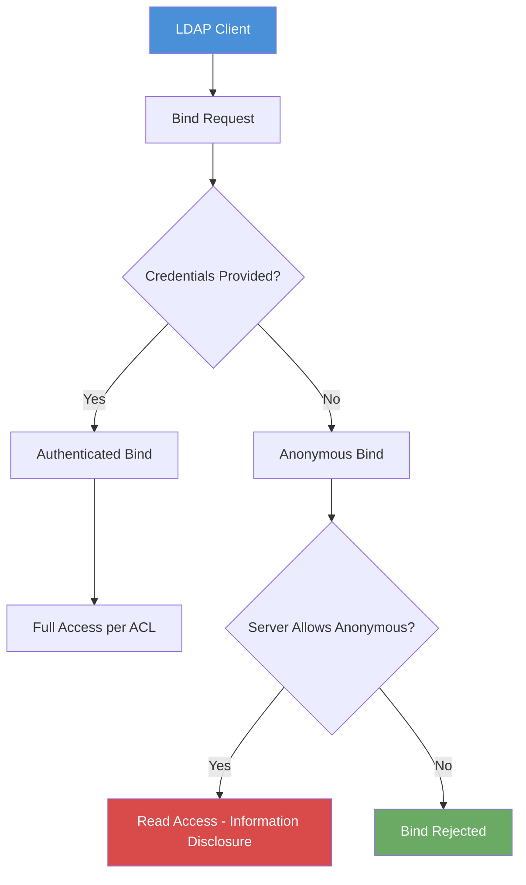

# Exercise 7.2: LDAP Anonymous Bind Test

## Before You Begin

In Exercise 7.1 you confirmed that LDAP is running on the target. Knowing the service exists is only the first step; now you need to determine whether the server allows unauthenticated queries. An LDAP server that permits **anonymous binds** lets anyone on the network read directory data without providing a username or password.

## Scenario

You are continuing the FinanceCorp penetration test. Your Nmap scan confirmed that port 389 is open and running OpenLDAP. Before you can enumerate users and groups, you need to determine whether the server requires credentials for LDAP queries. If anonymous binding is permitted, the entire directory may be readable without any authentication; a critical information disclosure finding.

## Your Objectives

- Use ldapsearch to attempt an anonymous bind against the target
- Understand the difference between authenticated and anonymous LDAP connections
- Determine whether the FinanceCorp LDAP server permits unauthenticated queries
- Capture the flag embedded in the directory data

---

## Background: Anonymous Binds

In LDAP terminology, a **bind** is the act of authenticating to the directory server. Every LDAP session begins with a bind operation; the client tells the server who it is and provides credentials. There are three types of binds you will encounter.

An **authenticated bind** provides a full DN and password, proving the client's identity. A **simple bind** uses plaintext credentials (username and password sent in the clear). An **anonymous bind** sends no credentials at all; the client connects and immediately begins querying without identifying itself. When a server accepts an anonymous bind, it treats the connection as an unauthenticated guest and returns whatever data its access control rules allow.

In many misconfigured environments, anonymous bind access is left enabled with default permissions that expose the entire directory tree. An attacker who discovers anonymous bind access can extract every user account, group membership, email address, and organizational unit in the directory; all without triggering any authentication logs.



## Tool Primer: ldapsearch

The `ldapsearch` command is the primary tool for querying LDAP directories from the command line. It is part of the `ldap-utils` package, which comes pre-installed on Kali Linux. You will use ldapsearch throughout the rest of this chapter.

!!! kali "Basic anonymous query syntax"
    Replace `<target_ip>` with the target IP shown in the Active Lab View. The command below is the basic shape of an anonymous LDAP query, with the flags explained in the table that follows.

    ```bash
    ldapsearch -x -H ldap://<target_ip> -b "dc=financecorp,dc=local"
    ```

    The flags control how ldapsearch connects and what it asks for:

    | Flag | Purpose |
    |------|---------|
    | `-x` | Use simple authentication instead of SASL (Security Assertion Markup Language). Required for anonymous binds. |
    | `-H ldap://<target_ip>` | Specify the LDAP server URI. The `ldap://` prefix indicates an unencrypted connection on port 389. |
    | `-b "dc=financecorp,dc=local"` | Set the Base DN; the starting point in the directory tree for the search. |

**Sample successful anonymous bind output:**

```
# extended LDIF
#
# LDAPv3
# base <dc=financecorp,dc=local> with scope subtree
# filter: (objectclass=*)
# requesting: ALL
#

# financecorp.local
dn: dc=financecorp,dc=local
objectClass: top
objectClass: dcObject
objectClass: organization
o: FinanceCorp
dc: financecorp

# Users, financecorp.local
dn: ou=Users,dc=financecorp,dc=local
objectClass: organizationalUnit
ou: Users

# search result
search: 2
result: 0 Success
```

**Sample failed anonymous bind output:**

```
ldap_bind: Inappropriate authentication (48)
	additional info: anonymous bind disallowed
```

A result code of `0 Success` means the anonymous bind was accepted and the server returned data. Any error code means the server rejected the unauthenticated connection.

---

## Walkthrough

### Step 1: Launch the Exercise

Open the platform in your browser and start the exercise environment.

- Navigate to **Exercises** then **Windows** then **Level 1**
- Click **Launch** on "LDAP Anonymous Bind Test"
- Wait for the status to change to **Running**
- Note the **target IP** displayed in the Active Lab View

### Step 2: Attempt an Anonymous Bind

!!! kali "Attempt an anonymous bind"
    Run ldapsearch with the `-x` flag and no credentials to test whether the server accepts anonymous connections:

    ```bash
    ldapsearch -x -H ldap://<target_ip> -b "dc=financecorp,dc=local"
    ```

    The `-x` flag tells ldapsearch to use simple authentication. Because you are not providing a `-D` (bind DN) or `-w` (password) flag, the tool sends an anonymous bind request. If the server accepts anonymous binds, you will see directory entries in the output. If not, you will see an error message.

### Step 3: Analyze the Response

If the bind succeeds, the output will contain LDIF-formatted directory entries. LDIF stands for LDAP Data Interchange Format; it is the standard text format for representing LDAP directory content.

Each entry begins with a `dn:` line showing the Distinguished Name of the object, followed by its attributes. Look through the returned entries for organizational units, user records, and any fields containing flag data.

If the bind fails, the error message will tell you why. Common rejection messages include "anonymous bind disallowed" or "insufficient access rights."

### Step 4: Count the Results

Scroll to the bottom of the output and look for the result summary. It tells you how many entries were returned:

```
# numEntries: 15
```

The number of entries indicates how much of the directory is accessible through anonymous binding. In a real penetration test, a high entry count means the server is exposing significant amounts of directory information to unauthenticated users.

---

### Record Your Findings

> **ldapsearch command used:**
>
> ```
> (paste your exact command here)
> ```
>
> **Result code:** ___________________________
>
> **Did the anonymous bind succeed?** Yes / No
>
> **Number of entries returned:** ___________________________
>
> **Organizational Units discovered:**
>
> | OU Name | Full DN |
> |---------|---------|
> |         |         |
> |         |         |
>
> **How to submit:** enter the flag on the exercise page exactly as you recovered it, keeping the `OCR{...}` wrapper.
>
> **Flag:** ___________________________

---

### Step 5: Record the Flag

The flag appears within the directory data returned by the anonymous query in `OCR{<flag_here>}` format. Copy it and paste it into the **Submit Flag** form on the platform and click **Submit**.

---

## Analysis Questions

**1. What is the security risk of allowing anonymous LDAP binds?**

??? note "Reveal Answer"

    Anonymous binds let anyone on the network query the directory without credentials. An attacker can extract usernames, email addresses, group memberships, organizational structure, and sometimes password-related attributes. None of these queries generate authentication logs, making the activity difficult to detect. The information gathered feeds directly into targeted attacks like password spraying and phishing.

**2. In the ldapsearch command, what happens if you omit the `-x` flag?**

??? note "Reveal Answer"

    Without `-x`, ldapsearch defaults to SASL (Simple Authentication and Security Layer) authentication, which requires additional configuration such as Kerberos tickets or SASL mechanisms. The connection will likely fail with an error about unsupported SASL mechanisms. The `-x` flag explicitly selects simple authentication, which is what you need for both anonymous and plaintext credential-based binds.

**3. The output format is called LDIF. Why is it significant to understand LDIF format?**

??? note "Reveal Answer"

    LDIF is the standard format for LDAP data exchange. Every entry starts with a `dn:` line followed by attribute-value pairs. Understanding LDIF lets you read raw directory dumps, create import files, and parse output with command-line tools like `grep`. Many LDAP tools, scripts, and attack frameworks expect or produce LDIF-formatted data.

---

## Key Takeaways

- An anonymous bind is an LDAP connection made without any credentials
- The `-x` flag in ldapsearch selects simple authentication, which is required for anonymous binding
- A successful anonymous bind returns directory entries and a result code of `0 Success`
- Anonymous bind access is a significant security finding because it exposes directory data to unauthenticated users
- Now that you have confirmed anonymous access works, the next exercise focuses on discovering the Base DN; the root of the directory tree that anchors all future queries
