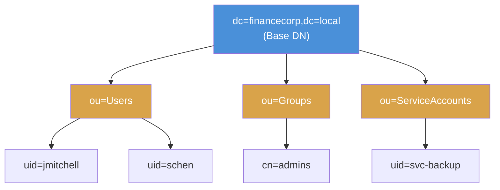

# Exercise 7.3: LDAP Base DN Enumeration

## Before You Begin

In Exercise 7.2 you confirmed that the FinanceCorp LDAP server accepts anonymous binds. You used a Base DN of `dc=financecorp,dc=local` because the lab instructions told you what it was. In a real penetration test, you would not know the Base DN in advance; you would need to discover it yourself. The Root DSE is the mechanism that makes that discovery possible.

## Scenario

You are continuing the FinanceCorp engagement. You have confirmed that anonymous LDAP queries work against the target. However, your team lead points out that in a real assessment you cannot assume you know the domain name or directory structure. You need to demonstrate that you can discover the Base DN from scratch by querying the Root DSE. Once you have the Base DN, every subsequent query will use it as the starting point for searching the directory tree.

## Your Objectives

- Query the Root DSE to discover the server's naming contexts
- Identify the Base DN from the `namingContexts` attribute
- Understand the hierarchical structure of the LDAP directory tree
- Use the discovered Base DN to perform a targeted directory search
- Capture the flag embedded in the directory data

---

## Background: The Root DSE and Base DN

Every LDAP server exposes a special entry called the **Root DSE** (DSA-Specific Entry, where DSA stands for Directory System Agent). The Root DSE sits at the very top of the directory; above all other entries; and it describes the server itself rather than any directory content. It is always accessible, even when the server restricts anonymous access to the rest of the directory.

The Root DSE contains several important attributes. The most critical for enumeration is `namingContexts`, which lists every Base DN the server hosts. A Base DN is the root of a directory partition; the topmost entry from which all other entries descend. For the FinanceCorp domain `financecorp.local`, the Base DN is `dc=financecorp,dc=local`.

Understanding how a domain name maps to a Base DN is straightforward. Each dot-separated component of the domain name becomes a `dc=` (Domain Component) element in the DN, and they are joined with commas:

```
financecorp.local  →  dc=financecorp,dc=local
corp.example.com   →  dc=corp,dc=example,dc=com
```

The directory tree below the Base DN is organized into **Organizational Units (OUs)**. OUs are containers that group related objects; much like folders in a file system. The FinanceCorp directory has OUs for Users, Groups, and ServiceAccounts.



## Tool Primer: Querying the Root DSE

Querying the Root DSE requires a specific combination of ldapsearch flags that differs from a normal directory search. You set the Base DN to an empty string and the search scope to `base`, which tells the server you want the Root DSE itself rather than any directory entries below it.

!!! kali "Root DSE query syntax"
    Replace `<target_ip>` with the target IP from the Active Lab View. The command below requests the Root DSE, and the flag table that follows explains each part.

    ```bash
    ldapsearch -x -H ldap://<target_ip> -b "" -s base "(objectclass=*)"
    ```

    The flags for a Root DSE query serve specific purposes:

    | Flag | Purpose |
    |------|---------|
    | `-x` | Use simple authentication (required for anonymous bind) |
    | `-H ldap://<target_ip>` | Target LDAP server URI |
    | `-b ""` | Empty Base DN; tells the server to return the Root DSE |
    | `-s base` | Search scope set to "base"; only return the entry at the Base DN itself, not its children |
    | `"(objectclass=*)"` | Match any object class; a wildcard filter that matches everything |

**Sample Root DSE output:**

```
# extended LDIF
#
# LDAPv3
# base <> with scope baseObject
# filter: (objectclass=*)
# requesting: ALL
#

#
dn:
objectClass: top
supportedLDAPVersion: 3
namingContexts: dc=financecorp,dc=local
subschemaSubentry: cn=Subschema
```

The `namingContexts` line reveals the Base DN: `dc=financecorp,dc=local`. On a real Active Directory server, you might see multiple naming contexts including the domain partition, configuration partition, and schema partition.

---

## Walkthrough

### Step 1: Launch the Exercise

Open the platform in your browser and start the exercise environment.

- Navigate to **Exercises** then **Windows** then **Level 1**
- Click **Launch** on "LDAP Base DN Enumeration"
- Wait for the status to change to **Running**
- Note the **target IP** displayed in the Active Lab View

### Step 2: Query the Root DSE

!!! kali "Query the Root DSE"
    Run the Root DSE query to discover the server's naming contexts:

    ```bash
    ldapsearch -x -H ldap://<target_ip> -b "" -s base "(objectclass=*)"
    ```

    The empty `-b ""` and `-s base` combination is the standard way to request the Root DSE. Look for the `namingContexts` attribute in the output; it contains the Base DN you need for all future queries.

### Step 3: Record the Base DN

From the Root DSE output, identify the value of `namingContexts`. For the FinanceCorp lab, you should see:

```
namingContexts: dc=financecorp,dc=local
```

Write down the Base DN. You will use it as the `-b` parameter in every ldapsearch query from this point forward.

### Step 4: Verify the Base DN with a Directory Search

!!! kali "Verify the Base DN with a directory search"
    Now use the Base DN you discovered to perform a directory search. Limit the results to Organizational Units to see the directory's top-level structure:

    ```bash
    ldapsearch -x -H ldap://<target_ip> \
      -b "dc=financecorp,dc=local" \
      "(objectClass=organizationalUnit)"
    ```

    The filter `(objectClass=organizationalUnit)` restricts results to OU entries only. You should see the major containers in the directory: Users, Groups, and ServiceAccounts.

### Step 5: Dump the Full Subtree to Find the Flag

!!! kali "Dump the full subtree"
    The OU-only filter shows containers, but the flag lives on an entry inside one of them. Run a full-subtree search from the Base DN to return every entry, including the service account that carries the flag:

    ```bash
    ldapsearch -x -H ldap://<target_ip> \
      -b "dc=financecorp,dc=local" \
      "(objectClass=*)"
    ```

    The filter `(objectClass=*)` matches every entry below the Base DN. Scroll through the output and read each `description` attribute. The flag appears on the `svc-backup` entry under `ou=ServiceAccounts` in `OCR{...}` format. To jump straight to it, pipe the output through grep:

    ```bash
    ldapsearch -x -H ldap://<target_ip> \
      -b "dc=financecorp,dc=local" \
      "(objectClass=*)" | grep "OCR{"
    ```

### Step 6: Understand the DN Components

Review the DNs returned by your search and break them into their component parts. Each DN tells you where an object sits in the directory hierarchy:

| DN | Meaning |
|----|---------|
| `dc=financecorp,dc=local` | The domain root |
| `ou=Users,dc=financecorp,dc=local` | The Users container under the domain root |
| `ou=Groups,dc=financecorp,dc=local` | The Groups container under the domain root |
| `ou=ServiceAccounts,dc=financecorp,dc=local` | The ServiceAccounts container under the domain root |

Recognizing these patterns lets you predict where specific types of objects are stored and write targeted search queries.

---

### Record Your Findings

> **Root DSE query output:**
>
> ```
> (paste your Root DSE output here)
> ```
>
> **Base DN discovered:** ___________________________
>
> **Supported LDAP version:** ___________________________
>
> **Organizational Units found:**
>
> | OU Name | Full DN |
> |---------|---------|
> |         |         |
> |         |         |
> |         |         |
>
> **How to submit:** enter the flag on the exercise page exactly as you recovered it, keeping the `OCR{...}` wrapper.
>
> **Flag:** ___________________________

---

### Step 7: Record the Flag

The flag appears in the directory data returned by your full-subtree search in `OCR{<flag_here>}` format. Copy it and paste it into the **Submit Flag** form on the platform and click **Submit**.

---

## Analysis Questions

**1. Why does the Root DSE use an empty Base DN and base scope?**

??? note "Reveal Answer"

    The Root DSE is not part of the normal directory tree; it exists above all naming contexts. Querying with an empty Base DN (`-b ""`) tells the server you want the server's own metadata entry rather than any directory content. The base scope (`-s base`) ensures only the Root DSE entry itself is returned, not entries below it. Together, these parameters form a special query that every LDAP server recognizes.

**2. A real Active Directory server might show multiple namingContexts. What would they represent?**

??? note "Reveal Answer"

    Active Directory uses multiple directory partitions. The domain partition (e.g., `dc=corp,dc=example,dc=com`) holds user, group, and computer objects. The configuration partition (`cn=Configuration,dc=corp,dc=example,dc=com`) holds site topology and service configuration. The schema partition (`cn=Schema,cn=Configuration,...`) defines the attribute types and object classes. Each partition appears as a separate namingContext in the Root DSE.

**3. How does knowing the Base DN help an attacker plan further enumeration?**

??? note "Reveal Answer"

    The Base DN is the required starting point for all LDAP queries. Without it, an attacker cannot construct valid search requests against the directory. Knowing the Base DN also reveals the domain name (financecorp.local), which is useful for Kerberos attacks, DNS enumeration, and crafting phishing emails. The Base DN is the foundation upon which every subsequent enumeration step builds.

---

## Key Takeaways

- The Root DSE is a special LDAP entry that describes the server itself and is accessible without authentication
- Querying with `-b "" -s base` retrieves the Root DSE instead of normal directory entries
- The `namingContexts` attribute in the Root DSE reveals the Base DN
- Domain names map directly to Base DNs: `financecorp.local` becomes `dc=financecorp,dc=local`
- OUs organize the directory into logical containers such as Users, Groups, and ServiceAccounts
- A full-subtree search with `(objectClass=*)` returns every entry, which is how you reach data that the OU-only filter does not show
- Now that you know the Base DN and directory structure, the next exercise targets user accounts stored under `ou=Users`
