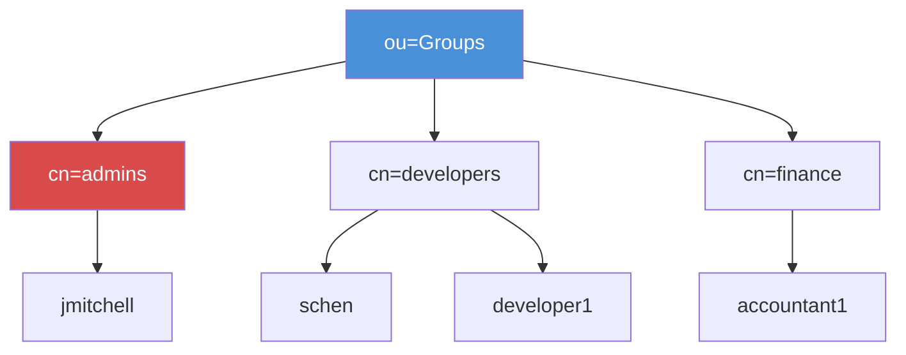

# Exercise 7.5: LDAP Group Enumeration

## Before You Begin

In Exercise 7.4 you extracted a complete list of user accounts from the FinanceCorp directory. Knowing who has an account is valuable, but knowing which groups they belong to is even more powerful. Group memberships determine what each user can access; and identifying members of privileged groups like "Domain Admins" tells you exactly which accounts to target in credential attacks.

## Scenario

You are continuing the FinanceCorp assessment. Your team now has a full list of usernames from the LDAP directory. The engagement lead wants you to map the organizational group structure; especially any groups that grant elevated privileges. Understanding group memberships helps prioritize which accounts to attack first. A single compromised Domain Admin account gives an attacker control over the entire domain.

## Your Objectives

- Query the LDAP directory for all group entries
- Identify the key security groups in the directory: admins, developers, and finance
- Extract group membership attributes to determine which users belong to each group
- Understand the relationship between users and groups in LDAP
- Capture the flag embedded in the directory data

---

## Background: LDAP Groups and Membership

LDAP directories organize access control through groups. A group entry contains a list of its members, and those memberships determine what resources each user can reach. In a corporate environment, groups typically map to departments (Finance, HR, Engineering) and privilege levels (Domain Admins, IT Staff, Help Desk).

Two common group object classes exist in OpenLDAP directories. The `posixGroup` class stores membership using the `memberUid` attribute, which contains simple username strings. The `groupOfNames` class stores membership using the `member` attribute, which contains full Distinguished Names of the member entries. Some directories use both classes depending on how they were configured.

Here is how each membership model looks in practice:

**posixGroup example (memberUid; simple usernames):**

```
dn: cn=developers,ou=Groups,dc=financecorp,dc=local
objectClass: posixGroup
cn: developers
gidNumber: 1001
memberUid: schen
memberUid: developer1
```

**groupOfNames example (member; full DNs):**

```
dn: cn=Domain Admins,ou=Groups,dc=financecorp,dc=local
objectClass: groupOfNames
cn: Domain Admins
member: uid=jmitchell,ou=Users,dc=financecorp,dc=local
member: uid=schen,ou=Users,dc=financecorp,dc=local
```

The distinction matters because the attribute you query depends on the object class. Querying for `memberUid` returns nothing if the group uses `member`, and vice versa.

From a penetration testing perspective, certain groups demand immediate attention. The FinanceCorp directory defines three groups, and each maps to a privilege tier you should weigh during an attack:

| Group Name | Why It Matters |
|-----------|---------------|
| admins | Administrative control over the environment; the highest-value target |
| developers | Likely has elevated access to application servers and source code |
| finance | Access to financial data; high-value for data exfiltration scenarios |



## Tool Primer: Querying Groups with ldapsearch

Group enumeration uses the same ldapsearch syntax you have been building throughout this chapter. The key differences are the search filter and the Base DN.

!!! kali "Group enumeration syntax"
    Replace `<target_ip>` with the target IP from the Active Lab View. The first command lists every POSIX group in the Groups OU.

    ```bash
    ldapsearch -x -H ldap://<target_ip> \
      -b "ou=Groups,dc=financecorp,dc=local" \
      "(objectClass=posixGroup)"
    ```

    Some directories store groups as `groupOfNames` instead. The next command targets that object class.

    ```bash
    ldapsearch -x -H ldap://<target_ip> \
      -b "ou=Groups,dc=financecorp,dc=local" \
      "(objectClass=groupOfNames)"
    ```

    To inspect one group in detail, filter on its common name. The command below pulls the admins group, which holds the most privileged accounts in this directory.

    ```bash
    ldapsearch -x -H ldap://<target_ip> \
      -b "ou=Groups,dc=financecorp,dc=local" \
      "(cn=admins)"
    ```

    The relevant flags and filters are summarized below:

    | Element | Purpose |
    |---------|---------|
    | `-b "ou=Groups,dc=financecorp,dc=local"` | Search only within the Groups OU |
    | `"(objectClass=posixGroup)"` | Match entries that are POSIX groups |
    | `"(objectClass=groupOfNames)"` | Match entries that are groupOfNames groups |
    | `"(cn=admins)"` | Match only the group named "admins" |
    | `cn memberUid member gidNumber` | Optional attribute list to limit returned fields |

---

## Walkthrough

### Step 1: Launch the Exercise

Open the platform in your browser and start the exercise environment.

- Navigate to **Exercises** then **Windows** then **Level 1**
- Click **Launch** on "LDAP Group Enumeration"
- Wait for the status to change to **Running**
- Note the **target IP** displayed in the Active Lab View

### Step 2: Enumerate All Groups

!!! kali "Enumerate all groups"
    Start by querying for all group entries in the Groups OU:

    ```bash
    ldapsearch -x -H ldap://<target_ip> \
      -b "ou=Groups,dc=financecorp,dc=local" \
      "(objectClass=posixGroup)"
    ```

    Review the output and count how many groups exist. Note the group names, their gidNumber values, and the membership attributes.

### Step 3: Try the groupOfNames Filter

!!! kali "Try the groupOfNames filter"
    Some groups may use the `groupOfNames` object class instead of `posixGroup`. Run a second query to check:

    ```bash
    ldapsearch -x -H ldap://<target_ip> \
      -b "ou=Groups,dc=financecorp,dc=local" \
      "(objectClass=groupOfNames)"
    ```

    Compare the results from both queries. Note whether any groups appear in one query but not the other, and observe the difference between `memberUid` (simple username) and `member` (full DN) attributes.

### Step 4: Identify the Administrative Group

!!! kali "Identify the admins group"
    Query the directory for the most privileged group specifically. In the FinanceCorp directory that group is named `admins`:

    ```bash
    ldapsearch -x -H ldap://<target_ip> \
      -b "ou=Groups,dc=financecorp,dc=local" \
      "(cn=admins)"
    ```

    The members of the admins group are the highest-priority targets in any credential attack. Document every member listed in the output; these accounts have administrative control over the environment.

### Step 5: Map Users to Groups

!!! kali "Map users to groups"
    Build a summary of which users belong to which groups. You can use a broad search with targeted attributes to get a concise overview:

    ```bash
    ldapsearch -x -H ldap://<target_ip> \
      -b "ou=Groups,dc=financecorp,dc=local" \
      "(objectClass=posixGroup)" cn memberUid
    ```

    The attribute list `cn memberUid` limits the output to just the group name and its members, producing a clean mapping.

### Step 6: Cross-Reference with User Data

Compare the group memberships against the user list you built in Exercise 7.4. Look for users who appear in multiple privileged groups; a user who is in both "admins" and "developers" is an especially high-value target because their credentials grant access to the broadest set of resources.

### Step 7: Find the Flag with a Full-Subtree Search

!!! kali "Search the whole directory for the flag"
    The group entries under `ou=Groups` describe membership, but the flag is not stored on a group. FinanceCorp parks the flag in the `description` attribute of the `svc-backup` service account under `ou=ServiceAccounts`, so a search scoped to the Groups OU will not reach it. Run a full-subtree search from the Base DN:

    ```bash
    ldapsearch -x -H ldap://<target_ip> \
      -b "dc=financecorp,dc=local" \
      "(objectClass=*)"
    ```

    To jump straight to the flag, pipe the output through grep:

    ```bash
    ldapsearch -x -H ldap://<target_ip> \
      -b "dc=financecorp,dc=local" \
      "(objectClass=*)" | grep "OCR{"
    ```

    The flag appears on the `uid=svc-backup,ou=ServiceAccounts,dc=financecorp,dc=local` entry in `OCR{...}` format.

---

### Record Your Findings

> **Total number of groups found:** ___________________________
>
> **Group summary:**
>
> | Group Name | gidNumber | Members |
> |-----------|-----------|---------|
> |           |           |         |
> |           |           |         |
> |           |           |         |
> |           |           |         |
>
> **admins group members:** ___________________________
>
> **Users appearing in multiple groups:** ___________________________
>
> **How to submit:** enter the flag on the exercise page exactly as you recovered it, keeping the `OCR{...}` wrapper.
>
> **Flag:** ___________________________

---

### Step 8: Record the Flag

The flag appears on the service account entry in `OCR{<flag_here>}` format. Copy it and paste it into the **Submit Flag** form on the platform and click **Submit**.

---

## Analysis Questions

**1. Why is the Domain Admins group the most important finding during LDAP enumeration?**

??? note "Reveal Answer"

    Members of the Domain Admins group have unrestricted control over the entire Active Directory domain. Compromising a single Domain Admin account gives an attacker the ability to create accounts, modify group memberships, access any resource, deploy software, and extract credentials for every other user. Identifying Domain Admin usernames lets an attacker focus credential attacks on the accounts with the highest potential payoff.

**2. What is the practical difference between the `memberUid` and `member` attributes?**

??? note "Reveal Answer"

    The `memberUid` attribute stores simple username strings (e.g., `jmitchell`), while the `member` attribute stores full Distinguished Names (e.g., `uid=jmitchell,ou=Users,dc=financecorp,dc=local`). The `memberUid` format is easier to read and use directly in credential attacks. The `member` format provides the full path to the user entry, which is useful for verifying the user exists and for building more complex LDAP queries. Your enumeration scripts need to handle both formats.

**3. How does mapping group memberships help prioritize a credential attack?**

??? note "Reveal Answer"

    Not all user accounts are equally valuable. An attacker with limited time should focus on accounts that grant the highest level of access. Group memberships reveal which accounts have administrative privileges, access to sensitive data, or control over critical infrastructure. Attacking a Domain Admin account first is more efficient than brute-forcing every account in the directory and hoping one of them has useful access.

---

## Key Takeaways

- LDAP groups are stored under `ou=Groups` and use either `posixGroup` or `groupOfNames` object classes
- The `memberUid` attribute contains simple usernames; the `member` attribute contains full DNs
- Domain Admins is the highest-priority group; its members have complete domain control
- Cross-referencing group memberships with user accounts reveals which accounts to target first
- Querying by specific group name with `(cn=Group Name)` lets you inspect individual groups
- Now that you have users and groups mapped, the next exercise combines all techniques into a thorough enumeration methodology
