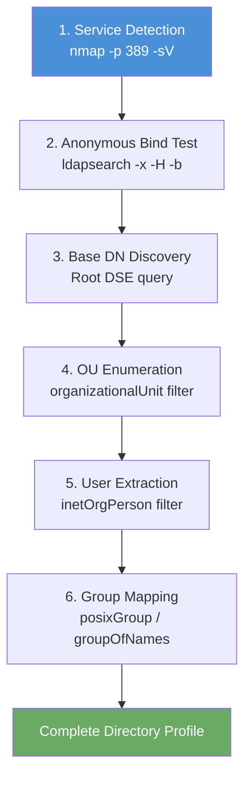

# Exercise 7.6: LDAP Comprehensive Enumeration

## Before You Begin

In Exercises 7.1 through 7.5 you learned each step of LDAP enumeration individually; detecting the service, testing anonymous binds, discovering the Base DN, extracting users, and mapping groups. A real penetration tester executes all of these steps together as a single methodology. In this exercise you will combine every technique into one complete enumeration pass against the FinanceCorp LDAP directory.

## Scenario

You are wrapping up the LDAP enumeration phase of the FinanceCorp penetration test. The engagement lead has asked you to produce a single, thorough report of everything the LDAP directory exposes to an unauthenticated attacker. Your deliverable is a full directory dump: the service version, Base DN, every organizational unit, every user account, every group and its members, and any sensitive data visible in the directory. Run the complete methodology from detection through extraction in one session.

## Your Objectives

- Execute the full LDAP enumeration methodology in sequence
- Combine Nmap detection with ldapsearch queries for complete coverage
- Extract and organize all directory data: OUs, users, groups, and attributes
- Identify sensitive or interesting data patterns in the directory
- Produce a structured summary suitable for a penetration test report
- Capture the flag embedded in the directory data

---

## Background: The LDAP Enumeration Methodology

Professional penetration testers follow a structured methodology when enumerating LDAP. Each step builds on the previous one, and skipping steps means missing information. The complete flow covers six phases that mirror the labs you have already completed.



Running these steps in order ensures nothing is missed. The Nmap scan confirms the service is running and identifies the software. The anonymous bind test determines whether credentials are needed. The Root DSE query discovers the Base DN. From there, targeted queries extract the organizational structure, user accounts, and group memberships.

In addition to the individual ldapsearch queries, you can perform a full directory dump with a single command. A wildcard search from the Base DN returns every entry in the directory, which is useful as a final sweep to catch anything the targeted queries might have missed.

Nmap's LDAP scripts also provide automated enumeration that complements manual ldapsearch queries. Running both tools ensures you get the most complete picture possible; each tool may extract data that the other misses.

## Tool Primer: Full Directory Dump and Nmap LDAP Scripts

Two techniques form the core of a thorough enumeration: the ldapsearch wildcard dump and the Nmap LDAP script suite.

!!! kali "Full directory dump with ldapsearch"
    Replace `<target_ip>` with the target IP from the Active Lab View. The wildcard query below pulls the entire directory in one pass.

    ```bash
    ldapsearch -x -H ldap://<target_ip> \
      -b "dc=financecorp,dc=local" \
      "(objectclass=*)"
    ```

    The wildcard filter `(objectclass=*)` matches every entry in the directory. Combined with the domain-level Base DN, this query returns the complete directory tree; every OU, user, group, and any other objects stored in the directory.

!!! kali "Nmap full LDAP scan"
    Nmap's LDAP scripts automate much of the same enumeration. The command below runs three scripts against port 389.

    ```bash
    nmap -p 389 -sV --script=ldap-rootdse,ldap-search,ldap-brute <target_ip>
    ```

    The scripts in this command perform different functions:

    | Script | Purpose |
    |--------|---------|
    | `ldap-rootdse` | Extract Root DSE information (Base DN, supported versions) |
    | `ldap-search` | Perform automated LDAP searches and return directory entries |
    | `ldap-brute` | Attempt common credential combinations against the LDAP bind |

**Targeted queries for the full pass:**

| Query Target | ldapsearch Command |
|-------------|-------------------|
| Root DSE | `ldapsearch -x -H ldap://<target_ip> -b "" -s base "(objectclass=*)"` |
| All OUs | `ldapsearch -x -H ldap://<target_ip> -b "dc=financecorp,dc=local" "(objectClass=organizationalUnit)"` |
| All Users | `ldapsearch -x -H ldap://<target_ip> -b "ou=Users,dc=financecorp,dc=local" "(objectClass=inetOrgPerson)"` |
| All Groups | `ldapsearch -x -H ldap://<target_ip> -b "ou=Groups,dc=financecorp,dc=local" "(objectClass=posixGroup)"` |
| Specific User | `ldapsearch -x -H ldap://<target_ip> -b "dc=financecorp,dc=local" "(uid=jmitchell)"` |
| Specific Group | `ldapsearch -x -H ldap://<target_ip> -b "dc=financecorp,dc=local" "(cn=admins)"` |

---

## Walkthrough

### Step 1: Launch the Exercise

Open the platform in your browser and start the exercise environment.

- Navigate to **Exercises** then **Windows** then **Level 1**
- Click **Launch** on "LDAP Comprehensive Enumeration"
- Wait for the status to change to **Running**
- Note the **target IP** displayed in the Active Lab View

### Step 2: Detect the LDAP Service

!!! kali "Detect the LDAP service"
    Start the methodology with service detection. Run an Nmap scan with version detection and LDAP scripts:

    ```bash
    nmap -p 389 -sV --script=ldap-rootdse,ldap-search <target_ip>
    ```

    Record the service version (OpenLDAP / slapd), the Base DN from the Root DSE output, and any directory entries the scripts return. Compare the Nmap script results with what you found using ldapsearch in earlier labs.

### Step 3: Confirm Anonymous Bind Access

!!! kali "Confirm anonymous bind access"
    Verify that anonymous queries still work by running a simple ldapsearch against the Base DN:

    ```bash
    ldapsearch -x -H ldap://<target_ip> \
      -b "dc=financecorp,dc=local" \
      "(objectclass=*)" \
      dn
    ```

    Appending `dn` as the only requested attribute returns just the Distinguished Name of each entry, giving you a compact overview of every object in the directory without the full attribute data. A successful response confirms anonymous bind access is permitted.

### Step 4: Discover the Base DN from Root DSE

!!! kali "Discover the Base DN from Root DSE"
    Even though you already know the Base DN, practice the discovery step as part of the full methodology:

    ```bash
    ldapsearch -x -H ldap://<target_ip> -b "" -s base "(objectclass=*)"
    ```

    Record the `namingContexts` value. In a real engagement, you would always start here rather than assuming you know the domain.

### Step 5: Enumerate Organizational Units

!!! kali "Enumerate organizational units"
    Map the directory structure by querying for all OUs:

    ```bash
    ldapsearch -x -H ldap://<target_ip> \
      -b "dc=financecorp,dc=local" \
      "(objectClass=organizationalUnit)" \
      ou description
    ```

    Requesting only the `ou` and `description` attributes produces a concise list of containers. Note each OU name; these tell you how the organization structures its directory.

### Step 6: Extract All User Accounts

!!! kali "Extract all user accounts"
    Pull the complete user listing with key attributes:

    ```bash
    ldapsearch -x -H ldap://<target_ip> \
      -b "ou=Users,dc=financecorp,dc=local" \
      "(objectClass=inetOrgPerson)" \
      uid cn sn mail uidNumber gidNumber
    ```

    Count the total number of user entries. Record each username, full name, and email address in your findings table.

### Step 7: Map All Group Memberships

!!! kali "Map all group memberships"
    Extract groups and their members:

    ```bash
    ldapsearch -x -H ldap://<target_ip> \
      -b "ou=Groups,dc=financecorp,dc=local" \
      "(objectClass=posixGroup)" \
      cn gidNumber memberUid
    ```

    Also check for groupOfNames entries:

    ```bash
    ldapsearch -x -H ldap://<target_ip> \
      -b "ou=Groups,dc=financecorp,dc=local" \
      "(objectClass=groupOfNames)" \
      cn member
    ```

    Cross-reference the group members against your user list from Step 6. Identify any users with memberships in multiple privileged groups.

### Step 8: Perform a Full Directory Dump

!!! kali "Perform a full directory dump"
    As a final sweep, dump the entire directory to catch anything the targeted queries missed:

    ```bash
    ldapsearch -x -H ldap://<target_ip> \
      -b "dc=financecorp,dc=local" \
      "(objectclass=*)"
    ```

    Scroll through the complete output looking for entries that did not appear in your earlier queries; objects stored outside the Users and Groups OUs, the service accounts under `ou=ServiceAccounts`, or entries with unusual attributes. The flag rides in the `description` attribute of the `svc-backup` service account, so a quick way to find it is to grep the dump:

    ```bash
    ldapsearch -x -H ldap://<target_ip> \
      -b "dc=financecorp,dc=local" \
      "(objectclass=*)" | grep "OCR{"
    ```

---

### Record Your Findings

> **Service Detection:**
>
> | Field | Value |
> |-------|-------|
> | Service | |
> | Version | |
> | Base DN | |
>
> **Anonymous Bind:** Permitted / Denied
>
> **Organizational Units:**
>
> | OU Name | Description |
> |---------|------------|
> |         |            |
> |         |            |
> |         |            |
>
> **User Accounts:**
>
> | uid | cn | mail | uidNumber |
> |-----|-----|------|-----------|
> |     |     |      |           |
> |     |     |      |           |
> |     |     |      |           |
>
> **Groups and Members:**
>
> | Group Name | Members |
> |-----------|---------|
> |           |         |
> |           |         |
> |           |         |
>
> **Domain Admin Accounts:** ___________________________
>
> **Total directory entries:** ___________________________
>
> **How to submit:** enter the flag on the exercise page exactly as you recovered it, keeping the `OCR{...}` wrapper.
>
> **Flag:** ___________________________

---

### Step 9: Record the Flag

The flag appears within the directory data in `OCR{<flag_here>}` format. Copy it and paste it into the **Submit Flag** form on the platform and click **Submit**.

---

## Analysis Questions

**1. Why is it important to run both Nmap scripts and manual ldapsearch queries during a thorough enumeration?**

??? note "Reveal Answer"

    Each tool may extract data the other misses. Nmap LDAP scripts use predefined query patterns that are good for quick discovery but may not search every OU or apply every relevant filter. Manual ldapsearch queries let you target specific containers, filter by exact object classes, and request specific attributes. Running both tools ensures the most complete coverage. In a professional engagement, overlooking a single account or group could mean missing the path to domain compromise.

**2. In a real penetration test, how would you organize and present this LDAP data in your report?**

??? note "Reveal Answer"

    A professional report would include a summary of findings (anonymous bind enabled, N users exposed, N groups enumerable), a risk rating for the anonymous bind misconfiguration, a complete user list table, a group membership matrix showing which users belong to which groups with privilege levels highlighted, and specific recommendations for remediation. The raw ldapsearch output would go into an appendix. The executive summary would focus on the business impact; an unauthenticated attacker can enumerate the entire directory.

**3. What remediation steps would you recommend to the FinanceCorp team?**

??? note "Reveal Answer"

    The primary recommendation is to disable anonymous LDAP binds so that all queries require authentication. Access Control Lists (ACLs) should be configured to restrict which attributes authenticated users can read; not everyone needs to see every attribute on every entry. LDAP traffic should be encrypted using LDAPS (port 636) or StartTLS to prevent credential sniffing. Sensitive attributes like password hashes should be restricted to administrative accounts only. Network segmentation should limit which systems can reach port 389 at all.

---

## Key Takeaways

- A complete LDAP enumeration follows a structured methodology: detect, bind, discover Base DN, enumerate OUs, extract users, map groups
- Running both Nmap LDAP scripts and manual ldapsearch queries provides the most complete coverage
- A full directory dump with `(objectclass=*)` catches entries that targeted queries might miss
- Cross-referencing users and groups reveals the highest-value targets for credential attacks
- The enumeration data you gathered in this chapter feeds directly into Chapter 8, where you will test credentials against the accounts you discovered
