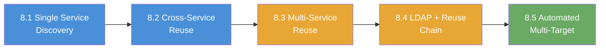

# Chapter 8: Credential Reuse

## What Is Credential Reuse?

People reuse passwords. A system administrator might set the same password on an SMB (Server Message Block) share, an RDP (Remote Desktop Protocol) login, and an SSH (Secure Shell) account; either out of convenience or because one set of credentials was copied across services during setup. Credential reuse is the practice of taking a username and password discovered on one service and testing them against every other service on the network to see where else they work.

Unlike brute force attacks, which generate thousands of password guesses, credential reuse starts with credentials you already know are valid somewhere. The approach is quieter, faster, and far more likely to succeed. A single working password discovered on an open file share can unlock remote desktop access, command-line shells, and database connections across the entire environment.

## Why Attackers Care

Credential reuse is one of the most reliable escalation techniques in a penetration test. Organizations frequently deploy multiple services on a single host or across hosts using the same local accounts and passwords. A penetration tester who discovers credentials on one service immediately gains a list of candidates to test everywhere else; and the success rate is remarkably high.

The value compounds with each service that accepts the same credentials. Access to SMB gives you file shares and potential data exfiltration. Access to RDP gives you a full graphical desktop session. Access to SSH gives you a command-line shell. Finding one password that works across all three transforms a minor finding into a critical one, because the attacker can choose the access method best suited to their objective.

Automated tools like **CrackMapExec** (CME) make credential reuse testing fast and systematic. CME can take a single set of credentials and spray them across dozens of targets and multiple protocols in seconds. Understanding how these tools work; and what their output means; is essential for both offensive testers and defenders trying to detect credential reuse attacks.

## What You Will Learn

The five labs in this chapter take you from discovering credentials on a single service to automating credential reuse testing across multiple targets and protocols. Each lab expands the scope: more services, more targets, and more automation. The progression mirrors how a real penetration tester escalates after finding that first working password.

By the end of this chapter, you will be able to:

- Discover credentials stored on an SMB share and verify them against the same service
- Test known credentials against a different service to confirm cross-service reuse
- Spray a single set of credentials across SMB, RDP, and SSH on the same target
- Chain LDAP (Lightweight Directory Access Protocol) enumeration with credential discovery and multi-protocol reuse
- Use CrackMapExec to automate credential reuse testing across multiple targets and protocols simultaneously

## What Makes Credential Reuse Different from Brute Force?

Brute force attacks guess passwords; they take a username and try thousands or millions of password candidates until one works. Credential reuse does not guess. Credential reuse takes a password that is already confirmed valid on one service and tests whether the same password works on other services or other machines.

The distinction matters for two reasons. First, credential reuse generates far fewer authentication attempts, making detection harder. A brute force attack against 10 users with a 10,000-word password list creates 100,000 login events. Credential reuse with one known password against 10 users across 3 services creates only 30 login events. Second, credential reuse has a much higher success rate per attempt because the password is not a guess; someone already chose that password for at least one account.

The table below shows how the two approaches compare:

| Factor | Brute Force | Credential Reuse |
|--------|-------------|------------------|
| Password source | Wordlist or generation rules | Known valid credentials |
| Attempts per target | Hundreds to millions | One to a handful |
| Detection risk | High (many failed logins) | Low (few attempts) |
| Success rate per attempt | Very low | High |
| Prerequisite | Username list | Username + confirmed password |

## The Tools You Will Use

Each lab introduces new tools or applies familiar tools to new protocols. The chapter builds on tools you have already used in previous chapters and adds CrackMapExec's multi-protocol capabilities as the primary automation layer.

| Tool | Purpose | First Used |
|------|---------|------------|
| `nmap` | Port scanning and service discovery | Exercise 8.1 |
| `smbclient` | SMB share access and file retrieval | Exercise 8.1 |
| `smbmap` | SMB share permission enumeration | Exercise 8.1 |
| `crackmapexec` | Multi-protocol credential testing (SMB, RDP, SSH) | Exercise 8.2 |
| `xfreerdp` | RDP session connection | Exercise 8.2 |
| `ssh` | SSH remote shell access | Exercise 8.2 |
| `ldapsearch` | LDAP directory enumeration | Exercise 8.4 |
| `enum4linux` | SMB and LDAP enumeration wrapper | Exercise 8.4 |

## Lab Progression

The five labs follow a deliberate progression from single-service credential discovery to multi-target automated reuse. Each lab builds on the previous one by expanding the number of services, the number of targets, or the level of automation:

| Exercise | Focus | What It Adds |
|-----|-------|-------------|
| 8.1 | Single Service Credential Discovery | Find credentials on SMB, verify on the same service |
| 8.2 | Cross-Service Credential Reuse | Test SMB credentials against RDP; first cross-protocol test |
| 8.3 | Multi-Service Credential Reuse | Spray one set of credentials across SMB, RDP, and SSH |
| 8.4 | Credential Discovery and Reuse Chain | LDAP enumeration feeds credential discovery, then reuse across three services |
| 8.5 | CME Credential Reuse Automation | CrackMapExec sprays credentials across three separate targets |

Notice how the scope expands at each step: one service becomes two, then three, then a full enumeration-to-exploitation chain, and finally multiple targets. Do not worry about memorizing every command and flag right now. Each lab walkthrough explains the specific tools and syntax before you run them.

## Before You Start

Make sure the following are in place before beginning Exercise 8.1:

- [ ] You have completed Chapter 2 (SMB Reconnaissance) and Chapter 3 (SMB Credential Attacks)
- [ ] You are comfortable using `smbclient` to connect to shares and retrieve files
- [ ] You understand how CrackMapExec tests credentials against a target
- [ ] You know the basics of RDP and SSH connectivity from earlier chapters
- [ ] Your VPN is connected and your terminal is open
- [ ] You have a Kali Linux terminal with CrackMapExec, smbclient, xfreerdp, and ldapsearch available
- [ ] You have verified connectivity to the target by pinging it or running a quick Nmap scan

If SMB authentication concepts from Chapter 3 feel unclear, review those labs before proceeding. The techniques in this chapter assume you can already authenticate to SMB and interpret the results.
