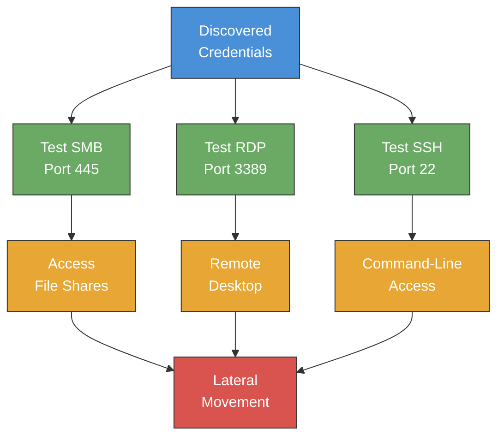

# Exercise 8.2: Cross-Service Credential Reuse

## Before You Begin

Cross-service credential reuse testing requires access to multiple protocols on the same target. Before starting, confirm that your Kali Linux virtual machine (VM) is connected to the OpenCyberRange network through the WireGuard VPN tunnel. Verify connectivity by pinging the target IP address shown on the lab dashboard.

Ensure the following tools are installed on your Kali VM:

- `nmap` for port scanning and service detection
- `crackmapexec` for multi-protocol credential validation
- `smbclient` for Server Message Block (SMB) share enumeration
- `xfreerdp` for Remote Desktop Protocol (RDP) connections
- `sshpass` and `ssh` for automated Secure Shell (SSH) login

## Scenario

You are continuing the FinanceCorp penetration test from Exercise 8.1. James Mitchell wants to know whether the SMB credentials discovered earlier; `admin:password123`: grant access to other services on the same host. The target server runs three services: SMB on port 445, RDP on port 3389, and SSH on port 22. If the same credentials work across multiple services, the organization faces a significantly higher risk of lateral movement.

Your task is to verify the credentials against each service, document which services accept them, and retrieve a flag stored on the target filesystem.

## Your Objectives

Each objective addresses a stage in the cross-service credential reuse assessment.

1. Scan the target to confirm SMB, RDP, and SSH are running
2. Test the credentials against SMB using CrackMapExec (CME)
3. Test the credentials against RDP using CME
4. Enumerate SMB shares to confirm file-level access
5. Connect via SSH and retrieve the flag from `/home/admin/flag.txt`
6. Document all services where the credentials are valid

---

## Background: Cross-Service Credential Reuse

Cross-service credential reuse occurs when the same username and password combination grants access to more than one service or protocol on a target. Users and administrators often reuse passwords across systems for convenience, creating a chain of access that attackers exploit during lateral movement.

Lateral movement is the process of expanding access within a network after an initial foothold. When a single credential pair unlocks SMB, RDP, and SSH on the same host, an attacker can choose the most advantageous protocol for their objective; file exfiltration through SMB, interactive desktop access through RDP, or command-line control through SSH.



Organizations mitigate credential reuse through unique passwords per service, centralized identity management, and multi-factor authentication (MFA). Penetration testers document every service where reused credentials succeed to demonstrate the scope of the exposure.

## Tool Primer: CrackMapExec

CrackMapExec (CME) is a post-exploitation tool designed for rapid credential validation across multiple protocols. Rather than testing each service manually with protocol-specific tools, CME provides a unified interface for SMB, RDP, SSH, WinRM, and other services.

The following table describes the core CME operations used in this exercise.

| Operation | Command | Description |
|-----------|---------|-------------|
| Test SMB credentials | `crackmapexec smb <target_ip> -u admin -p password123` | Authenticate against SMB |
| Test RDP credentials | `crackmapexec rdp <target_ip> -u admin -p password123` | Authenticate against RDP |
| Test SSH credentials | `crackmapexec ssh <target_ip> -u admin -p password123` | Authenticate against SSH |

CME output uses color-coded indicators to report results. A green `[+]` marker indicates successful authentication. A red `[-]` marker indicates failed authentication. Some protocols display additional context; for example, SMB results may include `(Pwn3d!)` when the account has administrative privileges on the target.

```
SMB   <target_ip>  445  TARGET  [+]  admin:password123 (Pwn3d!)
RDP   <target_ip>  3389 TARGET  [+]  admin:password123
```

The unified syntax makes CME efficient for testing one credential pair against many services or many credential pairs against one service. Penetration testers use CME to quickly map out which accounts have access to which services across an entire network segment.

## Walkthrough

### Step 1: Launch the Exercise

Open the OpenCyberRange dashboard and start Exercise 8.2 from the Credential Reuse track. Wait for the environment to report a ready status and note the target IP address. All commands in the walkthrough use this target IP.

!!! kali "Confirm connectivity to the target"
    Send a ping to the target IP shown on the lab dashboard to verify the VPN path is up.

    ```bash
    ping -c 3 <target_ip>
    ```

### Step 2: Scan Ports 22, 445, and 3389

!!! kali "Scan ports 22, 445, and 3389"
    Run an Nmap service version scan against the three target ports to confirm which services are running.

    ```bash
    nmap -sV -p 22,445,3389 <target_ip>
    ```

    The output should show all three ports as open. Note the service banners for SSH, SMB, and RDP; each banner provides version information that may be relevant for vulnerability research. Confirm that all three services are reachable before proceeding to credential testing.

### Step 3: Verify Credentials on SMB with CrackMapExec

!!! kali "Verify credentials on SMB with CrackMapExec"
    Test the credentials `admin:password123` against the SMB service using CME.

    ```bash
    crackmapexec smb <target_ip> -u admin -p password123
    ```

    Look for the `[+]` indicator in the output. A successful result confirms that the credentials are valid for SMB authentication. Note whether the output includes `(Pwn3d!)`, which indicates administrative-level access on the target.

### Step 4: Verify Credentials on RDP with CrackMapExec

!!! kali "Verify credentials on RDP with CrackMapExec"
    Test the same credentials against the RDP service.

    ```bash
    crackmapexec rdp <target_ip> -u admin -p password123
    ```

    A `[+]` result confirms that the RDP service also accepts the same credential pair. Credential reuse across SMB and RDP means an attacker could access both file shares and a full graphical desktop session on the target.

!!! kali "Launch an interactive RDP session"
    You can optionally verify the RDP connection by launching an interactive session with `xfreerdp`.

    ```bash
    xfreerdp /v:<target_ip> /u:admin /p:password123 /cert:ignore
    ```

    Close the RDP session after confirming access; the flag is retrieved through SSH in a later step.

### Step 5: Enumerate SMB Shares

!!! kali "Enumerate SMB shares"
    Use `smbclient` to list the available shares and confirm that the credentials provide file-level access.

    ```bash
    smbclient -L //<target_ip> -U admin%password123
    ```

    Review the share listing for any non-default shares. Connect to each share and examine the contents as you did in Exercise 8.1. The SMB enumeration confirms that the credential reuse extends to file share access.

### Step 6: Connect via SSH to Retrieve the Flag

!!! kali "Connect via SSH to retrieve the flag"
    Use `sshpass` to authenticate to the SSH service and read the flag file located at `/home/admin/flag.txt`.

    ```bash
    sshpass -p 'password123' ssh -o StrictHostKeyChecking=no admin@<target_ip> 'cat /home/admin/flag.txt'
    ```

    The command authenticates as `admin`, reads the flag file, and prints the `OCR{...}` flag value to your terminal. Copy the flag exactly as displayed. The `-o StrictHostKeyChecking=no` flag bypasses the host key verification prompt for lab environments; do not use that option in production assessments.

---

### Record Your Findings

Document all credential testing results and the services that accepted the credentials.

> **My Nmap output:**
>
> ```
> (paste your nmap output here)
> ```
>
> **Open ports I found:**
>
> | Port | Service |
> |------|---------|
> |      |         |
>
> **CrackMapExec results:**
>
> | Protocol | Port | Result | Indicator |
> |----------|------|--------|-----------|
> | SMB      | 445  |        |           |
> | RDP      | 3389 |        |           |
>
> **Flag value:**
>
> ```
> (paste the flag here)
> ```

---

### Step 7: Interpret the Results

The credential pair `admin:password123` granted access to three separate services on the same host: SMB, RDP, and SSH. Each service provides a different type of access; file shares, graphical desktop, and command-line shell; and each represents a distinct attack path an adversary could exploit.

Cross-service credential reuse amplifies the impact of a single compromised credential. An attacker who discovers one valid login can pivot across protocols, choosing the most effective channel for data exfiltration, persistence, or privilege escalation. The finding demonstrates that FinanceCorp lacks per-service credential segmentation and that password reuse is a systemic issue.

### Step 8: Find and Submit the Flag

Return to the OpenCyberRange dashboard and paste the `OCR{...}` flag into the submission field for Exercise 8.2. Successful validation confirms that you authenticated via SSH and retrieved the flag from the target filesystem.

---

## Analysis Questions

Work through each question to deepen your understanding of cross-service credential reuse.

**1. Why is cross-service credential reuse more dangerous than single-service credential exposure?**

??? note "Reveal Answer"

    A single compromised service limits the attacker to one type of access. Cross-service reuse multiplies the attack surface; the same credentials unlock file shares, remote desktops, and command-line shells. An attacker can choose the protocol best suited to their objective, and defenders must revoke access across every affected service simultaneously to contain the breach.

**2. What advantages does CrackMapExec offer over testing each service manually?**

??? note "Reveal Answer"

    CME provides a unified command-line interface for testing credentials against multiple protocols without switching between protocol-specific tools. A penetration tester can validate one credential pair across SMB, RDP, SSH, and other services using consistent syntax. CME also supports batch testing with username and password lists, making it efficient for large-scale credential audits across entire network ranges.

**3. What remediation steps would you recommend to FinanceCorp?**

??? note "Reveal Answer"

    The primary recommendation is to enforce unique passwords for each service and user account. FinanceCorp should deploy a centralized identity provider with MFA to prevent password reuse from granting cross-service access. Service accounts should follow the principle of least privilege, with each account scoped to the minimum services required. Regular credential audits and password rotation policies reduce the window of exposure when a credential is compromised.

---

## Key Takeaways

Reusing the same credentials across multiple services creates a lateral movement path that attackers exploit to expand their access. A single compromised password that works on SMB, RDP, and SSH gives an attacker three distinct channels to interact with the target system.

CrackMapExec streamlines credential validation by providing a single tool for testing multiple protocols. The `[+]` and `[-]` output indicators give immediate feedback on which services accept the tested credentials, replacing the need to connect manually with protocol-specific clients.

Effective remediation requires both technical controls and organizational policy. Unique per-service credentials, centralized identity management, MFA, and regular password audits all reduce the risk of cross-service credential reuse.

Exercise 8.3 extends credential reuse testing to multiple hosts, exploring how compromised credentials can enable movement across an entire network segment.
