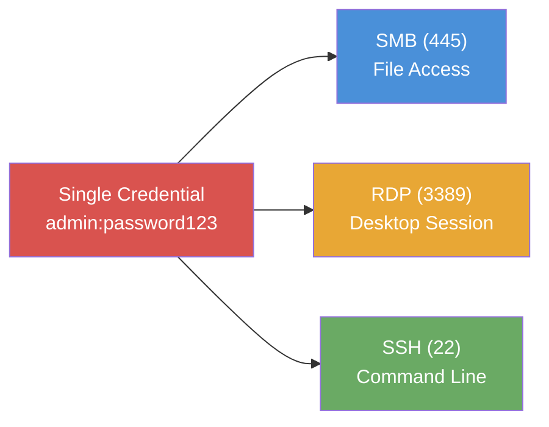

# Exercise 8.3: Multi-Service Credential Reuse

## Before You Begin

In Exercises 8.1 and 8.2 you tested credentials against individual services one at a time. Real networks rarely expose a single service; most servers run multiple protocols simultaneously. Exercise 8.3 introduces multi-service credential testing, where a single username and password pair is validated against every accessible protocol on the same target.

Confirm your VPN connection is active before proceeding. Run `ip a show wg0` and verify you have a valid WireGuard address in the `10.100.x.x` range.

## Scenario

James Mitchell, the FinanceCorp engagement lead, has asked for a thorough assessment of credential reuse across all services on a single target host. The server exposes three protocols; Server Message Block (SMB) on port 445, Remote Desktop Protocol (RDP) on port 3389, and Secure Shell (SSH) on port 22. Your task is to demonstrate that the same credential pair grants access to every one of these services, then retrieve sensitive data through the most efficient channel.

## Your Objectives

- Scan the target and confirm all three services are running
- Test a known credential pair against SMB, RDP, and SSH using CrackMapExec
- Enumerate accessible SMB shares with the validated credentials
- Connect via SSH and retrieve the flag from the file system

---

## Background: Why Multi-Service Credential Reuse Amplifies Risk

Credential reuse becomes significantly more dangerous when a target exposes multiple services. A single valid username and password pair is not one attack path; it is three, four, or more, depending on how many protocols accept the same credentials. Each service grants a different type of access, and an attacker who can authenticate to all of them gains a far wider range of capabilities than one who controls only a single channel.

Consider what each service type provides when compromised:



| Service | Port | Access Type | Attacker Capability |
|---------|------|------------|---------------------|
| SMB | 445 | File shares | Browse and download files, upload payloads, access sensitive documents |
| RDP | 3389 | Graphical desktop | Full interactive desktop session, run GUI applications, screenshot capture |
| SSH | 22 | Command-line shell | Execute commands directly, transfer files, pivot to other hosts |

SMB access lets an attacker browse shared folders, download sensitive documents, and upload malicious files. RDP provides a full graphical desktop session; the attacker sees exactly what a legitimate user would see, including open applications and saved credentials in browser sessions. SSH delivers a direct command-line shell, enabling rapid command execution, file transfers, and lateral movement to other systems.

The compounding effect is the critical concept here. An attacker who discovers one working credential pair does not stop at the first service; they test it everywhere. Blocking the credential on SMB alone does nothing if the same pair works on SSH and RDP.

## Tool Primer: CrackMapExec Multi-Protocol Syntax

CrackMapExec (CME) provides a consistent interface for credential testing across multiple protocols. The command structure stays the same regardless of the target service; only the protocol keyword changes. A penetration tester can switch from SMB to RDP to SSH without learning a new tool or remembering different flag conventions.

**Base syntax:**

```bash
crackmapexec <protocol> <target_ip> -u <username> -p <password>
```

**Protocol-specific examples:**

```bash
# Test credentials against SMB
crackmapexec smb <target_ip> -u admin -p password123

# Test credentials against RDP
crackmapexec rdp <target_ip> -u admin -p password123

# Test credentials against SSH
crackmapexec ssh <target_ip> -u admin -p password123
```

The output format is consistent across all three protocols. A successful authentication appears with a green `[+]` marker, while failures show a red `[-]` marker:

```
SMB   <target_ip>  445   TARGET  [+] admin:password123
RDP   <target_ip>  3389  TARGET  [+] admin:password123
SSH   <target_ip>  22    TARGET  [+] admin:password123
```

| Flag | Purpose |
|------|---------|
| `-u` | Username (single value or file path) |
| `-p` | Password (single value or file path) |
| `--continue-on-success` | Keep testing after the first valid pair is found |
| `--shares` | SMB only; enumerate accessible shares after authentication |

The consistency of CrackMapExec is its greatest strength. Once you learn the syntax for one protocol, you can test credentials against any supported service without consulting documentation.

---

## Walkthrough

### Step 1: Launch the Exercise

Open the OpenCyberRange platform in your browser and start the exercise environment.

- Navigate to **Exercises** then **Windows** then **Level 2**
- Click **Launch** on "Multi-Service Credential Reuse"
- Wait for the status to change to **Running**
- Note the **target IP** displayed in the Active Lab View

### Step 2: Scan for Open Services

!!! kali "Scan for open services"
    Run an Nmap scan targeting the three service ports to confirm all are accessible:

    ```bash
    nmap -sV -p 22,445,3389 <target_ip>
    ```

    The `-sV` flag performs version detection, confirming that each port is open and identifying the software behind it. You should see all three ports; 22 (SSH), 445 (SMB), and 3389 (RDP); reported as open.

### Step 3: Test Credentials on SMB

!!! kali "Test credentials on SMB"
    Begin credential validation with SMB. Run CrackMapExec against port 445:

    ```bash
    crackmapexec smb <target_ip> -u admin -p password123
    ```

    Look for the `[+]` marker in the output, confirming that the `admin:password123` pair is valid for SMB authentication. Note any additional information CrackMapExec reports, such as the hostname and domain.

### Step 4: Test Credentials on RDP

!!! kali "Test credentials on RDP"
    Run the same credential pair against the RDP service:

    ```bash
    crackmapexec rdp <target_ip> -u admin -p password123
    ```

    The output format mirrors the SMB result. A `[+]` marker confirms that the same credentials also grant RDP access. The target now has two confirmed attack paths from a single credential pair.

### Step 5: Test Credentials on SSH

!!! kali "Test credentials on SSH"
    Complete the multi-service test by checking SSH:

    ```bash
    crackmapexec ssh <target_ip> -u admin -p password123
    ```

    A successful result here means all three services accept the same username and password. One credential pair has opened three distinct access channels, each with different capabilities.

### Step 6: Enumerate SMB Shares

!!! kali "Enumerate SMB shares with CrackMapExec"
    Now that credentials are confirmed on SMB, enumerate the available shares to understand what file-level access the account provides:

    ```bash
    crackmapexec smb <target_ip> -u admin -p password123 --shares
    ```

    The `--shares` flag lists every share accessible to the authenticated user, along with the permission level (READ, WRITE, or READ/WRITE). Review the output and note which shares are available and what permissions the `admin` account holds.

!!! kali "Browse shares with smbclient"
    You can also use smbclient for interactive share browsing:

    ```bash
    smbclient -L //<target_ip> -U admin%password123
    ```

---

### Record Your Findings

> **Nmap scan output:**
>
> ```
> (paste your Nmap output here)
> ```
>
> **CrackMapExec results summary:**
>
> | Service | Port | Result ([+] or [-]) |
> |---------|------|---------------------|
> | SMB     | 445  |                     |
> | RDP     | 3389 |                     |
> | SSH     | 22   |                     |
>
> **SMB shares discovered:**
>
> | Share Name | Permissions |
> |------------|-------------|
> |            |             |
> |            |             |
> |            |             |
>
> **Flag:**
>
> ```
> (paste your flag here)
> ```

---

### Step 7: Interpret the Results

Review all three CrackMapExec outputs side by side. The credentials `admin:password123` were accepted by every service on the target. Each successful authentication represents a different capability:

- **SMB** confirmed file share access; the `--shares` output shows what documents and data the attacker can reach
- **RDP** confirmed graphical desktop access; the attacker could launch a full remote session
- **SSH** confirmed command-line access; the attacker can execute arbitrary commands directly

The target has no credential segmentation. A single password compromise unlocks the entire system through three independent channels. Even if the administrator disables one service, the other two remain exploitable with the same credentials.

### Step 8: Find and Submit the Flag

!!! kali "Connect to the target over SSH"
    SSH provides the fastest path to the flag because it delivers a direct command-line shell without any graphical overhead. Connect to the target:

    ```bash
    ssh admin@<target_ip>
    ```

    Enter the password `password123` when prompted. A shell prompt on the target confirms the SSH login succeeded.

!!! target "Read the flag on the target"
    Once logged in to the target shell, read the flag file:

    ```bash
    cat /tmp/private/flag.txt
    ```

    The flag is in `OCR{...}` format. Copy the value, then exit the SSH session:

    ```bash
    exit
    ```

    Paste the flag into the **Submit Flag** form on the platform and click **Submit**.

---

## Analysis Questions

**1. You tested three services and all three accepted the same credentials. Why is SSH often the fastest path to retrieving a flag or executing post-exploitation tasks?**

??? note "Reveal Answer"

    SSH delivers a direct command-line shell with immediate access to the file system and operating system commands. There is no graphical overhead to negotiate, no share mounting to configure, and no GUI to navigate. An attacker connected via SSH can run `cat`, `find`, `ls`, and any other command instantly. SMB requires mounting shares and navigating folder structures; RDP requires a graphical session to render before the attacker can interact. For file retrieval and command execution, SSH is the most efficient channel.

**2. Each service type gives an attacker different capabilities. Describe a scenario where RDP access would be more valuable than SSH access.**

??? note "Reveal Answer"

    RDP access is more valuable when the target runs graphical applications that store credentials or sensitive data in their interfaces; for example, a browser with saved passwords, an email client with cached messages, or a database management GUI with stored connection strings. An attacker with RDP access can screenshot the desktop, interact with running applications, and access credential stores that are only visible through the graphical interface. SSH cannot interact with GUI applications or capture visual information from the desktop session.

**3. The organization uses the same credentials across SMB, RDP, and SSH. What mitigation strategies would prevent multi-service credential reuse from being exploitable?**

??? note "Reveal Answer"

    Effective mitigations include: using different service accounts with unique passwords for each protocol instead of a single shared credential; implementing multi-factor authentication (MFA) on RDP and SSH so that a password alone is insufficient; applying the principle of least privilege by disabling protocols that users do not need (if a user only requires file access, disable their RDP and SSH access); deploying network segmentation to restrict which clients can reach each service port; and enforcing strong, unique passwords through a centralized password policy with regular rotation. Monitoring failed authentication attempts across all services also provides early warning of credential testing attacks.

---

## Key Takeaways

- **A single credential pair** tested against multiple services creates multiple independent attack paths; blocking one protocol does not protect the others
- **SSH provides direct command execution**, making it the most efficient channel for file retrieval and post-exploitation tasks
- **CrackMapExec maintains consistent syntax** across SMB, RDP, and SSH, allowing rapid multi-protocol credential validation with minimal command changes
- **Credential segmentation**: using different passwords for different services; is a critical defense that most organizations fail to implement
- The next exercise, Exercise 8.4, extends the attack chain further by adding LDAP enumeration as the initial discovery phase before credential reuse
