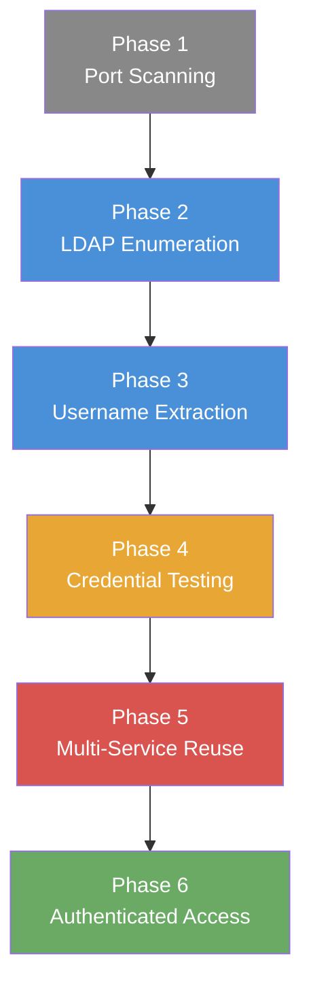

# Exercise 8.4: Credential Discovery and Reuse Chain

## Before You Begin

Exercise 8.3 demonstrated that a single credential pair can unlock multiple services on the same target. That lab started with known credentials; you already had `admin:password123` and tested it against each protocol. In a real engagement, the attacker does not begin with valid credentials. Exercise 8.4 closes that gap by starting from zero knowledge and building the complete attack chain: enumeration, credential discovery, multi-service validation, and finally access.

Confirm your VPN connection is active before proceeding. Run `ip a show wg0` and verify you have a valid WireGuard address in the `10.100.x.x` range.

## Scenario

James Mitchell wants to see the complete attack chain demonstrated from start to finish. Starting from a target IP address, you will enumerate the exposed services, confirm anonymous LDAP access, validate the `admin:password123` credential pair you recovered earlier in the chain across multiple protocols, and ultimately gain shell access to retrieve sensitive data. The target exposes four services: Lightweight Directory Access Protocol (LDAP) on port 389, SMB on port 445, RDP on port 3389, and SSH on port 22. Your goal is to prove that enumeration plus a recovered credential pair feeds directly into credential reuse and that the chain from discovery to access can be executed methodically.

## Your Objectives

- Scan the target and confirm all four services are running
- Query the LDAP directory anonymously and confirm the naming context and anonymous bind
- Use enum4linux to surface the `admin` account and SMB intelligence
- Test the recovered `admin:password123` pair against SMB, LDAP, and RDP using CrackMapExec
- Connect via SSH and retrieve the flag from the file system

---

## Background: The Credential Chain

Credential attacks in penetration testing follow a predictable chain of phases. Each phase produces output that feeds into the next, transforming raw network data into authenticated access. Understanding the chain as a methodology; rather than a collection of isolated techniques; is what separates systematic testing from guesswork.



| Phase | Action | Output |
|-------|--------|--------|
| 1. Port Scanning | Identify open services | List of accessible protocols |
| 2. LDAP Enumeration | Query directory service anonymously | Organizational structure, user entries |
| 3. Username Extraction | Parse enumeration output | Clean list of valid usernames |
| 4. Credential Testing | Test usernames against common passwords | Valid credential pairs |
| 5. Multi-Service Reuse | Validate credentials across all protocols | Confirmed access channels |
| 6. Authenticated Access | Connect and retrieve data | Shell access, file retrieval |

LDAP is the key addition in Exercise 8.4. Directory services store organizational data; user accounts, group memberships, email addresses, and system configurations; in a structured, queryable format. Many LDAP servers permit anonymous access to portions of the directory, which means an attacker can extract usernames without any credentials at all. Those usernames then feed directly into the credential testing phase, eliminating the need to guess account names.

The credential chain differs fundamentally from brute force. Brute force attacks try every possible combination blindly. The credential chain is targeted; each phase narrows the search space until only valid combinations remain. Enumeration provides real usernames; common password lists provide likely passwords; and multi-service testing confirms where each pair works.

## Tool Primer: ldapsearch

The `ldapsearch` command queries LDAP directories from the command line. LDAP directories organize data in a hierarchical tree structure, where each entry has a Distinguished Name (DN) that describes its position in the tree. The Base DN specifies where in the tree to start searching.

**Basic anonymous query syntax:**

```bash
ldapsearch -x -H ldap://<target_ip> -b <base_dn> -s base
```

**Searching for user accounts:**

```bash
ldapsearch -x -H ldap://<target_ip> \
  -b "dc=financecorp,dc=local" \
  "(objectClass=inetOrgPerson)" uid cn mail
```

**Authenticated query syntax:**

```bash
ldapsearch -x -H ldap://<target_ip> \
  -b "dc=financecorp,dc=local" \
  -D "cn=admin,dc=financecorp,dc=local" \
  -w password123 \
  "(objectClass=*)"
```

Each flag serves a specific purpose:

| Flag | Purpose |
|------|---------|
| `-x` | Use simple authentication (not SASL) |
| `-H ldap://<target_ip>` | Specify the LDAP server URI |
| `-b <base_dn>` | Set the Base DN; the starting point for the search |
| `-s base` | Search scope: `base` returns only the root entry; `sub` searches the entire subtree |
| `-D <bind_dn>` | Bind DN; the account to authenticate as |
| `-w <password>` | Password for the bind DN |

**Key LDAP terminology:**

| Term | Meaning |
|------|---------|
| Base DN | Root of the directory tree (e.g., `dc=financecorp,dc=local`) |
| DN (Distinguished Name) | Full path to a specific entry in the tree |
| objectClass | Defines what type of entry an object is (e.g., `inetOrgPerson`, `posixAccount`) |
| Search filter | Expression that controls which entries are returned (e.g., `(uid=admin)`) |
| Attribute | A named property of an entry (e.g., `uid`, `cn`, `mail`) |

An anonymous bind (no `-D` or `-w` flags) connects without credentials. Many LDAP servers allow anonymous access to at least the Base DN and organizational unit structure, which is sufficient to discover the directory layout and often to enumerate user accounts.

---

## Walkthrough

### Step 1: Launch the Exercise

Open the OpenCyberRange platform in your browser and start the exercise environment.

- Navigate to **Exercises** then **Windows** then **Level 2**
- Click **Launch** on "Credential Discovery and Reuse Chain"
- Wait for the status to change to **Running**
- Note the **target IP** displayed in the Active Lab View

### Step 2: Scan for Open Services

!!! kali "Scan for open services"
    Run an Nmap scan targeting all four service ports to confirm the attack surface:

    ```bash
    nmap -sV -p 22,389,445,3389 <target_ip>
    ```

    You should see all four ports reported as open: SSH on 22, LDAP on 389, SMB on 445, and RDP on 3389. Note the service versions reported; LDAP entries typically identify OpenLDAP and its version number.

### Step 3: Enumerate LDAP Anonymously with ldapsearch

!!! kali "Discover the LDAP Base DN"
    Begin the enumeration phase by querying the LDAP directory without credentials. First, discover the naming context the server exposes:

    ```bash
    ldapsearch -x -H ldap://<target_ip> -b "" -s base namingContexts
    ```

    The `namingContexts` attribute reveals the Base DN of the directory. Record the value; you will use it in subsequent queries.

!!! note "What anonymous LDAP shows on this target"
    The LDAP service on this host runs with a default, unseeded directory, so an anonymous query returns the bare directory skeleton rather than a populated list of staff accounts. That is a realistic outcome: many directories expose the naming context and high-level structure to anonymous binds but withhold the user entries. Confirm the response with a subtree query:

    ```bash
    ldapsearch -x -H ldap://<target_ip> \
      -b "dc=nodomain" \
      "(objectClass=*)"
    ```

    Treat the LDAP step as proof that the service is reachable and that anonymous binds are accepted. The working username for this chain is `admin`, which you carried forward from Exercise 8.3, where you recovered the `admin:password123` pair on this same host class. In a fully populated directory, this is where `(objectClass=inetOrgPerson)` would hand you a list of usernames to test; Chapter 7 walks through that enumeration in depth against a seeded FinanceCorp directory.

### Step 4: Use enum4linux for Full Enumeration

!!! kali "Run full enumeration with enum4linux"
    The enum4linux tool combines multiple enumeration techniques into a single automated scan. Run a full enumeration against the target:

    ```bash
    enum4linux -a <target_ip>
    ```

    The `-a` flag enables all enumeration modules: OS information, share listing, user listing via RID cycling, group enumeration, and password policy extraction. The output is lengthy but contains valuable intelligence.

Look through the results for the following sections:

- **OS Information**: Operating system type and Samba version
- **Share Enumeration**: Available SMB shares and permissions
- **User Enumeration via RID Cycling**: Usernames discovered through Security Identifier (SID) lookups
- **Password Policy**: Minimum length, complexity requirements, lockout threshold

On this target, enum4linux is the enumeration source that surfaces the `admin` account through SMB RID cycling, since the LDAP directory in Step 3 was not seeded with user entries. In a production environment with a populated directory, LDAP and enum4linux would cross-confirm the same set of accounts.

### Step 5: Test Discovered Credentials on SMB

!!! kali "Test discovered credentials on SMB"
    Armed with valid usernames from the enumeration phase, test them against the SMB service using CrackMapExec:

    ```bash
    crackmapexec smb <target_ip> -u admin -p password123
    ```

    Look for the `[+]` marker indicating successful authentication. The `admin:password123` pair should validate successfully against SMB.

### Step 6: Test Credentials on LDAP

!!! kali "Test credentials on LDAP"
    Try the same credentials against the LDAP service to see whether the directory accepts an authenticated bind:

    ```bash
    crackmapexec ldap <target_ip> -u admin -p password123
    ```

    On this target the LDAP directory is unseeded and has no `admin` bind entry, so the bind does not succeed even though the `admin` account is valid for SMB, RDP, and SSH. That mismatch is a useful lesson: a local operating system account is not automatically a directory account. In a real engagement with an Active Directory backed directory, the same domain credential would bind successfully here, and authenticated LDAP access would reveal entries hidden from anonymous queries.

### Step 7: Test Credentials on RDP

!!! kali "Test credentials on RDP"
    Complete the multi-service validation by checking RDP:

    ```bash
    crackmapexec rdp <target_ip> -u admin -p password123
    ```

    A `[+]` result here means the credentials work across SMB, LDAP, and RDP; three confirmed attack paths from a single pair. The credential chain has progressed from zero knowledge to multi-service validated access.

---

### Record Your Findings

> **Nmap scan output:**
>
> ```
> (paste your Nmap output here)
> ```
>
> **LDAP Base DN discovered:** ___________________________
>
> **Usernames found via LDAP:**
>
> | uid | cn (Full Name) | mail |
> |-----|----------------|------|
> |     |                |      |
> |     |                |      |
> |     |                |      |
>
> **enum4linux key findings:**
>
> ```
> (paste relevant sections of enum4linux output here)
> ```
>
> **CrackMapExec results summary:**
>
> | Service | Port | Result ([+] or [-]) |
> |---------|------|---------------------|
> | SMB     | 445  |                     |
> | LDAP    | 389  |                     |
> | RDP     | 3389 |                     |
>
> **Flag:**
>
> ```
> (paste your flag here)
> ```

---

### Step 8: Interpret the Results

Review the complete chain you have executed. You began with a target IP address and the `admin:password123` credential pair recovered earlier in the chain. The anonymous LDAP query proved the directory service was reachable and accepted anonymous binds. The enum4linux scan surfaced the `admin` account through SMB RID cycling and added SMB-specific intelligence. Credential testing then validated `admin:password123` across SMB, RDP, and SSH, while the LDAP bind did not succeed because the directory has no matching bind entry.

Each enumeration source provided different but complementary information:

| Source | Information Gained |
|--------|--------------------|
| LDAP (ldapsearch) | Naming context, anonymous bind confirmation, directory skeleton |
| enum4linux | OS version, SMB shares, `admin` account via RID cycling, password policy |
| CrackMapExec | Credential validation across SMB, RDP, and SSH |

On a seeded directory, anonymous LDAP would also hand you the username list, which is exactly the path Chapter 7 demonstrates. Here, SMB enumeration filled that role and the recovered credential pair carried the chain to authenticated access.

### Step 9: Find and Submit the Flag

!!! kali "Connect to the target over SSH"
    SSH provides direct command-line access for the final step. Connect to the target:

    ```bash
    ssh admin@<target_ip>
    ```

    Enter the password `password123` when prompted. A shell prompt on the target confirms the login succeeded.

!!! target "Read the flag on the target"
    Once logged in to the target shell, retrieve the flag:

    ```bash
    cat /tmp/private/flag.txt
    ```

    The flag is in `OCR{...}` format. Copy the value, then exit the SSH session:

    ```bash
    exit
    ```

    Paste the flag into the **Submit Flag** form on the platform and click **Submit**.

---

## Analysis Questions

**1. LDAP anonymous enumeration provided usernames before any credential attack was attempted. Why is LDAP particularly valuable to attackers during the reconnaissance phase?**

??? note "Reveal Answer"

    LDAP directories are designed to store and share organizational information. When anonymous access is permitted, an attacker can query the entire directory structure without authentication; extracting usernames, email addresses, group memberships, and organizational hierarchies. Usernames are the most critical output because they eliminate the guessing phase of credential attacks. Email addresses enable targeted phishing campaigns. Group memberships reveal which accounts have elevated privileges. All of the information is structured and machine-readable, making automated extraction trivial.

**2. How does the credential chain methodology differ from a brute force attack?**

??? note "Reveal Answer"

    A brute force attack tries every possible combination of usernames and passwords without prior knowledge. The credential chain is a targeted, phased approach where each step produces intelligence that narrows the next step. Enumeration provides validated usernames, which eliminates half of the guessing. Common password lists replace random character generation. Multi-service testing uses confirmed credentials across protocols instead of attacking each service independently. The credential chain is faster, quieter (fewer failed attempts to trigger alerts), and more likely to succeed because every input is informed by prior discovery.

**3. enum4linux combines multiple enumeration techniques into one tool. What specific advantages does enum4linux provide over running ldapsearch alone?**

??? note "Reveal Answer"

    enum4linux performs RID cycling to discover usernames even when LDAP anonymous access is disabled, making it effective against targets that block anonymous LDAP queries. The tool also extracts SMB-specific information that ldapsearch cannot access: share listings, OS version details, Samba configuration, and password policy settings. Password policy information is particularly valuable because it tells the attacker the minimum password length, complexity requirements, and lockout threshold; allowing them to calibrate credential attacks to avoid triggering account lockouts. Running both tools provides overlapping coverage and reduces the chance of missing critical information.

**4. The credentials validated on SMB and RDP but not on LDAP, even though the LDAP service was reachable. Why does a valid operating system account fail to bind to the directory?**

??? note "Reveal Answer"

    A local operating system account and a directory bind entry are two different things. The `admin:password123` pair is a Linux account on the host, valid for SMB, RDP, and SSH because those services authenticate against the system user database. The LDAP service runs its own directory, and on this target that directory was never seeded with an `admin` bind entry, so there is nothing for the credential to bind against. In an Active Directory environment the directory and the host authentication are unified, so the same domain credential would bind to LDAP and log into every service. Recognizing when an account is local versus directory backed tells you which attack paths a single credential actually opens.

---

## Key Takeaways

- **LDAP anonymous binds** reveal the naming context and directory structure without credentials; against a seeded directory the same query also yields usernames, which Chapter 7 demonstrates in depth
- **The credential chain methodology** (enumerate, discover, test, reuse, access) is a structured alternative to blind brute force that produces faster and quieter results
- **enum4linux provides full enumeration** by combining RID cycling, share listing, OS detection, and password policy extraction into a single automated scan; here it is what surfaces the `admin` account
- **A local account is not automatically a directory account**: the recovered pair worked on SMB, RDP, and SSH but not on the unseeded LDAP directory, so always confirm which services a credential actually unlocks
- The next exercise, Exercise 8.5, builds on the credential chain by introducing credential spraying across multiple user accounts and password combinations
