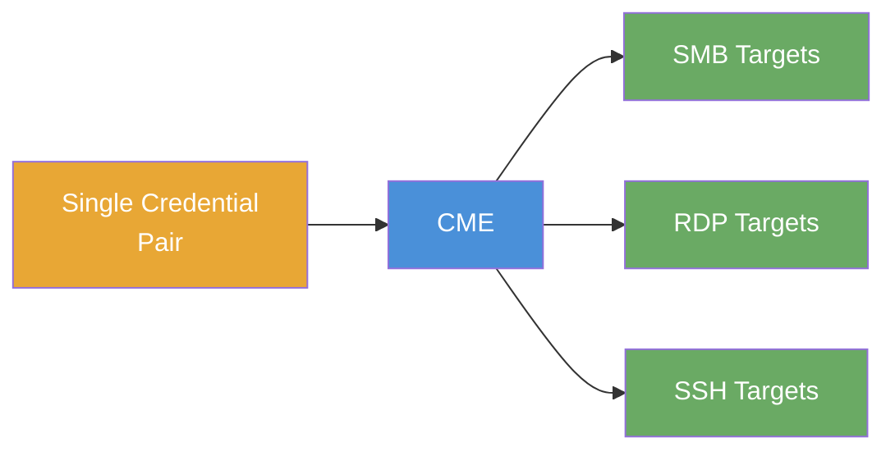

# Exercise 8.5: CME Credential Reuse Automation

## Before You Begin

Exercises 8.1 through 8.4 built your credential reuse skills one service at a time; from discovering credentials on SMB, to reusing them across RDP and SSH, to following a full credential chain through LDAP. Manual testing works when you face a single target, but real enterprise networks contain hundreds or thousands of hosts. In this exercise you will use CrackMapExec (CME) to automate credential testing across multiple targets and protocols in a single session.

Make sure your VPN connection is active before launching the lab. Run `ip a show wg0` and confirm you see your assigned IP address.

## Scenario

FinanceCorp has engaged your team for a network-wide penetration test. The security lead, James Mitchell, wants to understand how attackers use automation tools to efficiently test credentials across large infrastructures. During earlier phases of the engagement, you recovered a single set of credentials. Your task is to determine how many systems accept those credentials and what access each system grants. Three separate servers are in scope, each running a different remote access protocol: Server Message Block (SMB), Remote Desktop Protocol (RDP), and Secure Shell (SSH).

## Your Objectives

- Identify the three target hosts and the services each one exposes
- Use CME to test discovered credentials against SMB on target1
- Use CME to test discovered credentials against RDP on target2
- Use CME to test discovered credentials against SSH on target3
- Enumerate accessible shares on target1 using CME
- Retrieve the flag from the `private` SMB share on target1

---

## Background: Why Credential Automation Matters

Manual credential testing; typing a username and password into each service on each host; is slow, error-prone, and inconsistent at scale. A penetration tester facing a /24 subnet has 254 potential hosts. Testing one credential pair against three protocols on every host means 762 individual authentication attempts. Doing that by hand takes hours and invites typos that produce false negatives.

Automation tools like CrackMapExec solve these problems by standardizing the authentication process across protocols and targets. CME sends the same credential pair to every specified host using the correct protocol-specific handshake, captures the result, and reports success or failure with consistent output formatting. A test that takes hours manually completes in seconds with CME.

CME supports multiple target specification formats. You can test a single IP address, a space-separated list of IPs, a Classless Inter-Domain Routing (CIDR) range like `10.100.1.0/24`, or a text file containing one target per line. The file-based approach is particularly useful when your target list comes from an earlier Nmap scan or LDAP enumeration.



The same capability that makes CME valuable to penetration testers makes it dangerous in the wrong hands. Attackers who compromise a single credential pair can sweep an entire network in seconds, identifying every system that accepts those credentials. Defenders who understand CME can anticipate these attacks and implement controls like account lockout policies and network-level authentication logging.

## Tool Primer: CrackMapExec

CrackMapExec is a post-exploitation tool designed to automate credential testing and enumeration across multiple protocols. The tool uses a consistent command structure regardless of which protocol you are targeting.

**Basic syntax:**

```bash
crackmapexec <protocol> <target(s)> -u <username> -p <password> [options]
```

**Supported protocols and their default ports:**

| Protocol | Default Port | What CME Tests |
|----------|-------------|----------------|
| `smb` | 445 | SMB authentication and share access |
| `rdp` | 3389 | RDP authentication |
| `ssh` | 22 | SSH authentication |

**Target specification formats:**

| Format | Example | Description |
|--------|---------|-------------|
| Single IP | `10.100.1.10` | Test one host |
| Multiple IPs | `10.100.1.10 10.100.1.11` | Space-separated list |
| CIDR range | `10.100.1.0/24` | Test an entire subnet |
| File | `targets.txt` | One IP per line |

**Key options:**

| Option | Purpose |
|--------|---------|
| `-u <user>` | Username to authenticate with |
| `-p <pass>` | Password to authenticate with |
| `--shares` | Enumerate SMB shares after successful authentication |
| `--users` | Enumerate domain users (SMB only) |
| `-x <cmd>` | Execute a command on the target after authentication |

**Output indicators:**

CME uses color-coded symbols to indicate results. Understanding these indicators is essential for interpreting output quickly.

| Symbol | Meaning |
|--------|---------|
| `[+]` | Successful authentication or operation |
| `[-]` | Failed authentication or operation |
| `[*]` | Informational message (e.g., host identification) |

A typical successful SMB authentication line looks like the following:

```
SMB  10.100.1.10  445  TARGET1  [+] FinanceCorp\admin:password123
```

The output shows the protocol, target IP, port, hostname, and the result indicator followed by the credential pair that succeeded.

---

## Walkthrough

### Step 1: Launch the Exercise and Note All Target IPs

Open the platform in your browser and start the exercise environment.

- Navigate to **Exercises** then **Windows** then **Level 2**
- Click **Launch** on "CME Credential Reuse Automation"
- Wait for the status to change to **Running**

The Active Lab View displays three target IPs. Record each IP address and the service associated with it. Unlike previous labs with a single target, you need to track which IP corresponds to which service:

- **target1**: SMB (port 445)
- **target2**: RDP (port 3389)
- **target3**: SSH (port 22)

### Step 2: Scan All Targets to Confirm Services

!!! kali "Scan all targets to confirm services"
    Before testing credentials, verify that each target is running the expected service. Run an Nmap scan against all three IPs with version detection:

    ```bash
    nmap -sV -p 22,445,3389 <target1_ip> <target2_ip> <target3_ip>
    ```

    Confirm the following: target1 has port 445 open, target2 has port 3389 open, and target3 has port 22 open. Record the service versions reported by Nmap.

### Step 3: Test SMB Credentials on target1 with CME

!!! kali "Test SMB credentials on target1"
    Start your credential testing with the SMB protocol on target1. Run CME with the discovered credentials:

    ```bash
    crackmapexec smb <target1_ip> -u admin -p password123
    ```

    Look for the `[+]` indicator in the output. A successful result confirms that the `admin:password123` credential pair is valid for SMB authentication on target1.

### Step 4: Test RDP Credentials on target2 with CME

!!! kali "Test RDP credentials on target2"
    Test the same credentials against the RDP service on target2:

    ```bash
    crackmapexec rdp <target2_ip> -u admin -p password123
    ```

    A `[+]` result means the credentials grant RDP access to target2. Notice that the command syntax is nearly identical to the SMB test; only the protocol keyword changes.

### Step 5: Test SSH Credentials on target3 with CME

!!! kali "Test SSH credentials on target3"
    Complete the credential sweep by testing against SSH on target3:

    ```bash
    crackmapexec ssh <target3_ip> -u admin -p password123
    ```

    A `[+]` result on all three protocols confirms full credential reuse across the infrastructure. The same username and password grants access to every service on every target.

### Step 6: Enumerate SMB Shares on target1

!!! kali "Enumerate SMB shares on target1"
    Now that you have confirmed SMB access on target1, enumerate the available shares using CME:

    ```bash
    crackmapexec smb <target1_ip> -u admin -p password123 --shares
    ```

    CME lists each share name, the access level (READ, WRITE), and any description. Look for a share named `private` in the output.

!!! kali "Verify shares manually with smbclient"
    You can also verify share access manually using smbclient:

    ```bash
    smbclient -L //<target1_ip>/ -U admin%password123
    ```

    The `smbclient -L` command lists all available shares, confirming what CME reported.

---

### Record Your Findings

> **Target inventory:**
>
> | Target | IP Address | Port | Service | Credentials Valid? |
> |--------|-----------|------|---------|-------------------|
> | target1 | | 445 | SMB | |
> | target2 | | 3389 | RDP | |
> | target3 | | 22 | SSH | |
>
> **CME SMB output:**
>
> ```
> (paste your output here)
> ```
>
> **CME RDP output:**
>
> ```
> (paste your output here)
> ```
>
> **CME SSH output:**
>
> ```
> (paste your output here)
> ```
>
> **SMB shares on target1:**
>
> | Share Name | Access | Description |
> |-----------|--------|-------------|
> |           |        |             |
> |           |        |             |
>
> **How to submit:** enter the flag on the exercise page exactly as you recovered it, keeping the `OCR{...}` wrapper.
>
> **Flag:** ___________________________

---

### Step 7: Interpret the Results

Review your CME output across all three protocol tests. The `[+]` indicators confirm that a single credential pair grants access to three different services on three separate hosts. In a real engagement, confirming credential reuse at this scale reveals a critical vulnerability; the organization uses the same local account credentials across its entire infrastructure.

Compare the effort required for these three CME commands against the manual alternative. Testing SMB manually would require smbclient, RDP would require xfreerdp, and SSH would require an ssh client. Each tool has different syntax, different output formats, and different authentication mechanisms. CME abstracts all of that into a uniform interface.

### Step 8: Find and Submit the Flag

The flag for this exercise lives in the `private` SMB share on target1, which you already confirmed in Step 6. Pull it down with smbclient using the validated credentials.

!!! kali "Retrieve the flag from the private share on target1"
    Connect to the `private` share on target1 and download the flag file in a single command:

    ```bash
    smbclient //<target1_ip>/private -U admin%password123 -c 'get flag.txt'
    ```

    The `-c 'get flag.txt'` option runs the `get` command non-interactively and saves `flag.txt` to your current directory. Now read it:

    ```bash
    cat flag.txt
    ```

    Copy the flag value in `OCR{...}` format. Return to the platform and paste it into the **Submit Flag** form, then click **Submit**.

---

## Analysis Questions

**1. How does CME compare to manual credential testing in terms of speed, accuracy, and coverage?**

??? note "Reveal Answer"

    CME tests credentials in seconds compared to minutes or hours for manual testing. Accuracy improves because CME eliminates typos and uses the correct protocol handshake every time. Coverage increases because CME makes it practical to test every host in a subnet, whereas manual testing typically stops after a few hosts due to time constraints. The consistent output format also makes it easier to identify which hosts accepted the credentials.

**2. When would you use a targets file instead of specifying IPs on the command line?**

??? note "Reveal Answer"

    A targets file is useful when the target list is large, comes from another tool's output, or needs to be reused across multiple CME runs. For example, an Nmap scan might identify 50 hosts running SMB. Saving those IPs to a file and passing the file to CME is faster and less error-prone than typing 50 addresses on the command line. Target files also create a record of what was tested, which is valuable for penetration test documentation.

**3. What makes CME dangerous in the hands of an attacker, and what defenses can mitigate the risk?**

??? note "Reveal Answer"

    CME allows an attacker who compromises a single credential pair to sweep an entire network in seconds, identifying every system that accepts those credentials. Defenses include unique passwords per host (eliminating credential reuse), account lockout policies that trigger after a small number of failed attempts, network segmentation that limits lateral movement, and centralized authentication logging that detects rapid login attempts across multiple hosts. Multi-factor authentication (MFA) on critical services also prevents CME-style automated attacks because a valid password alone is not sufficient.

---

## Key Takeaways

- **CrackMapExec** automates credential testing across SMB, RDP, and SSH using a consistent command syntax, reducing the time and effort required compared to manual testing
- **Credential reuse** across multiple services and hosts is a critical vulnerability that CME exposes efficiently; a single compromised password can grant access to an entire infrastructure
- **Target specification** in CME supports single IPs, multiple IPs, CIDR ranges, and text files, making the tool practical for networks of any size
- **Share enumeration** with the `--shares` flag combines authentication testing and information gathering into a single command
- **Chapter 9** builds on these techniques by introducing assessment scenarios where you will apply credential testing and automation skills under timed conditions
