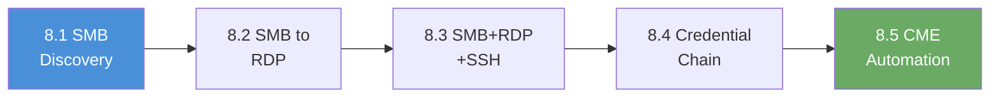

# Chapter 8: Review

## What You Learned

Over five labs, you progressed from discovering credentials on a single SMB share to automating credential testing across an entire multi-host infrastructure. You started by finding valid credentials through SMB enumeration, then proved those same credentials worked on RDP and SSH services. You traced a four-step credential chain through LDAP, SMB, RDP, and SSH; each service revealing information that unlocked the next. You finished by using CrackMapExec (CME) to automate the entire process, testing one credential pair against three separate targets running three different protocols in seconds.

## The Progression You Followed

Each lab added one new dimension to your credential reuse methodology:

| Exercise | What You Added | Why It Matters |
|-----|---------------|----------------|
| 8.1 | Credential discovery on SMB | Found valid credentials by enumerating accessible shares on an SMB service |
| 8.2 | Cross-service reuse: SMB to RDP | Proved that credentials from one protocol often work on a completely different service |
| 8.3 | Multi-service reuse: SMB + RDP + SSH | Demonstrated credential reuse across three protocols on the same host |
| 8.4 | Credential chain: LDAP to SMB to RDP to SSH | Followed a chain where each service revealed the credentials for the next |
| 8.5 | CME automation across multiple targets | Automated credential testing at scale using CrackMapExec across three separate hosts |

---

## Self-Assessment

Answer the following questions without looking back at the walkthroughs. If you get stuck on a question, that topic is worth revisiting before moving on.

**1.** What smbclient command lists all available shares on a target?

> &nbsp;
>
> &nbsp;

**2.** How does CrackMapExec indicate a successful authentication versus a failed one?

> &nbsp;
>
> &nbsp;

**3.** What three target specification formats does CME support besides a single IP address?

> &nbsp;
>
> &nbsp;

**4.** Why is credential reuse across services considered a critical vulnerability rather than a minor finding?

> &nbsp;
>
> &nbsp;

**5.** In Exercise 8.4, what was the order of the credential chain, and what did each step reveal?

> &nbsp;
>
> &nbsp;

**6.** What defenses can an organization deploy to prevent or detect credential reuse attacks?

> &nbsp;
>
> &nbsp;

---

## Command Cheat Sheet

Keep the following reference handy throughout the rest of the workbook.

| Command | What It Does |
|---------|-------------|
| `smbclient -L //<target>/ -U <user>%<pass>` | List all SMB shares on the target |
| `smbclient //<target>/<share> -U <user>%<pass>` | Connect to a specific SMB share |
| `crackmapexec smb <target> -u <user> -p <pass>` | Test SMB credentials on the target |
| `crackmapexec smb <target> -u <user> -p <pass> --shares` | Test SMB credentials and enumerate shares |
| `crackmapexec rdp <target> -u <user> -p <pass>` | Test RDP credentials on the target |
| `crackmapexec ssh <target> -u <user> -p <pass>` | Test SSH credentials on the target |
| `ldapsearch -x -H ldap://<target> -b "<base_dn>"` | Anonymous LDAP query against the target |
| `enum4linux -a <target>` | Automated SMB and NetBIOS enumeration |
| `xfreerdp /v:<target> /u:<user> /p:<pass>` | Connect to a target via RDP |
| `ssh <user>@<target>` | Connect to a target via SSH |
| `sshpass -p <pass> ssh <user>@<target>` | Non-interactive SSH login with a password |

---

## Connect the Dots: What Comes Next

You now have a complete credential reuse toolkit; from manual single-service testing to automated multi-host sweeps with CrackMapExec. You can discover credentials, test them across protocols, follow credential chains through interconnected services, and automate the entire process at scale.

Chapter 9 puts these skills to the test in assessment scenarios. You will face networks where the credential path is not spelled out in advance. Finding the entry point, identifying valid credentials, and determining which services accept them will be your responsibility. The tools and techniques from Chapter 8 form the foundation; Chapter 9 measures whether you can apply them independently.

---

## Self-Assessment Answer Key

**1.** `smbclient -L //<target>/ -U <user>%<pass>`: the `-L` flag lists available shares. The username and password are provided inline with `%` as the separator.

**2.** CME uses `[+]` (green) to indicate successful authentication and `[-]` (red) to indicate failure. The `[*]` symbol denotes informational messages such as host identification.

**3.** CME supports multiple space-separated IPs (`10.100.1.10 10.100.1.11`), CIDR ranges (`10.100.1.0/24`), and text files containing one target per line. All three formats work with any supported protocol.

**4.** Credential reuse means a single compromised password grants access to multiple services and hosts. An attacker who obtains credentials from one system can move laterally across the entire infrastructure without needing to crack additional passwords. The blast radius of a single credential compromise expands from one service to every system that shares those credentials.

**5.** The chain followed four steps: LDAP enumeration revealed usernames, those usernames led to valid SMB credentials on a share, the SMB share contained RDP connection details, and the RDP session exposed SSH credentials. Each service acted as a stepping stone to the next. Interconnected services create attack paths.

**6.** Effective defenses include unique passwords per service and per host (eliminating reuse), account lockout policies after a set number of failed attempts, multi-factor authentication (MFA) on remote access protocols, centralized logging and alerting for rapid authentication attempts across multiple hosts, and network segmentation that limits lateral movement between services.
