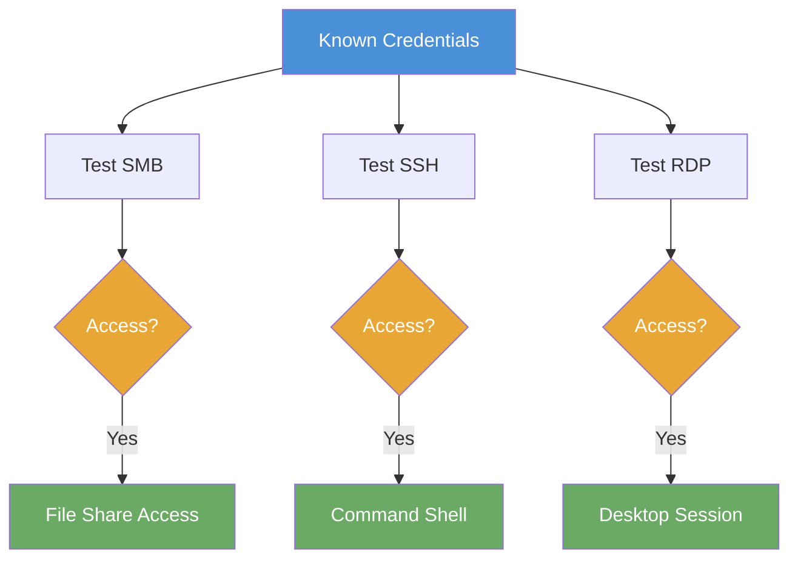

# Exercise 9.2: Multi-Service Exploitation

## Before You Begin

Exercise 9.1 demonstrated what an attacker can achieve without any credentials at all. Exercise 9.2 shifts to authenticated attacks; testing known credentials against every service on the target to determine the full scope of access. Make sure you are comfortable with CrackMapExec (CME) from Chapter 8 before proceeding. Your VPN must be connected and your Kali terminal ready.

## Scenario

You are continuing the FinanceCorp penetration test. During the previous phase, you discovered guest-accessible shares and an exposed HTTP service. James Mitchell, the engagement lead, now wants to see how an attacker with a single set of credentials can exploit multiple services on the same host. You have obtained the credentials `admin:password123` through a previous phase of the assessment. Your task is to determine which services accept these credentials and demonstrate the maximum impact of credential reuse.

## Your Objectives

- Scan the target to identify all exposed services
- Test the credentials `admin:password123` against SMB, SSH, and RDP using CrackMapExec
- Enumerate SMB shares using the authenticated session
- Connect via SSH and retrieve the flag from the target

---

## Background: Multi-Service Exploitation

Multi-service exploitation combines network assessment methodology with credential reuse techniques. Rather than testing one service and moving on, the approach systematically validates credentials against every protocol the target exposes. The goal is to determine the full blast radius of a single compromised credential set; how many doors does one key open?

When an attacker discovers working credentials on one service, the next step is to test those credentials everywhere else. SMB access allows file share browsing and data exfiltration. RDP access provides a full graphical desktop session. SSH access grants a command-line shell capable of running arbitrary commands. Each service provides a different level of access, and an effective penetration tester documents all of them.

CrackMapExec automates credential validation across multiple protocols. A single CME command can test a username and password against SMB, SSH, or RDP and immediately report whether authentication succeeded. The tool also supports command execution through authenticated sessions, making it possible to both validate credentials and demonstrate impact in one step.



## Tool Primer: CrackMapExec Multi-Protocol Testing

CrackMapExec accepts a protocol name as its first argument, followed by the target and credentials. The same credential pair can be tested against different services by changing the protocol keyword.

!!! kali "Test credentials against SMB"
    Pass the protocol keyword `smb` to validate the known credentials on the file-sharing service.

    ```bash
    crackmapexec smb <target_ip> -u admin -p password123
    ```

    A `[+]` result confirms SMB authentication succeeded.

!!! kali "Test credentials against SSH"
    Swap the keyword to `ssh` to test the same credential pair on the shell service.

    ```bash
    crackmapexec ssh <target_ip> -u admin -p password123
    ```

    A `[+]` result confirms SSH authentication succeeded.

!!! kali "Test credentials against RDP"
    Swap the keyword to `rdp` to test the credentials on the remote desktop service.

    ```bash
    crackmapexec rdp <target_ip> -u admin -p password123
    ```

    A `[+]` result confirms RDP authentication succeeded.

| Flag | Purpose |
|------|---------|
| `-u` | Username to test |
| `-p` | Password to test |
| `-x` | Execute a command on the target after successful authentication |

**CME output indicators:**

| Symbol | Meaning |
|--------|---------|
| `[+]` | Authentication succeeded |
| `[-]` | Authentication failed |
| `(Pwn3d!)` | The account has administrative privileges on the target |

The `(Pwn3d!)` marker in CME output is especially significant. When CME reports `Pwn3d!` after an SMB authentication, the account has local administrator rights, which means the attacker can execute commands, dump credentials, and fully control the system.

---

## Walkthrough

### Step 1: Launch the Exercise

Open the platform in your browser and start the exercise environment.

- Navigate to **Exercises** then **Windows** then **Level 2**
- Click **Launch** on "Multi-Service Exploitation"
- Wait for the status to change to **Running**
- Note the **target IP** displayed in the Active Lab View

### Step 2: Run a Full Service Scan

!!! kali "Full service and script scan"
    Start with a full Nmap scan to identify all open ports and services.

    ```bash
    nmap -sV -sC <target_ip>
    ```

    You should see three services in the output: SMB on port 445, SSH on port 22, and RDP on port 3389. Record every port, service, and version string. The scan confirms which protocols are available for credential testing.

### Step 3: Test Credentials on SMB

!!! kali "Validate credentials on SMB"
    Use CrackMapExec to test the known credentials against the SMB service.

    ```bash
    crackmapexec smb <target_ip> -u admin -p password123
    ```

    A `[+]` result confirms that the `admin` account authenticates successfully on SMB. Look for the `(Pwn3d!)` indicator, which signals administrative-level access. Record the result; authenticated SMB access allows share enumeration and file retrieval.

### Step 4: Test Credentials on SSH

!!! kali "Validate credentials on SSH"
    Test the same credentials against the SSH service.

    ```bash
    crackmapexec ssh <target_ip> -u admin -p password123
    ```

    A `[+]` result means the credentials work on SSH as well. SSH access is often the most valuable finding because it provides a full command-line shell. An attacker with SSH access can browse the file system, read configuration files, escalate privileges, and exfiltrate data.

### Step 5: Test Credentials on RDP

!!! kali "Validate credentials on RDP"
    Complete the credential sweep by testing against RDP.

    ```bash
    crackmapexec rdp <target_ip> -u admin -p password123
    ```

    A `[+]` result proves the same credentials work on all three services. Document how many services accept the same username and password; credential reuse across three protocols is a critical finding.

### Step 6: Enumerate Authenticated SMB Shares

!!! kali "Enumerate authenticated SMB shares"
    Now that you have confirmed SMB authentication works, enumerate the available shares with your authenticated session. The `-U admin%password123` flag passes the username and password inline.

    ```bash
    smbclient -L //<target_ip> -U admin%password123
    ```

    Authenticated share listings often reveal additional shares that were not visible during anonymous enumeration. Look for shares named `private`, `confidential`, or similar; these typically contain sensitive data.

---

### Record Your Findings

> **Nmap scan output:**
>
> ```
> (paste your nmap -sV -sC output here)
> ```
>
> **Open ports and services:**
>
> | Port | Service | Version |
> |------|---------|---------|
> |      |         |         |
> |      |         |         |
> |      |         |         |
>
> **CrackMapExec results:**
>
> | Protocol | Result | Admin Access? |
> |----------|--------|---------------|
> | SMB      |        |               |
> | SSH      |        |               |
> | RDP      |        |               |
>
> **Authenticated SMB shares:**
>
> | Share Name | Type |
> |------------|------|
> |            |      |
> |            |      |
>
> **How to submit:** enter the flag on the exercise page exactly as you recovered it, keeping the `OCR{...}` wrapper.
>
> **Flag:** ___________________________

---

### Step 7: Connect via SSH and Retrieve the Flag

!!! kali "Open an SSH session to the target"
    SSH provides the most direct path to the flag. Connect to the target using the validated credentials.

    ```bash
    ssh admin@<target_ip>
    ```

    Enter the password `password123` when prompted. A shell prompt confirms you are now logged in on the target host.

!!! target "Read the flag file"
    Once connected, navigate to the flag location and read its contents from the target host.

    ```bash
    cat /tmp/private/flag.txt
    ```

    The flag is displayed in `OCR{...}` format. Copy the value and submit it on the platform.

### Step 8: Interpret the Results

Review the full scope of access that a single set of credentials provided. The `admin:password123` credentials worked on SMB, SSH, and RDP; three different protocols providing three different types of access. SMB grants file share access. SSH grants command-line control. RDP grants a full graphical desktop.

The credential reuse finding is critical because it means compromising one service compromises all three. An attacker only needs to discover the password once; through a brute force attack, a phishing campaign, or a leaked credential database; and every service on the target is accessible. The remediation requires unique passwords for each service, or better yet, centralized authentication with multi-factor authentication (MFA).

---

## Analysis Questions

**1. Why should a penetration tester test all services even after one credential test succeeds?**

??? note "Reveal Answer"

    Each service provides different capabilities. SMB gives file access, SSH gives command execution, and RDP gives a graphical desktop. Testing all services documents the full scope of compromise, which affects the severity rating in the final report. A finding that says "credentials work on SMB" is less impactful than "credentials work on SMB, SSH, and RDP, granting full administrative access through three independent attack paths."

**2. Which service provides the most direct path to data extraction, and why?**

??? note "Reveal Answer"

    SSH provides the most direct path because it grants an interactive command-line shell. From an SSH session, the attacker can browse the entire file system, read arbitrary files, execute commands, and transfer data; all without needing a graphical interface or specialized tools. RDP provides similar access but requires a GUI client. SMB limits access to shared directories only.

**3. How would you document multi-service credential reuse findings in a penetration test report?**

??? note "Reveal Answer"

    The finding should list every service that accepted the same credentials, the access level granted by each service, and the impact of each access path. A recommended format includes the credential pair tested, a table of services with results, evidence screenshots from each service, and a combined risk rating that reflects the aggregate impact. The remediation section should address both the credential reuse itself and the underlying password policy.

---

## Key Takeaways

- **Credential reuse** across multiple services is one of the most common and highest-impact findings in penetration testing
- **CrackMapExec** enables rapid multi-protocol credential testing with a single tool; switching between SMB, SSH, and RDP requires only changing the protocol keyword
- **SSH access** provides the most direct path to command execution and data extraction, making it the preferred post-exploitation channel
- **Multiple attack paths** compound the severity; one working password across three services creates three independent ways to compromise the target
- The next exercise, **Exercise 9.3**, combines unauthenticated enumeration with authenticated exploitation in a complete penetration test methodology
