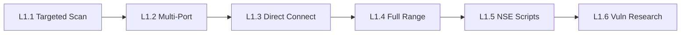

# Chapter L1: Linux Service Enumeration

## Why Linux Enumeration Comes First

Every penetration test begins with a question: what is running on the target? Before you can exploit a vulnerability, bypass authentication, or escalate privileges, you need to know which services are listening and what software is behind them. Linux servers power the majority of internet-facing infrastructure; web servers, file transfer services, remote administration tools, and databases all run on Linux. Learning to enumerate these services is the foundation of every assessment that follows.

Service enumeration is not a single step. A basic port scan tells you a door exists. Version detection tells you what is behind the door. Script-based enumeration and direct interaction reveal details that surface-level scans miss entirely. Across six labs, you will build from a single-port scan to full service analysis, learning why each layer of depth matters.

In a real engagement, incomplete enumeration leads to missed vulnerabilities. A server running an outdated FTP daemon on a non-standard port will not appear in a default scan. A custom banner containing credentials will not show up in version detection output. The progression in this chapter ensures you never stop at the surface.

## What You Will Learn

The six labs in this chapter progress from simple to thorough:

- **Detect** a single SSH service using targeted port scanning
- **Discover** multiple services running on the same host
- **Interact** directly with services to extract information that scanners miss
- **Scan** the full port range to find services hidden on non-standard ports
- **Enumerate** service details using Nmap Scripting Engine (NSE) scripts
- **Identify** vulnerable software versions and research known exploits

By the end of this chapter, you will have a repeatable methodology for enumerating any Linux host; from the first SYN packet to a vulnerability report.

## What Are Linux Services?

A service is a program that listens on a network port, waiting for connections. Each service speaks a specific protocol and serves a specific purpose. When a client connects to the correct port, the service responds according to its protocol; an HTTP server returns web pages, an SSH server initiates an encrypted session, and an FTP server begins a file transfer negotiation.

The table below lists the services you will encounter most often during Linux assessments.

| Port | Protocol | Service   | Purpose                          |
|------|----------|-----------|----------------------------------|
| 21   | TCP      | FTP       | File Transfer Protocol           |
| 22   | TCP      | SSH       | Secure Shell remote access       |
| 80   | TCP      | HTTP      | Web server (unencrypted)         |
| 443  | TCP      | HTTPS     | Web server (encrypted)           |
| 3306 | TCP      | MySQL     | Database server                  |
| 139  | TCP      | NetBIOS   | Legacy file/printer sharing      |
| 445  | TCP      | SMB       | Server Message Block file shares |
| 8080 | TCP      | HTTP-Alt  | Alternate web server / proxy     |

These port assignments are defaults defined by the Internet Assigned Numbers Authority (IANA). Administrators can; and often do; move services to non-standard ports. Your enumeration must account for that possibility, which is why Exercise L1.4 teaches full-range scanning.

## What Is Nmap?

Nmap (Network Mapper) is an open-source tool for network discovery and security auditing. If you completed the Windows track, you already used Nmap to scan Windows services. The same tool works against Linux targets; the commands are identical, but the services you discover will differ. Linux hosts typically expose SSH instead of Remote Desktop Protocol (RDP), Apache or Nginx instead of Internet Information Services (IIS), and vsftpd instead of Windows FTP.

Nmap runs on Linux, Windows, and macOS. Throughout this chapter, you will run Nmap from your Kali Linux attack machine, but the syntax is the same on any platform. Beyond port scanning, Nmap includes the Nmap Scripting Engine (NSE); a library of scripts that perform targeted enumeration tasks like retrieving SSH host keys or listing supported authentication methods. You will use NSE in Exercise L1.5.

Nmap is pre-installed on Kali Linux. You can verify your installation at any time:

```bash
nmap --version
```

## The Nmap Commands You Will Use

Each lab builds on the previous one, adding a new Nmap capability:



| Lab  | Core Command               | What It Adds                     |
|------|----------------------------|----------------------------------|
| L1.1 | `nmap -p 22 -sV`          | Single-port version detection    |
| L1.2 | `nmap -sV`                | Default top-port scanning        |
| L1.3 | `ftp <target>`            | Direct service interaction       |
| L1.4 | `nmap -p-`               | Full 65535-port range scan       |
| L1.5 | `nmap --script`           | NSE script enumeration           |
| L1.6 | `nmap -sV` + searchsploit | Version-to-vulnerability lookup  |

Notice the progression: each exercise asks a deeper question about the same types of services. By the final lab, you will chain version detection with vulnerability research to produce actionable findings.

## Before You Start

Confirm the following before launching your first exercise:

- [ ] VPN connection to the lab environment is active
- [ ] Terminal open and ready for commands
- [ ] Nmap installed and accessible (type `nmap --version` to confirm)
- [ ] FTP client available (type `ftp --help` to confirm)
- [ ] Netcat installed (type `nc -h` to confirm)
- [ ] Web browser available for HTTP interaction
- [ ] Notebook or text editor ready for recording findings
- [ ] Access to the OCR platform at the provided URL

Each lab takes approximately 15 to 30 minutes. Work through them in order; later exercises assume familiarity with the tools and techniques from earlier ones.
