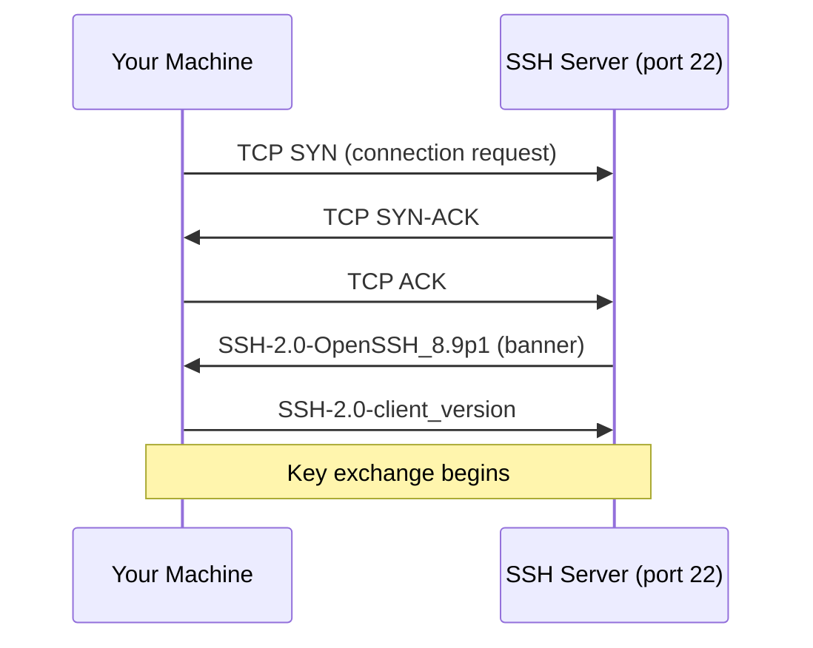

# Exercise L1.1: SSH Service Detection

## Before You Begin

- Confirm your VPN connection is active and you can reach the lab network.
- No credentials are needed for scanning; you will observe the service from the outside.
- You should be comfortable running commands in a Linux terminal.

## Scenario

TechStart Inc, a growing SaaS startup, has hired your security team to audit their Linux infrastructure. Your project lead, **Dana Reeves**, wants to start simple: confirm whether a Secure Shell (SSH) service is running on one of the company's development servers. SSH is how the engineering team manages servers remotely, so verifying its presence and version is the first step in the assessment.

## Your Objectives

- Launch the lab environment and note the target IP address
- Run a targeted Nmap scan against port 22
- Identify the SSH service version running on the target
- Understand the difference between port state and service version
- Record your findings and submit the flag

---

## Background: How SSH Works

SSH (Secure Shell) provides encrypted remote access to a system. When an SSH server starts, it binds to a port (default 22) and waits for incoming connections. During the initial handshake, the server announces its version string; a banner that identifies the software and protocol version.



That version banner is exactly what Nmap reads during a version scan. The server volunteers the information; no authentication required. The banner follows a standard format: the protocol version (SSH-2.0), a hyphen, and the software identifier (OpenSSH_8.9p1).

## Tool Primer: Nmap Version Scan

The `-sV` flag tells Nmap to probe open ports and identify the service and version running behind them. Combined with `-p`, you can target a specific port.

!!! kali "Version scan syntax"
    The general form of the version scan is shown below. You will fill in the port and the target IP from your own lab session in the steps that follow.

    ```bash
    nmap -p <port> -sV <target_ip>
    ```

**Key flags:**

| Flag  | Purpose                                      |
|-------|----------------------------------------------|
| `-p`  | Specify port(s) to scan                      |
| `-sV` | Probe open ports for service/version info    |
| `-v`  | Increase verbosity (optional but helpful)    |
| `-oN` | Save output to a normal text file            |

**Sample output:**

```
PORT   STATE SERVICE VERSION
22/tcp open  ssh     OpenSSH 8.9p1 Ubuntu 3ubuntu0.1
```

The output tells you the port number, its state, the service name, and the exact version string. Each field provides a different piece of the puzzle.

---

## Walkthrough

### Step 1: Launch the Exercise

Navigate to **Exercises** then **Linux** then **Level 1**, click **Launch**, wait for **Running**, note **target IP**.

Write down the IP address. You will use it in every command that follows.

### Step 2: Verify Connectivity

!!! kali "Verify connectivity to the target"
    Before scanning, confirm you can reach the target. The `-c 3` flag sends three ICMP echo requests and then stops.

    ```bash
    ping -c 3 <target_ip>
    ```

    You should see replies indicating the host is reachable. If the ping times out, check your VPN connection.

### Step 3: Run a Targeted SSH Scan

!!! kali "Scan port 22 for the SSH version"
    Open your terminal and run a version scan against port 22. The `-p 22` flag limits the scan to a single port, and `-sV` probes that port for the service banner.

    ```bash
    nmap -p 22 -sV <target_ip>
    ```

    Replace `<target_ip>` with the IP address from Step 1. A line reading `22/tcp open ssh` confirms the service is reachable, and the VERSION column reveals the exact OpenSSH build.

### Step 4: Read the Output

Your output should look similar to the following:

```
Starting Nmap 7.94 ( https://nmap.org )
Nmap scan report for <target_ip>
Host is up (0.023s latency).

PORT   STATE SERVICE VERSION
22/tcp open  ssh     OpenSSH 8.9p1 Ubuntu 3ubuntu0.1

Service detection performed.
Nmap done: 1 IP address (1 host up) scanned in 2.31 seconds
```

Break down what each column means:

- **PORT**: The port number and protocol (22/tcp)
- **STATE**: Whether the port is open, closed, or filtered
- **SERVICE**: The type of service Nmap identified (ssh)
- **VERSION**: The exact software version (OpenSSH 8.9p1)

### Step 5: Understand What Happened

Nmap completed three actions during the scan:

1. Sent a TCP SYN packet to port 22 to check if the port is open
2. Completed the TCP handshake when the port responded
3. Read the SSH version banner the server sent back

No password or authentication was needed. The SSH server freely shares its version with any client that connects. Understanding why is important: the SSH protocol specification requires version exchange before the encrypted channel is established.

### Step 6: Save Your Output (Optional)

!!! kali "Save the scan results to a file"
    For documentation, you can save the scan results to a file. The `-oN` flag mirrors the normal console output into the named text file.

    ```bash
    nmap -p 22 -sV -oN ssh_scan.txt <target_ip>
    ```

    The command writes `ssh_scan.txt` in your current directory. Building a habit of saving scan results now will serve you well in later exercises and real engagements.

### Record Your Findings

> **Target IP:** _______________
>
> | Field           | Your Finding          |
> |-----------------|-----------------------|
> | Port            | _______________       |
> | State           | _______________       |
> | Service         | _______________       |
> | Version         | _______________       |
> | Flag            | `OCR{_______________}`|

### Step 7: Record the Flag

The flag for this exercise is:

```
OCR{________}
```

Submit the flag on the OCR platform to mark the lab complete.

---

## Analysis Questions

**1. Why does an SSH server reveal its version to unauthenticated clients?**

??? note "Reveal Answer"

    The SSH protocol requires both sides to exchange version strings before the encrypted session begins. The server sends its banner immediately after the TCP handshake, before any authentication occurs. Protocol compatibility depends on this exchange.

**2. What risk does version disclosure create for a server administrator?**

??? note "Reveal Answer"

    An attacker can match the exact version string against public vulnerability databases. If the version has known flaws, the attacker gains a starting point for exploitation without ever logging in.

**3. Could an administrator hide the SSH version, and would that help?**

??? note "Reveal Answer"

    Some SSH configurations allow modifying or obscuring the banner, but the protocol still requires a version exchange. Changing the banner provides minimal protection; fingerprinting techniques can often identify the true version regardless. Defense should focus on patching, not hiding.

---

## Key Takeaways

- **Version scanning (`-sV`)** reads banners that services send during connection setup
- **SSH announces its version** before authentication, making it visible to any scanner
- **A single targeted port scan** runs faster than a broad scan when you know what to look for
- **Port state matters**: open means accessible, closed means rejected, filtered means blocked by a firewall
- **Saving scan output** with `-oN` creates a record for documentation and comparison
- **Version strings map to vulnerabilities**: you will use this relationship throughout the chapter
