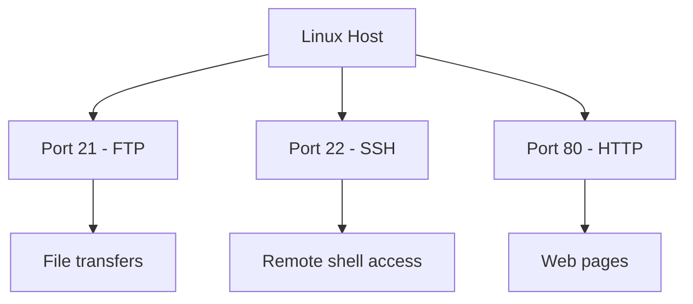

# Exercise L1.2: Multi-Service Discovery

## Before You Begin

- Confirm your VPN connection is active and you can reach the lab network.
- You should have completed Exercise L1.1 and be comfortable reading Nmap output.
- You will need a terminal, an FTP client, and a web browser (or curl).

## Scenario

Dana Reeves at TechStart Inc is satisfied that SSH was found on the first server. Now she wants a broader picture. A second development server is suspected to run multiple services; not just SSH. Your job is to scan the host, discover every service on the default port range, and interact with each one to gather information. The flag for this exercise is split across two services, so scanning alone will not be enough.

## Your Objectives

- Scan the target to discover all services on common ports
- Identify FTP, SSH, and HTTP services and their versions
- Connect to the FTP service using anonymous login
- Inspect the HTTP service to find hidden information in the page source
- Combine the flag halves from FTP and HTTP

---

## Background: Multiple Services on One Host

Production servers often run several services simultaneously. A single Linux host might serve web pages on port 80, accept file uploads on port 21, and allow remote administration on port 22. Each service binds to its own port and operates independently.



Discovering all active services is essential. A forgotten FTP server or a test web application can become the weakest link in an otherwise secure system.

## Tool Primer: Nmap Default Scan and FTP Client

**Nmap default service scan:**

!!! kali "Run a default service scan"
    When you run `nmap -sV` without specifying ports, Nmap scans the top 1,000 most common ports. For most initial assessments, the default range catches standard services.

    ```bash
    nmap -sV <target_ip>
    ```

    The output lists each open port with its detected service and version string.

**FTP anonymous login:**

!!! kali "Connect to the FTP service"
    Many FTP servers allow anonymous access; a guest account that requires no real credentials. The username is `anonymous` and any email address works as the password.

    ```bash
    ftp <target_ip>
    ```

    A successful connection drops you at an `ftp>` prompt after the login exchange.

**Curl for HTTP inspection:**

!!! kali "Fetch the web page"
    Use curl to retrieve the raw HTML served on port 80 without a browser.

    ```bash
    curl http://<target_ip>
    ```

    The raw HTML, including any HTML comments, prints to your terminal.

| Tool   | Command              | Purpose                          |
|--------|----------------------|----------------------------------|
| nmap   | `nmap -sV`           | Scan top 1000 ports with version |
| ftp    | `ftp <target_ip>`    | Connect to FTP service           |
| curl   | `curl <url>`         | Fetch web page content           |

---

## Walkthrough

### Step 1: Launch the Exercise

Navigate to **Exercises** then **Linux** then **Level 1**, click **Launch**, wait for **Running**, note **target IP**.

### Step 2: Run a Broad Service Scan

!!! kali "Run a broad service scan"
    Scan the target without specifying ports to let Nmap check its default top-1000 list:

    ```bash
    nmap -sV <target_ip>
    ```

    Nmap reports every open port in the top-1000 range along with the detected service and version.

### Step 3: Review the Results

You should see three services:

```
PORT   STATE SERVICE VERSION
21/tcp open  ftp     vsftpd 3.0.5
22/tcp open  ssh     OpenSSH 8.9p1
80/tcp open  http    Apache httpd 2.4.54
```

Three open ports means three attack surfaces to investigate. Note each service and version.

### Step 4: Connect to FTP with Anonymous Login

!!! kali "Connect to FTP and list files"
    Connect to the FTP service:

    ```bash
    ftp <target_ip>
    ```

    When prompted, enter `anonymous` as the username and press Enter for the password (or type any email address). Once logged in, list the files:

    ```bash
    ls
    ```

    Look for a text file. Download it:

    ```bash
    get <filename>
    bye
    ```

    The `get` command saves the file to your current local directory, and `bye` closes the FTP session.

!!! kali "Read the downloaded file"
    Read the downloaded file on your local machine:

    ```bash
    cat <filename>
    ```

    The file contains the first half of the flag.

### Step 5: Inspect the HTTP Service

!!! kali "Inspect the HTTP service"
    Open a web browser and navigate to `http://<target_ip>`, or use curl from the terminal:

    ```bash
    curl http://<target_ip>
    ```

    The page may look ordinary at first glance. View the page source (right-click, "View Page Source" in a browser, or read the raw curl output). Look for an HTML comment containing the second half of the flag. HTML comments follow the format `<!-- comment -->`.

### Step 6: Combine the Flag

The two halves you found; one from FTP, one from the HTTP page source; form the complete flag when joined together.

### Record Your Findings

> **Target IP:** _______________
>
> | Port | Service | Version              |
> |------|---------|----------------------|
> | 21   |         |                      |
> | 22   |         |                      |
> | 80   |         |                      |
>
> **FTP flag half:** _______________
>
> **HTTP flag half:** _______________
>
> **Combined Flag:** `OCR{_______________}`

### Step 7: Record the Flag

The complete flag for this exercise is:

```
OCR{________}
```

Submit the flag on the OCR platform to mark the lab complete.

---

## Analysis Questions

**1. Why does Nmap scan only the top 1,000 ports by default instead of all 65,535?**

??? note "Reveal Answer"

    Scanning all 65,535 ports takes significantly longer. The top 1,000 ports cover the vast majority of common services. Default scans balance speed with coverage; when you need completeness, you use the `-p-` flag (covered in Exercise L1.4).

**2. What is the security risk of allowing anonymous FTP access?**

??? note "Reveal Answer"

    Anonymous FTP lets anyone connect without credentials. If sensitive files are stored on the server, any unauthenticated user can download them. Attackers routinely check for anonymous FTP access during enumeration.

**3. Why might a developer leave information in HTML comments?**

??? note "Reveal Answer"

    Developers use HTML comments for notes, debugging, and documentation during development. When code moves to production without a review process, those comments remain visible to anyone who views the page source. Sensitive data in comments is a common finding in web assessments.

---

## Key Takeaways

- **Default Nmap scans** check the top 1,000 ports, which catches most standard services
- **Multiple services on one host** multiply the attack surface; each one needs investigation
- **Anonymous FTP** is a common misconfiguration that exposes files without authentication
- **HTML source code** often contains comments with sensitive information invisible on the rendered page
- **Scanning finds services; interaction reveals content**: both steps are necessary
- **Flag data can be distributed** across services, reinforcing why complete enumeration matters
