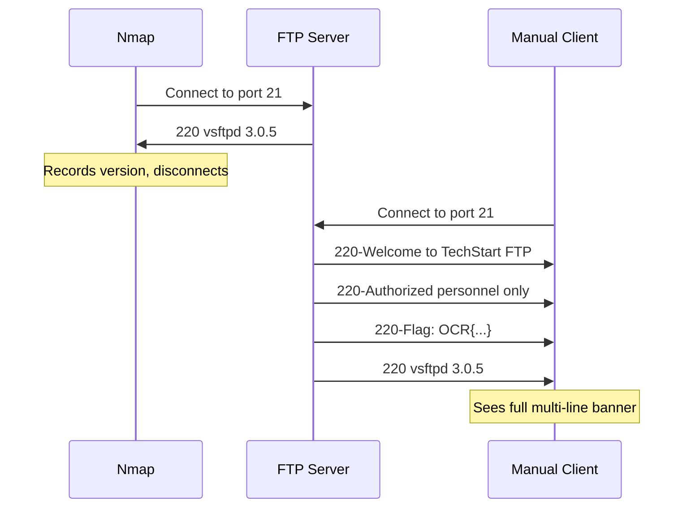

# Exercise L1.3: Service Interaction

## Before You Begin

- Confirm your VPN connection is active and you can reach the lab network.
- You should have completed Exercises L1.1 and L1.2.
- You will need a terminal with an FTP client and basic banner-grabbing tools (netcat).

## Scenario

After discovering multiple services on TechStart Inc's servers, Dana Reeves raises a concern. The security team's previous vendor only ran automated scans and never connected to services directly. Dana wants you to demonstrate what scanners miss. An FTP server on the next target has a detailed welcome banner that Nmap's version scan does not fully capture. Your job is to connect directly and prove that manual interaction reveals information that automated tools overlook.

## Your Objectives

- Scan the target to confirm the FTP service is running
- Connect directly to the FTP service and observe the full welcome banner
- Use netcat as an alternative banner-grabbing method
- Compare what Nmap reports versus what a direct connection reveals
- Extract the flag embedded in the FTP banner
- Document the difference between scanning and interacting

---

## Background: Service Banners and Why Scanners Truncate Them

When a service accepts a connection, it often sends a banner; a greeting message that may include the software name, version, legal warnings, or custom text set by the administrator. Nmap reads just enough of the banner to identify the service and version, then moves on. Custom messages, multi-line greetings, and non-standard text are frequently discarded.



The FTP protocol uses response code 220 for its welcome message. A single-line banner starts with `220 ` (space). A multi-line banner uses `220-` (hyphen) for continuation lines and `220 ` for the final line. Nmap typically captures only the last line containing the version identifier.

Understanding how FTP response codes work helps you interpret banners from any FTP server. Codes in the 200 range indicate success, codes in the 300 range indicate the server needs more input, and codes in the 500 range indicate errors.

## Tool Primer: FTP Client and Banner Grabbing

**FTP client connection:**

!!! kali "Connect with the FTP client"
    The moment you connect, the server sends its banner before prompting for credentials. Read every line carefully; the banner appears only once at connection time.

    ```bash
    ftp <target_ip>
    ```

    Watch the lines printed before the username prompt; those are the welcome banner.

**Alternative: Netcat for raw banner grabbing:**

!!! kali "Grab the raw banner with netcat"
    Netcat (nc) connects to a port and shows exactly what the server sends, with no interpretation or formatting. Where the FTP client may reformat text, netcat preserves the raw output.

    ```bash
    nc <target_ip> 21
    ```

    The exact bytes the server sends print to your terminal, response codes and all.

| Tool | Command                | Purpose                         |
|------|------------------------|---------------------------------|
| ftp  | `ftp <target_ip>`      | Standard FTP client connection  |
| nc   | `nc <target_ip> 21`    | Raw TCP connection to port 21   |
| nmap | `nmap -p 21 -sV`       | Version scan for comparison     |

---

## Walkthrough

### Step 1: Launch the Exercise

Navigate to **Exercises** then **Linux** then **Level 1**, click **Launch**, wait for **Running**, note **target IP**.

### Step 2: Scan with Nmap First

!!! kali "Establish a version-scan baseline"
    Start with a version scan to establish a baseline of what automated tools report:

    ```bash
    nmap -p 21 -sV <target_ip>
    ```

    Note what Nmap reports for the FTP service. You should see the version string but limited banner detail:

    ```
    PORT   STATE SERVICE VERSION
    21/tcp open  ftp     vsftpd 3.0.5
    ```

    Nmap identified the service and version. Save that output; you will compare it with direct interaction results shortly.

### Step 3: Connect with the FTP Client

!!! kali "Read the full banner with the FTP client"
    Now connect directly:

    ```bash
    ftp <target_ip>
    ```

    Watch the banner that appears before the login prompt. You should see multiple lines of text that Nmap did not include in its output. The welcome banner may contain a flag, administrative notes, or other information the server administrator configured.

    Read every line. The flag is embedded in the banner text. When prompted for a username, you can type `anonymous` or press Ctrl+C to disconnect. The banner, and the flag, appear before authentication.

### Step 4: Try Banner Grabbing with Netcat

!!! kali "Confirm the banner with netcat"
    For an even rawer view, use netcat:

    ```bash
    nc <target_ip> 21
    ```

    Netcat shows the exact bytes the server sends. You will see the same multi-line banner, confirming what the FTP client displayed. Notice how each line begins with the 220 response code. Type `QUIT` and press Enter to disconnect cleanly.

### Step 5: Compare the Results

Place your findings side by side:

- **Nmap reported:** service name and version only
- **FTP client revealed:** full multi-line welcome banner including the flag
- **Netcat confirmed:** identical raw banner with FTP response codes visible

The gap between these results is the lesson. Automated tools prioritize speed and classification. Manual interaction prioritizes completeness. A thorough assessment requires both approaches.

### Record Your Findings

> **Target IP:** _______________
>
> | Method            | Information Obtained         |
> |-------------------|------------------------------|
> | Nmap -sV          |                              |
> | FTP client banner |                              |
> | Netcat banner     |                              |
>
> **Full banner text:**
>
> _______________________________________________
>
> _______________________________________________
>
> **How to submit:** enter the flag on the exercise page exactly as you recovered it, keeping the `OCR{...}` wrapper.
>
> **Flag:** `OCR{_______________}`

### Step 6: Record the Flag

The flag for this exercise is:

```
OCR{________}
```

Submit the flag on the OCR platform to mark the lab complete.

---

## Analysis Questions

**1. Why does Nmap not capture the full FTP banner during a version scan?**

??? note "Reveal Answer"

    Nmap's version detection engine reads enough data to match a known service signature, then disconnects to save time. Multi-line banners, custom messages, and administrative notes fall outside the signature database and are discarded during processing.

**2. When would a penetration tester choose netcat over a standard FTP client?**

??? note "Reveal Answer"

    Netcat shows raw, uninterpreted server responses. A standard FTP client may format or hide certain response codes. When you need to see exactly what the server sends; byte for byte; netcat is the better tool. It also works for any TCP service, not just FTP.

**3. What kind of sensitive information might appear in service banners?**

??? note "Reveal Answer"

    Banners may contain internal hostnames, software versions, operating system details, administrator contact information, legal notices that reveal the organization's name, and sometimes credentials or debug information left by administrators. Every piece of banner text is reconnaissance data.

---

## Key Takeaways

- **Port scanning is not enough**: direct service interaction often reveals critical details
- **FTP banners can be multi-line**, and Nmap captures only what it needs for version matching
- **Netcat provides raw access** to any TCP service, showing unfiltered server responses
- **Always compare scanner output with manual interaction** during a real engagement
- **Banner information appears before authentication**, making it available to anyone who connects
- **Administrative messages in banners** are a common source of information leakage
- **The gap between automated and manual results** is where skilled penetration testers find value
