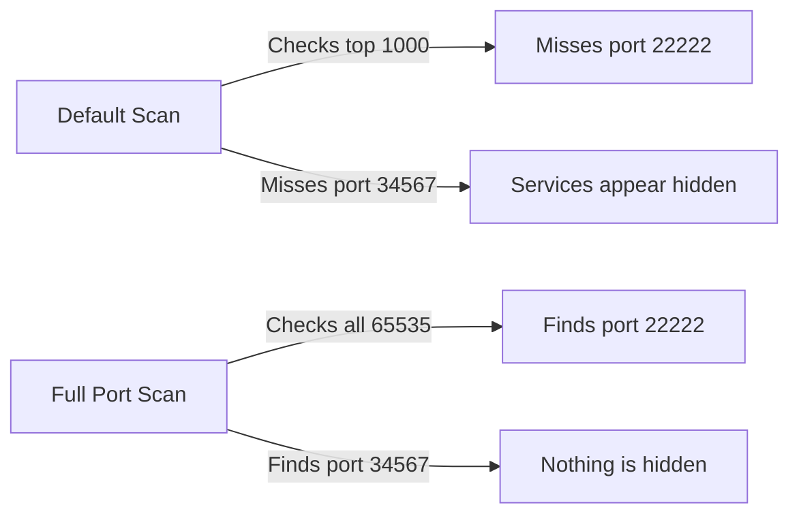

# Exercise L1.4: Non-Standard Port Discovery

## Before You Begin

- Confirm your VPN connection is active and you can reach the lab network.
- You should have completed Exercises L1.1 through L1.3.
- You will need a terminal, curl, and an SSH client.
- A full port scan may take several minutes; plan accordingly.

## Scenario

TechStart Inc's system administrator, **Carlos Medina**, relocated some services to unusual ports, believing that moving SSH off port 22 and HTTP off port 80 would prevent attackers from finding them. Dana Reeves suspects this "security through obscurity" approach provides no real protection. Your task is to find these relocated services, prove they are accessible, and demonstrate why non-standard ports do not equal security.

## Your Objectives

- Run a full 65,535-port scan to discover services on non-standard ports
- Identify the HTTP service running on a high-numbered port
- Extract credentials from the web page on the non-standard HTTP port
- Use those credentials to authenticate to SSH on its non-standard port
- Retrieve the flag after logging in

---

## Background: Security Through Obscurity

Administrators sometimes move services to non-standard ports, hoping attackers will only check the defaults. SSH on port 22222 instead of 22. HTTP on port 34567 instead of 80. The logic is simple: if attackers do not know where to look, they cannot connect.

The flaw is equally simple: a full port scan checks every port.



The Internet Assigned Numbers Authority (IANA) defines well-known ports (0-1023), registered ports (1024-49151), and dynamic ports (49152-65535). Services can bind to any port in any range. The only way to find them all is to scan the entire range.

## Tool Primer: Full Port Scan

**Syntax for a full range scan:**

!!! kali "Scan every TCP port"
    The `-p-` flag is shorthand for `-p 1-65535`, telling Nmap to scan every TCP port.

    ```bash
    nmap -p- -sV <target_ip>
    ```

    The scan reports open ports anywhere in the full 65,535-port range, including high-numbered ones.

| Flag        | Purpose                                  |
|-------------|------------------------------------------|
| `-p-`       | Scan all 65,535 ports                    |
| `-sV`       | Version detection on discovered ports    |
| `--open`    | Show only open ports (reduces noise)     |
| `-T4`       | Faster timing template                   |

**Speed considerations:** A full scan takes longer than a default scan. Using `-T4` increases speed.

!!! kali "Run a two-phase full scan"
    You can run the scan in two phases: discover open ports first with a fast scan, then version-scan only the open ones.

    ```bash
    nmap -p- --open -T4 <target_ip>
    nmap -p <found_ports> -sV <target_ip>
    ```

    The first command finds which ports are open quickly; the second spends time on version detection only where it matters.

---

## Walkthrough

### Step 1: Launch the Exercise

Navigate to **Exercises** then **Linux** then **Level 1**, click **Launch**, wait for **Running**, note **target IP**.

### Step 2: Try a Default Scan First

!!! kali "Run a default scan"
    Run a standard scan to see what the top 1,000 ports reveal:

    ```bash
    nmap -sV <target_ip>
    ```

    You may find no open ports, or only a partial picture. The services on non-standard ports remain invisible to a default scan.

### Step 3: Run a Full Port Scan

!!! kali "Run a full 65,535-port scan"
    Now scan all 65,535 ports:

    ```bash
    nmap -p- -sV --open -T4 <target_ip>
    ```

    The scan may take a few minutes. When it completes, you should see output resembling:

    ```
    PORT      STATE SERVICE VERSION
    22222/tcp open  ssh     OpenSSH 8.9p1
    34567/tcp open  http    Apache httpd 2.4.54
    ```

    Two services, both on ports that the default scan would never check.

### Step 4: Inspect the HTTP Service

!!! kali "Fetch the web page on the high port"
    The web server is on port 34567. Fetch the page:

    ```bash
    curl http://<target_ip>:34567
    ```

    Read the page content carefully. The page contains credentials (a username and password) intended for SSH access. Note them down.

### Step 5: Connect to SSH on the Non-Standard Port

!!! kali "SSH in on the non-standard port"
    SSH is listening on port 22222, not the default 22. Use the `-p` flag to specify the port:

    ```bash
    ssh -p 22222 <username>@<target_ip>
    ```

    Enter the password you found on the web page. A successful login drops you at a shell prompt on the target.

!!! target "Locate the flag file"
    Once authenticated on the target, look for the flag. Check common locations:

    ```bash
    cat flag.txt
    ls
    cat /root/flag.txt
    ```

    The flag file confirms that both non-standard services were fully accessible once discovered.

### Record Your Findings

> **Target IP:** _______________
>
> | Port  | Service | Version     | Standard Port |
> |-------|---------|-------------|---------------|
> |       | SSH     |             | 22            |
> |       | HTTP    |             | 80            |
>
> **Credentials found on web page:**
>
> Username: _______________
>
> Password: _______________
>
> **How to submit:** enter the flag on the exercise page exactly as you recovered it, keeping the `OCR{...}` wrapper.
>
> **Flag:** `OCR{_______________}`

### Step 6: Record the Flag

The flag for this exercise is:

```
OCR{________}
```

Submit the flag on the OCR platform to mark the lab complete.

---

## Analysis Questions

**1. Why is security through obscurity insufficient as a defense strategy?**

??? note "Reveal Answer"

    Moving a service to a non-standard port only prevents discovery by scanners that check default ports. Any attacker who runs a full port scan (`-p-`) will find the service regardless of which port it uses. Obscurity delays discovery by seconds or minutes, not permanently.

**2. What is the trade-off between a default scan and a full port scan?**

??? note "Reveal Answer"

    A default scan (top 1,000 ports) completes quickly but misses services on uncommon ports. A full scan (all 65,535 ports) takes significantly longer but guarantees complete coverage. In a real engagement, testers often start with a fast default scan, then run a full scan in the background.

**3. How does chaining information between services (web to SSH) reflect real attack patterns?**

??? note "Reveal Answer"

    Attackers frequently chain discoveries across services. Credentials on a web page lead to SSH access. Database connection strings lead to backend servers. Each service may expose information that grants access to another, creating an attack path across the infrastructure.

---

## Key Takeaways

- **Full port scans (`-p-`)** are essential for discovering services on non-standard ports
- **Security through obscurity fails** because scanners can check all 65,535 ports
- **Non-standard ports slow attackers down by minutes**, not by design
- **Information on one service often leads to access on another**: always investigate every service you find
- **Two-phase scanning** (discovery then version detection) speeds up full-range assessments
- **The `-p` flag in SSH** lets you connect to any port, matching the attacker's flexibility
