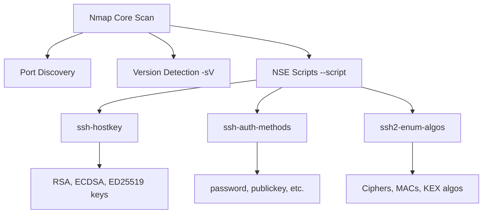

# Exercise L1.5: NSE Script Enumeration

## Before You Begin

- Confirm your VPN connection is active and you can reach the lab network.
- You should have completed Exercises L1.1 through L1.4.
- You will need a terminal with Nmap installed (NSE scripts are included with Nmap).

## Scenario

Dana Reeves at TechStart Inc is impressed with your enumeration work so far, but she wants deeper detail. Basic version detection tells you *what* is running; NSE scripts tell you *how* it is configured. Your task is to use Nmap Scripting Engine (NSE) scripts against an SSH server to enumerate its host keys, supported authentication methods, and encryption algorithms. One of the script outputs contains a hidden flag, proving that automated deep enumeration can surface information invisible to basic scans.

## Your Objectives

- Run NSE scripts targeting the SSH service on the target
- Enumerate SSH host keys using the `ssh-hostkey` script
- Identify supported authentication methods using `ssh-auth-methods`
- List encryption algorithms using `ssh2-enum-algos`
- Find the flag hidden within the script output

---

## Background: The Nmap Scripting Engine

NSE extends Nmap from a port scanner into a full enumeration framework. Scripts are written in Lua and organized into categories: `auth`, `default`, `discovery`, `vuln`, `brute`, and more. Each script targets a specific service and extracts specific information.



A basic `-sV` scan tells you "OpenSSH 8.9p1." NSE scripts tell you which authentication methods the server accepts, which cryptographic algorithms it supports, and what its host key fingerprints are; details that matter when assessing configuration security.

## Tool Primer: NSE Script Syntax

**Running specific scripts:**

!!! kali "Run a single NSE script"
    The `--script` flag names one NSE script to run against the chosen port.

    ```bash
    nmap -p 22 --script <script_name> <target_ip>
    ```

    Output from the named script appears under the port entry, prefixed with `|`.

**Running multiple scripts at once:**

!!! kali "Run several NSE scripts together"
    Comma-separate script names to run them all in one pass.

    ```bash
    nmap -p 22 --script ssh-hostkey,\
    ssh-auth-methods,ssh2-enum-algos <target_ip>
    ```

    Each script contributes its own block of output under the port.

**Key NSE scripts for SSH:**

| Script              | Purpose                              |
|---------------------|--------------------------------------|
| `ssh-hostkey`       | Retrieves SSH host key fingerprints  |
| `ssh-auth-methods`  | Lists accepted authentication types  |
| `ssh2-enum-algos`   | Enumerates supported algorithms      |

**Script arguments (optional):**

Some scripts accept arguments via `--script-args`.

!!! kali "Pass arguments to an NSE script"
    For example, `ssh-hostkey` can output full keys when you set `ssh_hostkey=full`.

    ```bash
    nmap -p 22 --script ssh-hostkey \
      --script-args ssh_hostkey=full <target_ip>
    ```

    Instead of just fingerprints, the full public key material prints for each host key.

---

## Walkthrough

### Step 1: Launch the Exercise

Navigate to **Exercises** then **Linux** then **Level 1**, click **Launch**, wait for **Running**, note **target IP**.

### Step 2: Run a Baseline Version Scan

!!! kali "Confirm SSH with a version scan"
    Start with a basic scan to confirm SSH is running:

    ```bash
    nmap -p 22 -sV <target_ip>
    ```

    Note the version. Now you will go far deeper than version detection alone.

### Step 3: Enumerate SSH Host Keys

!!! kali "Enumerate SSH host keys"
    Run the `ssh-hostkey` script to retrieve the server's public key fingerprints:

    ```bash
    nmap -p 22 --script ssh-hostkey <target_ip>
    ```

    The output lists each key type (RSA, ECDSA, ED25519) with its fingerprint. These fingerprints uniquely identify the server; if they change unexpectedly, it may indicate a man-in-the-middle attack.

### Step 4: Enumerate Authentication Methods

!!! kali "Enumerate authentication methods"
    Run the `ssh-auth-methods` script to see how the server accepts logins:

    ```bash
    nmap -p 22 --script ssh-auth-methods <target_ip>
    ```

    Expected output includes lines like:

    ```
    |   Supported authentication methods:
    |     publickey
    |     password
    |_    keyboard-interactive
    ```

    Read every line of the output carefully. The flag is embedded in the `ssh-auth-methods` script results. It may appear as a comment, an extra field, or an appended value within the authentication methods listing.

### Step 5: Enumerate Encryption Algorithms

!!! kali "Enumerate encryption algorithms"
    Run the `ssh2-enum-algos` script to list supported cryptographic algorithms:

    ```bash
    nmap -p 22 --script ssh2-enum-algos <target_ip>
    ```

    The output shows four categories:

    - **kex_algorithms**: Key Exchange methods
    - **server_host_key_algorithms**: Host key types
    - **encryption_algorithms**: Ciphers for data encryption
    - **mac_algorithms**: Message Authentication Code methods

    Weak algorithms in any category represent a potential security finding.

### Step 6: Run All Three Scripts Together

!!! kali "Run all three scripts at once"
    For efficiency, combine all scripts in a single command:

    ```bash
    nmap -p 22 --script ssh-hostkey,\
    ssh-auth-methods,ssh2-enum-algos <target_ip>
    ```

    Review the combined output. Compare it with the single-line version string from Step 2. The difference in depth is significant.

### Record Your Findings

> **Target IP:** _______________
>
> **SSH Version:** _______________
>
> | Script              | Key Findings                    |
> |---------------------|---------------------------------|
> | ssh-hostkey         |                                 |
> | ssh-auth-methods    |                                 |
> | ssh2-enum-algos     |                                 |
>
> **Authentication methods supported:**
>
> _______________________________________________
>
> **How to submit:** enter the flag on the exercise page exactly as you recovered it, keeping the `OCR{...}` wrapper.
>
> **Flag:** `OCR{_______________}`

### Step 7: Record the Flag

The flag for this exercise is:

```
OCR{________}
```

Submit the flag on the OCR platform to mark the lab complete.

---

## Analysis Questions

**1. How does NSE enumeration differ from basic version detection?**

??? note "Reveal Answer"

    Version detection (`-sV`) identifies the software name and version by matching a banner against a signature database. NSE scripts actively query the service for specific configuration details; authentication methods, supported algorithms, key fingerprints; that go far beyond what a banner reveals.

**2. Why would a security assessor care about which authentication methods an SSH server supports?**

??? note "Reveal Answer"

    If a server accepts password authentication, it is vulnerable to brute-force attacks. Servers restricted to public key authentication are more resistant. Knowing the accepted methods helps assessors identify which attack vectors are viable and which hardening recommendations to make.

**3. What security risk do weak encryption algorithms pose?**

??? note "Reveal Answer"

    Weak ciphers and key exchange algorithms can be broken or downgraded by an attacker positioned between the client and server. If the server supports deprecated algorithms like `diffie-hellman-group1-sha1` or `arcfour`, an attacker may force a connection to use the weak option and then intercept or decrypt the session.

---

## Key Takeaways

- **NSE scripts extend Nmap** from a scanner to a deep enumeration tool
- **`ssh-hostkey` reveals fingerprints** that can verify server identity or detect impersonation
- **`ssh-auth-methods` shows login options**, directly informing which attacks are possible
- **`ssh2-enum-algos` lists cryptographic choices**, exposing weak configurations
- **Combining scripts in one command** saves time while maximizing information gathered
- **Version detection is the starting point; NSE is the deep dive** that separates basic scanning from professional enumeration
