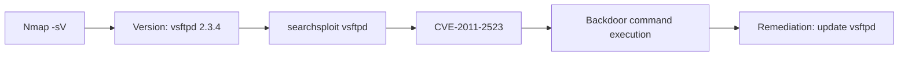

# Exercise L1.6: Version-Specific Vulnerability Identification

## Before You Begin

- Confirm your VPN connection is active and you can reach the lab network.
- You should have completed Exercises L1.1 through L1.5.
- You will need a terminal with Nmap, Netcat (`nc`), and searchsploit installed.
- No exploitation is performed in this exercise; you are identifying vulnerabilities, not exploiting them.

## Scenario

Dana Reeves at TechStart Inc has one final task for your assessment of their Linux infrastructure. A legacy server is running outdated software that was never updated. Your job is to identify the exact versions of the running services, research whether those versions have known vulnerabilities, and present your findings. The engineering team needs concrete evidence; CVE numbers and exploit references; before they will prioritize patching.

## Your Objectives

- Scan the target to identify all services and their exact versions
- Recognize vsftpd 2.3.4 as a version with a known critical vulnerability
- Use searchsploit to find the corresponding exploit and CVE
- Document the vulnerability with enough detail for a remediation report
- Retrieve the flag

---

## Background: From Version Strings to Exploits

Every piece of software has a version history, and many versions have known flaws catalogued as Common Vulnerabilities and Exposures (CVE). The process of matching a detected version to a known vulnerability is called vulnerability identification.



vsftpd 2.3.4 is one of the most well-known vulnerable versions in security training. In July 2011, an attacker compromised the vsftpd source code repository and inserted a backdoor. Any FTP login with a username ending in `:)` (a smiley face) would open a command shell on port 6200. The backdoor was discovered within days, but any server still running version 2.3.4 from the compromised source remains vulnerable.

The CVE identifier is **CVE-2011-2523**.

## Tool Primer: searchsploit

searchsploit is a command-line interface to the Exploit Database (ExploitDB), an archive of public exploits and vulnerability reports. It searches locally stored copies of the database, so it works offline.

**Basic syntax:**

!!! kali "Search ExploitDB by keyword"
    Pass a software name to searchsploit to list every matching exploit in the local database.

    ```bash
    searchsploit <software_name>
    ```

    Matching exploit titles and their file paths print in a two-column table.

**Narrow results by version:**

!!! kali "Narrow the search by version"
    Add the version number to filter the results to that specific release.

    ```bash
    searchsploit vsftpd 2.3.4
    ```

    Only exploits matching both the name and version appear, which sharpens the hit list.

**Key flags:**

| Flag         | Purpose                                    |
|--------------|--------------------------------------------|
| (none)       | Search by keyword                          |
| `-w`         | Show ExploitDB URL instead of local path   |
| `--examine`  | Open the exploit file for reading          |
| `-j`         | Output results in JSON format              |

**Sample output:**

```
--------------------------------------------- -------
 Exploit Title                                |  Path
--------------------------------------------- -------
 vsftpd 2.3.4 - Backdoor Command Execution   | unix/
--------------------------------------------- -------
```

---

## Walkthrough

### Step 1: Launch the Exercise

Navigate to **Exercises** then **Linux** then **Level 1**, click **Launch**, wait for **Running**, note **target IP**.

### Step 2: Run a Version Detection Scan

!!! kali "Run a version detection scan"
    Scan the target with version detection enabled:

    ```bash
    nmap -sV <target_ip>
    ```

    Look carefully at the FTP service line. At default intensity, Nmap fingerprints the running daemon and reports a broad guess such as `vsftpd 2.0.8 or later`, which is too vague to map to a CVE. The exact version lives in the FTP welcome banner, so read it directly in the next step.

### Step 3: Read the FTP Welcome Banner

The flag and the exact version string are published in the raw FTP welcome banner. Connect to port 21 with Netcat and read the first line the service sends.

!!! kali "Grab the FTP banner with Netcat"
    Open a raw TCP connection to the FTP port and read the welcome banner:

    ```bash
    nc <target_ip> 21
    ```

    The service immediately prints a `220` welcome line. Press Ctrl+C to disconnect after the banner appears. The banner reads:

    ```
    220 vsftpd 2.3.4 (TechStart FTP; VULNERABLE: CVE-2011-2523 Backdoor; Flag: OCR{________})
    ```

    The exact version (`vsftpd 2.3.4`), the CVE, and the flag are all in this single line.

!!! kali "Alternative: aggressive Nmap version intensity"
    If you prefer to stay in Nmap, raise the probe intensity so it captures the full banner:

    ```bash
    nmap -p 21 -sV --version-intensity 9 <target_ip>
    ```

    The higher intensity sends more probes and surfaces the banner text, including the `vsftpd 2.3.4` version and the flag.

### Step 4: Research the Version with searchsploit

!!! kali "Research the version with searchsploit"
    Search for known exploits matching the detected FTP version:

    ```bash
    searchsploit vsftpd 2.3.4
    ```

    The output should show at least one result referencing a backdoor command execution vulnerability. Note the exploit title and path.

### Step 5: Get the ExploitDB URL

!!! kali "Retrieve the ExploitDB URL"
    For your report, retrieve the web URL to reference:

    ```bash
    searchsploit -w vsftpd 2.3.4
    ```

    The URL points to the ExploitDB page with full details, including the CVE number, affected versions, and exploit code.

### Step 6: Review the Vulnerability Details

The key facts about CVE-2011-2523:

- **Software:** vsftpd 2.3.4
- **Type:** Backdoor (supply chain compromise)
- **Trigger:** Username containing `:)` during FTP login
- **Effect:** Opens a root shell listener on port 6200
- **Severity:** Critical; allows unauthenticated remote code execution
- **Fix:** Upgrade to vsftpd 2.3.5 or later (compiled from clean source)

Document these details. In a real engagement, your report would include the CVE number, affected host, detected version, risk rating, and remediation steps.

### Step 7: Verify the Flag

The flag was already printed in the FTP welcome banner you read in Step 3. To pull it out cleanly, grab the banner again and filter for the flag pattern.

!!! kali "Extract the flag from the FTP banner"
    Read the banner one more time and isolate the `OCR{...}` token:

    ```bash
    nc <target_ip> 21 </dev/null | grep -o 'OCR{[^}]*}'
    ```

    The command prints the flag on its own line:

    ```
    OCR{________}
    ```

### Record Your Findings

> **Target IP:** _______________
>
> | Field                 | Finding                     |
> |-----------------------|-----------------------------|
> | Service               | FTP                         |
> | Version               |                             |
> | CVE                   |                             |
> | Vulnerability Type    |                             |
> | Severity              |                             |
> | Remediation           |                             |
>
> **searchsploit results:**
>
> _______________________________________________
>
> **How to submit:** enter the flag on the exercise page exactly as you recovered it, keeping the `OCR{...}` wrapper.
>
> **Flag:** `OCR{____________}`

### Step 8: Record the Flag

The flag for this exercise is:

```
OCR{________}
```

Submit the flag on the OCR platform to mark the lab complete.

---

## Analysis Questions

**1. Why is version detection the critical first step before vulnerability research?**

??? note "Reveal Answer"

    Vulnerability databases are indexed by software name and version number. Without an exact version string, you cannot narrow results to relevant CVEs. A scan that reports "FTP" without a version leaves you searching blindly through thousands of potential vulnerabilities.

**2. What made the vsftpd 2.3.4 backdoor particularly dangerous?**

??? note "Reveal Answer"

    The backdoor was inserted into the official source code repository, meaning administrators who compiled and installed vsftpd from the trusted source unknowingly deployed compromised software. The trigger was trivial (a smiley face in the username), and the payload was a root shell; full system compromise with minimal effort.

**3. How does a vulnerability identification differ from exploitation?**

??? note "Reveal Answer"

    Vulnerability identification confirms that a target runs software with known flaws. Exploitation actively triggers the flaw to gain unauthorized access. In many engagements, the scope stops at identification; the client wants to know what is vulnerable, not to have it exploited. Both steps require different authorization and carry different risks.

---

## Key Takeaways

- **Version strings are the bridge** between enumeration and vulnerability assessment
- **searchsploit queries a local exploit database**, enabling offline vulnerability research
- **CVE-2011-2523 (vsftpd 2.3.4)** is a textbook example of a supply chain backdoor
- **Identification is not exploitation**: knowing a flaw exists and proving it are separate steps with separate rules of engagement
- **Remediation recommendations** should always accompany vulnerability findings in a report
- **Outdated software is the most common vulnerability** found in real-world assessments
