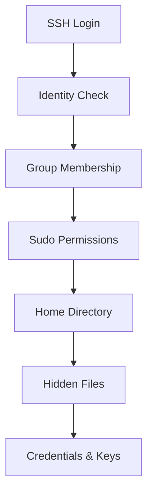

# Exercise L2.2: SSH User Discovery

## Before You Begin

- Confirm your VPN connection to the lab environment is active
- Open a terminal window with SSH client available
- Complete Exercise L2.1 before starting; the techniques here build on that foundation

## Scenario

Your penetration test for **FinanceCorp** continues. **James Mitchell** has provided a second set of credentials belonging to an employee account: `jmitchell:Finance2024#`. James wants to know what damage an attacker could cause if a single employee account were compromised. Your task is to authenticate with these credentials and determine what access, privileges, and sensitive data the account can reach.

## Your Objectives

- Authenticate to the target as `jmitchell` using SSH
- Determine the user's identity, group memberships, and role on the system
- Explore the home directory for sensitive files, including hidden entries
- Check sudo permissions to identify privilege escalation paths

---

## Background: Post-Authentication User Enumeration

Gaining a shell on a target system is only the beginning. The first minutes after login should follow a structured enumeration process to answer three questions:

1. **Who am I?**: Determine the user's identity, numeric user ID (UID), and group memberships.

2. **What can I do?**: Check whether the account has sudo privileges. A user with unrestricted sudo access effectively has root-level control.

3. **What can I find?**: Explore the home directory for configuration files, credentials, SSH keys, and command history.



## Tool Primer: User Enumeration Commands

The following Linux commands map a user's identity and access level.

| Command | Purpose | Example Output |
|---------|---------|----------------|
| `whoami` | Display current username | `jmitchell` |
| `id` | Show UID, GID, and all groups | `uid=1001(jmitchell) gid=1001...` |
| `groups` | List group memberships | `jmitchell sudo finance` |
| `sudo -l` | List allowed sudo commands | `(ALL : ALL) ALL` |
| `ls -la` | List all files including hidden | `.ssh/ .bash_history ...` |

**Reading the `id` output:**

```
uid=1001(jmitchell) gid=1001(jmitchell) \
  groups=1001(jmitchell),27(sudo),1005(finance)
```

- **uid**: the numeric user ID (root is always 0)
- **gid**: the primary group ID
- **groups**: all group memberships; `sudo` is significant

---

## Walkthrough

### Step 1: Launch the Exercise

Navigate to **Exercises** then **Linux** then **Level 2**. Locate Exercise L2.2, click **Launch**, and wait for the status to show **Running**. Note the **target IP** displayed on the lab panel.

### Step 2: Authenticate as jmitchell

!!! kali "Authenticate as the employee account"
    Connect to the target using the employee credentials. Replace `<target_ip>` with the address shown on the lab panel.

    ```bash
    ssh jmitchell@<target_ip>
    ```

    When prompted, enter the password below. A successful login drops you into the `jmitchell` home directory on the target.

    ```
    Finance2024#
    ```

### Step 3: Identify Your User Context

!!! target "Establish your user context"
    Run the following commands inside the SSH session to establish who you are on the system.

    ```
    whoami
    ```

    Now retrieve the full identity details:

    ```
    id
    ```

    Expected output:

    ```
    uid=1001(jmitchell) gid=1001(jmitchell)
      groups=1001(jmitchell),27(sudo),1005(finance)
    ```

    Note the `sudo` group membership; any user in that group can potentially execute commands as root.

### Step 4: Check Sudo Permissions

!!! target "Enumerate sudo permissions"
    Determine what commands this account can run with elevated privileges.

    ```
    sudo -l
    ```

    Enter the password `Finance2024#` when prompted. Expected output:

    ```
    User jmitchell may run the following commands
      on fc-prod-web01:
        (ALL : ALL) ALL
    ```

    The `(ALL : ALL) ALL` entry means `jmitchell` can run any command as any user; full root access.

### Step 5: Explore the Home Directory

!!! target "List the home directory"
    List all files in the home directory, including hidden entries.

    ```
    ls -la ~
    ```

    Review the output carefully. Look for:

    - **`.bash_history`**: contains previously executed commands
    - **`.ssh/`**: may contain SSH keys for lateral movement
    - **Configuration files**: may store database credentials or API keys

    Read the bash history with `cat ~/.bash_history` to see what the account has run before.

    ```
    cat ~/.bash_history
    ```

### Step 6: Locate Database Credentials

!!! target "Read the database config file"
    Look for configuration files in the home directory and read the one holding database settings.

    ```
    cat ~/db_config.txt
    ```

    Expected output reveals database connection details:

    ```
    # Database Configuration
    DB_HOST=localhost
    DB_USER=finance_admin
    DB_PASS=F1nanc3_DB_2024
    DB_NAME=financecorp_prod
    ```

    Record the database username and password; these credentials may also work against the database service itself.

### Step 7: Discover SSH Keys

!!! target "Enumerate the .ssh directory"
    Check for SSH keys that could allow lateral movement to other systems.

    ```
    ls -la ~/.ssh/
    ```

    Expected output:

    ```
    total 16
    drwx------ 2 jmitchell jmitchell 4096 ...
    -rw------- 1 jmitchell jmitchell 2602 ... id_rsa
    -rw-r--r-- 1 jmitchell jmitchell  571 ... id_rsa.pub
    -rw-r--r-- 1 jmitchell jmitchell  222 ... known_hosts
    ```

    A private key (`id_rsa`) is present. Check the `known_hosts` file to see which servers this account has connected to previously.

    ```
    cat ~/.ssh/known_hosts
    ```

    Every entry in `known_hosts` is a potential lateral movement target.

### Step 8: Capture the Flag

!!! target "Read the flag file"
    The flag is stored in the user directory file `user_info.txt` in the home directory. Read it.

    ```
    cat ~/user_info.txt
    ```

    The file prints a short directory header followed by the flag:

    ```
    FinanceCorp User Directory
    Flag: OCR{________}
    ```

    Record the `OCR{...}` value for submission.

### Record Your Findings

> **User Identity**
>
> | Field | Value |
> |-------|-------|
> | Username | __________ |
> | UID | __________ |
> | Primary Group | __________ |
> | All Groups | __________ |
> | Sudo Access | Full / Limited / None |
>
> **Discovered Credentials**
>
> | Source File | Username | Password |
> |------------|----------|----------|
> | __________ | __________ | __________ |
>
> **SSH Keys**
>
> | Key Type | File Path | Known Hosts |
> |----------|-----------|-------------|
> | __________ | __________ | __________ |
>
> **How to submit:** enter the flag on the exercise page exactly as you recovered it, keeping the `OCR{...}` wrapper.
>
> **Flag:** `OCR{____________}`

### Step 9: Record the Flag

Copy the flag in the `OCR{...}` format and submit it on the lab platform in the designated field to complete Exercise L2.2.

!!! target "Close the SSH session"
    Disconnect from the target by running `exit`.

    ```
    exit
    ```

---

## Analysis Questions

**1. Why is membership in the `sudo` group a critical finding during a penetration test?**

??? note "Reveal Answer"

    Membership in the `sudo` group allows a user to execute commands as root. An attacker who compromises an account with unrestricted sudo access can escalate to full administrative control; reading any file, modifying system configurations, and accessing all data without needing to exploit a software vulnerability.

**2. How could an attacker use a private SSH key found in a compromised account's `.ssh` directory?**

??? note "Reveal Answer"

    The attacker can use the private key to authenticate to any system where the corresponding public key is listed in `authorized_keys`. Combined with entries in `known_hosts`, which reveal servers the account has connected to before, the attacker can move laterally across the network without needing additional passwords.

**3. What hardening steps would prevent the findings discovered in this exercise?**

??? note "Reveal Answer"

    Administrators should remove unnecessary sudo privileges and follow the principle of least privilege. Database credentials should be stored in encrypted vaults rather than plaintext files. SSH keys should be protected with passphrases, and `known_hosts` entries should be hashed.

---

## Key Takeaways

- **User enumeration is the first post-login action**: running `whoami`, `id`, and `groups` immediately establishes your access level and potential escalation paths
- **Sudo privileges define the ceiling of an account's power**: unrestricted sudo access transforms a standard user compromise into full system control
- **Hidden files contain high-value data**: `.bash_history`, `.ssh/`, and dotfiles frequently store credentials, keys, and operational history
- **Database credentials in plaintext** represent a critical vulnerability that extends the compromise beyond the operating system into application data
- **SSH keys enable lateral movement**: a single private key can unlock access to multiple systems across the network
- **The `known_hosts` file maps the network** from the target's perspective, revealing systems that the compromised account has previously accessed
