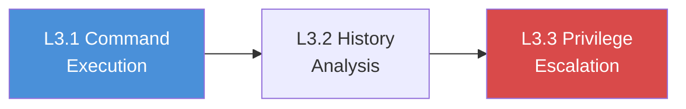

# Chapter L3: SSH Post-Exploitation & Privilege Escalation

## Why Post-Exploitation Matters

In Chapter L2, you authenticated to an SSH server, enumerated your user's identity, and explored the file system. You opened the door and looked around. But a penetration test does not end at initial access; it begins there.

Post-exploitation is the phase where you extract intelligence from the compromised system, map the internal environment, and escalate your privileges to gain deeper control. An attacker with a low-privilege shell can often read sensitive configuration files, harvest credentials from command history, and exploit misconfigured permissions to become root. Demonstrating that progression is what turns a finding of "weak SSH password" into a finding of "full system compromise."

## What You Will Learn

The three labs in this chapter guide you through the SSH post-exploitation workflow:

- **Execute** system enumeration commands to map the target's architecture, network topology, and running services
- **Analyze** shell history files to extract leaked credentials, API keys, and internal infrastructure details
- **Escalate** privileges by exploiting misconfigured sudo permissions to read files restricted to root

## What Is Post-Exploitation?

Post-exploitation refers to everything an attacker does after gaining initial access to a system. Where reconnaissance asks "what is running?" and exploitation asks "how do I get in?", post-exploitation asks "what can I do now that I am inside?"

The phase typically involves three activities:

- **Situational awareness**: understanding the system, its role, and its network position
- **Credential harvesting**: collecting passwords, keys, and tokens for lateral movement
- **Privilege escalation**: moving from a low-privilege account to administrative or root access

Each of these activities feeds the next. System enumeration reveals where credentials might be stored. Harvested credentials unlock new accounts. Elevated privileges expose data that was previously invisible.

## The Post-Exploitation Workflow

The three labs follow a natural escalation path:

| Lab  | Phase                | Core Skill                          |
|------|----------------------|-------------------------------------|
| L3.1 | Command Execution    | System enumeration and recon        |
| L3.2 | History Analysis     | Credential harvesting from history  |
| L3.3 | Privilege Escalation | Exploiting sudo misconfigurations   |

## Before You Start

Before beginning the labs in this chapter, confirm the following:

- [ ] Completed all labs in Chapter L2 (SSH Authentication & Discovery)
- [ ] Connected to the lab environment VPN
- [ ] Terminal open with SSH client available (verify with `ssh -V`)
- [ ] Notebook ready to record credentials, flags, and findings
- [ ] Familiar with basic Linux commands: `ls`, `cat`, `grep`, `sudo`
