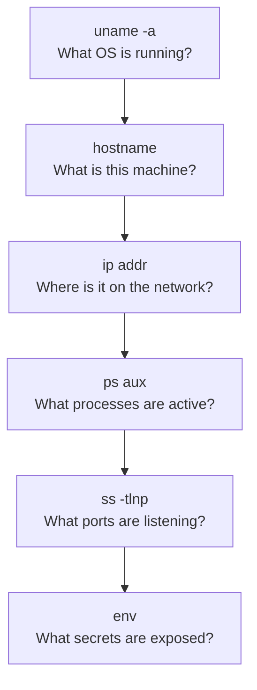

# Exercise L3.1: SSH Command Execution

## Before You Begin

Chapter L2 covered SSH authentication and file system exploration. You logged in, identified your user, and browsed directories. Now you move into active post-exploitation; running commands that reveal the target's architecture, network position, and operational secrets.

Make sure you have:

- [ ] Completed all Chapter L2 labs
- [ ] VPN connected and verified
- [ ] SSH client available in your terminal
- [ ] Notebook ready for recording findings

## Scenario

FinanceCorp has engaged your team for a penetration test of their internal infrastructure. Your colleague James Mitchell, the project lead, has obtained credentials for a system administration account on a Linux server. He wants you to demonstrate the full scope of information an attacker could gather from a single authenticated SSH session. The goal is to show FinanceCorp's leadership how much intelligence a compromised account exposes; system details, network topology, running services, and any secrets stored in the environment.

## Your Objectives

- Authenticate to the target via SSH using the provided credentials
- Run system enumeration commands to map the host's identity and configuration
- Identify running processes and listening services
- Discover sensitive data stored in environment variables
- Execute a custom administration script found on the system

---

## Background: System Enumeration

Once an attacker has shell access, the first priority is situational awareness. A handful of standard Linux commands reveal nearly everything about the host: what operating system it runs, where it sits on the network, what services are active, and what secrets the environment holds.

Each command answers a specific question:



Environment variables deserve special attention. Developers and administrators frequently store database connection strings, API keys, and configuration secrets in environment variables. These values persist in the shell session and are readable by anyone who can access that session.

## Tool Primer: Linux Enumeration Commands

The table below lists every command you will run inside the SSH session. Each one reveals a different layer of the target's configuration.

| Command | Purpose |
|---------|---------|
| `uname -a` | Display kernel version, architecture, hostname |
| `hostname` | Print the system's hostname |
| `ip addr` | Show all network interfaces and IP addresses |
| `ps aux` | List all running processes with user ownership |
| `ss -tlnp` | Show TCP sockets in listening state with process info |
| `env` | Print all environment variables for the session |

**Key flags for `ss`:**

| Flag | Meaning |
|------|---------|
| `-t` | Show TCP sockets only |
| `-l` | Show listening sockets only |
| `-n` | Display numeric port numbers (skip DNS resolution) |
| `-p` | Show the process using each socket |

**Key flags for `ps`:**

| Flag | Meaning |
|------|---------|
| `a` | Show processes from all users |
| `u` | Display user/owner column |
| `x` | Include processes not attached to a terminal |

---

## Walkthrough

### Step 1: Launch the Exercise and Note Your Target

Navigate to **Exercises** then **Linux** then **Level 2**, click **Launch**, wait for **Running**, and note the **target IP** displayed on the launch page.

### Step 2: Authenticate via SSH

!!! kali "Authenticate as the sysadmin account"
    Connect to the target using the sysadmin account. Replace `<target_ip>` with the address shown on the launch page.

    ```bash
    ssh sysadmin@<target_ip>
    ```

    When prompted, enter the password: `SysAdmin2024#`

    You should land in the sysadmin user's home directory. All commands from this point forward execute inside the remote SSH session.

### Step 3: Identify the Operating System

!!! target "Gather host identity"
    Gather baseline information about the host.

    ```bash
    uname -a
    ```

    The output displays the kernel name, hostname, kernel version, build date, and architecture. Record the kernel version and architecture; these details determine which exploits and tools are compatible with the target.

    ```bash
    hostname
    ```

    The hostname often reveals the system's role within the organization. A name like `fin-db-prod-01` suggests a production database server, which tells you this is a high-value target.

### Step 4: Map the Network Position

!!! target "Map the network interfaces"
    Determine where the host sits on the network.

    ```bash
    ip addr
    ```

    Look for the IP address assigned to the primary network interface (typically `eth0` or `ens33`). Note any additional interfaces; a host with multiple network interfaces may bridge two network segments, making it a pivot point for reaching otherwise isolated systems.

### Step 5: Enumerate Running Processes

!!! target "List running processes"
    List all active processes on the system.

    ```bash
    ps aux
    ```

    Scan the output for processes running as root, database services (MySQL, PostgreSQL), web servers (Apache, Nginx), and any custom applications. Each running service represents a potential attack surface. Pay attention to the user column; processes running as root are especially interesting because compromising them grants root-level access.

### Step 6: Identify Listening Services

!!! target "Enumerate listening ports"
    Check which ports are open and listening for connections.

    ```bash
    ss -tlnp
    ```

    Compare the listening ports against the running processes from the previous step. Any port that accepts connections from the network is reachable by other hosts; and potentially by attackers who pivot through the compromised machine.

### Step 7: Inspect Environment Variables

!!! target "Dump environment variables"
    Print all environment variables for the current session.

    ```bash
    env
    ```

    Read through the output carefully. Environment variables may contain database connection strings, API tokens, internal URLs, and security flags. Developers often store secrets in environment variables as a convenience, but anyone with shell access can read them.

    Look for variables with names like `DB_PASSWORD`, `API_KEY`, `SECRET`, or `FLAG`. Record every sensitive value you find.

### Step 8: Execute the Custom Admin Script

!!! target "Run the custom admin script"
    During your enumeration, James Mitchell flagged a custom script that FinanceCorp's administrators deployed for system health checks. Run it now.

    ```bash
    /usr/local/bin/system-check
    ```

    Review the output for any information the script reveals; system health data, configuration details, or additional credentials. Custom scripts often contain hardcoded paths, credentials, or references to other internal systems that standard enumeration commands would not surface.

### Step 9: Exit the Session

!!! target "Close the SSH session"
    Once you have recorded all findings, close the SSH connection.

    ```bash
    exit
    ```

---

### Record Your Findings

> Fill in the system enumeration results below.
>
> ```
> Kernel version:
> Architecture:
> Hostname:
> Primary IP address:
> Additional interfaces:
> ```
>
> | Category | Key Findings |
> |----------|-------------|
> | Running processes (notable) | |
> | Listening ports | |
> | Environment variable secrets | |
> | Admin script output | |
>
> **How to submit:** enter the flag on the exercise page exactly as you recovered it, keeping the `OCR{...}` wrapper.
>
> **Flag:** `OCR{_______________}`

### Step 10: Record the Flag

Enter the flag discovered during environment variable inspection, in `OCR{...}` format, on the submission page.

---

## Analysis Questions

**1. Why are environment variables a security risk on a compromised system?**

??? note "Reveal Answer"

    Environment variables are readable by any process running in the user's session. When developers store database passwords, API keys, or tokens as environment variables, a single compromised account exposes all of those secrets. Unlike files with restricted permissions, environment variables have no access control beyond the session itself.

**2. An attacker discovers that the target host has two network interfaces on different subnets. What does that mean for the engagement?**

??? note "Reveal Answer"

    A dual-homed host bridges two network segments. The attacker can use the compromised machine as a pivot point to reach hosts on the second subnet that are not directly accessible from the attacker's position. Network segmentation designed to isolate sensitive systems becomes ineffective when a bridging host is compromised.

**3. Why should penetration testers check for custom scripts in directories like `/usr/local/bin/`?**

??? note "Reveal Answer"

    Custom scripts are written by administrators and developers, not security teams. They often contain hardcoded credentials, internal hostnames, database connection strings, and references to other systems. Standard enumeration tools do not check for custom scripts, making manual inspection of common script directories an essential post-exploitation step.

---

## Key Takeaways

- **System enumeration is the first post-exploitation action**: before escalating or pivoting, you must understand the host
- **Environment variables frequently contain secrets**: database passwords, API keys, and tokens are commonly stored there without protection
- **Running processes reveal the attack surface**: every service is a potential target for further exploitation
- **Listening ports map the network exposure**: compare internal listeners against firewall rules to find gaps
- **Custom admin scripts are goldmines**: they often contain hardcoded credentials and references that standard tools miss
- **Record everything methodically**: the intelligence gathered here feeds every subsequent phase of the engagement
