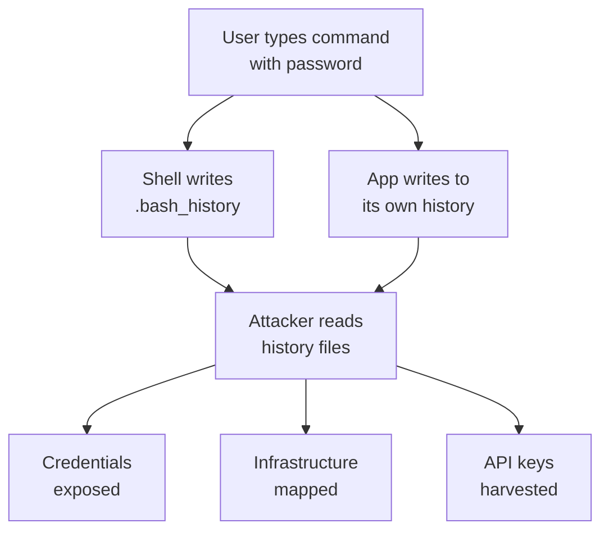

# Exercise L3.2: SSH History Analysis

## Before You Begin

Exercise L3.1 demonstrated how system enumeration commands reveal architecture, network topology, and environment secrets. Now you shift from active enumeration to passive intelligence gathering; reading the command history that previous users left behind.

Make sure you have:

- [ ] Completed Exercise L3.1 (SSH Command Execution)
- [ ] VPN connected and verified
- [ ] SSH client available in your terminal
- [ ] Notebook ready for recording credentials and infrastructure details

## Scenario

The FinanceCorp engagement continues. James Mitchell has identified a developer account on the same Linux server. Developers interact with databases, APIs, version control systems, and internal services daily; and their command history records every interaction. Your task is to log in as the developer, analyze all available history files, and extract every credential, key, and infrastructure detail that the history reveals. James needs this intelligence to plan lateral movement across FinanceCorp's network.

## Your Objectives

- Authenticate to the target using the developer account credentials
- Analyze `.bash_history` for leaked credentials and infrastructure references
- Search additional history files (`.mysql_history`, `.python_history`) for sensitive data
- Catalog all discovered credentials, API keys, and internal server addresses
- Document the full scope of information exposed through command history

---

## Background: Why History Files Leak Secrets

Every command typed in a Bash shell is recorded in `~/.bash_history` by default. When a user types a password on the command line; whether connecting to a database, authenticating to an API, or passing credentials to a script; that password is permanently written to disk.

The problem extends beyond Bash. Many applications maintain their own history files:

| History File | Application | What It Records |
|-------------|-------------|-----------------|
| `~/.bash_history` | Bash shell | Every command typed in the terminal |
| `~/.mysql_history` | MySQL client | Every SQL query and connection command |
| `~/.python_history` | Python REPL | Every Python statement executed interactively |
| `~/.psql_history` | PostgreSQL client | Every psql command and query |
| `~/.node_repl_history` | Node.js REPL | Every JavaScript statement executed |



History files persist across sessions. Even if a user changes a password, the old password remains in the history file unless someone explicitly clears it. Most users never think to do so.

## Tool Primer: History File Analysis Commands

The commands below are your primary tools for extracting intelligence from history files. All of these run inside the SSH session on the target.

| Command | Purpose |
|---------|---------|
| `cat ~/.bash_history` | Display the full Bash command history |
| `cat ~/.mysql_history` | Display the MySQL client history |
| `cat ~/.python_history` | Display the Python REPL history |
| `grep -i "pass" ~/.bash_history` | Search history for password references |
| `grep -i "key\|token\|secret" ~/.bash_history` | Search for API keys and tokens |
| `grep -i "ssh\|scp\|mysql\|redis" ~/.bash_history` | Find connections to other services |
| `grep -oE "[0-9]+\.[0-9]+\.[0-9]+\.[0-9]+" ~/.bash_history` | Extract all IP addresses from history |

**Key `grep` flags:**

| Flag | Meaning |
|------|---------|
| `-i` | Case-insensitive matching |
| `-n` | Show line numbers alongside matches |
| `-oE` | Print only the matched portion (extended regex) |
| `\|` | OR operator; match any of the listed patterns |

---

## Walkthrough

### Step 1: Launch the Exercise and Note Your Target

Navigate to **Exercises** then **Linux** then **Level 2**, click **Launch**, wait for **Running**, and note the **target IP** displayed on the launch page.

### Step 2: Authenticate as the Developer

!!! kali "Authenticate as the developer account"
    Connect to the target using the developer account. Replace `<target_ip>` with the address shown on the launch page.

    ```bash
    ssh developer@<target_ip>
    ```

    When prompted, enter the password: `DevAccess2024#`

    You should land in the developer's home directory. All commands from this point forward execute inside the remote SSH session.

### Step 3: List Available History Files

!!! target "List history files in the home directory"
    Before reading individual files, check what history files exist in the home directory.

    ```bash
    ls -la ~/
    ```

    Look for hidden files (those starting with a dot) that end in `_history` or `history`. You should see `.bash_history` along with application-specific history files like `.mysql_history` and `.python_history`.

### Step 4: Analyze Bash History

!!! target "Read the Bash history"
    Read the full Bash history to understand what the developer has been doing on the system.

    ```bash
    cat ~/.bash_history
    ```

    Read through the output line by line. Pay attention to commands that include passwords, connection strings, or references to other systems. Developers frequently pass credentials as command-line arguments when connecting to databases, APIs, and remote servers.

### Step 5: Search for Credentials in Bash History

!!! target "Grep history for passwords"
    Use targeted grep searches to isolate password-related commands.

    ```bash
    grep -in "pass\|password\|pwd" ~/.bash_history
    ```

    Record every credential you find. Look for patterns like `mysql -u username -p'password'`, `export DB_PASSWORD=`, and `curl` commands with authentication headers.

### Step 6: Search for API Keys and Tokens

!!! target "Grep history for keys and tokens"
    Hunt for API keys, tokens, and secrets.

    ```bash
    grep -in "key\|token\|secret\|api" ~/.bash_history
    ```

    API keys and tokens grant access to external services; cloud platforms, payment processors, CI/CD (Continuous Integration/Continuous Delivery) pipelines, and version control systems. A leaked GitHub personal access token, for example, grants full access to the developer's repositories.

### Step 7: Extract Internal IP Addresses

!!! target "Extract IP addresses from history"
    Map the internal infrastructure by pulling every IP address from the history.

    ```bash
    grep -oE "[0-9]+\.[0-9]+\.[0-9]+\.[0-9]+" ~/.bash_history \
      | sort -u
    ```

    Each unique IP address represents another host the developer has interacted with. Cross-reference these against any hostnames or service names found in the same commands to build an internal network map.

### Step 8: Analyze MySQL History

!!! target "Read the MySQL client history"
    Read the MySQL client history for database credentials and queries.

    ```bash
    cat ~/.mysql_history
    ```

    MySQL history records every command typed in the MySQL client, including connection commands with embedded passwords and queries against sensitive tables. Look for `GRANT` statements, `CREATE USER` commands, and `SELECT` queries against user or credential tables.

### Step 9: Analyze Python History

!!! target "Read the Python REPL history"
    Check the Python REPL (Read-Eval-Print Loop) history for scripts and configurations.

    ```bash
    cat ~/.python_history
    ```

    Developers often test database connections, API calls, and configuration parsing in the Python REPL. These test commands frequently contain hardcoded credentials and endpoint URLs.

### Step 10: Compile a Connection Map

!!! target "Grep history for service connections"
    Search for SSH, SCP, and service connection commands to understand how the developer moves through the network.

    ```bash
    grep -in "ssh\|scp\|mysql\|redis\|jenkins" ~/.bash_history
    ```

    Each connection command reveals a service, a credential, and a destination host. Together, they form a map of the developer's access across FinanceCorp's infrastructure.

### Step 11: Exit the Session

!!! target "Close the SSH session"
    Once you have recorded all findings, close the SSH connection.

    ```bash
    exit
    ```

---

### Record Your Findings

> Catalog every credential, key, and infrastructure detail below.
>
> **Database Credentials:**
>
> | Service | Username | Password |
> |---------|----------|----------|
> | MySQL | devuser | |
> | MySQL | root | |
>
> **API Keys and Tokens:**
>
> | Type | Value |
> |------|-------|
> | API Key | |
> | GitHub Token | |
>
> **Service Credentials:**
>
> | Service | Username | Password |
> |---------|----------|----------|
> | Jenkins | | |
> | Redis | (auth only) | |
>
> **Internal Servers Discovered:**
>
> | IP Address | Inferred Role |
> |-----------|---------------|
> | 10.10.10.50 | |
> | 10.10.10.100 | |
> | 10.10.10.102 | |
> | 10.10.10.105 | |
> | 10.10.10.110 | |
>
> **How to submit:** enter the flag on the exercise page exactly as you recovered it, keeping the `OCR{...}` wrapper.
>
> **Flag:** `OCR{_______________}`

### Step 12: Record the Flag

Enter the flag discovered during history analysis in the format `OCR{...}` on the submission page.

---

## Analysis Questions

**1. A developer argues that storing passwords in environment variables is safe because "they are only in memory." How does command history disprove that argument?**

??? note "Reveal Answer"

    When a developer runs `export DB_PASSWORD=secret123` in the terminal, that command is written to `.bash_history` on disk. The password persists in plaintext in the history file even after the session ends, even after the environment variable is unset, and even after the password is changed. Command history turns "in-memory" secrets into permanent plaintext records on the filesystem.

**2. You found both MySQL root credentials and a GitHub personal access token in the history. Which finding has greater impact, and why?**

??? note "Reveal Answer"

    The GitHub token likely has greater impact. MySQL root credentials grant access to databases on FinanceCorp's internal servers, but the GitHub token may grant access to source code repositories containing application logic, additional credentials, deployment configurations, and intellectual property. A personal access token can also be used from anywhere; not just from within the internal network; making it a higher-severity exposure.

**3. What steps should FinanceCorp take to prevent credential leakage through history files?**

??? note "Reveal Answer"

    FinanceCorp should enforce credential managers and environment-specific secret stores (like HashiCorp Vault) rather than command-line credential passing. They should configure `.bashrc` to exclude sensitive patterns from history using `HISTIGNORE`. They should set `HISTCONTROL=ignorespace` so commands prefixed with a space are not recorded. Periodic audits of history files on servers and mandatory history clearing during decommissioning would reduce exposure of legacy credentials.

---

## Key Takeaways

- **Shell history files are gold mines**: every command a user has typed is recorded on disk by default, including passwords and tokens
- **Credential harvesting extends beyond Bash**: MySQL, Python, PostgreSQL, and Node.js all maintain separate history files that contain their own secrets
- **API keys and tokens enable lateral movement**: a GitHub token or Jenkins credential opens entirely new attack surfaces beyond the compromised host
- **IP addresses in history map the internal network**: each connection command reveals another host and its role in the infrastructure
- **Grep is the primary extraction tool**: targeted searches for passwords, keys, tokens, and IP addresses surface intelligence faster than reading history line by line
- **Prevention requires operational discipline**: secret managers, HISTIGNORE rules, and periodic audits are all necessary to reduce history file exposure
