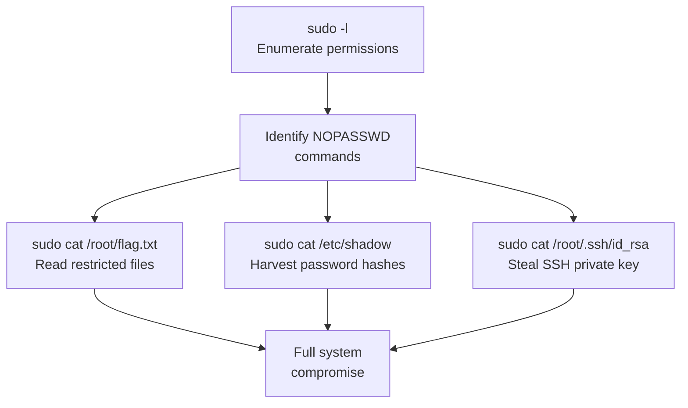

# Exercise L3.3: SSH Privilege Escalation

## Before You Begin

Exercises L3.1 and L3.2 covered system enumeration and credential harvesting from a compromised account. Both of those activities operated within the permissions of the logged-in user. Now you take the final step: escalating from a low-privilege account to root-level access by exploiting misconfigured sudo permissions.

Make sure you have:

- [ ] Completed Exercises L3.1 and L3.2
- [ ] VPN connected and verified
- [ ] SSH client available in your terminal
- [ ] Notebook ready for recording findings

## Scenario

James Mitchell has identified a third account on the FinanceCorp Linux server; a backup service account. Backup accounts often receive elevated permissions so they can read files across the system for archival purposes. James suspects that the sudo configuration on the server is overly permissive, granting the backup account access to commands that an attacker could abuse to read any file on the system, including root-owned secrets. Your task is to verify those permissions and demonstrate exactly how far a misconfigured sudo policy can take an attacker.

## Your Objectives

- Authenticate to the target using the backup account credentials
- Enumerate sudo permissions granted to the backup user
- Exploit NOPASSWD sudo rules to read root-owned files
- Extract the root flag, shadow file contents, and root SSH private key
- Document the complete privilege escalation chain

---

## Background: Sudo Misconfigurations

The `sudo` command allows a permitted user to execute a command as another user; typically root. System administrators configure sudo policies in `/etc/sudoers`, specifying which users can run which commands and whether a password is required.

A properly configured sudoers entry looks like this:

```
admin ALL=(ALL:ALL) ALL
```

An improperly configured entry looks like this:

```
backup ALL=(root) NOPASSWD: /usr/bin/cat
```

The second entry grants the backup user the ability to run `cat` as root without entering a password. On the surface, allowing `cat` seems harmless; it just reads files. But `cat` as root can read every file on the system, including:

- `/etc/shadow`: hashed passwords for all user accounts
- `/root/.ssh/id_rsa`: the root user's private SSH key
- `/root/flag.txt`: any file in the root home directory



The attack chain is straightforward: enumerate sudo permissions, identify commands that can be run as root without a password, and abuse those commands to access files that should be restricted. The lesson is that granting sudo access to any command that reads, writes, or copies files is equivalent to granting full root access.

## Tool Primer: sudo

The `sudo` command is both the enumeration tool and the exploitation tool in this exercise.

| Command | Purpose |
|---------|---------|
| `sudo -l` | List all sudo permissions for the current user |
| `sudo cat <file>` | Read a file as root |
| `sudo ls <directory>` | List a directory's contents as root |
| `sudo tar cf - <file>` | Archive a file as root (alternative read method) |

**Understanding `sudo -l` output:**

```
User backup may run the following commands on target:
    (root) NOPASSWD: /usr/bin/cat
    (root) NOPASSWD: /bin/ls
    (root) /usr/bin/tar
```

| Field | Meaning |
|-------|---------|
| `(root)` | The command runs as the root user |
| `NOPASSWD:` | No password is required to execute |
| `/usr/bin/cat` | The full path to the permitted command |

Entries without `NOPASSWD` still require the user's own password. Entries with `NOPASSWD` require nothing; just type the command and it executes as root immediately.

---

## Walkthrough

### Step 1: Launch the Exercise and Note Your Target

Navigate to **Exercises** then **Linux** then **Level 2**, click **Launch**, wait for **Running**, and note the **target IP** displayed on the launch page.

### Step 2: Authenticate as the Backup User

!!! kali "Connect over SSH as the backup user"
    Connect to the target using the backup account. The SSH client runs from your attacker Kali; once authenticated, your shell lives on the remote FinanceCorp server.

    ```bash
    ssh backup@<target_ip>
    ```

    When prompted, enter the password: `Backup2024#`

    You should land in the backup user's home directory. All commands from this point forward execute inside the remote SSH session.

### Step 3: Enumerate Sudo Permissions

!!! target "Enumerate sudo permissions for the backup user"
    The first action after landing on any compromised account is to check what sudo permissions are available. Run the command inside the SSH session on the target.

    ```bash
    sudo -l
    ```

    Read the output carefully. You should see three entries:

    - `(root) NOPASSWD: /usr/bin/cat`: read any file as root, no password needed
    - `(root) NOPASSWD: /bin/ls`: list any directory as root, no password needed
    - `(root) /usr/bin/tar`: archive files as root, password required

    The two NOPASSWD entries are the most immediately exploitable. The `cat` permission alone is enough to read every file on the system as root.

### Step 4: Browse the Root Home Directory

!!! target "List the root home directory as root"
    Before reading specific files, survey what exists in the root user's home directory. The `sudo ls` runs as root on the target despite your low-privilege login.

    ```bash
    sudo ls -la /root/
    ```

    Without sudo, the backup user cannot even list the contents of `/root/` because the directory permissions restrict access to the root user. With `sudo ls`, you bypass that restriction entirely.

    Record every file and directory you see. Pay attention to hidden files (those starting with a dot), which often contain SSH keys, configuration files, and scripts.

### Step 5: Read the Root Flag

!!! target "Read the root flag file"
    Use sudo cat to read the flag file from the root home directory on the target.

    ```bash
    sudo cat /root/flag.txt
    ```

    Record the flag. Under normal permissions, only root can read files in `/root/`. The misconfigured sudo entry for `cat` eliminates that boundary completely.

### Step 6: Extract Password Hashes from /etc/shadow

!!! target "Dump /etc/shadow password hashes"
    The `/etc/shadow` file contains hashed passwords for every user account on the system. Only root can read it, so use the NOPASSWD `cat` rule on the target.

    ```bash
    sudo cat /etc/shadow
    ```

    Each line follows the format:

    ```
    username:$algorithm$salt$hash:last_change:min:max:warn:inactive:expire
    ```

    The hash field contains the password hash that can be cracked offline using tools like John the Ripper or Hashcat. Record the entries for accounts you have already compromised (sysadmin, developer, backup) and any additional accounts you discover.

### Step 7: Steal the Root SSH Private Key

!!! target "Locate and read the root SSH private key"
    Check whether the root user has an SSH private key on the target.

    ```bash
    sudo ls -la /root/.ssh/
    ```

    If an `id_rsa` file exists, read it.

    ```bash
    sudo cat /root/.ssh/id_rsa
    ```

    A root SSH private key is the highest-value credential on the system. With it, an attacker can authenticate as root to any server that trusts that key; without knowing the root password. Copy the full key contents (from `-----BEGIN` to `-----END`) and record them.

### Step 8: Verify the Escalation Path

!!! target "Read the sudoers policy file"
    Confirm the full scope of access by reading one more restricted file on the target.

    ```bash
    sudo cat /etc/sudoers
    ```

    The sudoers file reveals sudo policies for every user on the system; not just the backup account. Other users may have their own misconfigurations that enable additional attack paths.

### Step 9: Exit the Session

!!! target "Close the SSH session"
    Once you have recorded all findings, close the SSH connection to the target.

    ```bash
    exit
    ```

---

### Record Your Findings

> Document the full privilege escalation chain below.
>
> **Sudo Permissions Discovered:**
>
> | Command | NOPASSWD | Risk |
> |---------|----------|------|
> | `/usr/bin/cat` | Yes | |
> | `/bin/ls` | Yes | |
> | `/usr/bin/tar` | No | |
>
> **Sensitive Files Read:**
>
> | File | Contents Summary |
> |------|-----------------|
> | `/root/flag.txt` | |
> | `/etc/shadow` | |
> | `/root/.ssh/id_rsa` | |
> | `/etc/sudoers` | |
>
> **Password Hashes Extracted:**
>
> | Username | Hash Algorithm | Hash (first 20 chars) |
> |----------|---------------|----------------------|
> | root | | |
> | sysadmin | | |
> | developer | | |
> | backup | | |
>
> **How to submit:** enter the flag on the exercise page exactly as you recovered it, keeping the `OCR{...}` wrapper.
>
> **Flag:** `OCR{_______________}`

### Step 10: Record the Flag

Enter the flag from `/root/flag.txt` in the format `OCR{...}` on the submission page.

---

## Analysis Questions

**1. The backup account was only given sudo access to `cat` and `ls`. Why is that equivalent to full root access?**

??? note "Reveal Answer"

    The `cat` command can read any file on the system when run as root. That includes `/etc/shadow` (password hashes for offline cracking), `/root/.ssh/id_rsa` (root SSH key for direct authentication), `/etc/sudoers` (sudo policies for all users), and any application configuration file containing credentials. While `cat` cannot write or execute files, the ability to read every file on the system exposes enough credentials and keys to achieve full root access through other means.

**2. How could FinanceCorp restrict the backup account's sudo permissions without breaking backup functionality?**

??? note "Reveal Answer"

    FinanceCorp should limit `cat` and `ls` access to specific directories that the backup process requires; for example, `(root) NOPASSWD: /usr/bin/cat /var/backups/*` instead of a blanket `/usr/bin/cat`. They should also consider using a dedicated backup tool (like `rsync` or `borgbackup`) that runs as a service account with restricted filesystem access, rather than granting general-purpose commands sudo privileges. Removing NOPASSWD where possible and requiring password entry adds another barrier even if the account is compromised.

**3. An attacker extracts the root SSH private key. What is the impact beyond the current server?**

??? note "Reveal Answer"

    The root SSH private key can authenticate as root on any server that has the corresponding public key in its `/root/.ssh/authorized_keys` file. In many organizations, the same root key pair is deployed across multiple servers for administrative convenience. A single stolen private key can grant root access to dozens or hundreds of hosts. The attacker can also use the key for lateral movement without generating password-based authentication events in logs, making detection significantly harder.

---

## Key Takeaways

- **Always check `sudo -l` first**: sudo misconfigurations are one of the most common and impactful privilege escalation vectors on Linux
- **NOPASSWD rules eliminate the last barrier**: if no password is required, a compromised account immediately gains the permitted root-level action
- **File-reading commands as root equal full compromise**: `cat`, `less`, `head`, `tail`, and `vim` can all read `/etc/shadow` and SSH keys when run with sudo
- **`/etc/shadow` enables offline password cracking**: extracted hashes can be cracked with John the Ripper or Hashcat without triggering any alerts on the target
- **Root SSH keys unlock lateral movement**: a single private key may grant root access across the entire infrastructure
- **Least privilege is the defense**: sudo permissions should be scoped to specific files and directories, never to unrestricted commands
