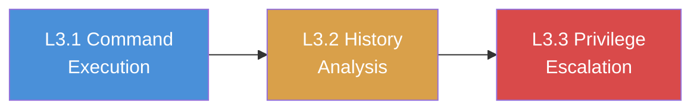

# Chapter L3: Review

## What You Learned

Across three labs, you executed a complete post-exploitation workflow against a FinanceCorp Linux server. Starting with authenticated command execution, you mapped the system's architecture, network position, and running services. You then pivoted to passive intelligence gathering, extracting credentials, API keys, and infrastructure details from shell history files. Finally, you exploited misconfigured sudo permissions to escalate from a low-privilege backup account to root-level file access.

Each phase built on the one before it. System enumeration in Exercise L3.1 revealed the environment and its secrets. History analysis in Exercise L3.2 harvested credentials that map FinanceCorp's internal network. Privilege escalation in Exercise L3.3 demonstrated that a single misconfigured sudoers entry can collapse the entire security boundary between a restricted user and full root access.

The three accounts you compromised; sysadmin, developer, and backup; represent common roles in enterprise Linux environments. Each role exposed a different class of vulnerability: environment variable secrets, history file leakage, and sudo misconfigurations. Together, they paint a picture of systemic security failures that a real penetration test report would flag as critical findings.

## The Progression You Followed

| Lab  | Account   | Technique                | Key Finding                          |
|------|-----------|--------------------------|--------------------------------------|
| L3.1 | sysadmin  | System enumeration       | Environment variables contain secrets |
| L3.2 | developer | History file analysis    | Credentials and API keys in history  |
| L3.3 | backup    | Sudo privilege escalation | NOPASSWD cat reads all root files    |

Each lab demonstrated a different post-exploitation technique, but they share a common thread: once an attacker has shell access, the boundary between "limited user" and "full compromise" is often thinner than administrators realize.

## Self-Assessment

Answer these questions without looking at the answer key below. If you can answer all eight confidently, you have internalized the core skills of this chapter.

**1. What six commands form the core of initial system enumeration after SSH access?**

> &nbsp;

**2. Why are environment variables a security risk, and how do you view them from a shell?**

> &nbsp;

**3. Name three types of history files an attacker should check beyond `.bash_history`.**

> &nbsp;

**4. What grep command extracts all IP addresses from a Bash history file?**

> &nbsp;

**5. What is the first command you should run to check for privilege escalation opportunities via sudo?**

> &nbsp;

**6. Why is `(root) NOPASSWD: /usr/bin/cat` effectively equivalent to full root access?**

> &nbsp;

**7. What three files should an attacker prioritize reading after gaining sudo cat access?**

> &nbsp;

**8. How does a stolen root SSH private key enable lateral movement across an organization?**

> &nbsp;

## Command Cheat Sheet

The table below collects every key command from this chapter into a single reference.

| Command | Purpose | Exercise |
|---------|---------|-----|
| `ssh user@<target_ip>` | Authenticate to the target via SSH | All |
| `uname -a` | Display kernel version and architecture | L3.1 |
| `hostname` | Print the system hostname | L3.1 |
| `ip addr` | Show network interfaces and IP addresses | L3.1 |
| `ps aux` | List all running processes | L3.1 |
| `ss -tlnp` | Show listening TCP ports with process info | L3.1 |
| `env` | Print all environment variables | L3.1 |
| `/usr/local/bin/system-check` | Execute the custom admin script | L3.1 |
| `cat ~/.bash_history` | Read Bash command history | L3.2 |
| `cat ~/.mysql_history` | Read MySQL client history | L3.2 |
| `cat ~/.python_history` | Read Python REPL history | L3.2 |
| `grep -in "pass" ~/.bash_history` | Search history for passwords | L3.2 |
| `grep -in "key\|token" ~/.bash_history` | Search history for API keys and tokens | L3.2 |
| `grep -oE "[0-9]+\.[0-9]+\.[0-9]+\.[0-9]+" ~/.bash_history` | Extract all IP addresses from history | L3.2 |
| `sudo -l` | List sudo permissions for current user | L3.3 |
| `sudo cat /root/flag.txt` | Read a root-owned file via sudo | L3.3 |
| `sudo cat /etc/shadow` | Extract password hashes | L3.3 |
| `sudo cat /root/.ssh/id_rsa` | Read the root SSH private key | L3.3 |
| `sudo ls -la /root/` | List root home directory contents | L3.3 |

## Connect the Dots: What Comes Next

Chapter L3 completes the Linux post-exploitation track. Across Chapters L1 through L3, you progressed from service enumeration to SSH authentication to full post-exploitation and privilege escalation. You can now scan a Linux target, gain authenticated access, gather intelligence, and escalate to root; the complete attack lifecycle on a Linux host.

These Linux skills do not exist in isolation. In real penetration test engagements, Linux and Windows systems coexist on the same network. The credentials you harvest from Linux history files may unlock Windows services. The network topology you map from a Linux pivot point may reveal Windows domain controllers. The password hashes you extract from `/etc/shadow` may match passwords reused on Windows accounts.

The Windows track (Chapters 4-7) covers RDP exploitation, WinRM command execution, MSSQL database attacks, and LDAP enumeration. Consider how the post-exploitation methodology you practiced here; enumerate, harvest, escalate; applies identically to Windows targets, just with different commands and different tools. A penetration tester who can operate across both Linux and Windows environments delivers a thorough assessment that reflects how real attackers move through hybrid networks.

Review your notes from all three chapters. Verify that you can explain the purpose of every command, describe the attack chain from scan to root, and articulate why each finding matters to FinanceCorp's security posture.

---

## Self-Assessment Answer Key

**1.** The six core enumeration commands are `uname -a` (OS and kernel), `hostname` (machine identity), `ip addr` (network position), `ps aux` (running processes), `ss -tlnp` (listening ports), and `env` (environment variables). Together, they provide complete situational awareness of the compromised host.

**2.** Environment variables are readable by any process in the user's shell session. Developers frequently store database passwords, API keys, and connection strings as environment variables. Running `env` displays all of them in plaintext. Any attacker with shell access can read these values immediately.

**3.** Beyond `.bash_history`, attackers should check `.mysql_history` (MySQL client commands and credentials), `.python_history` (Python REPL statements), and `.psql_history` (PostgreSQL client commands). Each application records its own command history independently of Bash.

**4.** `grep -oE "[0-9]+\.[0-9]+\.[0-9]+\.[0-9]+" ~/.bash_history | sort -u`: the `-oE` flag prints only the matched portion using extended regular expressions, and `sort -u` deduplicates the results.

**5.** `sudo -l` lists all sudo permissions for the current user. Running it immediately after gaining access reveals whether privilege escalation through sudo is possible and which commands are available.

**6.** Running `cat` as root can read any file on the filesystem. That includes `/etc/shadow` (password hashes for offline cracking), `/root/.ssh/id_rsa` (root SSH private key for authentication), and `/etc/sudoers` (sudo policies for all users). Reading these files provides enough credentials and keys to achieve full root access through alternative means.

**7.** The three priority files are `/etc/shadow` (password hashes for every account), `/root/.ssh/id_rsa` (root SSH private key for lateral movement), and `/etc/sudoers` (sudo policies that may reveal additional misconfigurations or privileged accounts).

**8.** A root SSH private key authenticates as root on any server that has the matching public key in `/root/.ssh/authorized_keys`. Organizations often deploy the same key pair across multiple servers. A single stolen private key can grant root access to every server that trusts it, enabling lateral movement across the entire infrastructure without generating password-based authentication logs.
