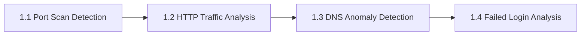

# Chapter N1: Log Analysis

## Why Log Analysis Matters

Network defenders detect attacks by analyzing the evidence attackers leave behind.
Every connection, every query, and every failed login gets recorded somewhere. Logs
are the first line of evidence; firewall logs reveal scanning activity, DNS query
logs expose covert communication channels, authentication logs capture brute-force
attempts, and packet captures preserve the raw traffic for deeper inspection. If you
can read these artifacts, you can reconstruct what happened on the network and
identify the threat before it escalates.

---

## What You Will Learn

The four labs in this chapter teach defensive analysis skills using real log data
from a simulated hospital network (MediCare Regional Hospital). You will:

- Detect port scanning activity in firewall logs
- Extract cleartext credentials from HTTP traffic using tshark
- Identify malware command-and-control communication in DNS logs
- Recognize brute-force attack patterns in SSH authentication logs

---

## The Analyst's Toolkit

You use the following tools throughout this chapter:

- **`curl`**: downloads log files and packet captures from the target server at `<target_ip>`
- **`grep`**, **`awk`**, **`cut`**, **`sort`**, **`uniq`**: the Unix pipeline for parsing and summarizing text-based logs
- **`tshark`**: the command-line packet analyzer (part of the Wireshark project), used when logs are in PCAP format rather than plain text

Wireshark is a well-known GUI tool for packet analysis, but these exercises use tshark
because you access the lab environment remotely via terminal. The display filter
syntax is identical between tshark and Wireshark, so the skills you build here
transfer directly to the graphical interface.

---

## How the Labs Are Structured

Three labs (1.1, 1.3, 1.4) download plain-text log files via curl and analyze them
with grep/awk pipelines. One lab (1.2) downloads a PCAP file via curl and analyzes
it with tshark. All four labs can be completed entirely from the command line.

---

## Lab Overview

| Exercise | Title | Log Type | Primary Tools |
|-----|-------|----------|---------------|
| 1.1 | Port Scan Detection | Firewall log | grep, awk, sort |
| 1.2 | HTTP Traffic Analysis | PCAP file | tshark |
| 1.3 | DNS Anomaly Detection | DNS query log | grep, awk, sort |
| 1.4 | Failed Login Analysis | SSH auth log | grep, awk, sort |

---

## The MediCare Scenario

All labs in this chapter use the same fictional scenario. MediCare Regional
Hospital's security operations center has detected suspicious network activity
across several systems. As a junior security analyst, you are assigned to
investigate specific alerts by analyzing the relevant logs. Each lab presents a
different type of alert; a firewall anomaly, suspicious HTTP traffic, unusual DNS
patterns, or repeated authentication failures. Your job is to examine the evidence,
identify the attacker's actions, and recover the flag that proves you completed the
investigation.

---

## Before You Start

Confirm the following before beginning any lab in this chapter:

- [ ] Logged into the Open Cyber Range platform
- [ ] VPN connected and verified
- [ ] Terminal open (Kali Linux recommended)
- [ ] tshark installed (`tshark --version` to verify)

---

*Proceed to Exercise 1.1; Port Scan Detection when you are ready.*
