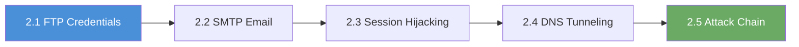

# Chapter N2: PCAP Forensics

## Why PCAP Forensics Matters

Chapter N1 taught you to analyze text-based logs. Those logs capture metadata; who
connected, when, and whether a connection was allowed or denied. But logs do not
capture the actual content of the communication. Packet captures (PCAPs) record
every byte that crossed the wire, giving you the complete picture: what was said,
what was sent, and what was stolen. In incident response, PCAPs are often the most
valuable evidence available.

---

## What You Will Learn

Five labs in this chapter teach protocol-specific packet analysis. You will:

- Extract FTP credentials transmitted in cleartext
- Reconstruct email messages from SMTP traffic and identify data exfiltration
- Detect session hijacking by tracking stolen HTTP cookies across different source IPs
- Decode data hidden in DNS tunnel queries
- Analyze a complete multi-stage attack chain from initial compromise through data theft

---

## How the Labs Work

Every lab in this chapter follows the same pattern:

1. SSH into an analyst workstation or Docker container
2. The PCAP file is pre-positioned in a captures directory
3. Analysis is performed with tshark (the command-line packet analyzer) directly on the workstation
4. All analysis can be completed entirely from the terminal

> **Note:** tshark uses the same display filter syntax as Wireshark, so if you are
> familiar with Wireshark's GUI, the filter expressions are identical. These labs
> use tshark because you access the analysis workstations via SSH, where a GUI is
> not available.

---

## Connection Details

All labs use the same credentials:

- **Username:** `analyst`
- **Password:** `MediCare2024#`
- **All exercises (2.1-2.5):** `ssh analyst@<target_ip>` on port 22, where `<target_ip>` is the address shown on the launch page. The capture files live under `/home/analyst/captures/`. For 2.1 and 2.2 you can `scp` the PCAP to your local machine if you want to open it in Wireshark.

---

## Lab Progression

---

## Lab Overview

| Exercise | Title | Protocol | PCAP File |
|-----|-------|----------|-----------|
| 2.1 | FTP Credential Extraction | FTP | medical-records-ftp.pcap |
| 2.2 | SMTP Email Analysis | SMTP | email-exfiltration.pcap |
| 2.3 | HTTP Session Hijacking | HTTP | session-hijack.pcap |
| 2.4 | DNS Data Exfiltration | DNS | dns-tunnel.pcap |
| 2.5 | Attack Chain Analysis | Multi-protocol | full-attack.pcap |

---

## The MediCare Scenario Continues

All labs continue the MediCare Regional Hospital scenario from Chapter N1. The
hospital's security team has captured network traffic related to several incidents.
Suspicious FTP transfers, email-based data exfiltration, hijacked web sessions,
covert DNS channels, and a coordinated multi-stage breach have all been recorded in
packet captures. As a junior analyst, you are assigned to investigate each capture
and document your findings.

---

## Before You Start

Confirm the following before beginning any lab in this chapter:

- [ ] Completed Chapter N1 (Log Analysis)
- [ ] VPN connected and verified
- [ ] Terminal open with SSH client available
- [ ] tshark installed (`tshark --version` to verify)

---

*Proceed to Exercise 2.1; FTP Credential Extraction when you are ready.*
