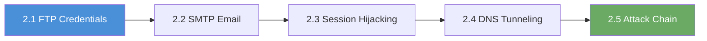

# Chapter N2: Review

## What You Learned

Over five labs, you built a complete PCAP forensics workflow; from extracting credentials in a single-protocol capture to reconstructing a multi-stage attack chain across HTTP, TLS, SMB, and FTP. You can now SSH into analyst workstations, navigate packet captures with tshark, and extract evidence from any common protocol.

Each lab introduced a new protocol and a new detection technique, but the analytical method stayed the same:

1. Start with a high-level overview; protocol hierarchy, conversation statistics, endpoint lists.
2. Apply targeted display filters to isolate the traffic of interest.
3. Extract specific fields to build a timeline of events.
4. Follow individual TCP streams to read the full conversation in context.
5. Correlate findings across protocols to reconstruct the attacker's actions.

By the final lab, you were applying all five steps simultaneously across multiple protocols in a single investigation.

You also learned that attackers rarely use a single protocol. Real intrusions leave traces across FTP, HTTP, DNS, SMB, and TLS; and the analyst who can follow the thread across all of them is the one who reconstructs the full story.

## The Progression You Followed

| Exercise | Protocol | What You Detected |
|-----|----------|-------------------|
| 2.1 | FTP | Cleartext credentials and file download |
| 2.2 | SMTP | Data exfiltration via email to external recipient |
| 2.3 | HTTP | Session hijacking via stolen cookie |
| 2.4 | DNS | Data exfiltration via DNS tunneling |
| 2.5 | Multi-protocol | Complete attack chain: access, C2, credentials, lateral movement, exfiltration |

Each lab built directly on the skills from the previous one:

- **Exercise 2.1** taught you to read a single protocol conversation and extract cleartext credentials from FTP traffic.
- **Exercise 2.2** added field extraction and content analysis, showing you how to identify data exfiltration through SMTP.
- **Exercise 2.3** introduced correlation across multiple sessions within the same protocol, revealing session hijacking through cookie reuse.
- **Exercise 2.4** required you to decode obfuscated data hidden inside legitimate DNS query fields; a covert exfiltration channel that evades most basic monitoring.
- **Exercise 2.5** brought everything together. You tracked an attacker across five protocols and reconstructed the full kill chain from initial access to data exfiltration.

## Self-Assessment

Answer these questions without looking at the answer key below. If you can answer all seven confidently, you have internalized the core skills of this chapter. If any question gives you trouble, revisit the corresponding lab before moving on.

1. What tshark command shows the protocol hierarchy of a PCAP file? *(Exercise 2.1)*

2. You see FTP response code 230 in a capture. What does it mean, and what should you look for next? *(Exercise 2.1)*

3. An SMTP RCPT TO field shows `external.contact@protonmail.com` from an internal sender. Why is this suspicious? *(Exercise 2.2)*

4. The same HTTP session cookie appears from two different source IPs. What attack does this indicate? *(Exercise 2.3)*

5. What does the decode pipeline `tshark ... | cut -d. -f1 | tr -d '\n' | xxd -r -p` do? *(Exercise 2.4)*

6. In the attack chain lab, the compromised workstation made outbound FTP connections. Why is this a red flag? *(Exercise 2.5)*

7. What is the tshark command to follow TCP stream number 5? *(All labs)*

## Command Cheat Sheet

These are the commands and filters you used most often across all five labs. Keep this page open during future investigations as a quick reference.

### General tshark commands

| Command | What It Does |
|---------|--------------|
| `ssh analyst@<target_ip>` | Connect to analyst workstation |
| `scp analyst@<target_ip>:/path/file .` | Download PCAP to local machine |
| `tshark -r file.pcap` | Read and display all packets |
| `tshark -r file.pcap -q -z io,phs` | Protocol hierarchy statistics |
| `tshark -r file.pcap -q -z conv,ip` | IP conversation summary |
| `tshark -r file.pcap -q -z conv,tcp` | TCP conversation summary |
| `tshark -r file.pcap -q -z endpoints,ip` | List all IP endpoints |
| `tshark -r file.pcap -Y "filter"` | Apply display filter |
| `tshark -r file.pcap -T fields -e field` | Extract specific fields |
| `tshark -r file.pcap -V` | Verbose packet decode |
| `tshark -r file.pcap -q -z follow,tcp,ascii,N` | Follow TCP stream N |

### Protocol-specific filters

| Filter | Protocol | What It Shows |
|--------|----------|---------------|
| `ftp.response.code == 230` | FTP | Successful login |
| `ftp.request.command == "PASS"` | FTP | Password commands |
| `smtp.req.command == "RCPT"` | SMTP | Email recipients |
| `smtp contains "keyword"` | SMTP | Packets containing a string |
| `http.set_cookie` | HTTP | Session cookie issuance |
| `http.cookie` | HTTP | Requests with cookies |
| `http.request.method == "POST"` | HTTP | POST requests (login forms) |
| `dns.flags.response == 0` | DNS | DNS queries only |
| `dns.qry.name contains "domain"` | DNS | Queries to specific domain |
| `tls.handshake.extensions_server_name` | TLS | SNI field (domain in HTTPS) |
| `smb2.cmd == 1` | SMB | Session setup (auth attempts) |
| `ftp.request.command == "STOR"` | FTP | File upload commands |

### Useful filter combinations

You can combine any of the filters above with `&&` (and), `||` (or), and `!` (not). For example:

- `ftp.request.command == "PASS" || ftp.request.command == "USER"`: show both username and password commands together.
- `http.cookie && !http.request.method == "GET"`: find non-GET requests that carry session cookies.
- `dns.qry.name contains "suspect.domain" && dns.flags.response == 0`: isolate outbound queries to a specific domain.

### Recommended analysis order

When you open any new PCAP file, follow this sequence:

1. Run `tshark -r file.pcap -q -z io,phs` to see what protocols are present.
2. Run `tshark -r file.pcap -q -z conv,ip` to identify the communicating hosts.
3. Run `tshark -r file.pcap -q -z endpoints,ip` to find which IPs are most active.
4. Apply protocol-specific filters from the table above to investigate each protocol.
5. Use `-z follow,tcp,ascii,N` to read the full content of suspicious conversations.

## Connect the Dots: What Comes Next

Chapters N1 and N2 covered the Network track of the Open Cyber Range. You now have a complete defensive analysis skillset: text log analysis (firewall, DNS, auth logs) and packet capture forensics (FTP, SMTP, HTTP, DNS, and multi-protocol attack chains). These skills form the foundation of SOC analyst and incident responder roles.

The techniques you practiced; filtering, field extraction, stream following, and timeline reconstruction; apply to any protocol and any investigation. Whether you encounter a novel C2 channel, an unfamiliar application-layer protocol, or a zero-day exploit in transit, the analytical framework remains the same: identify endpoints, follow conversations, extract artifacts, and reconstruct the timeline.

In a real SOC environment, you combine both skillsets simultaneously:

- **Firewall logs** tell you which connections were allowed or blocked.
- **DNS logs** reveal domain resolution patterns and potential tunneling.
- **Authentication logs** track who logged in, from where, and when.
- **PCAP files** give you the full content of those conversations.

When you correlate all four data sources, you can reconstruct an incident from first contact to final exfiltration with forensic-grade evidence.

The next tracks in the Open Cyber Range build on this network foundation. You will encounter host-based forensics, memory analysis, and incident response scenarios that reference the same attacker techniques you detected in network traffic here. The ability to pivot between network evidence and host evidence is what separates a capable analyst from an exceptional one.

## Self-Assessment Answer Key

1. `tshark -r file.pcap -q -z io,phs`: the `-q` flag suppresses per-packet output and `-z io,phs` generates the protocol hierarchy statistics. The protocol hierarchy is always your first command when opening an unfamiliar PCAP, because it tells you which protocols are present and how much traffic each one accounts for.

2. FTP 230 means "User logged in, proceed." Look backwards in the stream for the USER and PASS commands that preceded this response to extract the credentials. Because FTP transmits credentials in cleartext, the username and password are visible in the packet payload.

3. An internal sender emailing an external address at a privacy-focused provider (Protonmail) is a classic indicator of data exfiltration. The sender's role (database admin) and the email content determine whether this is malicious. You should examine the email body and any attachments for sensitive data.

4. Session hijacking. The attacker obtained the legitimate user's session cookie and is replaying it from a different IP address. The server accepts the valid cookie without re-authentication, granting the attacker the same access as the original user. You detect this by extracting `http.cookie` values alongside `ip.src` and looking for the same cookie value appearing from multiple source addresses.

5. It extracts DNS query names, isolates the subdomain label before the first dot (which contains hex-encoded data), removes newlines to concatenate the chunks into a single hex string, and decodes the hex to readable ASCII. The decoded ASCII reveals data that was exfiltrated via DNS tunneling. Each step in the pipeline is essential; skipping any one of them produces garbled output.

6. Normal workstations do not initiate FTP connections to external servers. Outbound FTP from a desktop is anomalous behavior that indicates data exfiltration or unauthorized file transfer. A firewall rule blocking outbound FTP from workstation subnets would have prevented this, and an alert on such traffic would have detected it early.

7. `tshark -r file.pcap -q -z follow,tcp,ascii,5`: this reconstructs the full TCP conversation for stream index 5 and displays it in ASCII. You identify the stream number from earlier analysis using conversation statistics or display filters.
