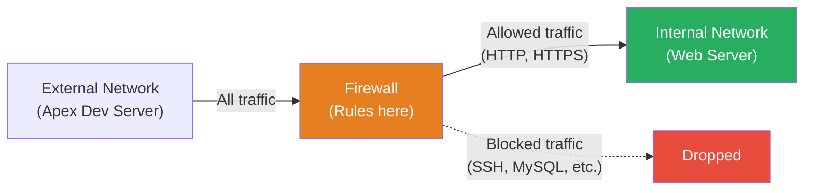

# Exercise 12.1: Firewall Fundamentals - Controlling Inbound Traffic

## Before You Begin

You should be comfortable with basic Linux commands and SSH. Your VPN must be connected and your terminal open. The exercise introduces firewall concepts from the operator's perspective: you will be working directly on the firewall, not attacking it.

**Credentials for this exercise:**

| Target | Username | Password |
|--------|----------|----------|
| Meridian Firewall | `analyst` | `M3r1d14n_Fw#` |

## Scenario

Meridian Health Partners, a healthcare consulting firm in Dallas, hired Apex Digital Solutions to build a patient intake web application. As part of the contract, Apex was given a development server on Meridian's network segment to test against the internal web server.

Your SOC team flagged unusual traffic originating from Apex's dev server: port scans, database connection attempts, and what appears to be reverse shell callbacks. The source could be a compromised developer workstation, a rogue employee, or sloppy development tooling.

James Whitfield (Network Security Lead) has pulled you in: "We need you on the firewall. HTTP and HTTPS to our web server is fine, that is what the contract covers. Everything else needs to be shut down."

## Your Objectives

- Explain what a firewall does and why it sits between network segments
- SSH into the firewall and observe live traffic using the monitoring tool
- Identify the anatomy of an iptables rule (chain, protocol, port, action)
- Write FORWARD chain rules to allow HTTP/HTTPS and block all other traffic
- Verify your rules work by watching the traffic monitor change from ALLOW to DROP

---

## Background: What Is a Firewall?

A firewall is a network device (or software) that inspects traffic and decides whether to **allow** or **block** each packet based on a set of rules. It acts as a gatekeeper between network segments. Without a firewall, any device on the network can reach any service on any other device. With a firewall, the administrator decides which traffic is permitted and which is silently dropped.



**Key concepts:**

| Term | Meaning |
|------|---------|
| Packet filtering | The firewall examines each packet's header (source IP, destination IP, protocol, port) and compares it against its rules |
| FORWARD chain | In iptables, the FORWARD chain handles traffic that passes *through* the firewall (not traffic destined for the firewall itself) |
| Default policy | What happens to traffic that does not match any rule (typically ACCEPT or DROP) |
| First-match-wins | Iptables evaluates rules top to bottom and applies the action from the *first* rule that matches the packet |

## The Anatomy of an iptables Rule

Every iptables rule has these components:

```
sudo iptables -A FORWARD -p tcp --dport 80 -j ACCEPT
             |    |        |  |      |       |    |
             |    |        |  |      |       |    +-- Action: ACCEPT, DROP, or REJECT
             |    |        |  |      |       +------- Jump (take this action)
             |    |        |  |      +--------------- Destination port
             |    |        |  +---------------------- Protocol (tcp, udp, icmp)
             |    |        +------------------------- Match specification
             |    +---------------------------------- Chain (INPUT, OUTPUT, FORWARD)
             +--------------------------------------- Append rule to chain
```

| Component | Flag | Purpose | Examples |
|-----------|------|---------|----------|
| Chain | (positional) | Where to apply the rule | `INPUT` (to this host), `OUTPUT` (from this host), `FORWARD` (through this host) |
| Protocol | `-p` | Match protocol type | `tcp`, `udp`, `icmp` |
| Source IP | `-s` | Match source address | `10.100.2.23`, `192.168.0.0/24` |
| Dest port | `--dport` | Match destination port | `80`, `443`, `3306` |
| Action | `-j` | What to do with matching traffic | `ACCEPT`, `DROP`, `REJECT` |

**ACCEPT** lets the packet through. **DROP** silently discards it (the sender gets no response and must wait for a timeout). **REJECT** sends an ICMP error back to the sender, explicitly telling them the connection was refused. In most production environments, DROP is preferred because it reveals less information to potential attackers.

## Tool Primer: iptables Commands

You will use these commands throughout the walkthrough. Each one is explained in context when you encounter it, but this table serves as a quick reference.

| Command | What it does |
|---------|-------------|
| `sudo iptables -L FORWARD -n -v --line-numbers` | Lists all rules in the FORWARD chain with packet counters and line numbers |
| `sudo iptables -A FORWARD -p tcp --dport 80 -j ACCEPT` | Appends a rule to allow TCP port 80 traffic |
| `sudo iptables -A FORWARD -j DROP` | Appends a catch-all rule that drops all unmatched traffic |
| `sudo iptables -F FORWARD` | Flushes (deletes) all rules from the FORWARD chain |
| `sudo monitor` | Custom lab tool: shows live traffic with color-coded ALLOW/DROP verdicts |
| `sudo check-rules` | Custom lab tool: validates your ruleset and reveals the flag if correct |

**Flag breakdown for the list command:**

- `-L FORWARD` - list rules in the FORWARD chain specifically
- `-n` - show numeric IPs and ports (skip DNS lookups, which is faster)
- `-v` - verbose output (show packet and byte counters per rule)
- `--line-numbers` - number each rule so you can reference them by position

---

## Walkthrough

### Step 1: Launch the Exercise

Open the platform in your browser and start the exercise environment.

- Navigate to your **Course** view and locate the Week 12 assignment
- Click **Launch** on "Firewall Fundamentals"
- Wait for the status to change to **Running**
- Note the target IPs displayed in the Active Lab View

You will see three hosts on your lab network:

| Host | Role | IP Offset |
|------|------|-----------|
| Meridian Firewall | Your workspace (SSH here) | .10 |
| Apex Dev Server | Third-party traffic source | .23 |
| Meridian Web Server | Protected asset | .47 |

The firewall sits between the dev server and the web server. Your job is to configure it so only legitimate traffic (HTTP and HTTPS) can reach the web server.

### Step 2: Scan the Network

Before connecting to the firewall, scan the lab subnet from Kali to see what is running. The scan gives you a picture of the network from an external perspective.

!!! kali "Run a service version scan against the lab subnet"
    Replace `<subnet>` with the subnet shown in the Active Lab View (for example, `10.100.2.0/24`).

    ```bash
    nmap -sV <subnet>
    ```

You should see three hosts in the output. Pay attention to what services are visible:

- The **firewall** (.10) has SSH open on port 22, which is how you will connect to configure it.
- The **Apex dev server** (.23) may show no open ports, or all ports closed. It is a traffic source, not a target.
- The **web server** (.47) has multiple ports open: 22 (SSH), 80 (HTTP), 443 (HTTPS), 3306 (MySQL), 4444, and 8080. These are the services your supervisor is concerned about. Only 80 and 443 should be reachable.

> **What did you observe?** How many ports are open on the web server? Which ones are legitimate business services and which ones are suspicious? Write down your observations before proceeding.

### Step 3: SSH into the Firewall

Now connect to the firewall to start configuring it.

!!! kali "Connect to the firewall via SSH"
    Replace `<firewall_ip>` with the firewall's IP from the scan results (the host at offset .10).

    ```bash
    ssh analyst@<firewall_ip>
    ```

    Accept the host key fingerprint when prompted (`yes`), then enter the password: `M3r1d14n_Fw#`

Once logged in, you are now operating directly on the firewall. Every iptables command you run here changes what traffic is permitted through this device.

### Step 4: Observe the Traffic (Before Rules)

The firewall has a custom monitoring tool that shows traffic flowing through the network in real time. Run it now to see what the Apex dev server is sending.

!!! target "Run the traffic monitor on the firewall"
    ```bash
    sudo monitor
    ```

    Watch the output for 20-30 seconds. You should see a repeating stream of traffic entries:

    <pre class="monitor-output"><span class="dim"> TIME      VERDICT  SOURCE                                       PROTO  INFO</span>
    <span class="dim"> ───────── ──────── ──────────────────────────────────────────── ────── ──────────────────────</span>
     15:04:12  <span class="allow">ALLOW   </span> &lt;subnet&gt;.23:52341 -> &lt;subnet&gt;.47:<span class="port">80</span>          TCP    HTTP request
     15:04:14  <span class="allow">ALLOW   </span> &lt;subnet&gt;.23:51982 -> &lt;subnet&gt;.47:<span class="port">443</span>         TCP    HTTPS request
     15:04:17  <span class="allow">ALLOW   </span> &lt;subnet&gt;.23:49301 -> &lt;subnet&gt;.47:<span class="port">22</span>          TCP    SSH connection attempt
     15:04:19  <span class="allow">ALLOW   </span> &lt;subnet&gt;.23:60112 -> &lt;subnet&gt;.47:<span class="port">3306</span>        TCP    MySQL database probe
     15:04:21  <span class="allow">ALLOW   </span> &lt;subnet&gt;.23:53219 -> &lt;subnet&gt;.47:<span class="port">4444</span>        TCP    Reverse shell callback
     15:04:24  <span class="allow">ALLOW   </span> &lt;subnet&gt;.23:61455 -> &lt;subnet&gt;.47:<span class="port">8080</span>        TCP    Suspicious C2 traffic</pre>

    Press **Ctrl+C** to stop the monitor.

**Interpreting the output:** Every line represents a connection attempt from the Apex dev server (.23) to the web server (.47). The green `ALLOW` verdict means the firewall is letting this traffic through. Right now, *everything* is allowed because the firewall has no rules configured.

Notice the traffic types. Ports 80 (HTTP) and 443 (HTTPS) are legitimate, covered by the Apex contract. But ports 22 (SSH), 3306 (MySQL), 4444 (a common reverse shell port), and 8080 (a common C2 callback port) are not authorized. Those ports carry the traffic your supervisor wants blocked.

??? question "Why is all traffic allowed with no rules?"
    When the FORWARD chain has no rules, iptables uses its **default policy**. The default policy is ACCEPT, meaning any packet that does not match a rule is allowed through. The result is effectively an open firewall: it exists on the network but provides no protection.

### Step 5: Check Current Firewall Rules

Before writing new rules, verify the current state of the firewall. Never assume a firewall is empty; always check first.

!!! target "View the FORWARD chain rules on the firewall"
    ```bash
    sudo iptables -L FORWARD -n -v --line-numbers
    ```

You should see an empty chain with a default ACCEPT policy:

```
Chain FORWARD (policy ACCEPT 0 packets, 0 bytes)
num   pkts bytes target     prot opt in     out     source               destination
```

**Reading this output:**

- `policy ACCEPT` - the default policy. Any packet that does not match a rule will be accepted.
- `0 packets, 0 bytes` - no traffic has matched any rule (because there are no rules).
- The table below the header is empty, confirming there are no rules in the FORWARD chain.

The empty chain listing confirms what the monitor showed: the firewall is wide open.

### Step 6: Write Your First Rule - Allow HTTP

Now you will start building the firewall policy. The first rule allows HTTP traffic (port 80) through the firewall.

!!! target "Allow HTTP traffic through the firewall"
    ```bash
    sudo iptables -A FORWARD -p tcp --dport 80 -j ACCEPT
    ```

**Breaking down this command:**

| Part | Meaning |
|------|---------|
| `sudo` | Run with root privileges (required for firewall changes) |
| `iptables` | The Linux firewall management tool |
| `-A FORWARD` | **Append** a rule to the end of the **FORWARD** chain |
| `-p tcp` | Match only **TCP** protocol packets (HTTP uses TCP) |
| `--dport 80` | Match packets with a **destination port** of 80 |
| `-j ACCEPT` | **Jump** to the ACCEPT action (allow the packet through) |

Now verify the rule was added:

!!! target "Confirm the rule appears in the FORWARD chain"
    ```bash
    sudo iptables -L FORWARD -n -v --line-numbers
    ```

You should see one rule in the chain:

```
Chain FORWARD (policy ACCEPT 0 packets, 0 bytes)
num   pkts bytes target     prot opt in     out     source               destination
1        0     0 ACCEPT     tcp  --  *      *       0.0.0.0/0            0.0.0.0/0            tcp dpt:80
```

**Reading this output:**

- `num 1` - this is the first (and only) rule
- `ACCEPT` - the action taken when a packet matches
- `tcp` - the protocol this rule matches
- `0.0.0.0/0` in both source and destination columns means "any IP address"
- `tcp dpt:80` - matches TCP packets with destination port 80
- `pkts 0` - no packets have matched yet (the counter starts at zero when the rule is created)

> **What did you observe?** The rule is in place but has not matched any traffic yet. That is expected: the counters only increment when real packets pass through.

### Step 7: Allow HTTPS

The web server also serves secure traffic on port 443 (HTTPS). Add a second ACCEPT rule for this port.

!!! target "Allow HTTPS traffic through the firewall"
    ```bash
    sudo iptables -A FORWARD -p tcp --dport 443 -j ACCEPT
    ```

The HTTPS rule is identical to the HTTP rule except for the port number. The `-A` flag appends the rule to the end of the chain, so this becomes rule number 2.

Verify both rules are present:

!!! target "Confirm both rules are listed"
    ```bash
    sudo iptables -L FORWARD -n -v --line-numbers
    ```

You should now see two rules:

```
num   pkts bytes target     prot opt in     out     source               destination
1        0     0 ACCEPT     tcp  --  *      *       0.0.0.0/0            0.0.0.0/0            tcp dpt:80
2        0     0 ACCEPT     tcp  --  *      *       0.0.0.0/0            0.0.0.0/0            tcp dpt:443
```

At this point, HTTP and HTTPS traffic will be accepted by rules 1 and 2. But all other traffic is *also* still allowed because the default policy is ACCEPT. You need one more rule to close the gap.

### Step 8: Block Everything Else

The catch-all DROP rule is the most important rule. Without it, the two ACCEPT rules above are meaningless because everything is allowed anyway by the default policy.

!!! target "Add a catch-all DROP rule"
    ```bash
    sudo iptables -A FORWARD -j DROP
    ```

**Breaking down this command:**

| Part | Meaning |
|------|---------|
| `-A FORWARD` | Append to the FORWARD chain (becomes rule 3) |
| `-j DROP` | Drop the packet silently |
| (no `-p` or `--dport`) | No protocol or port specified, so this rule matches **every packet** |

Because iptables processes rules top to bottom using first-match-wins, here is what happens to each packet:

1. Is it TCP destined for port 80? Rule 1 matches. **ACCEPT.**
2. Is it TCP destined for port 443? Rule 2 matches. **ACCEPT.**
3. Anything else? Rule 3 matches (it matches everything). **DROP.**

The ordering forms a **default-deny policy** built from rules. The three rules together say: "Allow HTTP and HTTPS. Block everything else."

### Step 9: Verify with the Monitor (After Rules)

Now see the impact of your rules in real time.

!!! target "Run the monitor again and observe the change"
    ```bash
    sudo monitor
    ```

    Watch for 20-30 seconds. The output should now look very different:

    <pre class="monitor-output"> 15:08:12  <span class="allow">ALLOW   </span> &lt;subnet&gt;.23:49301 -> &lt;subnet&gt;.47:<span class="port">80</span>          TCP    HTTP request
     15:08:14  <span class="allow">ALLOW   </span> &lt;subnet&gt;.23:49302 -> &lt;subnet&gt;.47:<span class="port">443</span>         TCP    HTTPS request
     15:08:17  <span class="drop">DROP    </span> &lt;subnet&gt;.23:49303 -> &lt;subnet&gt;.47:<span class="port">22</span>          TCP    SSH connection attempt
     15:08:19  <span class="allow">ALLOW   </span> &lt;subnet&gt;.23:49306 -> &lt;subnet&gt;.47:<span class="port">80</span>          TCP    HTTP request
     15:08:21  <span class="drop">DROP    </span> &lt;subnet&gt;.23:49304 -> &lt;subnet&gt;.47:<span class="port">3306</span>        TCP    MySQL database probe
     15:08:24  <span class="drop">DROP    </span> &lt;subnet&gt;.23:49305 -> &lt;subnet&gt;.47:<span class="port">4444</span>        TCP    Reverse shell callback
     15:08:27  <span class="allow">ALLOW   </span> &lt;subnet&gt;.23:49308 -> &lt;subnet&gt;.47:<span class="port">80</span>          TCP    HTTP request
     15:08:29  <span class="drop">DROP    </span> &lt;subnet&gt;.23:49307 -> &lt;subnet&gt;.47:<span class="port">8080</span>        TCP    Suspicious C2 traffic</pre>

    Press **Ctrl+C** to stop.

**Interpreting the output:** Compare this to what you saw in Step 4. The HTTP and HTTPS entries are still green `ALLOW`, which is correct since the contract authorizes that traffic. But the SSH, MySQL, reverse shell, and C2 entries are now red `DROP`. Your firewall rules are working.

> **What changed?** Before your rules, every line was `ALLOW`. After your rules, only HTTP (80) and HTTPS (443) are allowed. The firewall is now doing its job: permitting legitimate traffic and blocking everything else.

### Step 10: Inspect the Packet Counters

The packet counters in iptables provide proof that your rules are actively matching traffic. Counters are how you verify a firewall is working in production, not just configured.

!!! target "Review how many packets each rule has caught"
    ```bash
    sudo iptables -L FORWARD -n -v --line-numbers
    ```

Your output should now show non-zero packet counts:

```
num   pkts bytes target     prot opt in     out     source               destination
1       12   720 ACCEPT     tcp  --  *      *       0.0.0.0/0            0.0.0.0/0            tcp dpt:80
2        4   240 ACCEPT     tcp  --  *      *       0.0.0.0/0            0.0.0.0/0            tcp dpt:443
3       16   960 DROP       all  --  *      *       0.0.0.0/0            0.0.0.0/0
```

**Reading this output:**

- Rule 1 (`ACCEPT tcp dpt:80`): 12 packets matched. These are the legitimate HTTP connections from the dev server.
- Rule 2 (`ACCEPT tcp dpt:443`): 4 packets matched. Legitimate HTTPS traffic.
- Rule 3 (`DROP all`): 16 packets matched. Those 16 packets are every unauthorized connection attempt (SSH, MySQL, reverse shells, C2 callbacks) that was silently dropped.

The `bytes` column shows the total size of matched traffic. The `pkts` column is usually more useful because it tells you how many individual connection attempts occurred.

> **Why do the counters matter?** In a production environment, you would use these counters to verify that the firewall is actively blocking traffic, not just configured. A DROP rule with zero packets after hours of operation might mean the rule is never reached (rule order problem) or that the traffic you expected to block is not arriving.

### Step 11: Validate and Get the Flag

When you are confident your rules are correct, run the validator:

!!! target "Run the rule validator"
    ```bash
    sudo check-rules
    ```

The validator performs four checks:

1. **HTTP allowed** - is there an ACCEPT rule for TCP port 80?
2. **HTTPS allowed** - is there an ACCEPT rule for TCP port 443?
3. **Default DROP** - is there a catch-all DROP rule?
4. **Rule order** - are the ACCEPT rules positioned before the DROP rule?

If all checks pass, the validator displays the flag. If any check fails, it tells you exactly what is wrong and how to fix it. Read the error message carefully before making changes.

Submit the flag on the platform to complete the exercise.

---

## Analysis Questions

??? question "1. What would happen if you placed the DROP rule before the ACCEPT rules?"
    All traffic would be dropped, including HTTP and HTTPS. Firewalls process rules top to bottom using **first-match-wins**. If the first rule is a blanket DROP with no port or protocol match, it matches every packet before any ACCEPT rule is evaluated. Your ACCEPT rules would exist in the chain but never fire. Rule order is not cosmetic; it determines behavior.

??? question "2. What is the difference between DROP and REJECT?"
    **DROP** silently discards the packet. The sender receives no response and must wait for a timeout (typically 30-60 seconds in TCP). **REJECT** sends an ICMP "port unreachable" or TCP RST back to the sender, immediately telling them the connection was refused. DROP is preferred for external-facing traffic because it reveals less information: an attacker scanning the network cannot distinguish between a dropped port and a host that does not exist. REJECT is sometimes used on internal networks where faster error feedback is more important than stealth.

??? question "3. Why use the FORWARD chain instead of INPUT?"
    Iptables has three built-in chains for different traffic flows. **INPUT** handles traffic destined for the firewall itself (like your SSH connection on port 22). **OUTPUT** handles traffic originating from the firewall. **FORWARD** handles traffic passing *through* the firewall from one network interface to another. In this exercise, the traffic flows from the Apex dev server through the firewall to the web server, so the FORWARD chain is the correct place to filter it. If you wrote these rules on the INPUT chain, they would affect traffic to the firewall itself (potentially breaking your SSH session) and would not filter traffic between the dev server and web server at all.

??? question "4. The Apex dev server is sending traffic to port 4444. Why is this concerning?"
    Port 4444 is the default port for Metasploit's reverse shell handler (meterpreter). While it is technically possible for a legitimate service to use port 4444, this port is so strongly associated with post-exploitation tools that seeing traffic to it is a significant red flag. Combined with the other suspicious traffic (SSH brute-force attempts on port 22, MySQL probes on 3306, and C2-style callbacks on 8080), the pattern suggests the dev server may be compromised or being used for unauthorized testing beyond the scope of the contract.

??? question "5. Your SSH connection to the firewall still works after adding the DROP rule. Why?"
    Your SSH connection goes to the firewall itself (port 22 on the firewall's IP). That traffic hits the **INPUT** chain, not the FORWARD chain. Your DROP rule is on the FORWARD chain, which only affects traffic passing *through* the firewall to other hosts. Traffic destined for the firewall itself is handled by the INPUT chain, which has its own default ACCEPT policy. Understanding chains matters here: rules on one chain do not affect traffic processed by a different chain.

---

## Record Your Findings

> **Traffic observed before rules (from the monitor output):**
>
> | Port | Protocol | Description | Legitimate? |
> |------|----------|-------------|-------------|
> | 80 | TCP | HTTP request | |
> | 443 | TCP | HTTPS request | |
> | 22 | TCP | SSH connection attempt | |
> | 3306 | TCP | MySQL database probe | |
> | 4444 | TCP | Reverse shell callback | |
> | 8080 | TCP | Suspicious C2 traffic | |
>
> **Final iptables rules (paste output of `sudo iptables -L FORWARD -n -v --line-numbers`):**
>
> ```
> (paste here)
> ```
>
> **Packet counters after running the monitor for 1 minute:**
>
> | Rule # | Target | Protocol | Dest Port | Packets | Bytes |
> |--------|--------|----------|-----------|---------|-------|
> | 1 | | | | | |
> | 2 | | | | | |
> | 3 | | | | | |
>
> **What changed between the "before" and "after" monitor output?**
>
>
>
> **How to submit:** enter the flag on the exercise page exactly as you recovered it, keeping the `OCR{...}` wrapper.
>
> **Flag:** `OCR{________________________________}`
