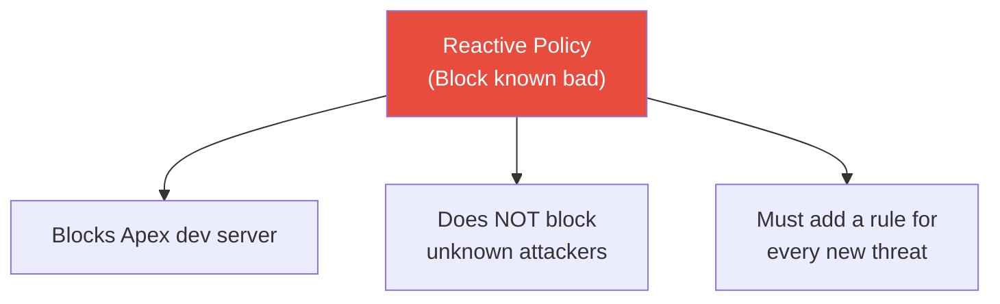
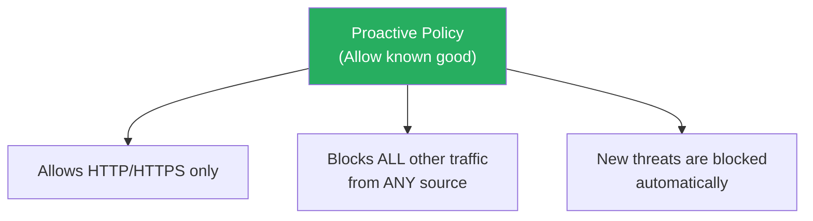

# Exercise 12.2: Firewall Policy Hardening - Defense in Depth

## Before You Begin

You should have completed Exercise 12.1 (Firewall Fundamentals). Exercise 12.2 builds on the same scenario and topology. You will write iptables rules independently in Phase 1 (reinforcing what you learned), then learn new concepts about policy design and rule order in Phase 2. Your VPN must be connected and your terminal open.

**Credentials for this exercise:**

| Target | Username | Password |
|--------|----------|----------|
| Meridian Firewall | `analyst` | `M3r1d14n_Fw#` |

## Scenario

Two weeks after you locked down the Meridian Health Partners firewall to block unauthorized traffic from Apex Digital Solutions, the situation has escalated. James Whitfield (Network Security Lead) called an emergency meeting.

"Good work blocking the Apex traffic last time. But here is the problem: we only blocked their dev server. If another contractor, a visitor on guest Wi-Fi, or a compromised internal host starts sending the same kind of traffic, we have no protection. We wrote rules targeting one IP address. That is reactive, not proactive."

Your task has two phases:

1. **Phase 1:** Block the Apex dev server using source-specific rules (reinforcement of Exercise 12.1 skills, plus the new `-s` flag for source filtering)
2. **Phase 2:** Replace those rules with a general default-deny policy that protects the web server from *any* source, not just the known bad actor

## Your Objectives

- Write source-specific iptables rules using the `-s` flag
- Explain why source-specific blocking alone is insufficient
- Build a general default-deny FORWARD policy that protects against any source
- Demonstrate understanding of first-match-wins rule processing order
- Diagnose and fix a misconfigured ruleset where rule order defeats the intended policy

---

## Background: Reactive vs. Proactive Firewall Policies

There are two fundamental approaches to firewall rule design. Understanding the difference is critical for building policies that survive real-world conditions.

### Approach 1: Reactive (Blocklist)

Block traffic from known bad sources. Allow everything else by default.

```
iptables -A FORWARD -s <subnet>.23 -j DROP     # Block Apex
# Everything else is allowed by the default ACCEPT policy
```

The blocklist approach is like a nightclub bouncer with a list of banned people. Anyone not on the list walks right in. If a new troublemaker shows up who is not on the list, they get in too. You are always reacting to threats after they appear.

### Approach 2: Proactive (Allowlist / Default Deny)

Allow only what is explicitly needed. Block everything else.

```
iptables -A FORWARD -p tcp --dport 80 -j ACCEPT   # Allow HTTP from anyone
iptables -A FORWARD -p tcp --dport 443 -j ACCEPT  # Allow HTTPS from anyone
iptables -A FORWARD -j DROP                        # Block everything else
```

The allowlist approach is like a building with a guest list. Only people with a specific reason to be there are allowed in. Everyone else is turned away, regardless of who they are. New threats are blocked automatically because they are not on the guest list.



---



The proactive approach is called **defense in depth** because it does not rely on knowing who the attacker is. It defines what legitimate traffic looks like and blocks everything that does not match. In production environments, default-deny is the standard because it fails safe: if you forget to add a rule, traffic is blocked rather than allowed.

## New Concept: Source-Specific Rules (-s flag)

In Exercise 12.1, your rules matched traffic based on destination port only. The `-s` flag adds another dimension: matching by the source IP address of the sender.

```bash
sudo iptables -A FORWARD -s <subnet>.23 -p tcp --dport 22 -j DROP
```

**Breaking down this command:**

| Part | Meaning |
|------|---------|
| `-s <subnet>.23` | Match packets **from** this specific source IP |
| `-p tcp --dport 22` | Match TCP packets destined for port 22 (SSH) |
| `-j DROP` | Drop matching packets silently |

The rule blocks SSH traffic **only from <subnet>.23** (the Apex dev server). The exact same SSH traffic from any other IP address would pass through the firewall untouched.

| Flag | Purpose | Example |
|------|---------|---------|
| `-s <ip>` | Match a single source host | `-s 10.100.2.23` |
| `-s <cidr>` | Match an entire source subnet | `-s 192.168.0.0/24` |
| (no `-s` flag) | Match any source | Equivalent to `-s 0.0.0.0/0` |

## The Rule Order Trap

Rule order is the single most important concept in this exercise. Iptables processes rules **top to bottom** and uses the **first matching rule**. Once a packet matches a rule, processing stops. No further rules are evaluated. The order in which you write rules completely determines the firewall's behavior.

**Correct order (works as intended):**

```
Rule 1: ACCEPT tcp dpt:80     <- HTTP packet arrives, matches here. ACCEPTED. Stop.
Rule 2: ACCEPT tcp dpt:443    <- HTTPS packet arrives, matches here. ACCEPTED. Stop.
Rule 3: DROP   all            <- SSH packet arrives, matches here. DROPPED. Stop.
```

**Wrong order (completely broken):**

```
Rule 1: DROP   all            <- HTTP packet arrives, matches here. DROPPED. Stop.
Rule 2: ACCEPT tcp dpt:80     <- Never reached. This rule might as well not exist.
Rule 3: ACCEPT tcp dpt:443    <- Never reached.
```

In the wrong order, the DROP rule on line 1 has no protocol or port match, so it matches *every* packet. HTTP, HTTPS, SSH, everything gets dropped on rule 1. Rules 2 and 3 are never evaluated. The firewall appears correctly configured when you list the rules, but it blocks all traffic including what you intended to allow.

Incorrect rule order is the most common firewall misconfiguration in production environments. An administrator adds a rule, the policy breaks, and the cause is not obvious because the rules all look correct when listed. The error is in the *order*, not the individual rules.

---

## Walkthrough

### Phase 1: Source-Specific Blocking (Reinforcement)

In this phase, you will block the Apex dev server using source-specific rules. Phase 1 reinforces the rule-writing skills from Exercise 12.1 and introduces the `-s` flag.

### Step 1: Launch and Connect

Launch the exercise from your course page. Once the lab is running, scan the subnet from Kali to identify the hosts, then SSH into the firewall.

!!! kali "Scan the lab subnet to confirm the topology"
    ```bash
    nmap -sV <subnet>
    ```

    You should see the same three hosts as Exercise 12.1: the firewall (.10), the Apex dev server (.23), and the web server (.47). Note the dev server's full IP address; you will need it for the source-specific rules.

!!! kali "SSH into the firewall"
    ```bash
    ssh analyst@<firewall_ip>
    ```

    Password: `M3r1d14n_Fw#`

### Step 2: Observe Current Traffic

!!! target "Start the traffic monitor"
    ```bash
    sudo monitor
    ```

Confirm you see the same mix of legitimate and suspicious traffic from the Apex dev server. All entries should show ALLOW because the firewall has no rules yet:

<pre class="monitor-output"><span class="dim"> TIME      VERDICT  SOURCE                                       PROTO  INFO</span>
<span class="dim"> ───────── ──────── ──────────────────────────────────────────── ────── ──────────────────────</span>
 15:04:12  <span class="allow">ALLOW   </span> &lt;subnet&gt;.23:52341 -> &lt;subnet&gt;.47:<span class="port">80</span>          TCP    HTTP request
 15:04:14  <span class="allow">ALLOW   </span> &lt;subnet&gt;.23:51982 -> &lt;subnet&gt;.47:<span class="port">443</span>         TCP    HTTPS request
 15:04:17  <span class="allow">ALLOW   </span> &lt;subnet&gt;.23:49301 -> &lt;subnet&gt;.47:<span class="port">22</span>          TCP    SSH connection attempt
 15:04:19  <span class="allow">ALLOW   </span> &lt;subnet&gt;.23:60112 -> &lt;subnet&gt;.47:<span class="port">3306</span>        TCP    MySQL database probe
 15:04:21  <span class="allow">ALLOW   </span> &lt;subnet&gt;.23:53219 -> &lt;subnet&gt;.47:<span class="port">4444</span>        TCP    Reverse shell callback
 15:04:24  <span class="allow">ALLOW   </span> &lt;subnet&gt;.23:61455 -> &lt;subnet&gt;.47:<span class="port">8080</span>        TCP    Suspicious C2 traffic</pre>

Take note of the dev server's IP address in the output (the source address in each line). You will use this exact IP in the next step. Press **Ctrl+C** to stop.

### Step 3: Write Source-Specific DROP Rules

Now block specific suspicious ports from the Apex dev server. Unlike Exercise 12.1 where your rules matched any source, these rules use `-s` to target one specific host.

!!! target "Block suspicious traffic from the Apex dev server"
    Replace `<apex_ip>` with the dev server's actual IP address from the monitor output (for example, `10.100.2.23`).

    ```bash
    sudo iptables -A FORWARD -s <apex_ip> -p tcp --dport 22 -j DROP
    sudo iptables -A FORWARD -s <apex_ip> -p tcp --dport 3306 -j DROP
    sudo iptables -A FORWARD -s <apex_ip> -p tcp --dport 4444 -j DROP
    sudo iptables -A FORWARD -s <apex_ip> -p tcp --dport 8080 -j DROP
    ```

**What each rule does:**

| Rule | Source | Port | Description |
|------|--------|------|-------------|
| 1 | Apex dev server | 22 | Blocks SSH brute-force attempts from Apex |
| 2 | Apex dev server | 3306 | Blocks MySQL database probes from Apex |
| 3 | Apex dev server | 4444 | Blocks reverse shell callbacks from Apex |
| 4 | Apex dev server | 8080 | Blocks C2 traffic from Apex |

Notice that you did *not* add DROP rules for ports 80 and 443. The contract allows HTTP and HTTPS traffic from Apex, so those connections should remain open.

Verify your rules:

!!! target "List the FORWARD chain to confirm all four rules"
    ```bash
    sudo iptables -L FORWARD -n -v --line-numbers
    ```

You should see four rules, all with the Apex dev server's IP in the source column and DROP as the target. The destination column shows `0.0.0.0/0` (any destination), and each rule is scoped to a specific port.

### Step 4: Verify Phase 1 with the Monitor

!!! target "Run the monitor to see the impact of your rules"
    ```bash
    sudo monitor
    ```

You should now see a mix of ALLOW and DROP:

<pre class="monitor-output"> 15:10:12  <span class="allow">ALLOW   </span> &lt;subnet&gt;.23:49301 -> &lt;subnet&gt;.47:<span class="port">80</span>          TCP    HTTP request
 15:10:14  <span class="allow">ALLOW   </span> &lt;subnet&gt;.23:49302 -> &lt;subnet&gt;.47:<span class="port">443</span>         TCP    HTTPS request
 15:10:17  <span class="drop">DROP    </span> &lt;subnet&gt;.23:49303 -> &lt;subnet&gt;.47:<span class="port">22</span>          TCP    SSH connection attempt
 15:10:19  <span class="allow">ALLOW   </span> &lt;subnet&gt;.23:49306 -> &lt;subnet&gt;.47:<span class="port">80</span>          TCP    HTTP request
 15:10:21  <span class="drop">DROP    </span> &lt;subnet&gt;.23:49304 -> &lt;subnet&gt;.47:<span class="port">3306</span>        TCP    MySQL database probe
 15:10:24  <span class="drop">DROP    </span> &lt;subnet&gt;.23:49305 -> &lt;subnet&gt;.47:<span class="port">4444</span>        TCP    Reverse shell callback
 15:10:27  <span class="allow">ALLOW   </span> &lt;subnet&gt;.23:49308 -> &lt;subnet&gt;.47:<span class="port">80</span>          TCP    HTTP request
 15:10:29  <span class="drop">DROP    </span> &lt;subnet&gt;.23:49307 -> &lt;subnet&gt;.47:<span class="port">8080</span>        TCP    Suspicious C2 traffic</pre>

- HTTP (port 80) and HTTPS (port 443) from Apex are still green ALLOW because no rule blocks them
- SSH (22), MySQL (3306), reverse shell (4444), and C2 (8080) from Apex are now red DROP

Press **Ctrl+C** when you have confirmed the pattern.

> **What did you observe?** The source-specific rules successfully blocked the unauthorized traffic from the Apex dev server. But consider this: if a different device on the network sent the same SSH or MySQL traffic to the web server, would your rules catch it?

??? question "Why is source-specific blocking insufficient?"
    These four rules only match packets with the Apex dev server's IP as the source. If a different host on the network (a compromised workstation, a rogue device on guest Wi-Fi, a visitor's laptop) sends the exact same traffic, every packet passes through unblocked. You are playing whack-a-mole: adding new rules for every threat *after* it appears. You cannot anticipate every future source of bad traffic, so blocking by source alone always leaves gaps.

---

### Phase 2: General Default-Deny Policy

In this phase, you will replace the source-specific rules with a general policy that protects the web server regardless of who is sending the traffic. Phase 2 is the proactive approach described in the Background section.

### Step 5: Flush the Phase 1 Rules

Before building the new policy, clear the source-specific rules from Phase 1. You are starting fresh.

!!! target "Remove all FORWARD chain rules"
    ```bash
    sudo iptables -F FORWARD
    ```

**What this command does:** The `-F` flag flushes (deletes) all rules from the specified chain. After this command, the FORWARD chain is empty and the default ACCEPT policy is back in effect. All traffic is allowed again.

Verify the chain is empty:

!!! target "Confirm the FORWARD chain has no rules"
    ```bash
    sudo iptables -L FORWARD -n -v --line-numbers
    ```

The output should show an empty chain with `policy ACCEPT`, just like the starting state.

### Step 6: Write the Default-Deny Policy

Now build the general policy. Unlike Phase 1, the rules do not use the `-s` flag, so they apply to traffic from **any source**.

!!! target "Build the allowlist policy"
    ```bash
    sudo iptables -A FORWARD -p tcp --dport 80 -j ACCEPT
    sudo iptables -A FORWARD -p tcp --dport 443 -j ACCEPT
    sudo iptables -A FORWARD -j DROP
    ```

**Breaking down the difference from Phase 1:**

| Phase 1 (source-specific) | Phase 2 (general) |
|---|---|
| `-s <subnet>.23 -p tcp --dport 22 -j DROP` | `-p tcp --dport 80 -j ACCEPT` |
| Blocks one port from one IP | Allows one port from any IP |
| 4 rules needed, gaps remain | 3 rules, complete coverage |
| Reactive: must know the threat first | Proactive: blocks unknown threats automatically |

The key difference is the absence of the `-s` flag. Without it, the ACCEPT rules match port 80 and 443 traffic from any source. The DROP rule at the end catches everything else, also from any source. The policy does not care who is sending the traffic; it only cares *what kind* of traffic it is.

### Step 7: Verify the General Policy with the Monitor

!!! target "Run the monitor to confirm the new policy works"
    ```bash
    sudo monitor
    ```

You should see the same result as Phase 1:

<pre class="monitor-output"> 15:18:12  <span class="allow">ALLOW   </span> &lt;subnet&gt;.23:50211 -> &lt;subnet&gt;.47:<span class="port">80</span>          TCP    HTTP request
 15:18:14  <span class="allow">ALLOW   </span> &lt;subnet&gt;.23:50982 -> &lt;subnet&gt;.47:<span class="port">443</span>         TCP    HTTPS request
 15:18:17  <span class="drop">DROP    </span> &lt;subnet&gt;.23:51303 -> &lt;subnet&gt;.47:<span class="port">22</span>          TCP    SSH connection attempt
 15:18:19  <span class="allow">ALLOW   </span> &lt;subnet&gt;.23:52106 -> &lt;subnet&gt;.47:<span class="port">80</span>          TCP    HTTP request
 15:18:21  <span class="drop">DROP    </span> &lt;subnet&gt;.23:51804 -> &lt;subnet&gt;.47:<span class="port">3306</span>        TCP    MySQL database probe
 15:18:24  <span class="drop">DROP    </span> &lt;subnet&gt;.23:51505 -> &lt;subnet&gt;.47:<span class="port">4444</span>        TCP    Reverse shell callback
 15:18:27  <span class="allow">ALLOW   </span> &lt;subnet&gt;.23:52408 -> &lt;subnet&gt;.47:<span class="port">80</span>          TCP    HTTP request
 15:18:29  <span class="drop">DROP    </span> &lt;subnet&gt;.23:51707 -> &lt;subnet&gt;.47:<span class="port">8080</span>        TCP    Suspicious C2 traffic</pre>

HTTP and HTTPS are ALLOW, everything else is DROP. The difference from Phase 1 is invisible in the monitor output but critical in practice: this policy blocks unauthorized traffic from *any* source, not just the Apex dev server.

Press **Ctrl+C** to stop.

### Step 8: Read and Understand the Rule Table

!!! target "View your rules with full detail"
    ```bash
    sudo iptables -L FORWARD -n -v --line-numbers
    ```

Your output should look like this:

```
num   pkts bytes target   prot opt in  out  source        destination
1      XX  XXXX ACCEPT   tcp  --  *   *    0.0.0.0/0     0.0.0.0/0    tcp dpt:80
2      XX  XXXX ACCEPT   tcp  --  *   *    0.0.0.0/0     0.0.0.0/0    tcp dpt:443
3      XX  XXXX DROP     all  --  *   *    0.0.0.0/0     0.0.0.0/0
```

**Reading each column:**

| Column | Meaning | What to look for |
|--------|---------|-----------------|
| `num` | Rule number (position in the chain) | Lower numbers are evaluated first |
| `pkts` | Number of packets that matched this rule | Non-zero means the rule is actively matching traffic |
| `bytes` | Total bytes of matched traffic | Useful for estimating traffic volume |
| `target` | Action taken (ACCEPT, DROP, REJECT) | This is what happens to matching packets |
| `prot` | Protocol matched (tcp, udp, all) | `all` means any protocol |
| `source` | Source IP filter | `0.0.0.0/0` means any source |
| `destination` | Destination IP filter | `0.0.0.0/0` means any destination |
| (last field) | Additional match criteria | `tcp dpt:80` means "TCP destination port 80" |

The critical observation: both the `source` and `destination` columns show `0.0.0.0/0` for all three rules. The identical `0.0.0.0/0` in both columns confirms the policy is general (not source-locked). Compare this to the Phase 1 output where the source column showed the Apex dev server's specific IP.

### (Optional) Step 9: Experience the Rule Order Trap

Step 9 is optional but highly recommended. You will deliberately write the rules in the wrong order, observe the broken behavior, and then fix it. Understanding rule order through direct experience is far more effective than reading about it.

!!! target "Deliberately break the policy by writing rules in the wrong order"
    ```bash
    sudo iptables -F FORWARD
    sudo iptables -A FORWARD -j DROP
    sudo iptables -A FORWARD -p tcp --dport 80 -j ACCEPT
    sudo iptables -A FORWARD -p tcp --dport 443 -j ACCEPT
    ```

Now list the rules:

!!! target "View the broken ruleset"
    ```bash
    sudo iptables -L FORWARD -n -v --line-numbers
    ```

The output looks almost identical to the correct policy. All three rules are present. But look at the rule numbers:

```
num   pkts bytes target   prot opt in  out  source        destination
1        0     0 DROP     all  --  *   *    0.0.0.0/0     0.0.0.0/0
2        0     0 ACCEPT   tcp  --  *   *    0.0.0.0/0     0.0.0.0/0    tcp dpt:80
3        0     0 ACCEPT   tcp  --  *   *    0.0.0.0/0     0.0.0.0/0    tcp dpt:443
```

The DROP rule is rule 1. It has no protocol or port filter, so it matches *every packet*. Rules 2 and 3 will never be reached.

Run the monitor to see the impact:

!!! target "Observe the broken policy in the monitor"
    ```bash
    sudo monitor
    ```

Everything is DROP, including HTTP and HTTPS:

<pre class="monitor-output"> 15:22:12  <span class="drop">DROP    </span> &lt;subnet&gt;.23:53201 -> &lt;subnet&gt;.47:<span class="port">80</span>          TCP    HTTP request
 15:22:14  <span class="drop">DROP    </span> &lt;subnet&gt;.23:53982 -> &lt;subnet&gt;.47:<span class="port">443</span>         TCP    HTTPS request
 15:22:17  <span class="drop">DROP    </span> &lt;subnet&gt;.23:54303 -> &lt;subnet&gt;.47:<span class="port">22</span>          TCP    SSH connection attempt
 15:22:19  <span class="drop">DROP    </span> &lt;subnet&gt;.23:55106 -> &lt;subnet&gt;.47:<span class="port">80</span>          TCP    HTTP request
 15:22:21  <span class="drop">DROP    </span> &lt;subnet&gt;.23:54804 -> &lt;subnet&gt;.47:<span class="port">3306</span>        TCP    MySQL database probe
 15:22:24  <span class="drop">DROP    </span> &lt;subnet&gt;.23:54505 -> &lt;subnet&gt;.47:<span class="port">4444</span>        TCP    Reverse shell callback</pre>

The policy is broken. The firewall is blocking all traffic, including the legitimate traffic the business needs.

Press **Ctrl+C** and fix it:

!!! target "Flush and rewrite the rules in the correct order"
    ```bash
    sudo iptables -F FORWARD
    sudo iptables -A FORWARD -p tcp --dport 80 -j ACCEPT
    sudo iptables -A FORWARD -p tcp --dport 443 -j ACCEPT
    sudo iptables -A FORWARD -j DROP
    ```

Run the monitor one more time to confirm the fix:

!!! target "Verify the corrected policy"
    ```bash
    sudo monitor
    ```

HTTP and HTTPS are ALLOW again. Everything else is DROP:

<pre class="monitor-output"> 15:24:12  <span class="allow">ALLOW   </span> &lt;subnet&gt;.23:56201 -> &lt;subnet&gt;.47:<span class="port">80</span>          TCP    HTTP request
 15:24:14  <span class="allow">ALLOW   </span> &lt;subnet&gt;.23:56982 -> &lt;subnet&gt;.47:<span class="port">443</span>         TCP    HTTPS request
 15:24:17  <span class="drop">DROP    </span> &lt;subnet&gt;.23:57303 -> &lt;subnet&gt;.47:<span class="port">22</span>          TCP    SSH connection attempt
 15:24:19  <span class="allow">ALLOW   </span> &lt;subnet&gt;.23:58106 -> &lt;subnet&gt;.47:<span class="port">80</span>          TCP    HTTP request
 15:24:21  <span class="drop">DROP    </span> &lt;subnet&gt;.23:57804 -> &lt;subnet&gt;.47:<span class="port">3306</span>        TCP    MySQL database probe
 15:24:24  <span class="drop">DROP    </span> &lt;subnet&gt;.23:57505 -> &lt;subnet&gt;.47:<span class="port">4444</span>        TCP    Reverse shell callback</pre>

The rules are identical to the broken version; only the order changed.

> **What did you learn?** The same three rules produced completely different behavior depending on their order. In production, this kind of mistake can take down a business application (if the DROP rule blocks legitimate traffic) or leave it exposed (if a broad ACCEPT rule is placed before specific DROPs). Always list your rules with `--line-numbers` after making changes and verify the order is correct.

### Step 10: Validate and Get the Flag

!!! target "Run the policy validator"
    ```bash
    sudo check-rules
    ```

The validator checks five things:

1. **HTTP allowed** - is there an ACCEPT rule for TCP port 80?
2. **HTTPS allowed** - is there an ACCEPT rule for TCP port 443?
3. **General policy** - are the ACCEPT rules source-agnostic (not locked to a specific IP)?
4. **Default DROP** - is there a catch-all DROP rule?
5. **Rule order** - are the ACCEPT rules positioned before the DROP rule?

If any check fails, the validator explains exactly what is wrong. Common reasons for failure:

- You still have source-locked rules from Phase 1 (flush and rewrite without `-s`)
- The DROP rule is above the ACCEPT rules (flush and rewrite in correct order)
- You have a broad ACCEPT-all rule before the DROP (remove it with `iptables -D FORWARD -j ACCEPT`)

If all checks pass, the validator displays the flag. Submit it on the platform.

---

## Analysis Questions

??? question "1. You wrote four source-specific DROP rules in Phase 1. How many rules does the Phase 2 policy need to achieve the same (or better) protection?"
    Three. Two ACCEPT rules (ports 80 and 443) plus one DROP-all rule. The default-deny approach is not only simpler (fewer rules to manage), it provides *better* protection because it blocks every port you did not explicitly think of. Phase 1 blocked ports 22, 3306, 4444, and 8080. But what about port 5555? Port 9999? Port 12345? Phase 2 blocks all of them automatically because they are not on the allowlist.

??? question "2. A new contractor joins the project and needs to test against the web server. What changes are needed for each approach?"
    **Phase 1 (source-specific):** You must add four new DROP rules with the new contractor's IP address for every suspicious port. If you miss one port, you have a gap in your defenses. If you forget to add rules entirely, the new contractor has unrestricted access. **Phase 2 (default-deny):** No changes needed whatsoever. The new contractor's HTTP/HTTPS traffic is already allowed by the general ACCEPT rules. All other traffic from the new contractor is already blocked by the general DROP rule. The policy is contractor-agnostic; it protects based on service type, not source identity.

??? question "3. An employee connects a personal laptop to the network and it starts probing ports. Which approach catches this?"
    Only Phase 2. The Phase 1 rules contain `-s <subnet>.23`, which matches only the Apex dev server's IP. The personal laptop has a different IP address and does not match any DROP rule. Its traffic passes through unblocked. The Phase 2 default-deny policy has no `-s` flag on the DROP rule, so it blocks all unauthorized traffic regardless of source IP. The rogue laptop's SSH probes, MySQL scans, and every other non-HTTP/HTTPS connection attempt would be silently dropped.

??? question "4. Why does the validator reject source-locked ACCEPT rules?"
    A source-locked ACCEPT rule like `iptables -A FORWARD -s <subnet>.23 -p tcp --dport 80 -j ACCEPT` only allows HTTP *from that specific IP*. Combined with a DROP-all rule, this means HTTP from every other source (including legitimate users, other contractors, and internal systems) is blocked. A proper default-deny policy defines what *services* are allowed, not what *sources* are allowed. The security comes from restricting *what kind of traffic* passes through, not *who* sends it. Port filtering is the gatekeeper; source filtering is a secondary tool for specific use cases.

??? question "5. In a production environment, what additional rules might you add to this policy?"
    Common additions include: DNS (TCP/UDP port 53) so the web server can resolve hostnames; NTP (UDP port 123) for time synchronization, which is critical for TLS certificates and logging; ICMP (ping) for network monitoring and troubleshooting; and possibly SSH (port 22) from a specific management subnet for administration. Each addition should be justified by a documented business need. The principle remains: start with deny-all and add only what is required. Every rule you add is a potential attack surface, so each one should be a deliberate decision, not a convenience.

---

## Record Your Findings

> **Phase 1 rules (source-specific, paste `iptables -L FORWARD -n -v --line-numbers` output):**
>
> ```
> (paste here)
> ```
>
> **How many rules did Phase 1 require?** ______
>
> **Phase 2 rules (general policy, paste `iptables -L FORWARD -n -v --line-numbers` output):**
>
> ```
> (paste here)
> ```
>
> **How many rules did Phase 2 require?** ______
>
> **Which approach provides better protection, and why?**
>
>
>
> **What happened when you put DROP before ACCEPT? (Step 9)**
>
>
>
> **How to submit:** enter the flag on the exercise page exactly as you recovered it, keeping the `OCR{...}` wrapper.
>
> **Flag:** `OCR{________________________________}`
