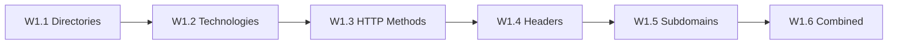

# Chapter W1: Web Reconnaissance

## Why Web Reconnaissance Comes First

Every web application penetration test begins with the same question: what is the target exposing? Before you can test for SQL injection, cross-site scripting, or authentication flaws, you need a map of the application's attack surface. Web reconnaissance builds that map, directory by directory, header by header, subdomain by subdomain.

Reconnaissance is not a single scan. A directory enumeration reveals hidden paths. Technology identification tells you what software powers the application. HTTP method testing uncovers API misconfigurations. Header analysis exposes information leaks and missing security controls. Subdomain discovery reveals forgotten services that no one remembered to lock down. Across six labs, you will build from a single gobuster scan to a complete reconnaissance methodology, learning why each layer of investigation matters.

In a real engagement, incomplete reconnaissance leads to missed vulnerabilities. An admin panel hidden behind an unlinked directory will not appear in a casual browse. A staging subdomain with debug mode enabled will not show up unless you enumerate it. The progression in this chapter ensures you never stop at the surface.

## What You Will Learn

The six labs in this chapter progress from targeted to comprehensive:

- **Enumerate** hidden directories and files using wordlist-based brute forcing
- **Identify** the technology stack powering a web application through headers and fingerprinting
- **Test** HTTP methods to find dangerous API misconfigurations
- **Analyze** HTTP headers for security weaknesses and information disclosure
- **Discover** subdomains to map the full attack surface beyond the main application
- **Combine** all techniques into a complete reconnaissance workflow

By the end of this chapter, you will have a repeatable methodology for assessing any web application, from the first directory scan to a comprehensive attack surface report.

## What Is Web Reconnaissance?

Web reconnaissance (also called web enumeration or web footprinting) is the process of gathering information about a web application and its infrastructure. Unlike network scanning, which focuses on open ports and services, web reconnaissance targets the application layer: the directories, technologies, headers, and domains that define what an attacker can reach.

The table below lists the reconnaissance techniques you will use in this chapter.

| Technique              | What It Reveals                                  | Primary Tool   |
|------------------------|--------------------------------------------------|----------------|
| Directory enumeration  | Hidden paths, admin panels, backup files         | gobuster       |
| Technology ID          | Web server, framework, CMS, language versions    | curl, whatweb   |
| HTTP method testing    | Allowed methods, dangerous API configurations    | curl            |
| Header analysis        | Security headers, information disclosure         | curl            |
| Subdomain discovery    | Additional hosts, staging environments, APIs     | gobuster (DNS)  |
| Combined assessment    | Complete attack surface map                      | All tools       |

Each technique answers a different question about the target. Together, they produce the complete picture that later testing phases (authentication attacks, injection testing, and exploitation) depend on.

## What Is Gobuster?

Gobuster is an open-source tool for brute-forcing URIs (directories and files), DNS subdomains, and virtual host names. It works by testing entries from a wordlist against a target, reporting which entries return valid responses.

Gobuster operates in two modes relevant to this chapter:

- **Directory mode (`dir`)**: tests directory and file names against a web server
- **DNS mode (`dns`)**: tests subdomain names against a domain's DNS records

Gobuster is fast, multi-threaded, and widely used in penetration testing. Combined with curl for header inspection and whatweb for technology fingerprinting, it forms the core toolkit for web reconnaissance.

Gobuster is pre-installed on Kali Linux. You can verify your installation at any time:

```bash
gobuster --help
```

## The Reconnaissance Workflow

Each lab builds on the previous one, adding a new reconnaissance capability:



| Lab  | Core Technique               | What It Adds                         |
|------|------------------------------|--------------------------------------|
| W1.1 | `gobuster dir`               | Directory and file discovery         |
| W1.2 | `curl -I`, `whatweb`         | Technology stack identification      |
| W1.3 | `curl -X OPTIONS`            | HTTP method enumeration              |
| W1.4 | `curl -v`                    | Security header analysis             |
| W1.5 | `gobuster dns`               | Subdomain enumeration                |
| W1.6 | All tools combined           | Complete reconnaissance workflow     |

Notice the progression: each lab asks a different question about the same type of target. By the final lab, you will chain every technique into a systematic assessment that covers the full attack surface.

## Before You Start

Confirm the following before launching your first lab:

- [ ] VPN connection to the lab environment is active
- [ ] Terminal open and ready for commands
- [ ] Gobuster installed and accessible (type `gobuster --help` to confirm)
- [ ] curl installed and accessible (type `curl --version` to confirm)
- [ ] whatweb installed and accessible (type `whatweb --version` to confirm)
- [ ] Web browser available for inspecting pages and source code
- [ ] Notebook or text editor ready for recording findings
- [ ] Access to the OCR platform at the provided URL

Each lab takes approximately 20 to 40 minutes. Work through them in order: later labs assume familiarity with the tools and techniques from earlier ones.
