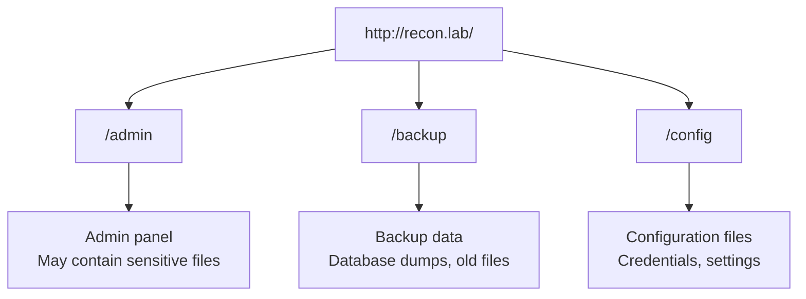

# Lab W1.1: Basic Directory Enumeration

## Before You Begin

- Confirm your VPN connection is active and you can reach the lab network.
- No credentials are needed: you will discover publicly accessible directories.
- You should be comfortable running commands in a Linux terminal.

## Scenario

TechStart Inc, a rapidly growing tech startup, has hired your security team to assess their web application before its public launch. Your contact, **Sarah Chen** (CTO), has heard rumours from the development team about exposed directories and wants to understand what information is publicly accessible beyond the main page.

Your initial briefing indicates the application is hosted at `recon.lab`. TechStart wants a comprehensive security assessment, starting with reconnaissance. Your first task is to discover hidden directories, exposed files, and any information that could aid an attacker.

## Your Objectives

- Launch the lab environment and note the target hostname
- Use gobuster to discover hidden directories on the web server
- Identify common web directories (admin panels, backups, configuration files)
- Investigate discovered directories for sensitive information and files
- Record your findings and submit the flag

---

## Background: What Is Directory Enumeration?

Web applications serve content from directories on the server's file system. The main page is just the front door; behind it, the server may host administrative panels, backup files, configuration directories, and development resources that are not linked from any visible page. Directory enumeration systematically tests for these hidden paths.



The technique works by sending HTTP requests for directory names drawn from a wordlist. If the server returns a successful response (200 OK) or a redirect (301/302), the directory exists. A 404 Not Found means it does not. A 403 Forbidden means the directory exists but access is denied, which is still valuable information.

Common findings during directory enumeration include:

| Discovery Type      | Examples                          | Risk                              |
|---------------------|-----------------------------------|-----------------------------------|
| Admin panels        | `/admin`, `/administrator`        | Unauthorized management access    |
| Backup files        | `/backup`, `/old`, `.bak` files   | Source code or database exposure  |
| Configuration files | `/config`, `.env`, `web.config`   | Credentials, API keys             |
| Development paths   | `/dev`, `/test`, `/staging`       | Debug information, test accounts  |

## Tool Primer: Gobuster Directory Mode

Gobuster's `dir` mode tests directory and file names from a wordlist against a target URL. It is fast, multi-threaded, and reports HTTP status codes for each match.

**Syntax:**

```bash
gobuster dir -u <url> -w <wordlist>
```

**Key flags:**

| Flag             | Purpose                                          |
|------------------|--------------------------------------------------|
| `-u <url>`       | Target URL (required)                            |
| `-w <wordlist>`  | Path to wordlist file (required)                 |
| `-t <threads>`   | Number of concurrent threads (default: 10)       |
| `-x <ext>`       | File extensions to search (e.g., `-x php,txt`)   |
| `-o <file>`      | Save output to a file                            |
| `-s <codes>`     | Show only specific status codes                  |

**Common wordlists on Kali Linux:**

| Wordlist                                                          | Size       | Use Case         |
|-------------------------------------------------------------------|------------|------------------|
| `/usr/share/wordlists/dirb/common.txt`                            | ~4,600     | Quick general scan |
| `/usr/share/wordlists/dirbuster/directory-list-2.3-medium.txt`    | ~220,000   | Thorough scan    |
| `/usr/share/seclists/Discovery/Web-Content/common.txt`            | ~4,700     | General purpose  |

For beginner labs, the smaller `common.txt` wordlist is sufficient and much faster than the medium list.

**Sample output:**

```
===============================================================
Gobuster v3.6
===============================================================
[+] Url:            http://recon.lab
[+] Wordlist:       /usr/share/wordlists/dirb/common.txt
[+] Threads:        10
===============================================================
/admin                (Status: 200) [Size: 1234]
/backup               (Status: 301) [Size: 312] [--> http://recon.lab/backup/]
/config               (Status: 301) [Size: 312] [--> http://recon.lab/config/]
===============================================================
```

Each line shows a discovered path, its HTTP status code, and the response size. Status 200 means the content is directly accessible. Status 301 means the server redirected to the directory with a trailing slash.

---

## Walkthrough

### Step 1: Launch the Lab

Navigate to **Learning Paths** then **Web** then **Level 1**, click **Launch**, wait for **Running**, note the **target hostname** (`recon.lab`).

Write down the hostname. You will use it in every command that follows.

### Step 2: Verify Connectivity

Before scanning, confirm you can reach the target.

!!! kali "Check that the target web server responds"
    ```bash
    curl -s -o /dev/null -w "%{http_code}" http://recon.lab
    ```

You should see `200`, indicating the web server is responding. If you get no response, check your VPN connection.

Open `http://recon.lab` in a web browser. You should see a welcome page for recon.lab, a basic web server set up for directory enumeration practice. The main page does not link to any other directories. Everything beyond this page must be discovered through enumeration.

### Step 3: Run a Directory Scan

Open your terminal and run gobuster in directory mode.

!!! kali "Run a gobuster directory scan against the target"
    ```bash
    gobuster dir -u http://recon.lab -w /usr/share/wordlists/dirb/common.txt
    ```

Gobuster will test each entry from the wordlist against the target. The scan may take one to two minutes depending on thread count and network speed.

### Step 4: Read the Output

Your output should show several discovered directories with status codes 200, 301, 302, or 403. You are looking for directories like `/admin`, `/backup`, and `/config`, exactly the kind of paths that should not be publicly accessible on a production server.

Record every result, noting the status code for each:

**Understanding status codes:**

- **200**: the page exists and is directly accessible
- **301/302**: the directory exists and the server redirected (usually adding a trailing slash)
- **403**: the directory exists but the server denied access (still confirms existence)
- **404**: not found (gobuster does not show these by default)

### Step 5: Investigate Discovered Directories

Visit each discovered directory in your browser or with curl. Start with the most interesting: an admin directory on a web server is always a high-priority finding.

!!! kali "Fetch each discovered directory with curl"
    ```bash
    curl http://recon.lab/admin
    curl http://recon.lab/backup
    curl http://recon.lab/config
    ```

Browse the contents carefully. Some directories may display a file listing. Look at every file available. If you see a directory index, check each file it contains.

### Step 6: Look Inside Directories for Files

When you find an interesting directory, look deeper. Directories often contain files that are not listed on the page itself. Try common file names inside discovered directories.

!!! kali "Request a common file name inside the admin directory"
    ```bash
    curl http://recon.lab/admin/flag.txt
    ```

The `/admin` directory is the most sensitive path you discovered. An admin panel that is publicly accessible without authentication is a critical finding. Examine its contents thoroughly: check for any text files, configuration files, or data that has been left exposed.

### Step 7: Scan with File Extensions

Some sensitive files have specific extensions. Run a second scan targeting common file types.

!!! kali "Rescan with common file extensions appended"
    ```bash
    gobuster dir -u http://recon.lab -w /usr/share/wordlists/dirb/common.txt -x txt,php,html,bak
    ```

The `-x` flag appends each extension to every wordlist entry, testing paths like `/admin/flag.txt`, `/config.bak`, and `/backup.sql` in addition to the base directory names. The extension scan confirms files within the directories you already found.

### Record Your Findings

> **Target Hostname:** _______________
>
> | Directory       | Status Code | Contents / Notes            |
> |-----------------|-------------|-----------------------------|
> | `/admin`        |             |                             |
> | `/backup`       |             |                             |
> | `/config`       |             |                             |
> |                 |             |                             |
>
> **Files found inside directories:**
>
> | File Path               | Contents                        |
> |-------------------------|---------------------------------|
> |                         |                                 |
> |                         |                                 |
>
> **How to submit:** enter the flag on the exercise page exactly as you recovered it, keeping the `OCR{...}` wrapper.
>
> **Flag:** `OCR{_______________}`

### Step 8: Record the Flag

The flag is located in a text file within one of the discovered directories. Enter the flag in the format `OCR{________}` on the lab submission page.

### Step 9: Clean Up

Close any browser tabs open to the target. You have completed the directory enumeration phase.

---

## Analysis Questions

**1. Why do web applications have directories that are not linked from the main page?**

> Web applications accumulate directories over time: admin panels for management, backup directories from maintenance, development paths from testing, and configuration directories from deployment. Developers and administrators create these for operational reasons. Without a deliberate cleanup process, they persist on production servers even when they are no longer needed.

**2. What is the difference between a 403 and a 404 response during directory enumeration?**

> A 403 Forbidden response confirms the directory exists but access is denied. A 404 Not Found response means the path does not exist on the server. From an attacker's perspective, 403 is more valuable: it confirms a target that may be accessible through other means (credential discovery, parameter manipulation, or misconfiguration exploitation).

**3. Why should you scan with file extensions in addition to directory names?**

> Directory scans alone miss files within discovered directories. A file like `flag.txt` inside `/admin/` will not appear in a directory-only scan. Adding extensions with `-x` tests for files at every path level, catching sensitive documents that directory enumeration alone overlooks.

---

## Key Takeaways

- **Directory enumeration** reveals paths that are invisible from the main page
- **Gobuster** tests wordlist entries against a target and reports valid responses
- **Status codes** tell you whether a path exists (200, 301) or is blocked (403)
- **Wordlist selection** balances speed against coverage: start small, escalate if needed
- **File extension scanning** catches individual files (like `.txt` or `.bak`) within discovered directories
- **Admin directories** are high-priority findings: always investigate their contents thoroughly
- **Every discovered path** is a potential entry point that requires further investigation
