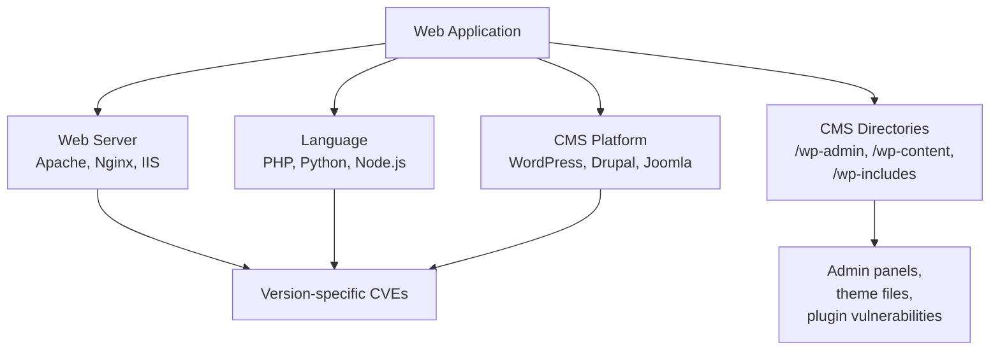

# Lab W1.2: Technology Identification

## Before You Begin

- Confirm your VPN connection is active and you can reach the lab network.
- You should have completed Lab W1.1 and be comfortable using curl from the command line.
- No credentials are needed: all information is gathered from public responses.

## Scenario

Continuing your assessment of TechStart Inc, **Sarah Chen** wants to understand what technologies power the company's web application. Your directory enumeration in the previous lab revealed several paths, but Sarah needs to know the full technology stack (web server software, programming languages, frameworks, and content management systems) so her team can evaluate whether any components have known vulnerabilities.

The application is accessible at `target.lab`. Your job is to fingerprint every technology in use and document version numbers wherever possible.

## Your Objectives

- Use curl to inspect HTTP response headers for server and framework information
- Run whatweb to perform comprehensive technology fingerprinting
- Identify the web server, programming language, framework, and CMS in use
- Explore CMS-specific directories and files that confirm the platform
- Document all version numbers discovered
- Record your findings and submit the flag

---

## Background: Why Technology Identification Matters

Every piece of software in a web application's stack introduces its own set of potential vulnerabilities. An Apache web server has different weaknesses than Nginx. A PHP application faces different threats than one built on Node.js. A WordPress site has an entirely different attack surface from a custom-built application. Knowing the exact technology stack transforms a generic web application into a set of specific software targets, each with its own CVE history.



Technology identification (also called fingerprinting) collects this information through several channels:

| Source               | What It Reveals                            | Example                        |
|----------------------|--------------------------------------------|---------------------------------|
| `Server` header      | Web server software and version            | `Apache/2.4.54`               |
| `X-Powered-By`       | Backend language or framework              | `PHP/8.1.0`                   |
| Custom headers        | CMS or framework identity                  | `X-Framework: WordPress/6.2.0`|
| HTML source           | Meta tags, script references               | `<meta name="generator" content="WordPress 6.2">`|
| Known file paths      | CMS structure confirmation                 | `/wp-admin/`, `/readme.html`  |
| `robots.txt`          | Directory structure, CMS directories       | `Disallow: /wp-admin/`        |

When you identify a CMS like WordPress, the attack surface expands dramatically. WordPress has its own admin panel (`/wp-admin`), a plugin ecosystem with known vulnerabilities, theme files that may leak information, and configuration files like `readme.html` that disclose the exact version.

## Tool Primer: curl and whatweb

**curl** is a command-line tool for transferring data with URLs. For reconnaissance, its most useful feature is fetching HTTP headers.

```bash
curl -I <url>          # Fetch headers only (HEAD request)
curl -v <url>          # Verbose output showing full request and response
curl -s <url>          # Silent mode (suppress progress bar)
```

**Key curl flags for reconnaissance:**

| Flag         | Purpose                                      |
|--------------|----------------------------------------------|
| `-I`         | Send HEAD request, show response headers only |
| `-v`         | Show complete HTTP exchange (verbose)         |
| `-s`         | Suppress progress meter                       |
| `-L`         | Follow redirects                              |
| `-A <agent>` | Set custom User-Agent string                  |

**whatweb** is a web application fingerprinting tool that identifies technologies by matching response patterns against a database of known signatures.

```bash
whatweb <url>           # Basic fingerprinting
whatweb -v <url>        # Verbose output with details
whatweb -a 3 <url>      # Aggressive mode (more requests, more detail)
```

whatweb checks HTTP headers, HTML content, JavaScript files, cookies, and URL patterns to build a comprehensive technology profile.

---

## Walkthrough

### Step 1: Launch the Lab

Navigate to **Learning Paths** then **Web** then **Level 1**, click **Launch**, wait for **Running**, note the **target hostname** (`target.lab`).

### Step 2: Fetch Response Headers with curl

Start by examining the HTTP response headers.

!!! kali "Fetch the response headers with curl"
    ```bash
    curl -I http://target.lab
    ```

The output will show headers returned by the server. Pay close attention to three headers:

- **`Server`**: identifies the web server software and version (e.g., `Apache/2.4.54`)
- **`X-Powered-By`**: reveals the backend programming language (e.g., `PHP/8.1.0`)
- **`X-Framework`**: a custom header that may identify the CMS or framework

Record every header value. In this lab, the server is intentionally configured with `ServerTokens Full`, meaning it discloses maximum version information. In production, administrators should suppress these details.

### Step 3: Run whatweb

Use whatweb for comprehensive fingerprinting.

!!! kali "Fingerprint the web stack with whatweb"
    ```bash
    whatweb http://target.lab
    ```

whatweb produces a compact summary identifying technologies. For more detail.

!!! kali "Run whatweb in verbose mode"
    ```bash
    whatweb -v http://target.lab
    ```

The verbose output breaks down each identified technology with the evidence that matched. Look for CMS identification: whatweb may detect a content management system by recognising its characteristic file structure, meta tags, or response patterns.

### Step 4: Inspect the HTML Source

Fetch the full page and look for technology clues in the HTML.

!!! kali "Retrieve the HTML source with curl"
    ```bash
    curl -s http://target.lab
    ```

Look for:

- **Meta generator tags**: a `<meta name="generator">` tag often identifies the CMS and version
- **Script tags**: `<script src="/wp-includes/js/...">` paths reveal WordPress
- **CSS references**: `/wp-content/themes/` paths confirm WordPress theming
- **HTML comments**: developers sometimes leave framework-specific comments

If the page references paths like `/wp-content/`, `/wp-includes/`, or `/wp-admin/`, the application is running WordPress or simulating its structure.

### Step 5: Explore CMS-Specific Paths

Once you identify the CMS, check its known file paths. WordPress has several predictable locations.

!!! kali "Probe the WordPress file paths"
    ```bash
    curl http://target.lab/readme.html
    curl http://target.lab/robots.txt
    curl http://target.lab/wp-admin/
    curl http://target.lab/wp-content/
    curl http://target.lab/wp-includes/
    ```

- **`readme.html`**: WordPress ships with a readme file that often includes the version number
- **`robots.txt`**: may list WordPress-specific directories that the site owner wants hidden from search engines
- **`/wp-admin/`**: the WordPress administration panel; check if it is accessible and what it contains

Investigate each path. The flag for this lab is located within one of these CMS-specific directories.

### Step 6: Check the Admin Directory

Navigate into the WordPress admin directory and look for exposed files.

!!! kali "Check the admin directory for the flag file"
    ```bash
    curl http://target.lab/wp-admin/
    curl http://target.lab/wp-admin/flag.txt
    ```

WordPress admin directories sometimes contain configuration files, backup scripts, or in this case, a flag file that should not be publicly accessible. The fact that you can reach it without authentication is the vulnerability.

### Record Your Findings

> **Target Hostname:** _______________
>
> **Technology Stack:**
>
> | Component        | Identified Value          | Source (header/page/path) |
> |------------------|---------------------------|---------------------------|
> | Web Server       |                           |                           |
> | Language         |                           |                           |
> | CMS / Framework  |                           |                           |
> | CMS Version      |                           |                           |
>
> **CMS Directories Found:**
>
> | Path              | Accessible? | Contents                   |
> |-------------------|-------------|----------------------------|
> | `/wp-admin/`      |             |                            |
> | `/wp-content/`    |             |                            |
> | `/wp-includes/`   |             |                            |
> | `/readme.html`    |             |                            |
>
> **How to submit:** enter the flag on the exercise page exactly as you recovered it, keeping the `OCR{...}` wrapper.
>
> **Flag:** `OCR{_______________}`

### Step 7: Record the Flag

Enter the flag discovered during technology identification in the format `OCR{________}` on the lab submission page.

---

## Analysis Questions

**1. Why do web servers include version information in the `Server` header by default?**

> The HTTP specification defines the `Server` header as a way for servers to identify themselves. Most web server software includes the version by default for interoperability and debugging purposes. From a security perspective, this is information disclosure: administrators should configure their servers to suppress or minimise version details in production (e.g., `ServerTokens Prod` in Apache).

**2. Why is identifying a CMS like WordPress more valuable than identifying just the web server?**

> A CMS identification opens a much larger attack surface. WordPress has known admin panel paths (`/wp-admin`), a plugin ecosystem with frequent vulnerabilities, theme files that may leak information, and predictable file structures. Knowing the CMS version maps to specific CVEs and known exploits. The web server alone tells you far less about the application's vulnerabilities.

**3. Why should `readme.html` and similar default files be removed from production WordPress installations?**

> Default files like `readme.html` disclose the exact WordPress version, which maps directly to known vulnerabilities. An attacker who reads the readme file can immediately search for exploits targeting that specific version. Removing default files is part of WordPress hardening: it does not fix vulnerabilities, but it removes the information that helps attackers identify them.

---

## Key Takeaways

- **HTTP headers** are the fastest source of technology information: check `Server`, `X-Powered-By`, and custom headers first
- **whatweb** automates fingerprinting by matching response patterns against known technology signatures
- **CMS identification** (e.g., WordPress) reveals an entire ecosystem of known paths, admin panels, and vulnerabilities
- **Default files** like `readme.html` and `robots.txt` often disclose version numbers and directory structures
- **CMS-specific directories** (`/wp-admin/`, `/wp-content/`) should be access-controlled but are frequently left exposed
- **Version numbers** are the critical detail: they map directly to vulnerability databases and known exploits
