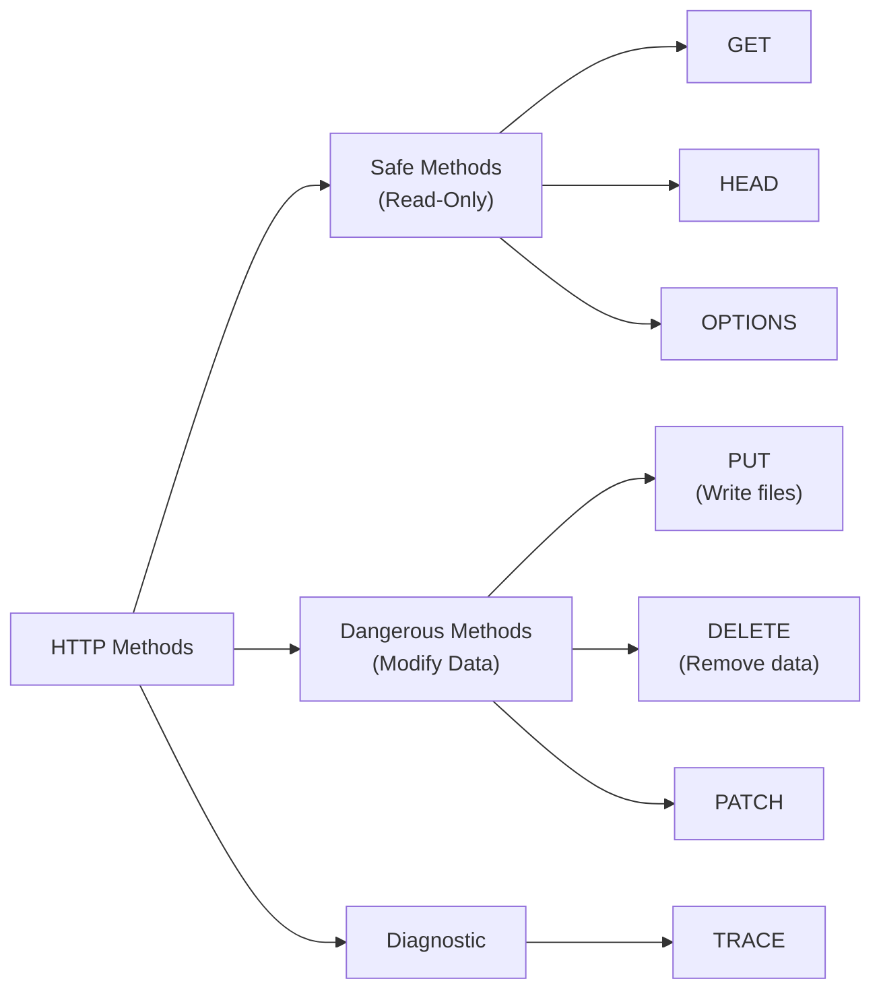

# Lab W1.3: HTTP Methods Enumeration

## Before You Begin

- Confirm your VPN connection is active and you can reach the lab network.
- You should have completed Labs W1.1 and W1.2 and be comfortable using curl.
- No credentials are needed: you will test HTTP methods from the outside.

## Scenario

Your reconnaissance of TechStart Inc has revealed an API endpoint at `api.lab`. **Sarah Chen** is particularly concerned about API security, since the application relies heavily on RESTful services for mobile and third-party integrations. During your initial assessment, you noticed the API responds to various HTTP methods. You need to enumerate which methods are allowed and test for potentially dangerous configurations.

If methods like PUT or DELETE are enabled without proper authorisation, an attacker could modify or destroy data without ever authenticating. Worse, a PUT method that accepts file uploads could allow an attacker to write files directly to the server.

## Your Objectives

- Understand the purpose of each HTTP method and its security implications
- Use the OPTIONS method to enumerate allowed methods on the API endpoint
- Test each allowed method to assess whether proper access controls exist
- Discover what happens when you send a PUT request with data
- Record your findings and submit the flag

---

## Background: HTTP Methods and API Security

HTTP methods (also called verbs) define the action a client wants to perform on a server resource. While most users only encounter GET (loading pages) and POST (submitting forms), the HTTP specification defines several additional methods.



| Method   | Purpose                              | Security Risk                        |
|----------|--------------------------------------|--------------------------------------|
| GET      | Retrieve a resource                  | Low: read-only                       |
| POST     | Submit data to create/update         | Medium: creates resources            |
| PUT      | Replace an entire resource           | High: overwrites or creates files    |
| DELETE   | Remove a resource                    | High: destroys data                  |
| OPTIONS  | Describe allowed methods             | Low: informational                   |
| HEAD     | Like GET but returns headers only    | Low: read-only                       |
| TRACE    | Echo the request back to the client  | Medium: enables cross-site tracing   |
| PATCH    | Partial modification of a resource   | High: modifies data                  |

The security concern is not that these methods exist: APIs need them to function. The concern is when dangerous methods are enabled without proper authentication or authorisation. A PUT method that accepts data from any unauthenticated client is an open door for file upload attacks. In this lab, the server uses Apache's `.htaccess` rewrite rules to route different HTTP methods to a PHP handler, and the PUT method actually creates files on the server.

## Tool Primer: curl with HTTP Methods

curl's `-X` flag sends a request using any HTTP method. Combined with `-v` for verbose output, you can see exactly what the server accepts.

**Syntax:**

```bash
curl -X <METHOD> <url> -v
```

**Key flags for method testing:**

| Flag             | Purpose                                      |
|------------------|----------------------------------------------|
| `-X <method>`    | Specify the HTTP method to use               |
| `-v`             | Show full request and response headers       |
| `-I`             | Send HEAD request (shortcut for `-X HEAD`)   |
| `-d <data>`      | Send data in the request body                |
| `-H <header>`    | Add a custom header to the request           |

---

## Walkthrough

### Step 1: Launch the Lab

Navigate to **Learning Paths** then **Web** then **Level 1**, click **Launch**, wait for **Running**, note the **target hostname** (`api.lab`).

Open `http://api.lab` in a browser or with curl to see the main page. You should see a welcome page indicating this is an API endpoint for HTTP methods testing.

### Step 2: Send an OPTIONS Request

The OPTIONS method is designed to reveal which methods a server endpoint supports. The response includes an `Allow` header listing them.

!!! kali "Enumerate allowed methods with an OPTIONS request"
    ```bash
    curl -X OPTIONS http://api.lab -v
    ```

In the verbose output, look for a line in the response that lists allowed methods:

```
Allowed methods: GET, POST, PUT, DELETE, OPTIONS, TRACE
```

The OPTIONS response tells you exactly which methods the server accepts. Record every method listed: you will test each one.

### Step 3: Test GET

Confirm the standard GET method works.

!!! kali "Confirm the endpoint serves content with GET"
    ```bash
    curl -X GET http://api.lab -v
    ```

A 200 OK response confirms the endpoint serves content. Read the response body for any useful information about the API.

### Step 4: Test PUT (File Creation)

The PUT method is the most dangerous finding in this lab. Test whether the server accepts PUT requests with data.

!!! kali "Send a PUT request with a data body"
    ```bash
    curl -X PUT http://api.lab -v -d "test=data"
    ```

Read the response carefully. If the server accepted the PUT request, it may have created a file on the server. The response body will tell you what happened and where the file was written.

The server's `.htaccess` configuration routes PUT requests to a PHP handler that creates files in an `/uploads/` directory. Check whether a flag file was created.

!!! kali "Retrieve the file written by the PUT handler"
    ```bash
    curl http://api.lab/uploads/flag.txt
    ```

A PUT method that creates files on the server without authentication is the critical finding here: it allows an attacker to upload malicious content such as web shells, phishing pages, or any other files.

### Step 5: Test DELETE

Test whether the server accepts DELETE requests.

!!! kali "Probe the DELETE method"
    ```bash
    curl -X DELETE http://api.lab -v
    ```

Read the response. The server may confirm that DELETE is accepted, even if it does not actually delete a resource. A DELETE method that returns 200 without authentication could allow an attacker to destroy resources.

### Step 6: Test TRACE

The TRACE method echoes the request back to the client. It is a diagnostic tool that can be exploited for cross-site tracing (XST) attacks.

!!! kali "Check whether TRACE echoes the request"
    ```bash
    curl -X TRACE http://api.lab -v
    ```

If TRACE is enabled, the response body contains a copy of your request including all headers. Check whether the server echoes your request headers back: an attacker can use this to steal authentication cookies via XSS in some scenarios.

### Step 7: Test Remaining Methods

Systematically test any other methods from the OPTIONS response.

!!! kali "Test the remaining POST, HEAD, and PATCH methods"
    ```bash
    curl -X POST http://api.lab -v -d "test=data"
    curl -X HEAD http://api.lab -v
    curl -X PATCH http://api.lab -v
    ```

Document the response code and behaviour for each method.

### Record Your Findings

> **Target Hostname:** _______________
>
> | Method   | Response Code | Behaviour / Notes                    |
> |----------|---------------|--------------------------------------|
> | OPTIONS  |               |                                      |
> | GET      |               |                                      |
> | POST     |               |                                      |
> | PUT      |               |                                      |
> | DELETE   |               |                                      |
> | TRACE    |               |                                      |
> | HEAD     |               |                                      |
>
> **Allowed Methods (from OPTIONS):** _______________
>
> **PUT result, file created at:** _______________
>
> **How to submit:** enter the flag on the exercise page exactly as you recovered it, keeping the `OCR{...}` wrapper.
>
> **Flag:** `OCR{_______________}`

### Step 8: Record the Flag

Enter the flag discovered during HTTP method enumeration in the format `OCR{________}` on the lab submission page.

---

## Analysis Questions

**1. Why is an unauthenticated PUT method that creates files particularly dangerous?**

> PUT with file creation allows an attacker to write arbitrary content to the web server. The most critical risk is uploading a web shell, a small script (often PHP) that gives the attacker command execution on the server. Even without a web shell, an attacker could upload phishing pages, deface the site, or store malicious content. The `/uploads/` directory in this lab was writable by the web server (chmod 777), compounding the risk.

**2. Why should TRACE be disabled on production servers?**

> TRACE echoes the complete HTTP request back to the client, including all headers. If an attacker can trigger a TRACE request via XSS, the response will contain authentication cookies and authorisation headers that the browser normally protects from JavaScript access. The technique is called a cross-site tracing (XST) attack.

**3. A server returns 401 Unauthorized for a DELETE request. Is that safer than returning 405 Method Not Allowed?**

> A 401 response means the method is enabled but requires authentication. A 405 response means the method is not supported at all. From a security standpoint, 405 is safer: the capability does not exist. With 401, the attacker knows the method works and only needs to find valid credentials. Disabling unnecessary methods is always more secure than relying on authentication to gate them.

---

## Key Takeaways

- **HTTP methods** define the action a client performs on a resource: not all methods are safe
- **OPTIONS** reveals which methods a server accepts via the response body or `Allow` header
- **PUT can create files** on the server: an unauthenticated PUT is a critical vulnerability
- **The `/uploads/` directory** received the flag file created by the PUT handler
- **TRACE** enables cross-site tracing attacks and should be disabled in production
- **Response codes** distinguish between disabled (405), gated (401/403), and open (200) methods
- **`.htaccess` routing** can silently forward HTTP methods to PHP handlers that perform dangerous operations
