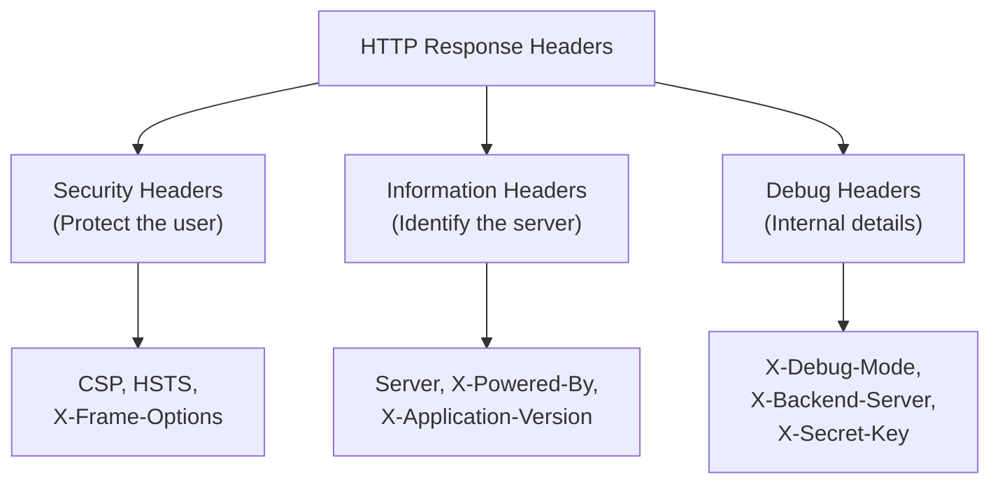

# Lab W1.4: Header Analysis

## Before You Begin

- Confirm your VPN connection is active and you can reach the lab network.
- You should have completed Labs W1.1 through W1.3 and be familiar with curl's verbose output.
- No credentials are needed: header analysis is entirely passive.

## Scenario

**Sarah Chen** at TechStart Inc mentioned that her security team recently implemented various security headers across the company's web application at `secure.lab`. She wants you to verify the configuration and identify any information disclosure issues. Misconfigured or missing security headers can leave the application vulnerable to cross-site scripting, clickjacking, and protocol downgrade attacks, even when the application code itself is secure.

Your job is to analyse every HTTP header the server returns, assess the security posture, and find any sensitive information being leaked through headers, including on pages beyond the main index.

## Your Objectives

- Fetch and examine all HTTP response headers from the target
- Identify security headers that are present and verify their configuration
- Detect missing security headers that leave the application vulnerable
- Find information disclosure in server, debug, and custom headers
- Explore beyond the main page, checking other endpoints for additional headers
- Record your findings and submit the flag

---

## Background: HTTP Security Headers

HTTP headers travel with every request and response between browser and server. Security headers instruct the browser to enable specific protections: blocking cross-site scripting, preventing clickjacking, or forcing encrypted connections. When these headers are missing, the browser uses its default behaviour, which is often permissive.



**Critical security headers:**

| Header                         | Purpose                                    | Recommended Value                |
|--------------------------------|--------------------------------------------|----------------------------------|
| `Content-Security-Policy`      | Controls which resources the browser loads | `default-src 'self'`             |
| `Strict-Transport-Security`    | Forces HTTPS for all future requests       | `max-age=31536000`               |
| `X-Frame-Options`              | Prevents the page from being framed        | `DENY` or `SAMEORIGIN`          |
| `X-Content-Type-Options`       | Blocks MIME-type sniffing                  | `nosniff`                        |
| `X-XSS-Protection`             | Enables legacy browser XSS filter          | `1; mode=block`                  |
| `Referrer-Policy`              | Controls referrer information in requests  | `strict-origin-when-cross-origin`|

**Information disclosure headers to watch for:**

| Header                   | Risk                                              |
|--------------------------|---------------------------------------------------|
| `Server`                 | Reveals web server software and version           |
| `X-Powered-By`           | Reveals backend language or framework             |
| `X-Backend-Server`       | Leaks internal server hostnames                   |
| `X-Debug-Mode`           | Confirms debugging is active in production        |
| `X-Application-Version`  | Reveals exact application version for CVE lookup  |
| Custom headers           | May contain secrets, internal paths, or tokens    |

A missing security header is a finding. A verbose information header is a finding. A custom header leaking secrets is a critical finding. All of them go in the report.

## Tool Primer: curl for Header Analysis

For header analysis, curl provides two essential modes:

```bash
curl -I http://target      # HEAD request: response headers only
curl -v http://target      # Verbose: full request and response with headers
```

**Filtering headers from verbose output:**

```bash
curl -v http://target 2>&1 | grep "^<"    # Show only response headers
curl -v http://target 2>&1 | grep "^>"    # Show only request headers
```

The `2>&1` redirects stderr to stdout because curl writes verbose output to stderr by default.

**Checking for specific headers:**

```bash
curl -I http://target | grep -i "x-frame-options"
curl -I http://target | grep -i "content-security-policy"
curl -I http://target | grep -i "strict-transport"
```

---

## Walkthrough

### Step 1: Launch the Lab

Navigate to **Learning Paths** then **Web** then **Level 1**, click **Launch**, wait for **Running**, note the **target hostname** (`secure.lab`).

Open `http://secure.lab` in a browser. The main page states that the application requires header analysis to find the flag. The flag is not in the page content: it is hidden in the HTTP headers themselves.

### Step 2: Fetch All Response Headers

Start with a HEAD request to see all response headers on the main page.

!!! kali "Fetch all response headers"
    ```bash
    curl -I http://secure.lab
    ```

Read through every header in the response. You should see a mix of standard and custom headers. Note each one: this server is intentionally configured to disclose excessive information.

Look for these specific headers:

- **`Server`**: will show the exact Apache version and operating system
- **`X-Powered-By`**: reveals the PHP version
- **`X-Backend-Server`**: leaks an internal hostname (e.g., `web-server-01.internal.lab`)
- **`X-Debug-Mode`**: confirms debugging is enabled (should never be on in production)
- **`X-Application-Version`**: discloses the application version number
- **`X-XSS-Protection: 0`**: intentionally set to disabled (the weakest possible value)

### Step 3: Check for Missing Security Headers

Systematically check for each critical security header.

!!! kali "Check for missing security headers"
    ```bash
    curl -I http://secure.lab | grep -i "strict-transport"
    curl -I http://secure.lab | grep -i "content-security-policy"
    curl -I http://secure.lab | grep -i "x-frame-options"
    curl -I http://secure.lab | grep -i "x-content-type-options"
    ```

The server is intentionally missing several critical security headers:

- **No `Strict-Transport-Security`**: vulnerable to SSL stripping attacks
- **No `X-Frame-Options`**: vulnerable to clickjacking
- **No `X-Content-Type-Options`**: vulnerable to MIME-type sniffing
- **No `Content-Security-Policy`**: vulnerable to XSS via resource injection

Each missing header is a finding for your report.

### Step 4: Explore Other Endpoints

The main page is not the only endpoint. Servers often return different headers on different pages. Check whether a `headers.php` endpoint exists.

!!! kali "Probe the headers.php endpoint"
    ```bash
    curl -v http://secure.lab/headers.php
    ```

Read the response headers carefully. The endpoint includes additional custom headers that do not appear on the main page:

- **`X-Flag-Hint`**: a header pointing you toward the flag
- **`X-Internal-Server`**: confirms the internal hostname
- **`X-Secret-Key`**: contains the flag value itself

The flag for this lab is embedded directly in an HTTP response header on the `/headers.php` endpoint. The placement demonstrates a real-world risk: developers sometimes embed secrets, API keys, or debug information in custom HTTP headers, assuming that users will not inspect the raw HTTP traffic.

### Step 5: Extract the Flag from Headers

To cleanly extract the flag header, filter for the secret key.

!!! kali "Extract the flag from the header"
    ```bash
    curl -I http://secure.lab/headers.php | grep -i "x-secret-key"
    ```

The `X-Secret-Key` header value is the flag.

### Step 6: Build a Security Header Audit

Create a complete audit by checking each header against best practices:

| Header                      | Expected        | Found? | Value / Notes |
|-----------------------------|-----------------|--------|---------------|
| `Content-Security-Policy`   | Present         |        |               |
| `Strict-Transport-Security` | Present         |        |               |
| `X-Frame-Options`           | `DENY`          |        |               |
| `X-Content-Type-Options`    | `nosniff`       |        |               |
| `X-XSS-Protection`          | `1; mode=block` |        |               |
| `Server`                    | Minimal info    |        |               |
| `X-Powered-By`              | Absent          |        |               |
| `X-Backend-Server`          | Absent          |        |               |
| `X-Debug-Mode`              | Absent          |        |               |

### Record Your Findings

> **Target Hostname:** _______________
>
> **Information Disclosure Headers (main page):**
>
> | Header                   | Value                               |
> |--------------------------|-------------------------------------|
> | `Server`                 |                                     |
> | `X-Powered-By`           |                                     |
> | `X-Backend-Server`       |                                     |
> | `X-Debug-Mode`           |                                     |
> | `X-Application-Version`  |                                     |
> | `X-XSS-Protection`       |                                     |
>
> **Security Headers Missing:**
>
> | Header                      | Risk if Missing                     |
> |-----------------------------|-------------------------------------|
> |                             |                                     |
> |                             |                                     |
>
> **Additional Headers from `/headers.php`:**
>
> | Header              | Value                                  |
> |---------------------|----------------------------------------|
> | `X-Flag-Hint`       |                                        |
> | `X-Internal-Server`  |                                        |
> | `X-Secret-Key`       |                                        |
>
> **How to submit:** enter the flag on the exercise page exactly as you recovered it, keeping the `OCR{...}` wrapper.
>
> **Flag:** `OCR{_______________}`

### Step 7: Record the Flag

Enter the flag from the `X-Secret-Key` header in the format `OCR{________}` on the lab submission page.

---

## Analysis Questions

**1. Why is a missing Content-Security-Policy header a security concern?**

> Without CSP, the browser loads resources (scripts, styles, images) from any origin. An attacker who finds a cross-site scripting vulnerability can inject a script tag pointing to their own server, and the browser will execute it without restriction. CSP limits which origins the browser trusts, containing the impact of XSS.

**2. Why should debug headers like `X-Debug-Mode` and `X-Backend-Server` never appear in production?**

> Debug headers expose internal architecture details. `X-Backend-Server` reveals internal hostnames that help an attacker map the network. `X-Debug-Mode: enabled` confirms the application is running in a verbose error state, which typically means stack traces, database queries, and file paths are visible in error responses. Those leaked details dramatically simplify an attacker's work.

**3. Why was the flag hidden in a header on `/headers.php` rather than on the main page?**

> The hidden flag demonstrates that different endpoints return different headers. Security testing must check headers across all accessible pages, not just the main index. Developers often add debug endpoints or test pages with additional headers that leak information. A tester who only checks the main page misses findings on secondary endpoints entirely.

---

## Key Takeaways

- **Security headers** instruct the browser to enable protections like XSS filtering and HTTPS enforcement
- **Missing security headers** are vulnerabilities: the browser defaults to permissive behaviour without them
- **Information disclosure headers** reveal software versions, internal hostnames, and debug states
- **Custom headers** can contain secrets: the flag in this lab was embedded in `X-Secret-Key`
- **Different endpoints return different headers**: always check paths beyond the main page
- **curl with `-I` and `-v`** are the primary tools for quick header analysis
- **`/headers.php`** is a common pattern for header-testing endpoints in web applications
