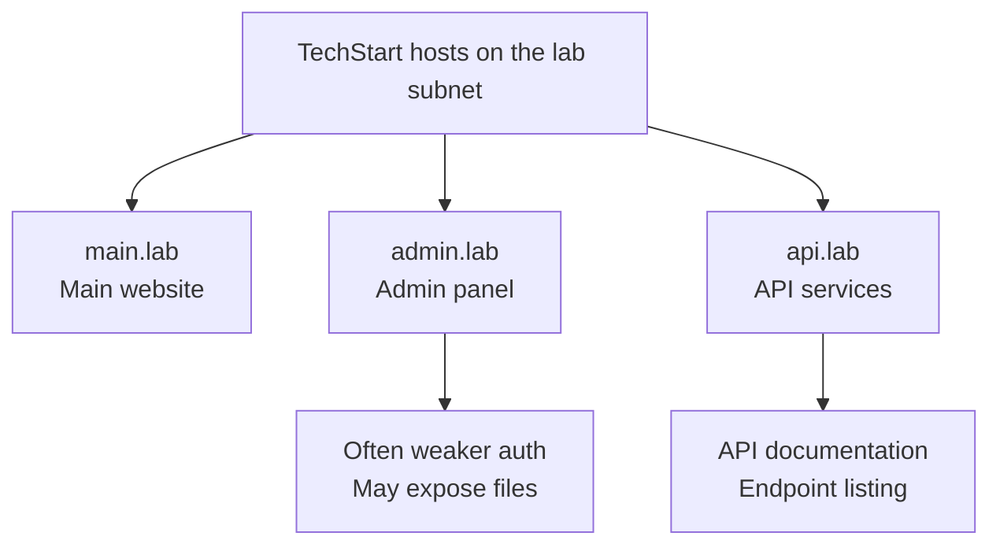

# Lab W1.5: Subdomain Discovery

## Before You Begin

- Confirm your VPN connection is active and you can reach the lab network.
- You should have completed Labs W1.1 through W1.4 and be comfortable with nmap and curl.
- No credentials are needed: subdomain discovery in this lab uses a subnet sweep and HTTP requests.

## Scenario

Your assessment of TechStart Inc has focused on a single hostname so far. **Sarah Chen** now wants a complete picture of all publicly accessible subdomains. The development team has been rapidly deploying new services, and Sarah is concerned that some may have been overlooked in security reviews.

Subdomain discovery is crucial for mapping the full attack surface. Less-secured subdomains (admin panels, staging environments, internal APIs) often provide entry points that the main application does not. Your job is to discover every subdomain associated with TechStart's domain and investigate each one.

## Your Objectives

- Understand subdomain enumeration concepts and techniques
- Sweep the lab subnet to find every live web server
- Fingerprint each host with curl to tell the main, admin, and API services apart
- Map the discovered hosts to hostnames in `/etc/hosts`
- Retrieve the flag from the admin host

---

## Important: Why DNS-Mode Tools Will Not Work Here

In a real engagement, subdomain enumeration leans on DNS. Tools query a resolver, brute-force names against it, or scrape certificate transparency logs. The lab environment is different, and the difference changes the whole approach.

The TechStart "subdomains" in this lab are not name-based virtual hosts behind a single IP. Each one is a **separate host at its own IP address** on the lab subnet, and there is **no DNS server** in front of them. Nothing resolves `admin.lab` to an address until you map it yourself.

As a result, DNS-mode tools have nothing to talk to and will return no results:

| Tool                | Why it fails here                                              |
|---------------------|---------------------------------------------------------------|
| `gobuster dns`      | Brute-forces names against a DNS resolver: there is no resolver |
| `dnsrecon`          | Queries DNS records: there are no records to query            |
| `sublist3r`         | Scrapes public sources for a real domain: the lab domain is internal |

Host-header fuzzing against a single IP fails for the same reason. The hosts are not vhosts sharing one address, so changing the `Host:` header on one IP never reveals the others.

The reliable method is a **subnet sweep**: find every live web server on the subnet, fingerprint each one, then map the addresses to friendly names. The walkthrough below does exactly that.

---

## Background: Why Subdomains Expand the Attack Surface

Organisations frequently deploy services on subdomains rather than separate directories. An admin panel might live at `admin.example.com`, an API at `api.example.com`, and a staging environment at `staging.example.com`. Each subdomain is effectively a separate web application, often running on its own server with its own configuration, security controls, and potential vulnerabilities.



The main application may have strong security controls, but a forgotten admin host might have files exposed without authentication. The risk shows up directly in this lab: one of the hosts serves the flag in an accessible file.

**Common subdomain categories:**

| Category       | Examples                            | Typical Risk                       |
|----------------|-------------------------------------|------------------------------------|
| Admin          | `admin`, `panel`, `manage`          | Management access, exposed files   |
| API            | `api`, `rest`, `graphql`            | Data access, injection points      |
| Development    | `dev`, `test`, `staging`, `uat`     | Debug info, test credentials       |
| Infrastructure | `mail`, `vpn`, `monitor`, `db`      | Internal service exposure          |
| Legacy         | `old`, `backup`, `v1`, `archive`    | Outdated and unpatched software    |

## Tool Primer: nmap Host Sweep

Because the hosts live at separate IP addresses, an nmap port sweep is the right discovery tool. Scanning the web port across the whole subnet lists every host that answers on port 80.

**Syntax:**

```bash
nmap -p 80 --open <subnet>/24
```

**Key flags:**

| Flag         | Purpose                                                  |
|--------------|----------------------------------------------------------|
| `-p 80`      | Scan only the HTTP port (fast)                           |
| `--open`     | Show only hosts with the port open, hiding the rest      |
| `-sn`        | Ping sweep with no port scan (host discovery only)       |
| `-oG <file>` | Save greppable output for scripting follow-up scans      |

**Sample output:**

```
Starting Nmap 7.94 ( https://nmap.org )
Nmap scan report for <subnet>.127
Host is up.
PORT   STATE SERVICE
80/tcp open  http

Nmap scan report for <subnet>.131
Host is up.
PORT   STATE SERVICE
80/tcp open  http

Nmap scan report for <subnet>.137
Host is up.
PORT   STATE SERVICE
80/tcp open  http
```

Each report block is one live web server. The set of addresses is the list of hosts to investigate.

---

## Walkthrough

### Step 1: Launch the Lab

Navigate to **Learning Paths** then **Web** then **Level 1**, click **Launch**, wait for **Running**. Read the **target subnet** from the lab panel (for example `10.X.Y.0/24`). The lab deploys three separate hosts on that subnet: a main site, an admin panel, and an API service.

Write down the subnet. You will use it in the sweep that follows.

!!! note "Placeholder addresses"
    Throughout this lab, `<subnet>` stands for the first three octets shown in your lab panel (for example `10.X.Y`), and addresses like `<subnet>.131` are the live hosts your own sweep returns. Substitute the real values before running each command.

### Step 2: Verify the Main Host

Confirm the main host is reachable. Use the address at the lowest offset from your panel:

!!! kali "Run on Kali"
    ```bash
    curl -s http://<subnet>.127/
    ```

You should see a welcome page for the main TechStart site. The page may hint that other services exist on the network.

### Step 3: Sweep the Subnet for Web Servers

DNS enumeration finds nothing here, so sweep the subnet for hosts listening on port 80:

!!! kali "Run on Kali"
    ```bash
    nmap -p 80 --open <subnet>.0/24
    ```

`--open` keeps only the hosts with port 80 listening, so the output is exactly the set of web servers to investigate. You should see three live addresses.

If nmap is unavailable, a curl loop does the same job:

!!! kali "Run on Kali"
    ```bash
    for ip in $(seq 1 254); do
        host="<subnet>.$ip"
        code=$(curl -s -o /dev/null -m 1 -w '%{http_code}' http://$host/)
        [ "$code" = "200" ] && echo "[+] live: $host"
    done
    ```

Record every live address. Each one is a separate TechStart service.

### Step 4: Fingerprint Each Host

The sweep gives you addresses but not roles. Fetch the front page of each live host to tell them apart:

!!! kali "Run on Kali"
    ```bash
    curl -s http://<subnet>.127/   # main site
    curl -s http://<subnet>.131/   # admin panel
    curl -s http://<subnet>.137/   # api service
    ```

Read each response carefully:

- The **main** host serves the primary TechStart website.
- The **admin** host presents itself as an administration panel. Its page text tells you where the flag is located.
- The **api** host returns API content rather than a normal web page.

The admin host is the high-value finding. Admin panels deployed on their own hosts frequently have weaker security controls than the main application.

### Step 5: Map the Hosts in /etc/hosts

Mapping the addresses to friendly names makes the rest of the work readable. Add the live addresses from your sweep:

!!! kali "Run on Kali"
    ```bash
    sudo bash -c 'cat >> /etc/hosts <<EOF
    <subnet>.127  main.lab
    <subnet>.131  admin.lab
    <subnet>.137  api.lab
    EOF'

    grep lab /etc/hosts
    ```

After the mapping is in place, the hosts respond to their names:

!!! kali "Run on Kali"
    ```bash
    curl -I http://admin.lab
    curl -I http://api.lab
    ```

### Step 6: Retrieve the Flag from the Admin Host

The admin host page tells you the flag location. Pull it directly:

!!! kali "Run on Kali"
    ```bash
    curl http://admin.lab/
    curl http://admin.lab/flag.txt
    ```

The flag file is served without authentication, which is a critical finding. In a real engagement, any attacker who reaches the admin host could read administrative files the same way.

### Step 7: Compare Security Across Hosts

Apply the header analysis skills from Lab W1.4 to each host:

!!! kali "Run on Kali"
    ```bash
    curl -I http://main.lab
    curl -I http://admin.lab
    curl -I http://api.lab
    ```

Compare the headers across the three hosts. Note any differences in:

- Server software and versions
- Security headers (X-Frame-Options, CSP, HSTS)
- Information disclosure headers

Header configurations often vary between hosts. The main application may carry proper headers while the admin host lacks them entirely.

### Record Your Findings

> **Target Subnet:** _______________
>
> **Discovered Hosts:**
>
> | Address          | Hostname        | Content / Purpose                     |
> |------------------|-----------------|---------------------------------------|
> | `<subnet>.127`   | `main.lab`      |                                       |
> | `<subnet>.131`   | `admin.lab`     |                                       |
> | `<subnet>.137`   | `api.lab`       |                                       |
>
> **Admin Host Files:**
>
> | File Path       | Accessible? | Contents                   |
> |-----------------|-------------|----------------------------|
> | `/flag.txt`     |             |                            |
>
> **How to submit:** enter the flag on the exercise page exactly as you recovered it, keeping the `OCR{...}` wrapper.
>
> **Flag:** `OCR{_______________}`

### Step 8: Record the Flag

Enter the flag from `admin.lab/flag.txt` in the format `OCR{________}` on the lab submission page.

---

## Analysis Questions

**1. Why does DNS-mode enumeration (gobuster dns, dnsrecon, sublist3r) find nothing in this lab?**

> Each tool depends on DNS. Gobuster dns and dnsrecon brute-force or query names against a resolver, and sublist3r scrapes public sources for a registered domain. The lab has no DNS server and no public registration, so there is nothing for them to query. The hosts exist only as separate IP addresses on the subnet, which is why a subnet sweep finds them and DNS tools do not.

**2. Why are admin hosts often less secure than the main application?**

> Admin interfaces are typically built for internal use and receive less scrutiny during security reviews. They may lack authentication on certain paths, skip security header configuration, or rely on the assumption that the host is "hidden." Obscurity is not security: a subnet sweep discovers these hosts in minutes.

**3. How does a subnet sweep differ from directory brute forcing?**

> Directory brute forcing sends HTTP requests to one web server and checks response codes for paths within that single host. A subnet sweep sends connection probes to many addresses and checks which hosts answer on the web port. They operate at different layers: directory enumeration works inside one host, while a subnet sweep discovers entirely separate hosts, each with its own application, server, and configuration.

---

## Key Takeaways

- **The lab subdomains are separate hosts** at distinct IP addresses, not name-based vhosts behind one IP.
- **No DNS server is present**, so `gobuster dns`, `dnsrecon`, and `sublist3r` return nothing.
- **A subnet sweep** (`nmap -p 80 --open <subnet>/24`) is the reliable discovery method here.
- **Per-host fingerprinting with curl** tells the main, admin, and API services apart.
- **Mapping hosts in `/etc/hosts`** lets you reach each one by name for the rest of the assessment.
- **The flag lives at `admin.lab/flag.txt`**, an unauthenticated file on the admin host, which is a critical finding.
