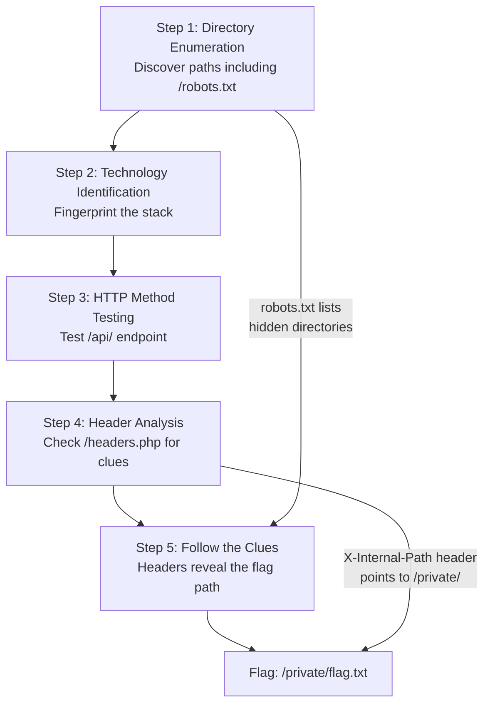

# Lab W1.6: Comprehensive Web Reconnaissance

## Before You Begin

- Confirm your VPN connection is active and you can reach the lab network.
- You should have completed Labs W1.1 through W1.5 and be comfortable with all reconnaissance tools.
- The lab combines every technique from the chapter, so review your notes if needed.

## Scenario

You are completing the reconnaissance phase of your penetration test for TechStart Inc. **Sarah Chen** has requested a comprehensive security assessment report that combines all the techniques you have used: directory enumeration, technology identification, HTTP method testing, header analysis, and subdomain discovery.

The target application is accessible at `target.lab`. TechStart needs this information to prioritise their security improvements before launch. Your report will form the foundation for the next phase of the engagement.

The capstone lab for the chapter pulls everything together. You will not learn a new tool. Instead, you will apply everything you have learned in a systematic workflow where each technique's findings lead to the next step.

## Your Objectives

- Perform directory enumeration to discover hidden paths and files
- Identify the full technology stack through headers and fingerprinting
- Test HTTP methods on discovered endpoints for misconfigurations
- Analyse security headers for missing protections and information leaks
- Follow the chain of clues across techniques to locate the flag
- Record your findings and submit the flag

---

## Background: The Reconnaissance Workflow

Professional penetration testers do not run tools randomly. They follow a structured workflow that ensures nothing is missed. Each technique builds on the last, and findings from one step inform the next.



In this lab, the flag is not found through a single technique. You must chain findings across multiple steps:

1. **Directory enumeration** reveals a `robots.txt` that lists hidden directories including `/private/`
2. **Header analysis** on `/headers.php` reveals an `X-Internal-Path` header pointing to the flag file
3. **Both clues converge** on the flag location at `/private/flag.txt`

The workflow mirrors real penetration testing, where high-value findings emerge from connecting observations across different techniques.

---

## Walkthrough

### Step 1: Launch the Lab

Navigate to **Learning Paths** then **Web** then **Level 1**, click **Launch**, wait for **Running**, note the **target hostname** (`target.lab`).

### Step 2: Directory Enumeration

Start by discovering all accessible directories and files.

!!! kali "Enumerate directories on the target"
    ```bash
    gobuster dir -u http://target.lab -w /usr/share/wordlists/dirb/common.txt
    ```

You should find several directories including `/admin`, `/api`, `/backup`, `/config`, `/uploads`, and `/private`. Record every path and its status code.

For a more thorough scan, add file extensions.

!!! kali "Scan for files with common extensions"
    ```bash
    gobuster dir -u http://target.lab -w /usr/share/wordlists/dirb/common.txt -x txt,php,html,bak
    ```

The scan reveals additional files, notably `robots.txt`, `version.txt`, and `headers.php`.

### Step 3: Check robots.txt

The `robots.txt` file is one of the first things to check on any web server. It tells search engine crawlers which paths to avoid, but for a penetration tester, it is a map of directories the site owner wants hidden.

!!! kali "Retrieve the robots.txt file"
    ```bash
    curl http://target.lab/robots.txt
    ```

You should see `Disallow` rules for several directories:

```
Disallow: /admin/
Disallow: /api/
Disallow: /backup/
Disallow: /config/
Disallow: /private/
Disallow: /uploads/
```

The `/private/` directory stands out: it was not visible during a casual browse of the site but is explicitly listed as off-limits to crawlers. The explicit listing makes it a high-priority investigation target.

### Step 4: Technology Identification

Fingerprint the technology stack.

!!! kali "Fingerprint the server and application stack"
    ```bash
    curl -I http://target.lab
    whatweb http://target.lab
    ```

The headers will reveal:

- **Server**: Apache version
- **X-Powered-By**: PHP version
- **X-Framework**: the application framework (e.g., Laravel)
- **X-Application-Version**: the specific application version

Check `version.txt` for additional version details.

!!! kali "Read the version file"
    ```bash
    curl http://target.lab/version.txt
    ```

The file explicitly lists the application version, framework version, and PHP version: information that maps directly to CVE databases.

### Step 5: HTTP Method Testing

Test the API endpoint discovered during directory enumeration.

!!! kali "Probe HTTP methods on the API endpoint"
    ```bash
    curl -X OPTIONS http://target.lab/api/ -v
    curl -X PUT http://target.lab/api/ -v
    curl -X DELETE http://target.lab/api/ -v
    ```

The `/api/` endpoint returns JSON responses and supports multiple HTTP methods. Document which methods are allowed and which return errors.

### Step 6: Header Analysis

Check the `/headers.php` endpoint for additional headers.

!!! kali "Inspect response headers from headers.php"
    ```bash
    curl -v http://target.lab/headers.php
    ```

Read the response headers carefully. You should find:

- **`X-Security-Headers: Missing`**: confirms security headers are not configured
- **`X-Debug-Mode: enabled`**: debug mode active in production
- **`X-Internal-Path`**: reveals an internal file path, pointing to the flag location
- **`X-Flag-Hint`**: a hint directing you to check a specific directory

The `X-Internal-Path` header value reveals the full server path to the flag file. The `X-Flag-Hint` header confirms which directory to check.

### Step 7: Retrieve the Flag

Both `robots.txt` (from step 3) and the `X-Internal-Path` header (from step 6) point to the same location. Fetch the flag.

!!! kali "Retrieve the flag file"
    ```bash
    curl http://target.lab/private/flag.txt
    ```

The flag file is accessible without authentication. In a real assessment, you would note that the `/private/` directory (despite being hidden from search engines via `robots.txt`) is not access-controlled. Hiding a path from crawlers is not a security measure.

### Step 8: Compile the Full Report

A complete reconnaissance report ties all findings together.

!!! kali "Confirm status codes for every discovered directory"
    ```bash
    # Verify all directories are accessible
    curl -s -o /dev/null -w "%{http_code}" http://target.lab/admin
    curl -s -o /dev/null -w "%{http_code}" http://target.lab/api
    curl -s -o /dev/null -w "%{http_code}" http://target.lab/backup
    curl -s -o /dev/null -w "%{http_code}" http://target.lab/config
    curl -s -o /dev/null -w "%{http_code}" http://target.lab/private
    curl -s -o /dev/null -w "%{http_code}" http://target.lab/uploads
    ```

### Record Your Findings

> **Target Hostname:** _______________
>
> **Directory Enumeration:**
>
> | Path            | Status Code | Notes                    |
> |-----------------|-------------|--------------------------|
> | `/admin`        |             |                          |
> | `/api`          |             |                          |
> | `/backup`       |             |                          |
> | `/config`       |             |                          |
> | `/private`      |             |                          |
> | `/uploads`      |             |                          |
>
> **robots.txt Disallowed Paths:** _______________
>
> **Technology Stack:**
>
> | Component       | Value                                |
> |-----------------|--------------------------------------|
> | Web Server      |                                      |
> | Language        |                                      |
> | Framework       |                                      |
> | App Version     |                                      |
>
> **Header Analysis (`/headers.php`):**
>
> | Header              | Value                                  |
> |---------------------|----------------------------------------|
> | `X-Debug-Mode`      |                                        |
> | `X-Internal-Path`   |                                        |
> | `X-Flag-Hint`       |                                        |
>
> **How to submit:** enter the flag on the exercise page exactly as you recovered it, keeping the `OCR{...}` wrapper.
>
> **Flag:** `OCR{_______________}`

### Step 9: Record the Flag

Enter the flag from `/private/flag.txt` in the format `OCR{________}` on the lab submission page.

---

## Analysis Questions

**1. Why is a structured workflow better than running tools randomly during reconnaissance?**

> A structured workflow ensures completeness and creates a chain of findings. In this lab, `robots.txt` listed `/private/` as a hidden directory, and `headers.php` confirmed the flag path. Neither finding alone was sufficient: the workflow connected them. Random tool usage risks missing one link in the chain, leaving the high-value finding undiscovered.

**2. Why is `robots.txt` not a security mechanism?**

> `robots.txt` is a voluntary protocol. It asks well-behaved crawlers not to index certain paths, but any HTTP client can request those paths directly. Listing a directory in `robots.txt` actually advertises its existence to attackers. In this lab, `robots.txt` was the first clue that `/private/` existed. True access control requires authentication, not crawler directives.

**3. Why should each discovered endpoint receive header analysis, not just the main page?**

> Different endpoints return different headers. In this lab, the main page had standard information disclosure, but `/headers.php` contained critical custom headers (`X-Internal-Path`, `X-Flag-Hint`) that pointed directly to the flag. A tester who only analyses headers on the index page misses endpoint-specific findings that may be the most severe.

---

## Key Takeaways

- **Comprehensive reconnaissance** follows a structured workflow where each step builds on the previous
- **`robots.txt`** is a goldmine for directory discovery: it lists paths the site owner considers sensitive
- **Multiple techniques converge** on the same finding: `robots.txt` and header analysis both pointed to `/private/`
- **Version files** (`version.txt`) explicitly disclose technology versions that map to CVE databases
- **Header analysis on secondary endpoints** (`/headers.php`) reveals findings invisible on the main page
- **Hiding a path from crawlers is not security**: the `/private/` directory was accessible to any HTTP client
- **The reconnaissance workflow is iterative**: findings from one technique inform the targets for the next
