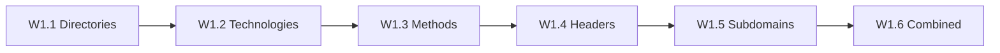

# Chapter W1: Review

## What You Learned

Across six labs, you built a complete web reconnaissance methodology, from a single directory scan to a comprehensive attack surface assessment. Each lab added a new technique to your toolkit, demonstrating that effective reconnaissance is not a single command but a structured process.

You started by discovering hidden directories with gobuster, learning that web applications expose far more than their main page. Technology identification revealed the software stack behind the application, turning a generic target into a set of specific, version-identified components. HTTP method testing showed that APIs can accept dangerous operations if not properly restricted. Header analysis exposed both the security controls in place and the information leaking through response headers. Subdomain discovery expanded the attack surface beyond the main application to forgotten admin panels, staging environments, and API endpoints. The final lab combined everything into a repeatable workflow.

The TechStart Inc engagement demonstrated a realistic reconnaissance progression. Real penetration tests follow the same sequence: discover, fingerprint, test, analyse, expand. The targets change, but the methodology stays consistent.

Along the way, you learned that hidden directories contain sensitive files (`/admin/flag.txt`), that CMS platforms like WordPress expose predictable paths (`/wp-admin/`), that a PUT method can create files on the server (`/uploads/flag.txt`), that custom HTTP headers leak secrets (`X-Secret-Key`), that admin subdomains expose files without authentication (`admin.lab/flag.txt`), and that `robots.txt` advertises hidden directories rather than protecting them (`/private/flag.txt`). These are not academic observations: they are the findings that populate real penetration test reports.

## The Progression You Followed

| Lab  | Skill Learned                    | Key Command / Tool          | Flag Location                                 | Flag                                 |
|------|----------------------------------|-----------------------------|-----------------------------------------------|--------------------------------------|
| W1.1 | Directory enumeration            | `gobuster dir`              | `/admin/flag.txt`                             | `OCR{________}`  |
| W1.2 | Technology identification        | `curl -I`, `whatweb`        | `/wp-admin/flag.txt`                          | `OCR{________}`    |
| W1.3 | HTTP method testing              | `curl -X PUT`               | `/uploads/flag.txt` (created via PUT)         | `OCR{________}`     |
| W1.4 | Security header analysis         | `curl -v`                   | `X-Secret-Key` header on `/headers.php`       | `OCR{________}`        |
| W1.5 | Subdomain discovery              | `gobuster dns`              | `admin.lab/flag.txt`                          | `OCR{________}`    |
| W1.6 | Comprehensive reconnaissance     | All tools combined          | `/private/flag.txt` (via robots.txt + headers)| `OCR{________}`   |

## Key Concepts Revisited

- **Directory enumeration**: testing wordlist entries against a web server to discover hidden paths, admin panels, backup files, and configuration directories that are not linked from the main page.
- **Technology identification**: fingerprinting the software stack (web server, language, framework, CMS) through HTTP headers, HTML source, and automated tools like whatweb.
- **HTTP method testing**: using OPTIONS to enumerate allowed methods and testing dangerous methods (PUT, DELETE, TRACE) for proper access controls.
- **Security header analysis**: auditing response headers for critical protections (CSP, HSTS, X-Frame-Options) and information disclosure (Server, X-Powered-By versions).
- **Subdomain discovery**: brute-forcing DNS to find additional hostnames (admin panels, staging sites, APIs) that expand the attack surface beyond the main application.
- **Structured workflow**: following a repeatable sequence where each technique's findings inform the next step, ensuring no aspect of the attack surface is missed.

## Self-Assessment

Answer each question from memory before checking the answer key at the bottom of the page.

**1. What gobuster mode discovers hidden directories on a web server?**

> &nbsp;

**2. Which curl flag sends a HEAD request to fetch only response headers?**

> &nbsp;

**3. What HTTP method reveals which methods a server endpoint supports?**

> &nbsp;

**4. Name three HTTP security headers that protect against common web attacks.**

> &nbsp;

**5. What gobuster mode discovers subdomains via DNS brute forcing?**

> &nbsp;

**6. Why is a 403 response during directory enumeration still a useful finding?**

> &nbsp;

**7. What does the X-Powered-By header typically reveal?**

> &nbsp;

**8. Why should the TRACE HTTP method be disabled on production servers?**

> &nbsp;

## Command Cheat Sheet

| Command                                                         | Purpose                                  |
|-----------------------------------------------------------------|------------------------------------------|
| `gobuster dir -u <url> -w <wordlist>`                           | Directory enumeration                    |
| `gobuster dir -u <url> -w <wordlist> -x php,txt,bak`           | Directory scan with file extensions      |
| `gobuster dns -d <domain> -w <wordlist>`                        | Subdomain brute forcing                  |
| `curl -I <url>`                                                 | Fetch response headers only              |
| `curl -v <url>`                                                 | Verbose output with full HTTP exchange   |
| `curl -X OPTIONS <url> -v`                                      | Enumerate allowed HTTP methods           |
| `curl -X PUT <url> -v`                                          | Test PUT method                          |
| `curl -X DELETE <url> -v`                                       | Test DELETE method                       |
| `curl -X TRACE <url> -v`                                        | Test TRACE method                        |
| `whatweb <url>`                                                  | Technology fingerprinting                |
| `whatweb -v <url>`                                               | Verbose technology fingerprinting        |
| `curl -v <url> 2>&1 \| grep "^<"`                               | Filter response headers from verbose     |
| `curl -I <url> \| grep -i "content-security-policy"`            | Check for specific security header       |

## Connect the Dots: What Comes Next

You now know how to map a web application's attack surface: its directories, technologies, methods, headers, and subdomains. The next chapter, **CH_WEB02: SQL Injection**, shifts from reconnaissance to exploitation. You will take the login forms and application endpoints you have been discovering and test them for SQL injection vulnerabilities.

Reconnaissance tells you the door exists and what it is made of. SQL injection testing tries to break through it.

The skills from this chapter carry forward directly. You will still inspect HTTP responses, analyse page source code, and examine server behaviour, but now you will pair that observation with active injection payloads. Every directory, technology, and endpoint discovered in Chapter W1 becomes a target for Chapter W2.

Consider reviewing the commands in the cheat sheet above until you can recall each one without looking. Fluency with reconnaissance tools frees your attention for the harder decisions that come during exploitation.

---

## Self-Assessment Answer Key

**1.** The `dir` mode (`gobuster dir`) discovers hidden directories on a web server.

**2.** The `-I` flag (or `--head`) sends a HEAD request and returns only response headers.

**3.** The `OPTIONS` method reveals supported methods via the `Allow` response header.

**4.** Content-Security-Policy (CSP), Strict-Transport-Security (HSTS), and X-Frame-Options. Other valid answers include X-Content-Type-Options, X-XSS-Protection, and Referrer-Policy.

**5.** The `dns` mode (`gobuster dns`) discovers subdomains via DNS brute forcing.

**6.** A 403 Forbidden response confirms the directory exists on the server, even though access is denied. It is valuable because the path may be accessible through other means: credential discovery, parameter manipulation, or directory traversal.

**7.** The `X-Powered-By` header typically reveals the backend programming language or framework (e.g., `PHP/8.1.2`, `Express`, `ASP.NET`).

**8.** TRACE echoes the full HTTP request back to the client, including all headers. An attacker can use cross-site tracing (XST) to steal authentication cookies via XSS when TRACE is enabled.
