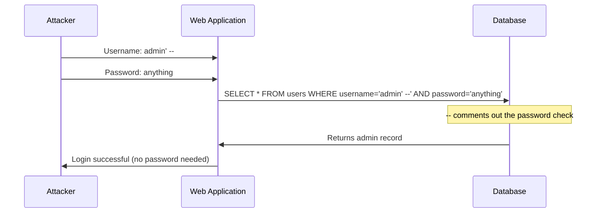

# Chapter W2: SQL Injection

## Why SQL Injection Matters

In Chapter W1, you mapped web applications from the outside, discovering directories, fingerprinting technologies, and analysing headers. That was reconnaissance. SQL injection is where reconnaissance becomes exploitation.

SQL injection (SQLi) is one of the most dangerous and most common web application vulnerabilities. It occurs when user input is inserted directly into a database query without proper validation or sanitisation. An attacker who finds a SQL injection point can bypass authentication, extract entire databases, modify records, and in some cases execute commands on the underlying operating system.

Despite being well-understood and documented for over two decades, SQL injection remains in the OWASP Top 10 and appears regularly in real-world penetration tests. The vulnerability persists because developers continue to build queries by concatenating user input rather than using parameterised statements. Understanding how SQL injection works, and why it works, is essential for any security professional.

## What You Will Learn

The chapter contains one lab that introduces the core SQL injection concept:

- **Identify** a login form vulnerable to SQL injection
- **Understand** how unsanitised input manipulates the underlying SQL query
- **Exploit** the vulnerability to bypass authentication without valid credentials
- **Access** restricted content that should require authorised login

By the end of this chapter, you will understand the mechanics of SQL injection in authentication forms and why input validation is a critical defence.

## What Is SQL Injection?

Web applications store data in databases. When a user submits a login form, the application builds a SQL query to check whether the username and password match a record in the database. If the application inserts user input directly into that query, an attacker can craft input that changes the query's logic.



The single quote (`'`) closes the string in the SQL query. The double dash (`--`) comments out the rest of the query, including the password check. The database executes a query that returns the admin user regardless of the password entered.

**Normal login flow:**

```sql
SELECT * FROM users WHERE username='admin' AND password='correct_password'
```

**Injected login flow:**

```sql
SELECT * FROM users WHERE username='admin' --' AND password='anything'
```

Everything after `--` is treated as a comment by the database. The query reduces to `WHERE username='admin'`, which returns the admin record unconditionally.

## Types of SQL Injection

SQL injection takes many forms. The chapter introduces the most fundamental type, authentication bypass, but the same principle applies across all variants.

| Type                      | Description                                          | Example                            |
|---------------------------|------------------------------------------------------|------------------------------------|
| Authentication bypass     | Manipulate login query to skip password check         | `admin' --`                        |
| Union-based               | Append a UNION SELECT to extract data from other tables | `' UNION SELECT username, password FROM users --` |
| Error-based               | Trigger database errors that reveal information       | `' AND 1=CONVERT(int, @@version) --` |
| Blind (boolean)           | Infer data from true/false response differences       | `' AND 1=1 --` vs `' AND 1=2 --`  |
| Blind (time-based)        | Infer data from response time delays                  | `' OR SLEEP(5) --`                |

Each type exploits the same root cause: unsanitised user input reaching a SQL query.

## The Tools You Will Use

SQL injection testing at the beginner level requires no specialised tools. A web browser and an understanding of SQL syntax are sufficient.

| Tool              | Purpose                                      |
|-------------------|----------------------------------------------|
| Web browser       | Submit login forms and observe responses      |
| curl              | Send HTTP requests with injection payloads    |
| Browser DevTools  | Inspect form parameters and HTTP requests     |

In later chapters, tools like sqlmap automate the process of finding and exploiting SQL injection. Lab W2.1 focuses on manual testing so you understand what automated tools do under the hood.

## Before You Start

Confirm the following before launching your first lab:

- [ ] Completed all labs in Chapter W1 (Web Reconnaissance)
- [ ] VPN connection to the lab environment is active
- [ ] Web browser open and ready
- [ ] curl installed and accessible (type `curl --version` to confirm)
- [ ] Browser Developer Tools accessible (F12 in most browsers)
- [ ] Notebook ready to record payloads, responses, and findings

Once every item is checked, proceed to Lab W2.1.
